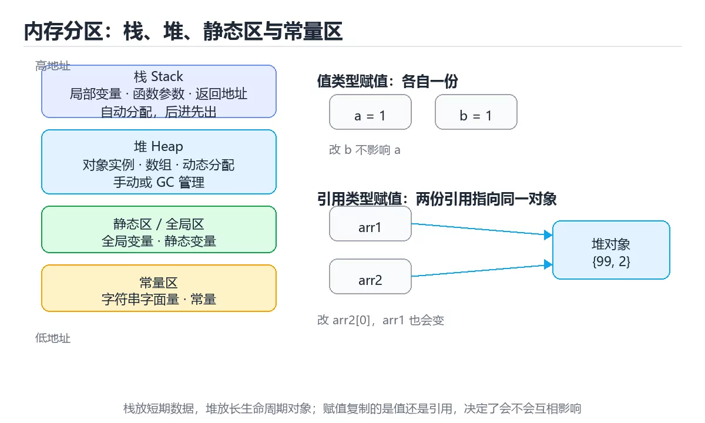

# 图解内存布局：栈、堆与引用

> 内容更新时间：2026-10-06 · 学习阶段：入门 · 预计用时：40 分钟

## 本节知识框架

**课程定位**：所属分类 `visual_guide`（图解专题），课程主题 `图解内存布局：栈、堆与引用`，学习阶段 入门，建议用时 45 分钟。

本课主线：用示意图讲清栈、堆、静态区，以及赋值时到底复制了什么。

**学完本课应当能够**
- 说清 `内存布局` 与 `堆` 的含义与区别，并各举一个正例和一个反例。
- 用本课示例验证 `引用` 的行为，记录输入、输出与失败条件。
- 遇到「把引用复制当成对象复制」这类问题时，能说出触发条件与修复顺序。

### 从概念到验证的学习链条

1. `内存布局`：先掌握 图解内存布局：栈、堆与引用解决了什么问题，而不是只背术语，再用它解释 `堆` 为什么会出现。
2. `堆`：先掌握 用于动态分配对象的内存区域；在算法语境中也指满足堆序的完全二叉树，再用它解释 `引用` 为什么会出现。
3. `引用`：先掌握 指向另一个值或资源的别名；在存储语境中也可能指数据来源，再用它解释 `栈` 为什么会出现。
4. `栈`：先掌握 存放函数调用与局部变量的区域，随调用自动分配释放，速度快但生命周期只在函数内，再用它解释 本课示例的观察结果 为什么会出现。

**先修与衔接**：本课是「图解专题」分类的第 1 课。相关或后续课程：《图解调用栈与递归》。

### 完成判据

- **定义关**：不看正文也能说明 `内存布局` 是 图解内存布局：栈、堆与引用解决了什么问题，而不是只背术语，并指出一个反例。
- **机制关**：能按“输入 → 转换 → 输出 → 验证”复述 `图解内存布局：栈、堆与引用`，而不是只背结论。
- **示例关**：能运行或推演 `图解内存布局：栈、堆与引用` 的 `java` 示例，并说明一个真实出现的标识符或字面量。
- **证据关**：能指出 `图解内存布局：栈、堆与引用` 示例里的 调用了 `append()`，并说明它支持或反驳了本课的哪一条结论。
- **排错关**：能复现 把引用复制当成对象复制，记录现象并按 明确赋值语义并使用拷贝 修复。
- **迁移关**：能把 `内存布局`、`栈`、`堆`、`引用` 放进一个与 `图解内存布局：栈、堆与引用` 不同的项目场景，并保持输入与验证条件可追踪。
- **复盘关**：学完 `图解内存布局：栈、堆与引用` 后，用一句话写下仍然不确定的结论，并列出下一次验证需要的输入、环境和成功判据。

### 复习清单

- [ ] 能不看正文复述本课核心术语，并指出一个边界或反例。
- [ ] 能运行或推演本课示例，记录输入、输出与失败现象。
- [ ] 能完成一次自测，并把错题对照错误表定位原因。

**本课配图**




## 核心概念定义

| 术语 | 操作性定义 | 常见边界与风险 |
| --- | --- | --- |
| 内存布局 | 图解内存布局：栈、堆与引用解决了什么问题，而不是只背术语。 | 越界、悬垂引用与释放顺序会破坏结论，必须在边界输入下复验。 |
| 堆 | 用于动态分配对象的内存区域；在算法语境中也指满足堆序的完全二叉树。 | 越界、悬垂引用与释放顺序会破坏结论，必须在边界输入下复验。 |
| 引用 | 指向另一个值或资源的别名；在存储语境中也可能指数据来源。 | 易错：修改一个变量影响另一个；正确做法是明确赋值语义并使用拷贝。 |
| 栈 | 存放函数调用与局部变量的区域，随调用自动分配释放，速度快但生命周期只在函数内。 | 越界、悬垂引用与释放顺序会破坏结论，必须在边界输入下复验。 |

## 原理与运行机制

### 机制总览

| 阶段 | 关注对象 | 失败时应检查 |
| --- | --- | --- |
| 输入 | 内存布局 | 类型、范围、编码、版本或前置状态是否满足定义。 |
| 处理 | 堆 | 顺序、可见性、锁、路由、事务或调度规则是否被破坏。 |
| 输出 | 引用 | 结果是否可复现，错误是否被正确传播而不是被吞掉。 |

**教材衔接：一句话说清**

程序运行时，数据分别住在**栈**、**堆**和**静态区**。
看懂一张内存图，就能解释「为什么改了一个变量另一个也变了」。

**失败路径（来自本课错误表）**
- 把引用复制当成对象复制 → 修改一个变量影响另一个 → 明确赋值语义并使用拷贝。
- 认为 GC 不会泄漏 → 长生命周期引用导致内存上涨 → 分析引用链和缓存生命周期。
- 递归没有终止条件 → 栈溢出 → 增加基例和深度限制。
- 大量短生命周期对象进入堆 → GC 频繁停顿 → 减少分配、复用对象或使用栈分配。
### 机制拆解：每一步的输入、动作与输出

#### 1. `内存布局`
- 输入：`内存布局`；本步把 图解内存布局：栈、堆与引用解决了什么问题，而不是只背术语 当作判断规则。
- 动作：围绕 `内存布局` 保留中间状态，并记录它与 `堆` 的对应关系。
- 输出：`堆`，它可以被下一段代码、测试或记录继续使用。
- `内存布局` 的失败条件：越界、悬垂引用与释放顺序会破坏结论，必须在边界输入下复验。

#### 2. `堆`
- 输入：`内存布局`；本步把 用于动态分配对象的内存区域；在算法语境中也指满足堆序的完全二叉树 当作判断规则。
- 动作：围绕 `堆` 保留中间状态，并记录它与 `引用` 的对应关系。
- 输出：`引用`，它可以被下一段代码、测试或记录继续使用。
- `堆` 的失败条件：当大量短生命周期对象进入堆时，会出现GC 频繁停顿。

#### 3. `引用`
- 输入：`堆`；本步把 指向另一个值或资源的别名；在存储语境中也可能指数据来源 当作判断规则。
- 动作：围绕 `引用` 保留中间状态，并记录它与 `栈` 的对应关系。
- 输出：`栈`，它可以被下一段代码、测试或记录继续使用。
- `引用` 的失败条件：当把引用复制当成对象复制时，会出现修改一个变量影响另一个。

#### 4. `栈`
- 输入：`引用`；本步把 存放函数调用与局部变量的区域，随调用自动分配释放，速度快但生命周期只在函数内 当作判断规则。
- 动作：围绕 `栈` 保留中间状态，并记录它与 `append` 的对应关系。
- 输出：`append`，它可以被下一段代码、测试或记录继续使用。
- `栈` 的失败条件：当递归没有终止条件时，会出现栈溢出。

### 示例中的可观察事实

1. 调用了 `append()`；它对应的课程主题是 `图解内存布局：栈、堆与引用`。
2. 调用了 `print()`；它对应的课程主题是 `图解内存布局：栈、堆与引用`。
3. 调用了 `copy()`；它对应的课程主题是 `图解内存布局：栈、堆与引用`。

### 复现实验记录

- 环境：`图解内存布局：栈、堆与引用` 使用 `java` 示例，固定 `内存布局`、`栈`、`堆`、`引用` 作为第一组条件。
- 首轮输入：先确认 调用了 `append()`，预测 `内存布局` 会怎样变化。
- 基线观察：记录命令、输入、输出和错误原文，不用截图代替可复制的文本。
- 单变量修改：只改变 `内存布局`，观察 `栈` 是否仍满足定义。
- 失败注入：复现 把引用复制当成对象复制，确认现象是 修改一个变量影响另一个。
- 记录结论：把“修改前、修改后、预期变化、实际变化”写成四列表，这样复盘 `图解内存布局：栈、堆与引用` 时才能区分概念错误与实现错误。

## 典型应用场景

| 场景 | 典型输入或前提 | 期望产物 |
| --- | --- | --- |
| 学习验证 | 使用本课最小示例和 内存布局、栈 | 能复现正文结论，并解释每一步。 |
| 工程落地 | 把「图解内存布局：栈、堆与引用」放入真实模块或服务边界 | 输出可观测、失败可定位、参数可配置。 |
| 故障排查 | 只改一个版本、规模、输入或依赖条件 | 能区分概念错误、实现错误和环境差异。 |

**教材衔接：案例三：Go 的切片三要素**

```go
s := []int{1, 2, 3}
t := s[1:3]        // 共享底层数组
t[0] = 99
fmt.Println(s)     // [1 99 3]
```

```text
s  { ptr ──┐, len: 3, cap: 3 }
           │
           ▼
底层数组   [1, 99, 3]
           ▲
           │
t  { ptr ──┘, len: 2, cap: 2 }
```

切片本身是「指针 + 长度 + 容量」的小结构，**赋值只复制这个结构，不复制底层数组**。

- **把引用复制当成对象复制**：典型现象是修改一个变量影响另一个；正确做法是明确赋值语义并使用拷贝。
- **认为 GC 不会泄漏**：典型现象是长生命周期引用导致内存上涨；正确做法是分析引用链和缓存生命周期。
- **递归没有终止条件**：典型现象是栈溢出；正确做法是增加基例和深度限制。
- **大量短生命周期对象进入堆**：典型现象是GC 频繁停顿；正确做法是减少分配、复用对象或使用栈分配。

### 最小验证场景

- 准备：保留 `java` 示例的原始输入，先记录 `图解内存布局：栈、堆与引用` 的基线输出和完整运行命令。
- 观察：先核对 调用了 `append()`，再改变一个与 `内存布局` 相关的条件。
- 判定：新结果与 `图解内存布局：栈、堆与引用` 的基线不同不等于错误；只有当差异破坏了 `内存布局` 的定义或错误表中的约束，才判定为失败。

### 选择与边界

- 使用 `内存布局` 时，先满足它的定义：图解内存布局：栈、堆与引用解决了什么问题，而不是只背术语；越界、悬垂引用与释放顺序会破坏结论，必须在边界输入下复验。
- 使用 `堆` 时，先满足它的定义：用于动态分配对象的内存区域；在算法语境中也指满足堆序的完全二叉树；越界、悬垂引用与释放顺序会破坏结论，必须在边界输入下复验。
- 使用 `引用` 时，先满足它的定义：指向另一个值或资源的别名；在存储语境中也可能指数据来源；易错：修改一个变量影响另一个；正确做法是明确赋值语义并使用拷贝。
- 使用 `栈` 时，先满足它的定义：存放函数调用与局部变量的区域，随调用自动分配释放，速度快但生命周期只在函数内；越界、悬垂引用与释放顺序会破坏结论，必须在边界输入下复验。

## 代码/协议/SQL 示例

**教材衔接：一张图看懂三种存储区**

```text
高地址
┌──────────────────────────────┐
│  栈 Stack                    │  函数局部变量、参数、返回地址
│  · 自动分配与释放            │  空间小、速度快
│  · 后进先出                  │
├──────────────────────────────┤
│  ↓ 栈向下增长                │
│                              │
│  ↑ 堆向上增长                │
├──────────────────────────────┤
│  堆 Heap                     │  new / malloc 出来的对象
│  · 手动或 GC 管理            │  空间大、速度较慢
├──────────────────────────────┤
│  静态区 / 全局区             │  全局变量、静态变量
├──────────────────────────────┤
│  常量区                      │  字符串字面量、常量
└──────────────────────────────┘
低地址
```

```java
int a = 1;
int b = a;        // 复制值
b = 2;            // a 仍然是 1

int[] arr1 = {1, 2};
int[] arr2 = arr1;   // 复制引用
arr2[0] = 99;        // arr1[0] 也变成 99
```

```python
a = [1, 2, 3]
b = a              # b 与 a 指向同一个列表
b.append(4)
print(a)           # [1, 2, 3, 4]

c = a.copy()       # 真正的浅拷贝
c.append(5)
print(a)           # [1, 2, 3, 4]，不受影响
```

```cpp
void demo() {
    int x = 1;                    // 栈上，离开作用域自动释放
    int* p = new int(2);           // 堆上，必须 delete
    std::unique_ptr<int> q = std::make_unique<int>(3);   // 堆上，自动释放
    delete p;
}
```

**运行方式**：运行 `图解内存布局：栈、堆与引用` 的示例时，保存为 `.java` 后用 `javac` 编译、`java` 运行；注意类名与文件名一致。

### 示例精读：先找证据，再改一个条件

1. 调用了 `append()`；它出现在 `图解内存布局：栈、堆与引用` 的示例中，阅读时先确认它前后各发生了什么。
2. 调用了 `print()`；它出现在 `图解内存布局：栈、堆与引用` 的示例中，阅读时先确认它前后各发生了什么。
3. 调用了 `copy()`；它出现在 `图解内存布局：栈、堆与引用` 的示例中，阅读时先确认它前后各发生了什么。
- 在 `图解内存布局：栈、堆与引用` 中与 `内存布局` 对照：示例必须能支持 图解内存布局：栈、堆与引用解决了什么问题，而不是只背术语，否则说明这一段还缺少实现或验证步骤。
- 在 `图解内存布局：栈、堆与引用` 中与 `堆` 对照：示例必须能支持 用于动态分配对象的内存区域；在算法语境中也指满足堆序的完全二叉树，否则说明这一段还缺少实现或验证步骤。
- 在 `图解内存布局：栈、堆与引用` 中与 `引用` 对照：示例必须能支持 指向另一个值或资源的别名；在存储语境中也可能指数据来源，否则说明这一段还缺少实现或验证步骤。
- 在 `图解内存布局：栈、堆与引用` 中与 `栈` 对照：示例必须能支持 存放函数调用与局部变量的区域，随调用自动分配释放，速度快但生命周期只在函数内，否则说明这一段还缺少实现或验证步骤。

## 时间/空间复杂度或性能分析

**教材衔接：三个操作在内存里发生了什么**

| 操作 | 内存行为 |
| --- | --- |
| 赋值 `b = a`（基本类型） | 复制值，两份独立 |
| 赋值 `b = a`（对象） | 复制引用，指向同一个对象 |
| 浅拷贝 | 新建外层容器，内层仍共享 |
| 深拷贝 | 递归复制，完全独立 |
| 传参（基本类型） | 复制值 |
| 传参（对象） | 复制引用（C++ 默认是值拷贝，需注意） |

**教材衔接：深入补充：图解内存布局：栈、堆与引用**

前面已经建立了基本概念。这一节换一个角度，把图解内存布局：栈、堆与引用放进真实工程里，
重点回答三件事：一句话说清 的机制、代价与边界。

程序内存通常分为栈、堆、静态区和代码区：栈保存函数调用与局部变量，堆保存动态分配对象，静态区保存全局和静态数据。理解引用与值复制是排查共享修改问题的关键。

1. 栈按后进先出管理，分配和释放极快，但空间有限且生命周期与函数调用绑定。
2. 堆空间大、生命周期灵活，但分配回收成本高，容易产生碎片和内存泄漏。
3. 静态区保存全局变量、静态变量和常量，生命周期通常贯穿整个程序。
4. 值类型复制的是内容，引用类型复制的是地址，两个变量可能指向同一对象。
5. 浅拷贝只复制第一层，嵌套对象仍共享；深拷贝递归复制所有层级。
6. 栈溢出通常由过深递归或超大局部变量导致，堆溢出则由分配过多或泄漏导致。
7. GC 语言仍需关注引用泄漏、缓存膨胀和长生命周期对象，垃圾回收不是免死金牌。

| 错误做法或假设 | 后果 | 正确做法 |
| --- | --- | --- |
| 把引用复制当成对象复制 | 修改一个变量影响另一个 | 明确赋值语义并使用拷贝 |
| 认为 GC 不会泄漏 | 长生命周期引用导致内存上涨 | 分析引用链和缓存生命周期 |
| 递归没有终止条件 | 栈溢出 | 增加基例和深度限制 |
| 大量短生命周期对象进入堆 | GC 频繁停顿 | 减少分配、复用对象或使用栈分配 |

服务运行数小时后内存持续上涨。排查时先看堆快照和对象增长，再检查缓存是否有上限、事件监听是否注销、闭包是否持有大对象；最后确认是泄漏、缓存膨胀还是正常的工作集增长。

**Q4：GC 语言为什么仍会内存泄漏？**

内存布局是语言运行时和编译器的实现模型，不同语言细节不同。重点是建立“栈/堆/引用/生命周期”的心智模型，而不是死记地址布局。

- [ ] 能画出栈、堆、静态区和代码区
- [ ] 能区分值复制与引用复制
- [ ] 能说明浅拷贝和深拷贝
- [ ] 能判断栈溢出与堆溢出的原因
- [ ] 能使用堆快照排查内存增长

1. 不看资料讲清「图解内存布局：栈、堆与引用」的核心模型，并各举一个正例和反例。
2. 再对照表逐行解释容易混淆的概念，每个概念补一个反例。
3. 跟着工作示例做一遍，改变一个条件并预测结果。
4. 用自测问答检查理解，错题回到对应小节重新阅读。
5. 把 栈 的实现、测试与复盘整理成一份可提交的产物。

**测量方法**：以 `图解内存布局：栈、堆与引用` 的 `内存布局` 场景为对象，固定输入跑一遍记录基线，再把规模或并发度提高一个数量级复测；两次结果的差值与波动范围才是结论依据。

### 需要控制的变量与记录项

- `图解内存布局：栈、堆与引用` 的 `内存布局`：固定它的版本、输入范围和资源上限，分别记录速度、内存与失败率的变化。
- `图解内存布局：栈、堆与引用` 的 `栈`：固定它的版本、输入范围和资源上限，分别记录速度、内存与失败率的变化。
- `图解内存布局：栈、堆与引用` 的 `堆`：固定它的版本、输入范围和资源上限，分别记录速度、内存与失败率的变化。
- `图解内存布局：栈、堆与引用` 的 `引用`：固定它的版本、输入范围和资源上限，分别记录速度、内存与失败率的变化。
- `图解内存布局：栈、堆与引用` 的 `深浅拷贝`：固定它的版本、输入范围和资源上限，分别记录速度、内存与失败率的变化。
- `图解内存布局：栈、堆与引用` 中 `内存布局` 的边界：越界、悬垂引用与释放顺序会破坏结论，必须在边界输入下复验。达到边界时不要外推，必须重新测量。
- `图解内存布局：栈、堆与引用` 中 `堆` 的边界：越界、悬垂引用与释放顺序会破坏结论，必须在边界输入下复验。达到边界时不要外推，必须重新测量。
- `图解内存布局：栈、堆与引用` 中 `引用` 的边界：易错：修改一个变量影响另一个；正确做法是明确赋值语义并使用拷贝。达到边界时不要外推，必须重新测量。
- `图解内存布局：栈、堆与引用` 中 `栈` 的边界：越界、悬垂引用与释放顺序会破坏结论，必须在边界输入下复验。达到边界时不要外推，必须重新测量。
- `图解内存布局：栈、堆与引用` 的代码证据：先验证 调用了 `append()`，再记录该路径的输入规模与耗时；只看代码行数不能推出复杂度。

## 常见误区与易错点

| 容易写错的做法 | 实际现象 | 原因与正确做法 |
| --- | --- | --- |
| 把引用复制当成对象复制 | 修改一个变量影响另一个 | 明确赋值语义并使用拷贝 |
| 认为 GC 不会泄漏 | 长生命周期引用导致内存上涨 | 分析引用链和缓存生命周期 |
| 递归没有终止条件 | 栈溢出 | 增加基例和深度限制 |
| 大量短生命周期对象进入堆 | GC 频繁停顿 | 减少分配、复用对象或使用栈分配 |
| 以为赋值就是复制 | 改一个影响另一个 | 明确引用语义，需要副本就拷贝 |
| 浅拷贝嵌套结构 | 内层仍互相影响 | 用深拷贝 |
| 忘了 C++ 默认值拷贝 | 大对象被复制 | 传 `const&` |
| 返回栈上对象的指针 | 悬垂指针 | 返回值或智能指针 |
| Go 切片共享底层数组 | 改一个影响另一个 | 用 `slices.Clone` 或 `copy` |
| 以为 GC 语言不会泄漏 | 长生命周期引用导致泄漏 | 及时解除引用与订阅 |

### 现场 1：把引用复制当成对象复制

**症状**：修改一个变量影响另一个。

**根因与修复**：明确赋值语义并使用拷贝。

**自检**：在本课示例里复现「把引用复制当成对象复制」，改成明确赋值语义并使用拷贝后重跑；如果症状消失且失败路径按预期变化，说明定位正确。

### 现场 2：认为 GC 不会泄漏

**症状**：长生命周期引用导致内存上涨。

**根因与修复**：分析引用链和缓存生命周期。

**自检**：在本课示例里复现「认为 GC 不会泄漏」，改成分析引用链和缓存生命周期后重跑；如果症状消失且失败路径按预期变化，说明定位正确。

### 现场 3：递归没有终止条件

**症状**：栈溢出。

**根因与修复**：增加基例和深度限制。

**自检**：在本课示例里复现「递归没有终止条件」，改成增加基例和深度限制后重跑；如果症状消失且失败路径按预期变化，说明定位正确。

### 现场 4：大量短生命周期对象进入堆

**症状**：GC 频繁停顿。

**根因与修复**：减少分配、复用对象或使用栈分配。

**自检**：在本课示例里复现「大量短生命周期对象进入堆」，改成减少分配、复用对象或使用栈分配后重跑；如果症状消失且失败路径按预期变化，说明定位正确。

### 现场 5：以为赋值就是复制

**症状**：改一个影响另一个。

**根因与修复**：明确引用语义，需要副本就拷贝。

**自检**：在本课示例里复现「以为赋值就是复制」，改成明确引用语义，需要副本就拷贝后重跑；如果症状消失且失败路径按预期变化，说明定位正确。

### 现场 6：浅拷贝嵌套结构

**症状**：内层仍互相影响。

**根因与修复**：用深拷贝。

**自检**：在本课示例里复现「浅拷贝嵌套结构」，改成用深拷贝后重跑；如果症状消失且失败路径按预期变化，说明定位正确。

### 现场 7：忘了 C++ 默认值拷贝

**症状**：大对象被复制。

**根因与修复**：传 `const&`。

**自检**：在本课示例里复现「忘了 C++ 默认值拷贝」，改成传 `const&`后重跑；如果症状消失且失败路径按预期变化，说明定位正确。

### 现场 8：返回栈上对象的指针

**症状**：悬垂指针。

**根因与修复**：返回值或智能指针。

**自检**：在本课示例里复现「返回栈上对象的指针」，改成返回值或智能指针后重跑；如果症状消失且失败路径按预期变化，说明定位正确。

### 现场 9：Go 切片共享底层数组

**症状**：改一个影响另一个。

**根因与修复**：用 `slices.Clone` 或 `copy`。

**自检**：在本课示例里复现「Go 切片共享底层数组」，改成用 `slices.Clone` 或 `copy`后重跑；如果症状消失且失败路径按预期变化，说明定位正确。

## 与其他知识点的关系

**教材衔接：跨语言对照：谁负责释放**

| 语言 | 栈上对象 | 堆上对象 | 释放方式 |
| --- | --- | --- | --- |
| C++ | 常见 | `new` / `make_unique` | RAII 或手动 `delete` |
| Java | 基本类型 | 对象 | 垃圾回收 |
| C# | 值类型 | 引用类型 | 垃圾回收 |
| Go | 局部变量（可能逃逸） | 逃逸到堆的对象 | 垃圾回收 |
| Python | 无明确区分 | 一切对象 | 引用计数 + 分代回收 |
| JavaScript | 基本类型 | 对象 | 垃圾回收 |
| Rust | 常见 | `Box` / `Vec` | 所有权自动释放 |

- **相关或后续**：`图解调用栈与递归`。本课术语会在这些课程里继续使用。
- **术语归属**：`内存布局`、`堆`、`引用` 的定义以本课「核心概念定义」为准，换到其他课程时先确认定义是否被改写。

### 先修与后续术语接口

- `图解调用栈与递归`：两者通过本分类的学习顺序衔接，阅读时重点比较各自的输入与失败条件。

### 容易混淆的相邻概念

- `内存布局` 与 `堆`：前者强调 图解内存布局：栈、堆与引用解决了什么问题，而不是只背术语；后者强调 用于动态分配对象的内存区域；在算法语境中也指满足堆序的完全二叉树。判断时分别检查两条定义的适用范围，不要只看名称相似就互换。
- `堆` 与 `引用`：前者强调 用于动态分配对象的内存区域；在算法语境中也指满足堆序的完全二叉树；后者强调 指向另一个值或资源的别名；在存储语境中也可能指数据来源。判断时分别检查两条定义的适用范围，不要只看名称相似就互换。
- `引用` 与 `栈`：前者强调 指向另一个值或资源的别名；在存储语境中也可能指数据来源；后者强调 存放函数调用与局部变量的区域，随调用自动分配释放，速度快但生命周期只在函数内。判断时分别检查两条定义的适用范围，不要只看名称相似就互换。

## 自测题与参考答案

> 先独立作答，再对照参考答案；答案都能在本课正文、术语表或错误表里找到依据。

### 自测 1（概念复述）

不看正文，写出 `内存布局` 的操作性定义，并说明它与 `堆` 的区别。

**参考答案**：图解内存布局：栈、堆与引用解决了什么问题，而不是只背术语。

`堆` 的定位是：用于动态分配对象的内存区域；在算法语境中也指满足堆序的完全二叉树；两者的差别要从适用对象与失败模式上说明。

### 自测 2（排错）

本课错误表记录了「把引用复制当成对象复制」这类做法。请写出它会出现的现象、根因，以及修复顺序。

**参考答案**：现象是修改一个变量影响另一个；正确做法是明确赋值语义并使用拷贝。修复时先复现现象并保留证据，再改动一处假设重跑，确认现象消失。

### 自测 3（动手验证）

运行本课的 `java` 示例，把其中的 `1` 换成一个边界值后重新运行，记录输出与错误信息。

**参考答案**：正常输入下 `java` 示例应当复现正文给出的结果；把 `1` 换成边界值后，如果结果改变或报错，先核对它是否满足 `图解内存布局：栈、堆与引用` 中`内存布局` 的适用范围，再检查错误表里是否有同类现象。

### 自测 4（代码阅读）

阅读本课开头的 `java` 示例，说明它体现了`内存布局` 的哪一条性质，并指出改动哪个输入会让这条性质不再成立。

**参考答案**：`内存布局` 的定义是 图解内存布局：栈、堆与引用解决了什么问题，而不是只背术语，示例正是在实现这条定义。改动与 `内存布局` 有关的一个输入后，如果结果不再符合 `图解内存布局：栈、堆与引用` 的正文描述，就说明该性质只在当前前提成立。

### 自测 5（迁移）

把 `图解内存布局：栈、堆与引用` 的方法迁移到自己的项目：围绕 `内存布局` 写出一个与错误表同类的风险点，并说明触发条件和检验方式。

**参考答案**：例如「以为 GC 语言不会泄漏」，它会导致长生命周期引用导致泄漏；检验方式是按及时解除引用与订阅改一处再复现，确认现象消失且没有引入新的失败分支。

### 自测 6（对比）

用一个表格对比 `内存布局` 与 `堆`：各写一行适用场景、一行失败表现。

**参考答案**：`内存布局` 的定义是图解内存布局：栈、堆与引用解决了什么问题，而不是只背术语；`堆` 的定义是用于动态分配对象的内存区域；在算法语境中也指满足堆序的完全二叉树。两者的失败表现分别对应本课错误表里与本术语相关的行。

### 自测 7（排错顺序）

面对「把引用复制当成对象复制」引发的问题，请把“复现 修改一个变量影响另一个 → 保留证据 → 明确赋值语义并使用拷贝 → 回归验证”四步写成可执行的检查清单。

**参考答案**：第一步按修改一个变量影响另一个复现；第二步记录输入、版本与完整报错；第三步按明确赋值语义并使用拷贝只改一处；第四步重跑并确认失败路径也按预期变化。

### 自测 8（边界判断）

针对 `栈`，分别写出“可以使用”的条件和“结论不再成立”的条件。

**参考答案**：越界、悬垂引用与释放顺序会破坏结论，必须在边界输入下复验。 同时要把 `栈` 的定义 存放函数调用与局部变量的区域，随调用自动分配释放，速度快但生命周期只在函数内 与实际输入逐项对照。

### 自测 9（机制重建）

不看正文，按输入、转换、输出、验证四段重建 `内存布局` → `堆` → `引用` → `栈` 的作用链。

**参考答案**：起点是 `内存布局` 的定义 图解内存布局：栈、堆与引用解决了什么问题，而不是只背术语；中间每一步都保留可观察状态；终点由 `栈` 检查，失败时回到错误表定位第一个偏离定义的步骤。

### 自测 10（综合排错）

在 `图解内存布局：栈、堆与引用` 中，现象是 长生命周期引用导致泄漏。请围绕 以为 GC 语言不会泄漏 写出最小复现、关键证据、修复动作和回归验证，并说明为什么不能只凭一次运行下结论。

**参考答案**：先复现 以为 GC 语言不会泄漏，记录输入与完整错误；再按 及时解除引用与订阅 只改一处。回归时同时跑正常路径和边界路径，只有两次结果都可解释，才把修复视为完成。

### 自测 11（一分钟复述）

用每分钟约 200 字的速度复述 `图解内存布局：栈、堆与引用`：先给主问题，再按顺序说出 `内存布局`、`堆`、`引用`、`栈`，最后给一个失败案例。

**自评标准**：主问题必须对应 用示意图讲清栈、堆、静态区，以及赋值时到底复制了什么；每个术语都要能接上一句定义或边界；失败案例必须写成可观察现象，不能用“可能有风险”代替证据。

## 术语速查

| 术语 | 一句话说明 |
| --- | --- |
| `内存布局` | 图解内存布局：栈、堆与引用解决了什么问题，而不是只背术语。 |
| `堆` | 用于动态分配对象的内存区域；在算法语境中也指满足堆序的完全二叉树。 |
| `引用` | 指向另一个值或资源的别名；在存储语境中也可能指数据来源。 |
| `栈` | 存放函数调用与局部变量的区域，随调用自动分配释放，速度快但生命周期只在函数内。 |

**术语关系**：`内存布局`（图解内存布局：栈、堆与引用解决了什么问题） → `堆`（用于动态分配对象的内存区域） → `引用`（指向另一个值或资源的别名） → `栈`（存放函数调用与局部变量的区域）。

## 考点精讲

`图解内存布局：栈、堆与引用` 的题库有 6 道题，下面逐题给出题干、正确项与判断依据：先自己作答，再核对正确项，最后回到正文对应小节复核。

### 考点 1：第 1 题

- **题目**：`图解内存布局：栈、堆与引用` 的示例代码用于验证 `内存布局`，其背景是用示意图讲清栈、堆、静态区，以及赋值时到底复制了什么。代码的真实内容是下面哪一项？
- **正确项**：调用了 `copy()`
- **判断依据**：这道题落在术语 `内存布局` 上：图解内存布局：栈、堆与引用解决了什么问题，而不是只背术语。复习时把 `内存布局` 的定义、适用边界和一个反例一起说清楚，再回到「核心概念定义」核对原文。

### 考点 2：第 2 题

- **题目**：执行 `b = a`（a 是数组或对象）之后修改 b，为什么 a 也会变？
- **正确项**：因为赋复制的是引用
- **判断依据**：这道题落在术语 `引用` 上：指向另一个值或资源的别名，在存储语境中也可能指数据来源。复习时把 `引用` 的定义、适用边界和一个反例一起说清楚，再回到「核心概念定义」核对原文。

### 考点 3：第 3 题

- **题目**：Go 中对切片做 `t := s[1:3]` 后修改 t，会影响 s，原因是？
- **正确项**：切片本身只包含指针，长度与容量
- **判断依据**：这道题检验本课主问题：用示意图讲清栈、堆、静态区，以及赋值时到底复制了什么。复习时先复述本课主问题，再举一个会让结论失效的输入。

### 考点 4：第 4 题

- **题目**：在 C++ 中，函数参数写成 `const std::vector<int>&` 的主要好处是？
- **正确项**：不产生拷贝且不允许修改
- **判断依据**：这道题检验本课主问题：用示意图讲清栈、堆、静态区，以及赋值时到底复制了什么。复习时先复述本课主问题，再举一个会让结论失效的输入。

### 考点 5：第 5 题

- **题目**：填空：补齐下面这段术语说明中的空缺。课程 `用示意图讲清栈、堆、静态区，以及赋值时到底复制了什么。`，这段说明是：用于动态分配对象的内存区域；在算法语境中也指满足`____`序的完全二叉树。空缺处应填哪个术语？
- **正确项**：堆
- **判断依据**：这道题落在术语 `堆` 上：用于动态分配对象的内存区域，在算法语境中也指满足堆序的完全二叉树。复习时把 `堆` 的定义、适用边界和一个反例一起说清楚，再回到「核心概念定义」核对原文。

### 考点 6：第 6 题

- **题目**：关于 `内存布局`，下列哪些说法与 `图解内存布局：栈、堆与引用` 的正文一致？判断时以用示意图讲清栈、堆、静态区，以及赋值时到底复制了什么。为主线。（多选）
- **正确项**：栈；因为赋复制的是引用
- **判断依据**：这道题落在术语 `内存布局` 上：图解内存布局：栈、堆与引用解决了什么问题，而不是只背术语。复习时把 `内存布局` 的定义、适用边界和一个反例一起说清楚，再回到「核心概念定义」核对原文。

### 考点 7：`内存布局`

- **要点**：图解内存布局：栈、堆与引用解决了什么问题，而不是只背术语。
- **内存布局 的边界**：越界、悬垂引用与释放顺序会破坏结论，必须在边界输入下复验。

### 考点 8：`堆`

- **要点**：用于动态分配对象的内存区域；在算法语境中也指满足堆序的完全二叉树。
- **堆 的边界**：越界、悬垂引用与释放顺序会破坏结论，必须在边界输入下复验。

### 考点 9：`引用`

- **要点**：指向另一个值或资源的别名；在存储语境中也可能指数据来源。
- **引用 的边界**：易错：修改一个变量影响另一个；正确做法是明确赋值语义并使用拷贝。

### 考点 10：`栈`

- **要点**：存放函数调用与局部变量的区域，随调用自动分配释放，速度快但生命周期只在函数内。
- **栈 的边界**：越界、悬垂引用与释放顺序会破坏结论，必须在边界输入下复验。

### 考点 11：排错——把引用复制当成对象复制

- **现象**：修改一个变量影响另一个。
- **处理**：明确赋值语义并使用拷贝。

### 考点 12：排错——认为 GC 不会泄漏

- **现象**：长生命周期引用导致内存上涨。
- **处理**：分析引用链和缓存生命周期。

### 考点 13：综合辨析——`内存布局` 与 `栈`

- **辨析点**：`内存布局` 的定义是 图解内存布局：栈、堆与引用解决了什么问题，而不是只背术语；`栈` 的定义是 存放函数调用与局部变量的区域，随调用自动分配释放，速度快但生命周期只在函数内。
- **答题要求**：面对 `图解内存布局：栈、堆与引用` 的题目，先判断描述的是 `内存布局` 还是 `栈`，再归到对应定义，最后写出一个会让该定义失效的边界输入。

### 考点 14：排错评分点

- **现象分**：能写出 修改一个变量影响另一个，而不是只写“程序有错”。
- **证据分**：保留触发 把引用复制当成对象复制 的输入、版本和错误原文。
- **修复分**：按 明确赋值语义并使用拷贝 只改一处，并同时回归正常路径与边界路径。

## 内容元数据

- 内容版本：v2.0
- 最后更新：2026-10-06
- 学习阶段：入门
- 适用环境：通用图解与系统原理
；本课聚焦 内存布局。
- 内容来源：内置结构化课程与工程实践整理
- 相关主题：内存布局、栈、堆、引用、深浅拷贝
- 质量版本：P0 测验标准 + P1 覆盖扩展 + P2 体验补全

## 参考资料与复核

- 最后复核：2026-10-04
- 下次复核：2027-07-10
- 复核范围：版本兼容、API 行为、安全建议与工程实践
- 来源性质：官方文档、标准或权威教材；本课核对关键词：内存布局、栈、堆、引用、深浅拷贝。

| 参考资料 | 本课用途 |
| --- | --- |
| [Pro Git 内部原理](https://git-scm.com/book/zh/v2/Git-内部原理-Git-对象) | Git 对象与引用关系 |
| [MDN 浏览器工作原理](https://developer.mozilla.org/docs/Web/Performance/How_browsers_work) | 从请求到渲染的流程 |
| [Mermaid 文档](https://mermaid.js.org/intro/) | 流程图、时序图与状态图 |

| [本课术语索引：图解内存布局：栈、堆与引用](#核心概念定义) | 按本课输入、术语边界和错误表现逐项核对 |
> 「图解内存布局：栈、堆与引用」的链接用于离线阅读后的延伸核对；App 不会自动联网。