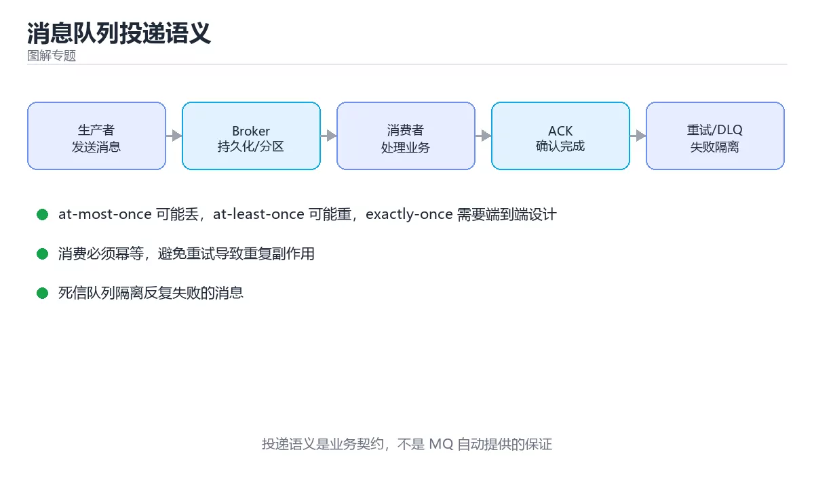
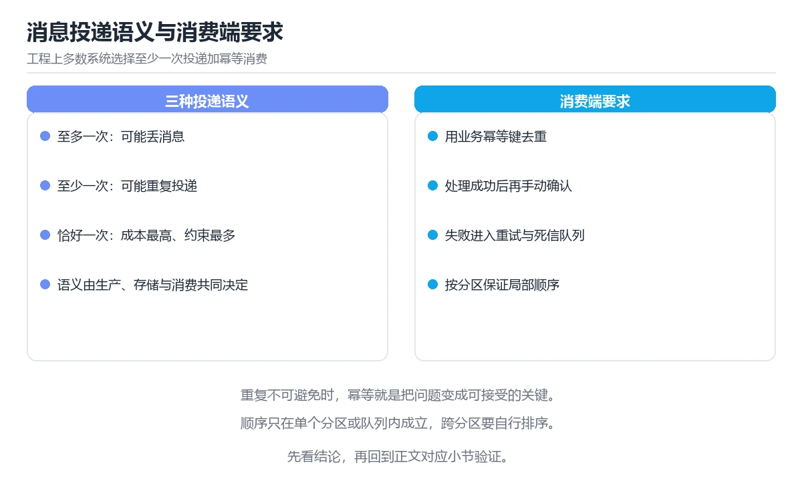

# 图解消息队列投递语义

> 内容更新时间：2026-10-06 · 学习阶段：进阶 · 预计用时：40 分钟



## 学习目标

- 能用自己的话解释图解消息队列投递语义解决了什么问题，而不是只背术语。
- 能说清 「消息队列」、「幂等」、「投递语义」、「死信队列」 之间的关系，并分别举出一个例子。
- 能把本课知识放回「图解专题」的知识体系，说明它和相邻主题的边界。
- 能完成本课练习，并用验收标准检查自己的结果。

> 一句话摘要：三种投递语义、重复的成因、消费端幂等与顺序保障。

## 前置知识

- 先完成上一课《图解数据库事务隔离级别》；如果已经掌握，可以直接用本课练习自测。
- 本课阶段：进阶。建议先掌握同一分类的基础课程，并能独立运行正文中的最小示例。
- 开始前先复习：消息队列、幂等、投递语义。
- 如果某一步看不懂，先记录具体卡点，完成练习后再回头读一遍。

## 一句话说清

消息队列解决三件事：**解耦、削峰、异步**。
而语义问题只有三个档位：**最多一次、至少一次、恰好一次**——后者在分布式下需要额外代价。

## 三种投递语义

```text
① 最多一次 At-most-once
   发送即忘，不重试
   消息可能丢失，但不会重复

   生产者 ──发送──► 队列 ──► 消费者
            └──失败也不重试（消息丢失）

② 至少一次 At-least-once（最常用）
   失败就重试，直到确认
   消息不丢，但可能重复

   生产者 ──发送──► 队列 ──► 消费者
            ▲        │
            └─ 未收到 ACK 就重发 ─┘
   消费者可能处理两次 → 必须做幂等

③ 恰好一次 Exactly-once
   需要事务或去重机制配合
   代价高，通常只在特定链路实现

   实际做法：至少一次投递 + 消费端幂等 = 业务上的「恰好一次」
```

## 一张图看懂重复是怎么产生的

```text
生产者                队列                消费者
   │  发送 msg#1        │                    │
   ├───────────────────►│                    │
   │                    │  投递 msg#1        │
   │                    ├───────────────────►│
   │                    │                    │ 处理成功
   │                    │      ACK 丢失 ✗     │
   │                    │◄╌╌╌╌╌╌╌╌╌╌╌╌╌╌╌╌╌╌╌┤
   │                    │  重新投递 msg#1    │
   │                    ├───────────────────►│ 处理第二次 → 重复！

结论：ACK 丢失必然导致重复，所以消费端必须具备幂等能力
```

## 消费端幂等的三种做法

| 做法 | 原理 | 适用 |
| --- | --- | --- |
| 唯一键约束 | 数据库唯一索引挡住重复插入 | 创建类操作 |
| 去重表 | 记录已处理的 message_id | 通用兜底 |
| 状态机 | 只有合法状态迁移才生效 | 订单、工单流转 |

```sql
-- 唯一键：同一订单号只能写入一次
CREATE UNIQUE INDEX uk_order_no ON payments(order_no);
INSERT INTO payments(order_no, amount) VALUES ('A100', 99.5)
ON CONFLICT (order_no) DO NOTHING;
```

```text
状态机示例
  待支付 ──► 已支付 ──► 已发货
  「已支付」的重复消息不会再次触发发货，因为当前状态不满足迁移条件
```

## 顺序与分区

```text
同一业务键 → 同一分区 → 分区内有序

队列（3 个分区）
  ┌──────────┐  ┌──────────┐  ┌──────────┐
  │ P0       │  │ P1       │  │ P2       │
  │ user=1   │  │ user=2   │  │ user=3   │
  │ msg A    │  │ msg F    │  │ msg H    │
  │ msg B    │  │ msg G    │  │ msg I    │
  └──────────┘  └──────────┘  └──────────┘
  A 与 B 有序；A 与 F 之间无序

因此「同一用户的动作有序」可以保证，全局有序代价极高
```

| 需求 | 做法 |
| --- | --- |
| 无需有序 | 随便分区，吞吐最高 |
| 单业务键有序 | 业务键做分区键 |
| 全局有序 | 单分区或全局序号，吞吐受限 |

## 消息堆积与处理

```text
堆积曲线
   lag
    ▲
    │        ╱
    │      ╱        ← 消费速度 < 生产速度
    │    ╱
    │  ╱
    └────────────────────► 时间

处理顺序
  1. 看消费速率与 lag 曲线（是突发还是持续）
  2. 定位慢消费：外部接口慢？SQL 慢？重试风暴？
  3. 扩容消费者数量（不超过分区数）
  4. 限流生产者或降级非核心消息
```

```bash
# Kafka：查看消费组堆积
kafka-consumer-groups.sh --describe --group my-group --bootstrap-server localhost:9092
```

## 死信队列与重试

```text
正常消息 →（失败）→ 重试 1 → 重试 2 → 重试 3 → 死信队列
                                                  │
                                                  ▼
                                       人工处理或定时补偿

重试策略：指数退避 + 抖动（避免同一时刻大量重试）
 1s → 2s → 4s → 8s（上限 30s，加 ±20% 随机）
```

**没有死信队列的后果**：坏消息无限重试，阻塞整个分区。

## 常见错误与排查

| 坑 | 现象 | 正确做法 |
| --- | --- | --- |
| 假设消息不重复 | 重复扣款、重复发货 | 消费端幂等 |
| 假设消息不乱序 | 状态回退 | 按业务键分区 |
| 先 ACK 再处理 | 处理失败消息丢失 | 处理成功后再 ACK |
| 无死信队列 | 坏消息阻塞队列 | 配置 DLQ 与重试上限 |
| 消费者数量超过分区数 | 部分消费者空转 | 消费者数不大于分区数 |
| 重试无退避 | 重试风暴 | 指数退避加抖动 |
| 大消息塞队列 | 吞吐骤降 | 只传引用，内容放对象存储 |
| 不监控 lag | 堆积到故障才发现 | 对 lag 设告警 |



## 本课小结

- 三种语义中，**至少一次投递加消费端幂等**是工程上最实用的组合。
- 重复的根源是 ACK 丢失，因此幂等不是可选优化，而是必需设计。
- 顺序只需保证「同一业务键有序」，全局有序代价极高。

## 补充：顺序保证层级、幂等实现与积压处理

### 顺序保证的三个层级

| 层级 | 做法 | 代价 | 适用 |
| --- | --- | --- | --- |
| 全局有序 | 单分区 / 单队列 | 并行度归零 | 极少数场景 |
| 业务键有序 | 用业务键做分区键 | 分区内串行 | **绝大多数场景** |
| 无顺序要求 | 随机分区 | 无 | 日志、埋点 |

```text
「业务键有序」为什么够用
  · 同一订单的状态变更必须有序
  · 不同订单之间互不影响，可并行
  · 用 order_id 做 key，天然满足这两点

注意：扩容分区会改变 key 的映射，可能破坏顺序。
      需要顺序的主题，分区数应在创建时一次规划到位。
```

### 幂等的三种实现对比

| 实现 | 原理 | 优点 | 缺点 |
| --- | --- | --- | --- |
| 唯一键约束 | 数据库唯一索引拒绝重复插入 | 最简单、最可靠 | 只适合插入类操作 |
| 去重表 | 记录已处理的 message_id | 通用 | 需要额外存储与清理 |
| 状态机 | 只接受合法的状态迁移 | 语义清晰 | 需要业务有明确状态 |

```sql
-- 去重表：先插入，插入成功才处理业务（都在同一事务里）
BEGIN;
INSERT INTO processed_messages(message_id, created_at)
VALUES ('msg-123', now()) ON CONFLICT DO NOTHING;
-- 若上面影响行数为 0，说明已处理过，直接提交返回
UPDATE orders SET status = 'paid' WHERE id = 1001;
COMMIT;
```

```text
去重表的维护
  · 只保留最近 7~30 天的记录（按时间分区或定时清理）
  · 表要有唯一索引 message_id，否则去重失效
  · 记录写入与业务操作必须在同一事务中，避免「记录成功但业务失败」
```

### 跨服务原子性：本地消息表

```text
问题：更新数据库与发消息是两个操作，无法直接原子

本地消息表方案
  ① 同一个事务里：更新业务表 + 往 outbox 表插入一条待发送消息
  ② 后台任务轮询 outbox，发送消息并更新状态为「已发送」
  ③ 下游幂等处理

优点：不依赖两阶段提交，实现简单
代价：消息有延迟（取决于轮询间隔），需要清理已发送记录
```

### 积压处理的五个动作

```text
① 先看曲线：突发堆积还是持续堆积？
   突发 → 等消费追上；持续 → 必须扩容或优化

② 定位慢消费：外部接口慢 / SQL 慢 / 重试风暴 / 单条处理超时

③ 扩容消费者（不超过分区数）

④ 提高单批吞吐：批量处理、并发处理单分区内的独立消息

⑤ 限流生产者或降级非核心消息，先保住核心链路
```

| 指标 | 含义 | 告警建议 |
| --- | --- | --- |
| Lag | 未消费消息数 | 超过阈值并持续增长 |
| 消费速率 | 每秒处理条数 | 明显低于生产速率 |
| 重试率 | 重试次数 / 总次数 | 突增说明下游异常 |
| 死信数量 | 进入 DLQ 的条数 | 任何增长都应跟进 |

### 监控与压测要点

```text
必须埋点的四件事
  · 生产成功/失败率与重试次数
  · 消费耗时分布（P50/P95/P99）
  · Lag 与消费速率
  · 死信数量与原因分类

压测方法
  · 用真实消息体大小（大消息与空消息性能差很多）
  · 模拟下游变慢（延迟注入），验证背压与限流是否生效
  · 模拟消费者重启，验证再平衡期间的重复处理是否幂等
```

### 自查清单

- [ ] 用业务键做分区键，保证单键有序
- [ ] 消费端幂等，且有去重记录或唯一约束
- [ ] 跨服务场景使用本地消息表而非分布式事务
- [ ] 有 DLQ 与重试上限，坏消息不阻塞队列
- [ ] 监控 Lag、消费速率与死信数量

## 动手练习

> 本课练习重点：围绕「消息队列、幂等、投递语义」完成复述、实验和交付，每个结果都要能被别人检查。

先不看原图手绘流程，再标出状态变化，最后用自己的话解释关键一步。

### 练习 1：建立心智模型（10 分钟）

合上教程，用 3～5 句话回答：

1. 图解消息队列投递语义解决了什么问题？
2. 如果没有它，会出现什么具体后果？
3. 它和「幂等」是什么关系？

**验收标准**：至少出现一个本课关键词，并写出一个反例、边界条件或失效场景。

### 练习 2：做一次可控实验（20 分钟）

从正文中选一个最小示例，完成以下操作：

1. 先预测修改一个参数、输入或步骤后的结果。
2. 再实际执行或逐步推演，记录真实结果。
3. 如果结果与预测不同，写出差异原因。

**验收标准**：留下「原例 → 改动 → 预测 → 结果 → 原因」五步记录。

### 练习 3：交付一个小结果（30 分钟）

不看原图手绘一遍流程，再用自己的话指出图中的关键状态变化。

任务要求：

- 结果必须能被别人检查，不能只写“我已经理解了”。
- 至少覆盖「消息队列」和「幂等」两个关键词。
- 写出 1 个仍然不确定的问题，以及下一步如何验证。

> 提示：时间有限时优先做练习 1 和练习 2；练习 3 可以拆成两次完成。

## 可运行练习

### 任务 1：先跑通，再解释

```sql
-- 唯一键：同一订单号只能写入一次
CREATE UNIQUE INDEX uk_order_no ON payments(order_no);
INSERT INTO payments(order_no, amount) VALUES ('A100', 99.5)
ON CONFLICT (order_no) DO NOTHING;
```

### 任务 2：只改一个条件

把「图解消息队列投递语义」的最小示例复制一份，只改一个条件再跑一次：

- 改动点：只把消息队列的输入换成空值、极值或错误输入，其余保持不变。
- 预测：先写下「图解消息队列投递语义」在改动后的输出或错误信息，再运行。
- 记录：对照改动前后的结果，指出差异出在哪一步。
- 验收：换回原条件能复现原结果，改动只影响消息队列。

### 任务 3：迁移到自己的数据

用同一套思路处理一组你自己的数据或场景，保持输出格式与任务 1 一致。

## 故障现场

### 现场 1：本课的 消息队列 常规用例通过，但边界用例失败

**症状**：在本课的练习或生产场景里出现“本课的 消息队列 常规用例通过，但边界用例失败”。

**复现**：准备一组最小输入，只保留触发“本课的 消息队列 常规用例通过，但边界用例失败”的必要条件，连续运行两次确认结果稳定。

**定位**：围绕“消息队列 的前置条件与取值边界没有写进代码，默认值掩盖了空值和极值”检查调用链、输入数据和环境配置，先验证假设再改代码。

**预防**：把“本课的 消息队列 常规用例通过，但边界用例失败”写成一条自动化用例，并在本课的验收清单里保留对应检查项。

### 现场 2：本课的 幂等 结果在两次运行之间不一致

**症状**：在本课的练习或生产场景里出现“本课的 幂等 结果在两次运行之间不一致”。

**复现**：准备一组最小输入，只保留触发“本课的 幂等 结果在两次运行之间不一致”的必要条件，连续运行两次确认结果稳定。

**定位**：围绕“幂等 依赖了当前版本、执行顺序或共享状态，单次运行无法暴露差异”检查调用链、输入数据和环境配置，先验证假设再改代码。

**预防**：把“本课的 幂等 结果在两次运行之间不一致”写成一条自动化用例，并在本课的验收清单里保留对应检查项。

### 现场 3：本课的验证只在开发机通过

**症状**：在本课的练习或生产场景里出现“本课的验证只在开发机通过”。

**定位**：围绕“环境版本、配置和输入规模与目标环境不同，消息队列 缺少可重复的验证记录”检查调用链、输入数据和环境配置，先验证假设再改代码。

## 深入补充：图解消息队列投递语义 的取舍与边界

### 一、把概念放回真实约束

学习图解消息队列投递语义时，最容易只记住结论而忽略前提。先写出三个约束：数据规模、时间预算、可接受的失败方式；再判断 消息队列 与 幂等 在这些约束下是否仍然成立。只要约束改变，原来的最优解就可能变成错误解。

| 观察到的现象 | 背后的机制 | 验证方式 | 常见误判 |
| --- | --- | --- | --- |
| 延迟突然升高 | 队列堆积或重传 | 分段计时与指标对照 | 只盯平均值 |
| 状态看似随机 | 并发交错或缓存失效 | 固定随机种子复现 | 把时序问题当逻辑错误 |
| 结果与预期不符 | 默认值与边界规则 | 构造最小输入 | 忽略版本差异 |

### 二、三个容易混淆的边界

1. 澄清输入与目标。先写清「图解消息队列投递语义」要解决的问题、合法输入范围和成功标准，再进入后续步骤。
2. **把“平均值”当成“全部”**：消息队列 的指标好看，不代表尾部请求、冷启动或失败重试也好看。
3. **把“当前版本”当成“永久行为”**：幂等 依赖的默认值、API 或性能特征都可能随版本变化，需要固定版本并保留回归用例。

### 三、一个生产场景

假设团队要在真实系统里使用图解消息队列投递语义：第一周先做小流量验证，记录 消息队列 的基线与异常；第二周扩大输入规模，观察 幂等 是否成为瓶颈；第三周再做故障演练，主动注入超时、重复请求和依赖不可用，确认系统能降级、能重试、能恢复。每一步都要留下指标、日志和结论，而不是只留下“感觉更快了”。

### 四、自测清单

- 能否用一句话说出图解消息队列投递语义解决的核心问题与不适用场景？
- 能否画出 消息队列 的数据流或状态变化，并标出失败路径？
- 能否给出一个反例，证明某个看似合理的结论在边界条件下不成立？
- 能否写出一条可复现的验证命令，让别人独立得到相同结论？

## 本课复习清单

离开本课前，逐项确认：

- [ ] 不看解析，能说出「工程上最实用的投递语义组合是？」的判断依据。
- [ ] 不看解析，能说出「消息重复最常见的直接原因是？」的判断依据。
- [ ] 不看解析，能说出「要保证「同一用户的动作有序」，应该怎么做？」的判断依据。
- [ ] 不看解析，能说出「配置死信队列（DLQ）的主要目的是？」的判断依据。
- [ ] 不看解析，能说出的判断依据。
- [ ] 至少运行一次本课示例，记录输入、输出和一个边界情况。
- [ ] 把本课最容易混淆的两个概念写成一句话对照。

| 复盘项 | 记录 |
| --- | --- |
| 已经能独立解释的考点 |  |
| 仍然说不清的概念 |  |
| 下一步验证动作 |  |

## 术语速查

| 术语 | 一句话说明 |
| --- | --- |
| `消息队列` | 围绕“环境版本、配置和输入规模与目标环境不同，消息队列 缺少可重复的验证记录”检查调用链、输入数据和环境配置，先验证假设再改代码。 |
| `幂等` | 围绕“幂等 依赖了当前版本、执行顺序或共享状态，单次运行无法暴露差异”检查调用链、输入数据和环境配置，先验证假设再改代码。 |
| `投递语义` | [ ] 能用一句话解释「投递语义」在本课中的角色与边界。 |
| `死信队列` | [ ] 能用一句话解释「死信队列」在本课中的角色与边界。 |
| `堆积` | [ ] 能用一句话解释「堆积」在本课中的角色与边界。 |

## 零基础精讲：把图解消息队列投递语义真正讲透

### 先建立一个直觉

本课的摘要可以当作一张地图：三种投递语义、重复的成因、消费端幂等与顺序保障。

### 逐步拆解

1. 澄清输入与目标。先写清「图解消息队列投递语义」要解决的问题、合法输入范围和成功标准，再进入后续步骤。
2. 描述处理过程。把「消息队列、幂等、投递语义、死信队列、堆积」映射到具体步骤，每步都要求能单独验证。
3. 定义输出。输出不仅包括正常结果，还包括错误码、日志、指标和资源释放状态。
4. 找出一条失败路径。让错误尽早暴露，并说明重试、降级、回滚或人工处理的边界。
5. 用一个小例子贯穿全过程。先手算或预测结果，再运行代码或实验，最后解释差异。

### 把正文串成一条执行链

- **顺序保证的三个层级**：| 层级 | 做法 | 代价 | 适用 |
- **幂等的三种实现对比**：| 实现 | 原理 | 优点 | 缺点 |
- **跨服务原子性：本地消息表**：在「图解消息队列投递语义」里，「跨服务原子性：本地消息表」这一步要先写清输入与预期，再记录实际结果和差异；结果不符时回到对应小节核对前提。
- **积压处理的五个动作**：| 指标 | 含义 | 告警建议 |
- **自查清单**：- [ ] 用业务键做分区键，保证单键有序
- **练习 1：建立心智模型（10 分钟）**：在「图解消息队列投递语义」里，「练习 1：建立心智模型（10 分钟）」这一步要先写清输入与预期，再记录实际结果和差异；结果不符时回到对应小节核对前提。

### 从测验反推易错点

**检查点 1：工程上最实用的投递语义组合是？**

- 参考判断：至少一次投递，消费端保证幂等
- 自问：如果去掉题干里的一个限定词，结论还成立吗？

**检查点 2：消息重复最常见的直接原因是？**

- 参考判断：消费成功但 ACK 丢失

**检查点 3：要保证「同一用户的动作有序」，应该怎么做？**

- 参考判断：用用户 ID 作为分区键

**检查点 4：配置死信队列（DLQ）的主要目的是？**

- 参考判断：避免坏消息无限重试阻塞队列

- 参考判断：message_id
- 解析：正确答案是「message_id」，这道题在问补全代码：图解消息队列投递语义示例中，es(____,created_at)`，判断时要把题干限定的输入、边界与目标逐项对齐。messages(, createdat) 限定的语境来判断。

### 工程排错顺序

| 先查什么 | 要得到的证据 | 判断标准 |
| --- | --- | --- |
| 输入与前提是否满足 | 日志、输入样例、测试或指标 | 能复现并解释，才算定位 |
| 核心步骤是否产生了预期中间结果 | 日志、输入样例、测试或指标 | 能复现并解释，才算定位 |
| 失败路径是否可观测、可恢复 | 日志、输入样例、测试或指标 | 能复现并解释，才算定位 |
| 资源、权限与成本是否在预算内 | 日志、输入样例、测试或指标 | 能复现并解释，才算定位 |

### 变式训练

1. 把它放进一个只有单机、没有额外依赖的小项目，先保证正确，再考虑扩展。
2. 把输入规模扩大十倍，记录时间、内存和失败路径，找出第一个真正瓶颈。
3. 制造一次依赖超时或错误输入，要求系统给出可解释错误并且不留下半完成状态。
5. 删掉一个看似必要的步骤，观察哪个测试或指标先失败，用证据说明它为什么必要。
6. 把方案切换到低资源设备，重新评估默认参数、超时和降级策略。

### 本课自测

- [ ] 能用一句话解释「消息队列」在本课中的角色与边界。
- [ ] 能举出一个正常例子和一个失败例子。
- [ ] 能说出最小验证步骤，以及需要记录的证据。
- [ ] 能用一句话解释「幂等」在本课中的角色与边界。
- [ ] 能用一句话解释「投递语义」在本课中的角色与边界。
- [ ] 能用一句话解释「死信队列」在本课中的角色与边界。
- [ ] 能用一句话解释「堆积」在本课中的角色与边界。

### 迁移案例库

下面用不同约束重复同一套方法。每完成一轮，都把结论写进笔记，并只改变一个变量。

#### 迁移案例 1：围绕「消息队列」做一次小实验

**目标**：在不改变课程主体的前提下，验证图解消息队列投递语义中的一个关键判断。

**步骤**：
1. 复述当前方案对「消息队列」的假设，写成一句可证伪的话。
2. 设计一个正常输入和一个边界输入，分别预测输出。
3. 运行或逐步演算，记录实际输出、耗时和失败信息。
4. 只调整一个参数，比较前后差异并解释原因。
5. 补充一条测试或复习卡，确保下次能更快复现。

**验收**：结论有证据、差异可解释、失败可恢复；如果做不到，说明还需要缩小问题范围。

#### 迁移案例 2：围绕「幂等」做一次小实验

**步骤**：
1. 复述当前方案对「幂等」的假设，写成一句可证伪的话。

#### 迁移案例 3：围绕「投递语义」做一次小实验

**步骤**：
1. 复述当前方案对「投递语义」的假设，写成一句可证伪的话。

#### 迁移案例 4：围绕「死信队列」做一次小实验

**步骤**：
1. 复述当前方案对「死信队列」的假设，写成一句可证伪的话。

#### 迁移案例 5：围绕「堆积」做一次小实验

**步骤**：
1. 复述当前方案对「堆积」的假设，写成一句可证伪的话。

#### 迁移案例 6：围绕「消息队列」做一次小实验

**步骤**：

#### 迁移案例 7：围绕「幂等」做一次小实验

**步骤**：

#### 迁移案例 8：围绕「投递语义」做一次小实验

**步骤**：

#### 迁移案例 9：围绕「死信队列」做一次小实验

**步骤**：

#### 迁移案例 10：围绕「堆积」做一次小实验

**步骤**：

#### 迁移案例 11：围绕「消息队列」做一次小实验

**步骤**：

#### 迁移案例 12：围绕「幂等」做一次小实验

**步骤**：

#### 迁移案例 13：围绕「投递语义」做一次小实验

**步骤**：

#### 迁移案例 14：围绕「死信队列」做一次小实验

**步骤**：

#### 迁移案例 15：围绕「堆积」做一次小实验

**步骤**：

#### 迁移案例 16：围绕「消息队列」做一次小实验

**步骤**：

<!-- p0-depth-v2:end -->

## 考点精讲

### 考点 1：多选辨析·消息队列

- **题目**：围绕“图解消息队列投递语义”中的 消息队列、幂等、投递语义，下列哪两项是本课强调的实践判断？
- **判断依据**：本课把图解消息队列投递语义拆成概念、示例与故障现场三部分，因此判断 消息队列 时必须同时交代输入、输出和失败路径，这使“学习 消息队列 时要同时说明输入、输出和失败路径，不能只看正常流程”成立。在图解消息队列投递语义里，判断 幂等 时要固定版本与边界输入，所以“验证 幂等 时要固定版本并覆盖边界输入，结论才可复现”才可复现。

### 考点 2：代码补全·消息队列

- **题目**：下面这段代码摘自「图解消息队列投递语义」的正文示例。关于这段代码，下面哪一项说法与实际内容相符？
- **判断依据**：在「图解消息队列投递语义」里，题干的正确项是这段代码只做静态声明，没有循环、分支或可观察输出，在「图解消息队列投递语义」里它只能证明消息队列相关约束存在，不能替代真实运行证据。把输入或边界换成空值、极值或失败情况后，结论要以「图解消息队列投递语义」的实际运行结果为准。“下面这段代码摘自图解消息队列投递语义的正文示例关于这段代”与「图解消息队列投递语义」的术语表相呼应，只有符合消息队列、幂等、投递语义约束的“这段代码只做静态声明，没有循环”才是正文支持的结论。

### 考点 3：概念判断·同一用户的动作有序

- **题目**：要保证「同一用户的动作有序」，应该怎么做？
- **判断依据**：在「图解消息队列投递语义」里，用用户 ID 作为分区键。分区内有序即可满足单业务键有序，同时保留并发度。在「图解消息队列投递语义」里判断这道题，要把消息队列、幂等、投递语义的条件、过程与失败路径逐项对齐，换成“要保证同一用户的动作有序”这个场景，只有满足前提的结论才成立。回到「图解消息队列投递语义」的正文示例，用“要保证同一用户的动作有序”走一遍消息队列、幂等、投递语义的完整流程，能复现的结论才可以保留。

### 考点 4：概念判断·消息队列

- **题目**：配置死信队列（DLQ）的主要目的是？
- **判断依据**：DLQ 把反复失败的消息隔离出来，让正常消息继续流动。在「图解消息队列投递语义」里，作答时，先用消息队列建立输入与输出的基线，再把避免坏消息无限重试阻塞队列代入边界条件核对，结论才能复现。在「图解消息队列投递语义」里，这道题要求区分概念与边界，「避免坏消息无限重试阻塞队列」只有在题干给出的前提下才成立，而「提高消息吞吐」、「降低存储成本」缺少同一组条件。

### 考点 5：填空·消息队列

- **题目**：补全代码：「图解消息队列投递语义」示例中，下面这行代码缺少哪个关键字或函数名？请填入 ____。 `INSERT INTO processed_messages(____, created_at)`
- **判断依据**：空格应填写「message_id」。在「图解消息队列投递语义」里判断这道题，要把消息队列、幂等、投递语义的条件、过程与失败路径逐项对齐，换成“补全代码”这个场景，只有满足前提的结论才成立。回到「图解消息队列投递语义」的正文示例，用“补全代码”走一遍消息队列、幂等、投递语义的完整流程，能复现的结论才可以保留。

## 复习与自测

- [ ] 能说清「一句话说清」的结论，并说出它的适用边界。
- [ ] 能用自己的话复述「三种投递语义」，并各举一个正例和反例。
- [ ] 能解释「一张图看懂重复是怎么产生的」里最容易混淆的两个概念。
- [ ] 能不看正文写出「消费端幂等的三种做法」的关键步骤。
- [ ] 能用一句话说明「顺序与分区」解决什么问题。
- [ ] 能把「消息堆积与处理」的判断标准套到一个新例子上。

## English Overview

**Title:** Message Delivery Semantics

**Summary:** Delivery guarantees, duplication causes, idempotency and ordering.

**Category:** Visual Guide
**Level:** 进阶
**Key terms:** 消息队列, 幂等, 投递语义, 死信队列, 堆积

## 内容元数据

- 内容版本：v2.0
- 最后更新：2026-10-06
- 学习阶段：进阶
- 适用环境：通用图解与系统原理
- 内容来源：内置结构化课程与工程实践整理
- 相关主题：消息队列、幂等、投递语义、死信队列、堆积
- 质量版本：P0 测验标准 + P1 覆盖扩展 + P2 体验补全

## 参考资料与复核

- 最后复核：2026-10-04
- 下次复核：2027-04-04
- 复核范围：版本兼容、API 行为、安全建议与工程实践
- 来源性质：官方文档、标准或权威教材；正文为离线教学重组

| 参考资料 | 本课用途 |
| --- | --- |
| [Kubernetes 架构](https://kubernetes.io/docs/concepts/architecture/) | 控制平面与节点流程 |
| [MDN 浏览器工作原理](https://developer.mozilla.org/docs/Web/Performance/How_browsers_work) | 从请求到渲染的流程 |
| [PlantUML 文档](https://plantuml.com/) | UML 与架构图表达 |

> 「图解消息队列投递语义」的链接用于离线阅读后的延伸核对；App 不会自动联网。
