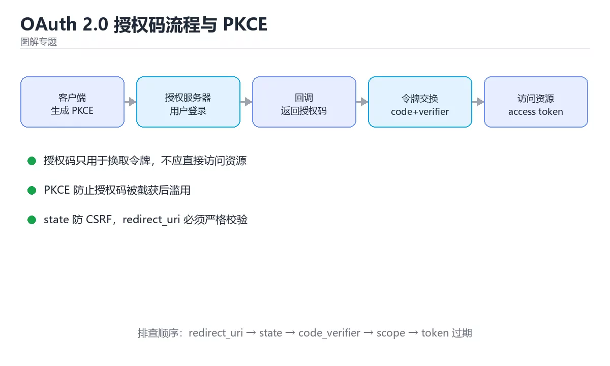
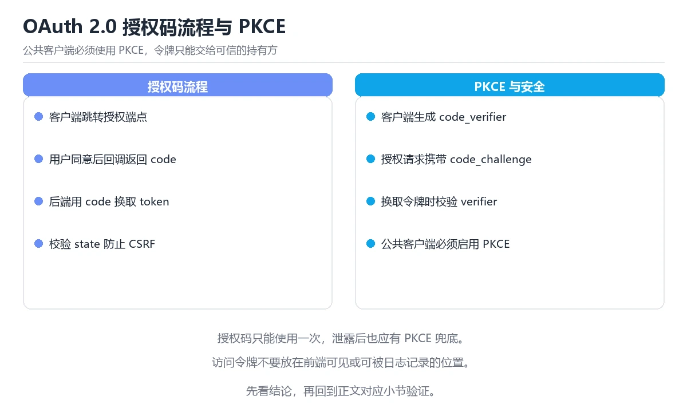

# 图解 OAuth 2.0 授权码流程与 PKCE

> 内容更新时间：2026-10-06 · 学习阶段：进阶 · 预计用时：45 分钟



## 本节知识框架

**课程定位**：所属分类 `visual_guide`（图解专题），课程主题 `图解 OAuth 2.0 授权码流程与 PKCE`，学习阶段 进阶，建议用时 45 分钟。

本课主线：四种角色、授权码加 PKCE 全流程、令牌纪律与八类常见错误。

**学完本课应当能够**
- 说清 `OAuth` 与 `PKCE` 的含义与区别，并各举一个正例和一个反例。
- 用本课示例验证 `授权码` 的行为，记录输入、输出与失败条件。
- 遇到「授权码流程不做额外校验」这类问题时，能说出触发条件与修复顺序。

### 从概念到验证的学习链条

1. `OAuth`：先掌握 授权框架：资源所有者授权后客户端用令牌访问资源服务器，全程不接触用户密码，再用它解释 `PKCE` 为什么会出现。
2. `PKCE`：先掌握 授权码流程的扩展：客户端生成并校验 code_verifier，防止授权码被截获后换令牌，再用它解释 `授权码` 为什么会出现。
3. `授权码`：先掌握 OAuth 中由授权服务器发给客户端、再换取令牌的一次性凭证，再用它解释 `令牌` 为什么会出现。
4. `令牌`：先掌握 服务签发的临时凭证，用于证明身份或携带有限权限，再用它解释 `安全` 为什么会出现。
5. `安全`：先掌握 授权流程通过 PKCE、state 校验、短时令牌和最小作用域降低令牌泄露风险，再用它解释 本课示例的观察结果 为什么会出现。

**先修与衔接**：本课是「图解专题」分类的第 16 课。先修内容：《图解大模型推理与显存占用》。《图解大模型推理与显存占用》里的 `大模型`、`推理` 是本课的前提。相关或后续课程：《图解 CDN 缓存与回源》。

### 完成判据

- **定义关**：不看正文也能说明 `OAuth` 是 授权框架：资源所有者授权后客户端用令牌访问资源服务器，全程不接触用户密码，并指出一个反例。
- **机制关**：能按“输入 → 转换 → 输出 → 验证”复述 `图解 OAuth 2.0 授权码流程与 PKCE`，而不是只背结论。
- **示例关**：能运行或推演 `图解 OAuth 2.0 授权码流程与 PKCE` 的 `text` 示例，并说明一个真实出现的标识符或字面量。
- **证据关**：能从 `图解 OAuth 2.0 授权码流程与 PKCE` 的示例写出一个输入、处理、输出三元组，并说明它支持或反驳了本课的哪一条结论。
- **排错关**：能复现 授权码流程不做额外校验，记录现象并按 使用校验挑战并校验状态参数 修复。
- **迁移关**：能把 `OAuth`、`PKCE`、`授权码`、`令牌` 放进一个与 `图解 OAuth 2.0 授权码流程与 PKCE` 不同的项目场景，并保持输入与验证条件可追踪。
- **复盘关**：学完 `图解 OAuth 2.0 授权码流程与 PKCE` 后，用一句话写下仍然不确定的结论，并列出下一次验证需要的输入、环境和成功判据。

### 复习清单

- [ ] 能不看正文复述本课核心术语，并指出一个边界或反例。
- [ ] 能运行或推演本课示例，记录输入、输出与失败现象。
- [ ] 能完成一次自测，并把错题对照错误表定位原因。

**本课配图**



## 核心概念定义

| 术语 | 操作性定义 | 常见边界与风险 |
| --- | --- | --- |
| OAuth | 授权框架：资源所有者授权后客户端用令牌访问资源服务器，全程不接触用户密码。 | 权限与密钥策略变化会让结论失效，按最小权限并用真实凭据流程复验。 |
| PKCE | 授权码流程的扩展：客户端生成并校验 code_verifier，防止授权码被截获后换令牌。 | 权限与密钥策略变化会让结论失效，按最小权限并用真实凭据流程复验。 |
| 授权码 | OAuth 中由授权服务器发给客户端、再换取令牌的一次性凭证。 | 易错：授权码被拦截后可直接换令牌；正确做法是使用校验挑战并校验状态参数。 |
| 令牌 | 服务签发的临时凭证，用于证明身份或携带有限权限。 | 易错：授权码被拦截后可直接换令牌；正确做法是使用校验挑战并校验状态参数。 |
| 安全 | 授权流程通过 PKCE、state 校验、短时令牌和最小作用域降低令牌泄露风险。 | 易错：要么容易泄露，要么频繁掉线；正确做法是短期访问令牌配合安全存储的刷新令牌。 |

## 原理与运行机制

### 机制总览

**教材衔接：一句话说清**

OAuth 2.0 解决的问题是：**让第三方应用在不知道你密码的前提下，获得有限的访问权限**。
授权码模式是其中最安全、最常用的一种，配合 PKCE 后连公开客户端也安全。

**教材衔接：授权码流程（含 PKCE）**

```text
用户          客户端            授权服务器          资源服务器
 │              │                   │                  │
 │  ① 点击登录  │                   │                  │
 ├─────────────►│                   │                  │
 │              │ ② 生成 code_verifier 与其哈希 code_challenge
 │              │ ③ 跳转 /authorize?client_id&code_challenge  │
 │              ├──────────────────►│                  │
 │  ④ 登录并同意授权                 │                  │
 ├─────────────────────────────────►│                  │
 │              │ ⑤ 重定向回跳转地址，带 authorization code   │
 │              │◄──────────────────┤                  │
 │              │ ⑥ 用 code + code_verifier 换令牌        │
 │              ├──────────────────►│                  │
 │              │ ⑦ 返回 access_token 与 refresh_token    │
 │              │◄──────────────────┤                  │
 │              │ ⑧ 带 access_token 调用 API             │
 │              ├─────────────────────────────────────►│
 │              │◄─────────────── 数据 ─────────────────┤
```

| 步骤 | 关键点 |
| --- | --- |
| ② 生成 PKCE | `code_challenge = BASE64URL(SHA256(code_verifier))` |
| ③ 授权请求 | 使用 `response_type=code`，不要用 `token` |
| ⑤ 回跳 | 只接受白名单内的 `redirect_uri` |
| ⑥ 换令牌 | 一次性使用 code，防止重放 |
| ⑧ 调用 API | `Authorization: Bearer <token>` |

**PKCE 的作用**：即使授权码被拦截，攻击者没有 `code_verifier` 也换不到令牌。

**教材衔接：授权码与令牌的差别**

| 维度 | 授权码 code | 访问令牌 access_token |
| --- | --- | --- |
| 用途 | 换取令牌 | 调用 API |
| 寿命 | 一次性、秒级 | 分钟级 |
| 能否暴露 | 也不能（PKCE 保护） | 不能 |
| 存储位置 | 不存储 | 内存 |

**教材衔接：深入补充：图解 OAuth 2.0 授权码流程与 PKCE 的取舍与边界**

### 一、把概念放回真实约束

| 观察到的现象 | 背后的机制 | 验证方式 | 常见误判 |
| --- | --- | --- | --- |
| 延迟突然升高 | 队列堆积或重传 | 分段计时与指标对照 | 只盯平均值 |
| 状态看似随机 | 并发交错或缓存失效 | 固定随机种子复现 | 把时序问题当逻辑错误 |
| 结果与预期不符 | 默认值与边界规则 | 构造最小输入 | 忽略版本差异 |


### 机制拆解：每一步的输入、动作与输出

#### 1. `OAuth`
- 输入：`OAuth`；本步把 授权框架：资源所有者授权后客户端用令牌访问资源服务器，全程不接触用户密码 当作判断规则。
- 动作：围绕 `OAuth` 保留中间状态，并记录它与 `PKCE` 的对应关系。
- 输出：`PKCE`，它可以被下一段代码、测试或记录继续使用。
- `OAuth` 的失败条件：权限与密钥策略变化会让结论失效，按最小权限并用真实凭据流程复验。

#### 2. `PKCE`
- 输入：`OAuth`；本步把 授权码流程的扩展：客户端生成并校验 code_verifier，防止授权码被截获后换令牌 当作判断规则。
- 动作：围绕 `PKCE` 保留中间状态，并记录它与 `授权码` 的对应关系。
- 输出：`授权码`，它可以被下一段代码、测试或记录继续使用。
- `PKCE` 的失败条件：权限与密钥策略变化会让结论失效，按最小权限并用真实凭据流程复验。

#### 3. `授权码`
- 输入：`PKCE`；本步把 OAuth 中由授权服务器发给客户端、再换取令牌的一次性凭证 当作判断规则。
- 动作：围绕 `授权码` 保留中间状态，并记录它与 `令牌` 的对应关系。
- 输出：`令牌`，它可以被下一段代码、测试或记录继续使用。
- `授权码` 的失败条件：当授权码流程不做额外校验时，会出现授权码被拦截后可直接换令牌。

#### 4. `令牌`
- 输入：`授权码`；本步把 服务签发的临时凭证，用于证明身份或携带有限权限 当作判断规则。
- 动作：围绕 `令牌` 保留中间状态，并记录它与 `安全` 的对应关系。
- 输出：`安全`，它可以被下一段代码、测试或记录继续使用。
- `令牌` 的失败条件：当授权码流程不做额外校验时，会出现授权码被拦截后可直接换令牌。

#### 5. `安全`
- 输入：`令牌`；本步把 授权流程通过 PKCE、state 校验、短时令牌和最小作用域降低令牌泄露风险 当作判断规则。
- 动作：围绕 `安全` 保留中间状态，并记录它与 `本课示例的最终结果` 的对应关系。
- 输出：`本课示例的最终结果`，它可以被下一段代码、测试或记录继续使用。
- `安全` 的失败条件：当令牌存储与刷新策略随意时，会出现要么容易泄露，要么频繁掉线。

### 复现实验记录

- 环境：`图解 OAuth 2.0 授权码流程与 PKCE` 使用 `text` 示例，固定 `OAuth`、`PKCE`、`授权码`、`令牌` 作为第一组条件。
- 首轮输入：从示例中的第一个输入开始，预测 `OAuth` 会怎样变化。
- 基线观察：记录命令、输入、输出和错误原文，不用截图代替可复制的文本。
- 单变量修改：只改变 `OAuth`，观察 `安全` 是否仍满足定义。
- 失败注入：复现 授权码流程不做额外校验，确认现象是 授权码被拦截后可直接换令牌。
- 记录结论：把“修改前、修改后、预期变化、实际变化”写成四列表，这样复盘 `图解 OAuth 2.0 授权码流程与 PKCE` 时才能区分概念错误与实现错误。

## 典型应用场景

- **授权码流程不做额外校验**：典型现象是授权码被拦截后可直接换令牌；正确做法是使用校验挑战并校验状态参数。
- **重定向地址匹配不严格**：典型现象是授权码被送到攻击者地址；正确做法是严格校验重定向地址。
- **令牌存储与刷新策略随意**：典型现象是要么容易泄露，要么频繁掉线；正确做法是短期访问令牌配合安全存储的刷新令牌。

### 最小验证场景

- 准备：保留 `text` 示例的原始输入，先记录 `图解 OAuth 2.0 授权码流程与 PKCE` 的基线输出和完整运行命令。
- 判定：新结果与 `图解 OAuth 2.0 授权码流程与 PKCE` 的基线不同不等于错误；只有当差异破坏了 `OAuth` 的定义或错误表中的约束，才判定为失败。

### 选择与边界

- 使用 `OAuth` 时，先满足它的定义：授权框架：资源所有者授权后客户端用令牌访问资源服务器，全程不接触用户密码；权限与密钥策略变化会让结论失效，按最小权限并用真实凭据流程复验。
- 使用 `PKCE` 时，先满足它的定义：授权码流程的扩展：客户端生成并校验 code_verifier，防止授权码被截获后换令牌；权限与密钥策略变化会让结论失效，按最小权限并用真实凭据流程复验。
- 使用 `授权码` 时，先满足它的定义：OAuth 中由授权服务器发给客户端、再换取令牌的一次性凭证；易错：授权码被拦截后可直接换令牌；正确做法是使用校验挑战并校验状态参数。
- 使用 `令牌` 时，先满足它的定义：服务签发的临时凭证，用于证明身份或携带有限权限；易错：授权码被拦截后可直接换令牌；正确做法是使用校验挑战并校验状态参数。
- 使用 `安全` 时，先满足它的定义：授权流程通过 PKCE、state 校验、短时令牌和最小作用域降低令牌泄露风险；易错：要么容易泄露，要么频繁掉线；正确做法是短期访问令牌配合安全存储的刷新令牌。

## 代码/协议/SQL 示例

**教材衔接：四个角色**

```text
① 资源所有者 Resource Owner    → 你（用户）
② 客户端 Client               → 想访问你数据的应用
③ 授权服务器 Authorization Server → 发放令牌
④ 资源服务器 Resource Server   → 存放数据的 API
```

**教材衔接：四种授权模式的取舍**

| 模式 | 适合 | 是否推荐 |
| --- | --- | --- |
| 授权码 + PKCE | Web、移动端、SPA | **推荐** |
| 客户端凭证 | 服务间调用（无用户） | 推荐 |
| 隐式模式 | 老式 SPA | **已废弃** |
| 密码模式 | 老式自有应用 | **已废弃** |

```text
为什么隐式模式被废弃
  · 令牌直接出现在 URL 片段里，容易泄漏到日志与浏览器历史
  · 无法使用刷新令牌
  → 用「授权码 + PKCE」替代
```

**教材衔接：令牌的三条纪律**

```text
① access_token 短寿命（如 15 分钟），放内存，别写 localStorage
② refresh_token 长寿命，必须安全存储（HttpOnly Cookie 或系统安全存储）
③ 每次请求校验签名、iss、aud、exp，不能只看有没有令牌
```

```typescript
// 校验 JWT 的关键声明
const payload = verifyJwt(token, publicKey, {
  issuer: "https://auth.example.com",
  audience: "my-api",
  algorithms: ["RS256"],       // 明确算法，防止 alg=none 攻击
});
```

| 风险 | 防护 |
| --- | --- |
| 令牌被窃取 | 短寿命 + HTTPS + 安全存储 |
| 授权码被拦截 | PKCE + 一次性 code |
| 重定向被篡改 | 严格白名单校验 `redirect_uri` |
| CSRF | `state` 参数校验 |
| 权限过大 | 最小化 scope + 资源级鉴权 |

**教材衔接：access 与 refresh 的配合**

```text
时间线
  t0  获取 access_token（15 分钟）+ refresh_token（30 天）
  t1  正常调用 API
  t2  access 过期 → API 返回 401
  t3  用 refresh_token 换新 access（静默刷新）
  t4  重放被中断的请求

注意：刷新要串行化，多个并发请求同时刷新会互相失效
```

```typescript
// 并发请求只触发一次刷新
let refreshing: Promise<string> | null = null;

async function getToken(): Promise<string> {
  if (!refreshing) {
    refreshing = refreshAccessToken().finally(() => { refreshing = null; });
  }
  return refreshing;
}
```

### 示例精读：先找证据，再改一个条件

- 在 `图解 OAuth 2.0 授权码流程与 PKCE` 中与 `OAuth` 对照：示例必须能支持 授权框架：资源所有者授权后客户端用令牌访问资源服务器，全程不接触用户密码，否则说明这一段还缺少实现或验证步骤。
- 在 `图解 OAuth 2.0 授权码流程与 PKCE` 中与 `PKCE` 对照：示例必须能支持 授权码流程的扩展：客户端生成并校验 code_verifier，防止授权码被截获后换令牌，否则说明这一段还缺少实现或验证步骤。
- 在 `图解 OAuth 2.0 授权码流程与 PKCE` 中与 `授权码` 对照：示例必须能支持 OAuth 中由授权服务器发给客户端、再换取令牌的一次性凭证，否则说明这一段还缺少实现或验证步骤。
- 在 `图解 OAuth 2.0 授权码流程与 PKCE` 中与 `令牌` 对照：示例必须能支持 服务签发的临时凭证，用于证明身份或携带有限权限，否则说明这一段还缺少实现或验证步骤。
- `图解 OAuth 2.0 授权码流程与 PKCE` 的示例没有抽取到函数调用或字面量；按行记录输入、控制流和输出，避免只背代码外形。

## 时间/空间复杂度或性能分析

**性能关注点（图解 OAuth 2.0 授权码流程与 PKCE）**：图解类课程的性能点在渲染与交互响应：记录首屏时间与交互延迟。

**本课特有开销（图解 OAuth 2.0 授权码流程与 PKCE · OAuth）**：缓存命中率比缓存实现本身更关键，先记录命中率与失效策略再谈优化。

**测量方法**：以 `图解 OAuth 2.0 授权码流程与 PKCE` 的 `OAuth` 场景为对象，固定输入跑一遍记录基线，再把规模或并发度提高一个数量级复测；两次结果的差值与波动范围才是结论依据。

### 需要控制的变量与记录项

- `图解 OAuth 2.0 授权码流程与 PKCE` 的 `OAuth`：固定它的版本、输入范围和资源上限，分别记录速度、内存与失败率的变化。
- `图解 OAuth 2.0 授权码流程与 PKCE` 的 `PKCE`：固定它的版本、输入范围和资源上限，分别记录速度、内存与失败率的变化。
- `图解 OAuth 2.0 授权码流程与 PKCE` 的 `授权码`：固定它的版本、输入范围和资源上限，分别记录速度、内存与失败率的变化。
- `图解 OAuth 2.0 授权码流程与 PKCE` 的 `令牌`：固定它的版本、输入范围和资源上限，分别记录速度、内存与失败率的变化。
- `图解 OAuth 2.0 授权码流程与 PKCE` 的 `安全`：固定它的版本、输入范围和资源上限，分别记录速度、内存与失败率的变化。
- `图解 OAuth 2.0 授权码流程与 PKCE` 中 `OAuth` 的边界：权限与密钥策略变化会让结论失效，按最小权限并用真实凭据流程复验。达到边界时不要外推，必须重新测量。
- `图解 OAuth 2.0 授权码流程与 PKCE` 中 `PKCE` 的边界：权限与密钥策略变化会让结论失效，按最小权限并用真实凭据流程复验。达到边界时不要外推，必须重新测量。
- `图解 OAuth 2.0 授权码流程与 PKCE` 中 `授权码` 的边界：易错：授权码被拦截后可直接换令牌；正确做法是使用校验挑战并校验状态参数。达到边界时不要外推，必须重新测量。
- `图解 OAuth 2.0 授权码流程与 PKCE` 中 `令牌` 的边界：易错：授权码被拦截后可直接换令牌；正确做法是使用校验挑战并校验状态参数。达到边界时不要外推，必须重新测量。
- `图解 OAuth 2.0 授权码流程与 PKCE` 中 `安全` 的边界：易错：要么容易泄露，要么频繁掉线；正确做法是短期访问令牌配合安全存储的刷新令牌。达到边界时不要外推，必须重新测量。

## 常见误区与易错点

| 容易写错的做法 | 实际现象 | 原因与正确做法 |
| --- | --- | --- |
| 授权码流程不做额外校验 | 授权码被拦截后可直接换令牌。 | 使用校验挑战并校验状态参数。 |
| 重定向地址匹配不严格 | 授权码被送到攻击者地址。 | 严格校验重定向地址。 |
| 令牌存储与刷新策略随意 | 要么容易泄露，要么频繁掉线。 | 短期访问令牌配合安全存储的刷新令牌。 |

### 现场 1：授权码流程不做额外校验

**症状**：授权码被拦截后可直接换令牌。

**根因与修复**：使用校验挑战并校验状态参数。

**自检**：在本课示例里复现「授权码流程不做额外校验」，改成使用校验挑战并校验状态参数后重跑；如果症状消失且失败路径按预期变化，说明定位正确。

### 现场 2：重定向地址匹配不严格

**症状**：授权码被送到攻击者地址。

**根因与修复**：严格校验重定向地址。

**自检**：在本课示例里复现「重定向地址匹配不严格」，改成严格校验重定向地址后重跑；如果症状消失且失败路径按预期变化，说明定位正确。

### 现场 3：令牌存储与刷新策略随意

**症状**：要么容易泄露，要么频繁掉线。

**根因与修复**：短期访问令牌配合安全存储的刷新令牌。

**自检**：在本课示例里复现「令牌存储与刷新策略随意」，改成短期访问令牌配合安全存储的刷新令牌后重跑；如果症状消失且失败路径按预期变化，说明定位正确。

## 与其他知识点的关系

**教材衔接：复习与迁移**

### 概念复述

- 用一句话说明「图解 OAuth 2.0 授权码流程与 PKCE」解决什么问题：四种角色、授权码加 PKCE 全流程、令牌纪律与八类常见错误。
- 写出OAuth、PKCE、授权码之间的关系，并各举一个例子。
- 说出本课最容易混淆的两个概念，以及区分它们的判据。

### 正文逐节复核

- **一句话说清**：OAuth 2.0 解决的问题是：**让第三方应用在不知道你密码的前提下，获得有限的访问权限**。
- **深入补充：图解 OAuth 2.0 授权码流程与 PKCE 的取舍与边界**：学习图解 OAuth 2.0 授权码流程与 PKCE时，最容易只记住结论而忽略前提。

### 测验回顾

1. 围绕“图解 OAuth 2.0 授权码流程与 PKCE”中的 OAuth、PKCE、授权码，下列哪两项是本课强调的实践判断？
   - 依据：本课把图解 OAuth 2.0 授权码流程与 PKCE拆成概念、示例与故障现场三部分，因此判断 OAuth 时必须同时交代输入、输出和失败路径，这使“学习 OAuth 时要同时说明输入、输出和失败路径，不能只看正常流程”成立。在图解 OAuth 2.0 授权码流程与 PKCE里，判断 PKCE 时要固定版本与边界输入，所以“验证 PKCE 时要固定版本并覆盖边界输入，结论才可复现”才可复现。
2. 这段 TypeScript 代码是「图解 OAuth 2.0 授权码流程与 PKCE」的示例片段，下面哪一项描述与它一致？
   - 依据：在「图解 OAuth 2.0 授权码流程与 PKCE」里，这段代码只做静态声明，没有循环、分支或可观察输出。这段代码出自「图解 OAuth 2.0 授权码流程与 PKCE」的正文示例，围绕OAuth、PKCE、授权码展开；把输入或边界换成空值、极值或失败情况后，结论要以「图解 OAuth 2.0 授权码流程与 PKCE」的实际运行结果为准。
3. 校验令牌签名时，明确指定允许的算法（如 RS256）是为了防？
   - 依据：在「图解 OAuth 2.0 授权码流程与 PKCE」里，防止 alg=none 等算法混淆攻击。不限制算法会让攻击者用弱算法或 none 绕过验签。把“防止 alg=none 等算法混淆攻击”代回「图解 OAuth 2.0 授权码流程与 PKCE」里“校验令牌签名时”的例子核对，条件一旦改变，结论就要用OAuth、PKCE、授权码重新推导。
4. 多个并发请求同时发现 access_token 过期，正确的处理是？
   - 依据：在「图解 OAuth 2.0 授权码流程与 PKCE」里，结论应落在「刷新动作串行化，只刷新一次，其余请求复用新令牌」。并发刷新会互相使旧令牌失效，必须合并为一次刷新。在「图解 OAuth 2.0 授权码流程与 PKCE」里，这道题要求区分概念与边界，「刷新动作串行化，只刷新一次，其余请求复用新令牌」只有在题干给出的前提下才成立，而「每个请求各自刷新一次」、「忽略 401 直接重试」缺少同一组条件。
5. 补全代码：「图解 OAuth 2.0 授权码流程与 PKCE」示例中，下面这行代码缺少哪个关键字或函数名？请填入 ____。

### 迁移练习

- **先修**：`图解大模型推理与显存占用`。本课默认这些内容已经掌握。
- **相关或后续**：`图解 CDN 缓存与回源`。本课术语会在这些课程里继续使用。
- **术语归属**：`OAuth`、`PKCE`、`授权码` 的定义以本课「核心概念定义」为准，换到其他课程时先确认定义是否被改写。

### 先修与后续术语接口

- `图解大模型推理与显存占用`：两者通过本分类的学习顺序衔接，阅读时重点比较各自的输入与失败条件。
- `图解 CDN 缓存与回源`：两者通过本分类的学习顺序衔接，阅读时重点比较各自的输入与失败条件。

### 容易混淆的相邻概念

- `OAuth` 与 `PKCE`：前者强调 授权框架：资源所有者授权后客户端用令牌访问资源服务器，全程不接触用户密码；后者强调 授权码流程的扩展：客户端生成并校验 code_verifier，防止授权码被截获后换令牌。判断时分别检查两条定义的适用范围，不要只看名称相似就互换。
- `PKCE` 与 `授权码`：前者强调 授权码流程的扩展：客户端生成并校验 code_verifier，防止授权码被截获后换令牌；后者强调 OAuth 中由授权服务器发给客户端、再换取令牌的一次性凭证。判断时分别检查两条定义的适用范围，不要只看名称相似就互换。
- `授权码` 与 `令牌`：前者强调 OAuth 中由授权服务器发给客户端、再换取令牌的一次性凭证；后者强调 服务签发的临时凭证，用于证明身份或携带有限权限。判断时分别检查两条定义的适用范围，不要只看名称相似就互换。
- `令牌` 与 `安全`：前者强调 服务签发的临时凭证，用于证明身份或携带有限权限；后者强调 授权流程通过 PKCE、state 校验、短时令牌和最小作用域降低令牌泄露风险。判断时分别检查两条定义的适用范围，不要只看名称相似就互换。

## 自测题与参考答案

> 先独立作答，再对照参考答案；答案都能在本课正文、术语表或错误表里找到依据。

### 自测 1（概念复述）

不看正文，写出 `OAuth` 的操作性定义，并说明它与 `PKCE` 的区别。

**参考答案**：授权框架：资源所有者授权后客户端用令牌访问资源服务器，全程不接触用户密码。

`PKCE` 的定位是：授权码流程的扩展：客户端生成并校验 code_verifier，防止授权码被截获后换令牌；两者的差别要从适用对象与失败模式上说明。

### 自测 2（排错）

本课错误表记录了「授权码流程不做额外校验」这类做法。请写出它会出现的现象、根因，以及修复顺序。

**参考答案**：现象是授权码被拦截后可直接换令牌；正确做法是使用校验挑战并校验状态参数。修复时先复现现象并保留证据，再改动一处假设重跑，确认现象消失。

### 自测 3（动手验证）

运行本课的 `text` 示例，改动其中一个输入后重新运行，记录输出与错误信息。

**参考答案**：正常输入下 `text` 示例应当复现正文给出的结果；改动输入后，如果结果改变或报错，先核对它是否满足 `图解 OAuth 2.0 授权码流程与 PKCE` 中`OAuth` 的适用范围，再检查错误表里是否有同类现象。

### 自测 4（代码阅读）

阅读本课开头的 `text` 示例，说明它体现了`OAuth` 的哪一条性质，并指出改动哪个输入会让这条性质不再成立。

**参考答案**：`OAuth` 的定义是 授权框架：资源所有者授权后客户端用令牌访问资源服务器，全程不接触用户密码，示例正是在实现这条定义。改动与 `OAuth` 有关的一个输入后，如果结果不再符合 `图解 OAuth 2.0 授权码流程与 PKCE` 的正文描述，就说明该性质只在当前前提成立。

### 自测 5（迁移）

把 `图解 OAuth 2.0 授权码流程与 PKCE` 的方法迁移到自己的项目：围绕 `OAuth` 写出一个与错误表同类的风险点，并说明触发条件和检验方式。

**参考答案**：例如「令牌存储与刷新策略随意」，它会导致要么容易泄露，要么频繁掉线；检验方式是按短期访问令牌配合安全存储的刷新令牌改一处再复现，确认现象消失且没有引入新的失败分支。

### 自测 6（对比）

用一个表格对比 `OAuth` 与 `PKCE`：各写一行适用场景、一行失败表现。

**参考答案**：`OAuth` 的定义是授权框架：资源所有者授权后客户端用令牌访问资源服务器，全程不接触用户密码；`PKCE` 的定义是授权码流程的扩展：客户端生成并校验 code_verifier，防止授权码被截获后换令牌。两者的失败表现分别对应本课错误表里与本术语相关的行。

### 自测 7（排错顺序）

面对「授权码流程不做额外校验」引发的问题，请把“复现 授权码被拦截后可直接换令牌 → 保留证据 → 使用校验挑战并校验状态参数 → 回归验证”四步写成可执行的检查清单。

**参考答案**：第一步按授权码被拦截后可直接换令牌复现；第二步记录输入、版本与完整报错；第三步按使用校验挑战并校验状态参数只改一处；第四步重跑并确认失败路径也按预期变化。

### 自测 8（边界判断）

针对 `安全`，分别写出“可以使用”的条件和“结论不再成立”的条件。

**参考答案**：易错：要么容易泄露，要么频繁掉线；正确做法是短期访问令牌配合安全存储的刷新令牌。 同时要把 `安全` 的定义 授权流程通过 PKCE、state 校验、短时令牌和最小作用域降低令牌泄露风险 与实际输入逐项对照。

### 自测 9（机制重建）

不看正文，按输入、转换、输出、验证四段重建 `OAuth` → `PKCE` → `授权码` → `令牌` 的作用链。

**参考答案**：起点是 `OAuth` 的定义 授权框架：资源所有者授权后客户端用令牌访问资源服务器，全程不接触用户密码；中间每一步都保留可观察状态；终点由 `安全` 检查，失败时回到错误表定位第一个偏离定义的步骤。

### 自测 10（综合排错）

在 `图解 OAuth 2.0 授权码流程与 PKCE` 中，现象是 要么容易泄露，要么频繁掉线。请围绕 令牌存储与刷新策略随意 写出最小复现、关键证据、修复动作和回归验证，并说明为什么不能只凭一次运行下结论。

**参考答案**：先复现 令牌存储与刷新策略随意，记录输入与完整错误；再按 短期访问令牌配合安全存储的刷新令牌 只改一处。回归时同时跑正常路径和边界路径，只有两次结果都可解释，才把修复视为完成。

### 自测 11（一分钟复述）

用每分钟约 200 字的速度复述 `图解 OAuth 2.0 授权码流程与 PKCE`：先给主问题，再按顺序说出 `OAuth`、`PKCE`、`授权码`、`令牌`，最后给一个失败案例。

**自评标准**：主问题必须对应 四种角色、授权码加 PKCE 全流程、令牌纪律与八类常见错误；每个术语都要能接上一句定义或边界；失败案例必须写成可观察现象，不能用“可能有风险”代替证据。

## 术语速查

| 术语 | 一句话说明 |
| --- | --- |
| `OAuth` | 授权框架：资源所有者授权后客户端用令牌访问资源服务器，全程不接触用户密码。 |
| `PKCE` | 授权码流程的扩展：客户端生成并校验 code_verifier，防止授权码被截获后换令牌。 |
| `授权码` | OAuth 中由授权服务器发给客户端、再换取令牌的一次性凭证。 |
| `令牌` | 服务签发的临时凭证，用于证明身份或携带有限权限。 |
| `安全` | 授权流程通过 PKCE、state 校验、短时令牌和最小作用域降低令牌泄露风险。 |

**术语关系**：`OAuth`（授权框架：资源所有者授权后客户端用令牌访问资源服务器） → `PKCE`（授权码流程的扩展：客户端生成并校验 code_verifier） → `授权码`（OAuth 中由授权服务器发给客户端、再换取令牌的一次性凭证） → `令牌`（服务签发的临时凭证）。

## 考点精讲

`图解 OAuth 2.0 授权码流程与 PKCE` 的题库有 5 道题，下面逐题给出题干、正确项与判断依据：先自己作答，再核对正确项，最后回到正文对应小节复核。

### 考点 1：第 1 题

- **题目**：围绕“图解 OAuth 2.0 授权码流程与 PKCE”中的 OAuth、PKCE、授权码，下列哪两项是本课强调的实践判断？
- **正确项**：学习 OAuth 时要同时说明输入、输出和失败路径，不能只看正常流程；验证 PKCE 时要固定版本并覆盖边界输入，结论才可复现
- **判断依据**：这道题落在术语 `OAuth` 上：授权框架：资源所有者授权后客户端用令牌访问资源服务器，全程不接触用户密码。复习时把 `OAuth` 的定义、适用边界和一个反例一起说清楚，再回到「核心概念定义」核对原文。

### 考点 2：第 2 题

- **题目**：代码语言为 `typescript`，选自 `图解 OAuth 2.0 授权码流程与 PKCE` 的 `OAuth` 部分。课程问题为四种角色、授权码加 PKCE 全流程、令牌纪律与八类常见错误。哪一项描述与代码一致？
- **正确项**：这段示例用于说明本课术语 `安全` 的行为
- **判断依据**：这道题落在术语 `OAuth` 上：授权框架：资源所有者授权后客户端用令牌访问资源服务器，全程不接触用户密码。复习时把 `OAuth` 的定义、适用边界和一个反例一起说清楚，再回到「核心概念定义」核对原文。

### 考点 3：第 3 题

- **题目**：校验令牌签名时，明确指定允许的算法（如 RS256）是为了防？
- **正确项**：防止 alg=none 等算法混淆攻击
- **判断依据**：这道题落在术语 `令牌` 上：服务签发的临时凭证，用于证明身份或携带有限权限。复习时把 `令牌` 的定义、适用边界和一个反例一起说清楚，再回到「核心概念定义」核对原文。

### 考点 4：第 4 题

- **题目**：多个并发请求同时发现 access_token 过期，正确的处理是？
- **正确项**：刷新动作串行化，只刷新一次，其余请求复用新令牌
- **判断依据**：这道题落在术语 `令牌` 上：服务签发的临时凭证，用于证明身份或携带有限权限。复习时把 `令牌` 的定义、适用边界和一个反例一起说清楚，再回到「核心概念定义」核对原文。

### 考点 5：第 5 题

- **题目**：填空：补齐下面这段术语说明中的空缺。课程 `四种角色、授权码加 PKCE 全流程、令牌纪律与八类常见错误。`，这段说明是：`____`：OAuth 中由授权服务器发给客户端、再换取令牌的一次性凭证。空缺处应填哪个术语？
- **正确项**：授权码
- **判断依据**：这道题落在术语 `OAuth` 上：授权框架：资源所有者授权后客户端用令牌访问资源服务器，全程不接触用户密码。复习时把 `OAuth` 的定义、适用边界和一个反例一起说清楚，再回到「核心概念定义」核对原文。

### 考点 6：`OAuth`

- **要点**：授权框架：资源所有者授权后客户端用令牌访问资源服务器，全程不接触用户密码。
- **OAuth 的边界**：权限与密钥策略变化会让结论失效，按最小权限并用真实凭据流程复验。

### 考点 7：`PKCE`

- **要点**：授权码流程的扩展：客户端生成并校验 code_verifier，防止授权码被截获后换令牌。
- **PKCE 的边界**：权限与密钥策略变化会让结论失效，按最小权限并用真实凭据流程复验。

### 考点 8：`授权码`

- **要点**：OAuth 中由授权服务器发给客户端、再换取令牌的一次性凭证。
- **授权码 的边界**：易错：授权码被拦截后可直接换令牌；正确做法是使用校验挑战并校验状态参数。

### 考点 9：`令牌`

- **要点**：服务签发的临时凭证，用于证明身份或携带有限权限。
- **令牌 的边界**：易错：授权码被拦截后可直接换令牌；正确做法是使用校验挑战并校验状态参数。

### 考点 10：`安全`

- **要点**：授权流程通过 PKCE、state 校验、短时令牌和最小作用域降低令牌泄露风险。
- **安全 的边界**：易错：要么容易泄露，要么频繁掉线；正确做法是短期访问令牌配合安全存储的刷新令牌。

### 考点 11：排错——授权码流程不做额外校验

- **现象**：授权码被拦截后可直接换令牌。
- **处理**：使用校验挑战并校验状态参数。

### 考点 12：排错——重定向地址匹配不严格

- **现象**：授权码被送到攻击者地址。
- **处理**：严格校验重定向地址。

### 考点 13：综合辨析——`OAuth` 与 `安全`

- **辨析点**：`OAuth` 的定义是 授权框架：资源所有者授权后客户端用令牌访问资源服务器，全程不接触用户密码；`安全` 的定义是 授权流程通过 PKCE、state 校验、短时令牌和最小作用域降低令牌泄露风险。
- **答题要求**：面对 `图解 OAuth 2.0 授权码流程与 PKCE` 的题目，先判断描述的是 `OAuth` 还是 `安全`，再归到对应定义，最后写出一个会让该定义失效的边界输入。

### 考点 14：排错评分点

- **现象分**：能写出 授权码被拦截后可直接换令牌，而不是只写“程序有错”。
- **证据分**：保留触发 授权码流程不做额外校验 的输入、版本和错误原文。
- **修复分**：按 使用校验挑战并校验状态参数 只改一处，并同时回归正常路径与边界路径。

## 内容元数据

- 内容版本：v2.0
- 最后更新：2026-10-06
- 学习阶段：进阶
- 适用环境：通用图解与系统原理；本课聚焦 OAuth。
- 内容来源：内置结构化课程与工程实践整理
- 相关主题：OAuth、PKCE、授权码、令牌、安全
- 质量版本：P0 测验标准 + P1 覆盖扩展 + P2 体验补全

## 参考资料与复核

- 最后复核：2026-10-04
- 下次复核：2027-07-10
- 复核范围：版本兼容、API 行为、安全建议与工程实践
- 来源性质：官方文档、标准或权威教材；本课核对关键词：OAuth、PKCE、授权码、令牌、安全。

| 参考资料 | 本课用途 |
| --- | --- |
| [Mermaid 文档](https://mermaid.js.org/intro/) | 流程图、时序图与状态图 |
| [RFC Editor](https://www.rfc-editor.org/) | 协议状态机与报文流程 |
| [PlantUML 文档](https://plantuml.com/) | UML 与架构图表达 |

| [本课术语索引：图解 OAuth 2.0 授权码流程与 PKCE](#核心概念定义) | 按本课输入、术语边界和错误表现逐项核对 |
> 「图解 OAuth 2.0 授权码流程与 PKCE」的链接用于离线阅读后的延伸核对；App 不会自动联网。