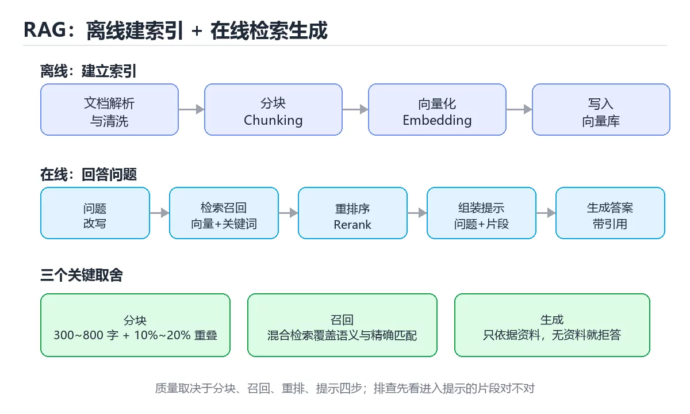

# 图解 RAG 检索增强生成流程

> 内容更新时间：2026-10-03 · 学习阶段：进阶 · 预计用时：22 分钟

## 学习目标

- 能用自己的话解释「图解 RAG 检索增强生成流程」解决了什么问题，而不是只背术语。
- 能说清 「RAG」、「分块」、「向量检索」、「Rerank」 之间的关系，并分别举出一个例子。
- 能把本课知识放回「图解专题」的知识体系，说明它和相邻主题的边界。
- 能完成本课练习，并用验收标准检查自己的结果。

> 一句话摘要：离线索引与在线问答全链路、分块策略、混合检索与评测指标。

## 前置知识

- 先完成上一课《图解 Kubernetes 调度与探针》；如果已经掌握，可以直接用本课练习自测。
- 本课阶段：进阶。建议先掌握同一分类的基础课程，并能独立运行正文中的最小示例。
- 开始前先复习：RAG、分块、向量检索。
- 如果某一步看不懂，先记录具体卡点，完成练习后再回头读一遍。




## 一句话说清

RAG 就是在模型回答之前，先**去知识库里捞出相关片段塞进提示**。
它解决两个问题：模型不知道的私有知识，以及模型凭空编造（幻觉）。

## 一张图看懂完整链路

```text
【离线：建立索引】

文档（PDF / Markdown / 网页 / 表格）
        │
        ▼
① 解析与清洗（去页眉页脚、乱码、重复）
        │
        ▼
② 分块 Chunking（按语义或固定长度加重叠）
        │
        ▼
③ 向量化 Embedding（每块转成一组向量）
        │
        ▼
④ 写入向量库（向量 + 原文 + 元数据）

【在线：回答问题】

用户提问
        │
        ▼
⑤ 问题向量化
        │
        ▼
⑥ 检索召回（向量相似度 + 关键词 BM25，可混合）
        │
        ▼
⑦ 重排序 Rerank（用小模型精排 Top-K）
        │
        ▼
⑧ 组装提示（问题 + 片段 + 回答约束）
        │
        ▼
⑨ 大模型生成答案（附引用来源）
        │
        ▼
⑩ 后处理（校验、格式化、日志与评测）
```

## 分块策略：影响最大的一步

```text
块太大                          块太小
┌───────────────────────┐      ┌────┐ ┌────┐ ┌────┐
│ 含大量无关内容          │      │一句话│ │半句 │ │短语│
│ 检索精度下降            │      │语义不完整、缺上下文   │
└───────────────────────┘      └────┘ └────┘ └────┘

推荐做法
  · 长度：中文 300~800 字，或 200~500 token
  · 重叠：10%~20%，避免语义在切分点被截断
  · 优先按结构切：标题、段落、代码块、表格自成一块
  · 每块带元数据：文档名、章节、页码、更新时间
```

| 策略 | 适合 |
| --- | --- |
| 固定长度加重叠 | 通用兜底 |
| 按标题层级切 | 结构化文档（手册、规范） |
| 按语义切（句子边界） | 叙述性文本 |
| 小块检索、大块生成 | 兼顾精度与上下文 |

## 检索：先召回再精排

```text
第一阶段：召回（Recall）—— 要快、宁多勿漏
  · 向量检索：语义相似，同义改述也能命中
  · 关键词检索（BM25）：专有名词、编号、代码符号更准
  · 混合检索：两路各取前 N，去重合并

第二阶段：精排（Rerank）—— 要准，用小模型逐条打分
  · 交叉编码器给「问题-片段」打相关性分
  · 取前 3~5 条进入提示，而不是把 20 条全塞进去
```

| 做法 | 优点 | 代价 |
| --- | --- | --- |
| 纯向量 | 语义泛化好 | 精确匹配差（编号、缩写） |
| 纯关键词 | 精确 | 换种说法就搜不到 |
| 混合 | 覆盖两者 | 需要调权重 |
| 加 Rerank | 相关性显著提升 | 增加一次模型调用延迟 |

## 提示组装的三条约束

```text
系统提示示例
  你是一个严谨的问答助手，只能依据给定资料回答。
  · 资料中没有的内容，回答「资料中未提及」
  · 每个结论后面标注来源编号，如 [1]
  · 不要编造链接、数据与引用

用户提示
  【资料】
  [1] ……片段内容……
  [2] ……片段内容……

  【问题】
  用户的原始问题
```

**关键点：明确指出「资料中没有就说没有」**，能大幅降低编造。

## 评测：怎么知道 RAG 变好了

| 指标 | 衡量什么 | 怎么算 |
| --- | --- | --- |
| 召回率 Recall@K | 正确片段是否被召回 | 正确片段出现在前 K 的比例 |
| 准确率 Precision@K | 召回的片段有多少相关 | 前 K 中相关片段占比 |
| 忠实度 Faithfulness | 答案是否只依据资料 | 人工或模型评审 |
| 答案相关性 | 是否回答了问题 | 人工或模型评审 |
| 引用正确率 | 引用是否指向真正来源 | 抽样核对 |

```text
评测集最小可用版本
  · 50~100 个真实问题
  · 每个问题标注「正确片段来源」与「期望答案要点」
  · 每次改动（分块、模型、K 值）都跑一遍对比
```

## 五个高频失效场景

| 现象 | 根因 | 对策 |
| --- | --- | --- |
| 检索不到 | 分块不合适或术语不匹配 | 改分块、加混合检索、补同义词 |
| 检索到但答非所问 | 召回了相似但无关片段 | 加 Rerank、提高阈值 |
| 答案编造 | 提示没约束或资料不足 | 强化提示、无资料就拒答 |
| 答案过长或跑题 | 片段太多、约束不清 | 限制片段数与输出长度 |
| 延迟太高 | Rerank 与长上下文开销 | 减少 K、加缓存、并行化 |

```text
排查顺序（从便宜到贵）
  1. 打印实际进入提示的片段，肉眼判断相关性
  2. 看召回集是否包含正确片段（不含则属于检索问题）
  3. 若含正确片段但答案错，属于生成或提示问题
  4. 最后才考虑换模型或换向量库
```

## 新手最容易踩的八个坑

| 坑 | 现象 | 正确做法 |
| --- | --- | --- |
| 不做清洗直接入库 | 页眉页脚污染检索 | 先清洗再分块 |
| 分块不带重叠 | 关键句被切断 | 加 10%~20% 重叠 |
| 只做向量检索 | 编号与专有名词搜不到 | 加关键词混合检索 |
| 把 20 个片段全塞提示 | 噪音多、延迟高 | Rerank 后取前 3~5 |
| 没有「无资料就说没有」约束 | 幻觉严重 | 在系统提示中明确约束 |
| 不做评测就上线 | 改坏了也不知道 | 建最小评测集 |
| 不记录引用与日志 | 无法追溯答案来源 | 保存片段 ID 与得分 |
| 忽略更新与删除 | 检索到过期内容 | 支持增量更新与失效 |

## 本课小结
- RAG 的质量取决于**分块、召回、重排、提示**这四步，模型只是最后一环。
- 排查永远先看「进入提示的片段对不对」，再怀疑模型。
- 没有评测集的 RAG 无法迭代，先做 50 条评测集再谈优化。


## 补充：查询改写、上下文压缩与评测落地

### 查询改写的四种手段

| 手段 | 做法 | 适用 |
| --- | --- | --- |
| 多查询扩展 | 让模型把问题改写成 3~5 个不同说法，分别检索后合并 | 提问口语化、术语不统一 |
| HyDE | 先让模型「编」一个假设答案，再用它去检索 | 问题很短、语义稀疏 |
| 关键词抽取 | 从问题里抽实体与关键字做 BM25 检索 | 含编号、型号、专有名词 |
| 对话改写 | 把「它多少钱」改写成「X 商品多少钱」 | 多轮对话 |

```text
多查询扩展的实现要点
  ① 各查询分别取 Top-N（例如各 10 条）
  ② 用 RRF（倒数排名融合）合并：score = Σ 1/(k + rank)，k 常取 60
  ③ 再把融合结果交给 Rerank
优势：不依赖分数可比性，比「加权求和」更稳
```

### 上下文压缩：把长片段变短

```text
问题：召回的长片段里 70% 是无关内容，既占 token 又干扰生成

三种压缩方式
  ① 句子级筛选：用 Rerank 分数只保留相关句子
  ② 摘要压缩：让模型把片段压缩成要点（有信息损失）
  ③ 结构化抽取：只保留表格/代码块/参数值等关键部分

取舍：压缩越狠，token 越省，但信息丢失风险越高
     建议先做①（无损筛选），必要时才做②
```

### 引用返回：让答案可核对

```text
输出约定
  · 每个结论后面标注来源编号 [1]
  · 末尾列出「编号 → 文档名 + 章节 + 片段 ID」
  · 无依据的内容必须标注「资料中未提及」

工程价值
  · 用户可自行核对，降低幻觉危害
  · 评测时可自动检查「引用是否真的支持结论」
  · 出问题时能快速定位是检索错还是生成错
```

### 增量索引与失效

| 场景 | 做法 |
| --- | --- |
| 新增文档 | 走同一分块与向量化流程，追加写入 |
| 文档更新 | 先按文档 ID 删除旧片段，再写入新片段 |
| 文档删除 | 按元数据过滤（软删除）或重建索引 |
| 批量重建 | 双索引切换：建好新索引后切流量 |

```text
容易忽略的两点
  · 分块策略变更必须整体重建，否则新旧片段口径不一致
  · 嵌入模型升级同样要重建：不同模型的向量不可比较
```

### 最小评测集的构造与使用

```text
构造步骤
  ① 收集 50~100 个真实问题（不是编造的）
  ② 标注每个问题的「正确来源片段」与「期望答案要点」
  ③ 分成两半：调参用、验收用（避免过拟合）

每次改动都要跑的三组数字
  · Recall@5：正确片段是否被召回
  · 忠实度：答案是否只依据资料
  · P95 延迟与单次成本

改动优先级：先修检索（召回不够），再调生成（提示与模型）
```

### 自查清单

- [ ] 用了查询改写提升召回，而不是只调 Top-K
- [ ] 长片段做过句子级筛选再进提示
- [ ] 答案带可核对的引用编号
- [ ] 文档更新与模型升级有明确的重建流程
- [ ] 有独立的调参集与验收集，避免过拟合

## 动手练习


> 本课练习重点：围绕「RAG、分块、向量检索」完成复述、实验和交付，每个结果都要能被别人检查。

先不看原图手绘流程，再标出状态变化，最后用自己的话解释关键一步。

### 练习 1：建立心智模型（10 分钟）

合上教程，用 3～5 句话回答：

1. 「图解 RAG 检索增强生成流程」解决了什么问题？
2. 如果没有它，会出现什么具体后果？
3. 它和「分块」是什么关系？

**验收标准**：至少出现一个本课关键词，并写出一个反例、边界条件或失效场景。

### 练习 2：做一次可控实验（20 分钟）

从正文中选一个最小示例，完成以下操作：

1. 先预测修改一个参数、输入或步骤后的结果。
2. 再实际执行或逐步推演，记录真实结果。
3. 如果结果与预测不同，写出差异原因。

**验收标准**：留下「原例 → 改动 → 预测 → 结果 → 原因」五步记录。

### 练习 3：交付一个小结果（30 分钟）

不看原图手绘一遍流程，再用自己的话指出图中的关键状态变化。

任务要求：

- 结果必须能被别人检查，不能只写“我已经理解了”。
- 至少覆盖「RAG」和「分块」两个关键词。
- 写出 1 个仍然不确定的问题，以及下一步如何验证。

> 提示：时间有限时优先做练习 1 和练习 2；练习 3 可以拆成两次完成。


## 考点精讲：把测验题还原成判断过程

本课有 5 个判断点。先自己作答，再看「判断依据」；如果结论正确但理由不完整，回到正文对应章节补足概念。

### 考点 1：分块过大或过小分别会带来什么问题？

- **正确判断**：过大引入噪音降低精度，过小导致语义不完整
- **判断依据**：正确答案是「过大引入噪音降低精度，过小导致语义不完整」，本课在「提示组装的三条约束」中说明：关键点：明确指出「资料中没有就说没有」，能大幅降低编造。分块尺寸直接决定检索质量，需要在噪音与语义完整之间取平衡。本课还在「本课小结」中说明：RAG 的质量取决于分块、召回、重排、提示这四步，模型只是最后一环。本课还在「本课小结」中说明：没有评测集的 RAG 无法迭代，先做 50 条评测集再谈优化。
- **迁移检查**：如果给某个错误选项去掉一个限定词，它会不会变成正确？说明理由。

### 考点 2：混合检索指的是？

- **正确判断**：向量检索与关键词检索相结合
- **判断依据**：正确答案是「向量检索与关键词检索相结合」，本课在「一句话说清」中说明：它解决两个问题：模型不知道的私有知识，以及模型凭空编造（幻觉）。向量擅长语义泛化，关键词擅长编号与专有名词，混合后覆盖更全。，本课在「一句话说清」中说明：RAG 就是在模型回答之前，先去知识库里捞出相关片段塞进提示。本课还在「本课小结」中说明：排查永远先看「进入提示的片段对不对」，再怀疑模型。
- **迁移检查**：如果给某个错误选项去掉一个限定词，它会不会变成正确？说明理由。

### 考点 3：引入 Rerank 的主要目的是？

- **正确判断**：对召回结果精排
- **判断依据**：正确答案是「对召回结果精排」，本课在「补充：查询改写、上下文压缩与评测落地」中说明：用了查询改写提升召回，而不是只调 Top-K。Rerank 用更精细的模型给「问题-片段」打分，把最相关的少数片段送进提示。课程摘要指出离线索引与在线问答全链路，分块策略，混合检索与评测指标，本课要判断的正是引入Rerank的主要目的是。
- **迁移检查**：如果给某个错误选项去掉一个限定词，它会不会变成正确？说明理由。

### 考点 4：回答出现编造内容时，最先应该检查什么？

- **正确判断**：先看进入提示的片段是否正确
- **判断依据**：正确答案是「先看进入提示的片段是否正确」，本课在「本课小结」中说明：排查永远先看「进入提示的片段对不对」，再怀疑模型。多数幻觉来自片段不相关或提示缺少约束，先验证输入再谈换模型。本课还在「一句话说清」中说明：RAG 就是在模型回答之前，先去知识库里捞出相关片段塞进提示。本课还在「本课小结」中说明：RAG 的质量取决于分块、召回、重排、提示这四步，模型只是最后一环。
- **迁移检查**：遮住选项，只根据定义复述一次答案，再回来看哪个选项与复述一致。

### 考点 5：把「图解 RAG 检索增强生成流程」中「验证步骤」的步骤调整为正确顺序。

- **正确判断**：1. 记录运行环境、命令和真实输出 → 2. 修改一个输入，先写预测再运行 → 3. 制造一次错误输入，记录错误信息与修复方式 → 4. 把结论写回本课笔记或测试用例
- **判断依据**：正确答案是「记录运行环境、命令和真实输出 → 修改一个输入，先写预测再运行 → 制造一次错误输入，记录错误信息与修复方式 → 把结论写回本课笔记或测试用例」，这道题在问把图解RAG检索增强生成流程中验证步骤的步骤调整为正确顺序，判断时要把题干限定的输入、边界与目标逐项对齐。
- **迁移检查**：交换其中两步，会出现什么后果？写出失败现象。

## 本课复习清单

离开本课前，逐项确认：

- [ ] 不看解析，能说出「分块过大或过小分别会带来什么问题？」的判断依据。
- [ ] 不看解析，能说出「混合检索指的是？」的判断依据。
- [ ] 不看解析，能说出「引入 Rerank 的主要目的是？」的判断依据。
- [ ] 不看解析，能说出「回答出现编造内容时，最先应该检查什么？」的判断依据。
- [ ] 不看解析，能说出「把「图解 RAG 检索增强生成流程」中「验证步骤」的步骤调整为正确顺序。」的判断依据。
- [ ] 至少运行一次本课示例，记录输入、输出和一个边界情况。
- [ ] 把本课最容易混淆的两个概念写成一句话对照。

| 复盘项 | 记录 |
| --- | --- |
| 已经能独立解释的考点 |  |
| 仍然说不清的概念 |  |
| 下一步验证动作 |  |

## 术语速查

把本课反复出现的术语集中放在一起。复习时先遮住右列，尝试用自己的话解释，再回到正文核对。

| 术语 | 本课语境 |
| --- | --- |
| `RAG` | 本课围绕该主题展开，结合正文与代码示例理解它的适用边界。 |
| `分块` | 本课围绕该主题展开，结合正文与代码示例理解它的适用边界。 |
| `向量检索` | 本课围绕该主题展开，结合正文与代码示例理解它的适用边界。 |
| `Rerank` | 本课围绕该主题展开，结合正文与代码示例理解它的适用边界。 |
| `评测` | 本课围绕该主题展开，结合正文与代码示例理解它的适用边界。 |

## 面试问答与自测

下面把本课考点换成面试追问。先口述自己的答案，
再对照参考回答检查是否遗漏了前提、边界或失败路径。

### 追问 1：分块过大或过小分别会带来什么问题？

**参考回答**：正确答案是「过大引入噪音降低精度，过小导致语义不完整」，本课在「提示组装的三条约束」中说明：关键点：明确指出「资料中没有就说没有」，能大幅降低编造。分块尺寸直接决定检索质量，需要在噪音与语义完整之间取平衡。本课还在「本课小结」中说明：RAG 的质量取决于分块、召回、重排、提示这四步，模型只是最后一环。本课还在「本课小结」中说明：没有评测集的 RAG 无法迭代，先做 50 条评测集再谈优化。

### 追问 2：混合检索指的是？

**参考回答**：正确答案是「向量检索与关键词检索相结合」，本课在「一句话说清」中说明：它解决两个问题：模型不知道的私有知识，以及模型凭空编造（幻觉）。向量擅长语义泛化，关键词擅长编号与专有名词，混合后覆盖更全。，本课在「一句话说清」中说明：RAG 就是在模型回答之前，先去知识库里捞出相关片段塞进提示。本课还在「本课小结」中说明：排查永远先看「进入提示的片段对不对」，再怀疑模型。

### 追问 3：引入 Rerank 的主要目的是？

**参考回答**：正确答案是「对召回结果精排」，本课在「补充·查询改写、上下文压缩与评测落地」中说明：用了查询改写提升召回，而不是只调 Top-K。Rerank 用更精细的模型给「问题-片段」打分，把最相关的少数片段送进提示。课程摘要指出离线索引与在线问答全链路，分块策略，混合检索与评测指标，本课要判断的正是引入Rerank的主要目的是。

### 追问 4：回答出现编造内容时，最先应该检查什么？

**参考回答**：正确答案是「先看进入提示的片段是否正确」，本课在「本课小结」中说明：排查永远先看「进入提示的片段对不对」，再怀疑模型。多数幻觉来自片段不相关或提示缺少约束，先验证输入再谈换模型。本课还在「一句话说清」中说明：RAG 就是在模型回答之前，先去知识库里捞出相关片段塞进提示。本课还在「本课小结」中说明：RAG 的质量取决于分块、召回、重排、提示这四步，模型只是最后一环。

### 追问 5：把「图解 RAG 检索增强生成流程」中「验证步骤」的步骤调整为正确顺序。

**参考回答**：正确答案是「记录运行环境、命令和真实输出 → 修改一个输入，先写预测再运行 → 制造一次错误输入，记录错误信息与修复方式 → 把结论写回本课笔记或测试用例」，这道题在问把图解RAG检索增强生成流程中验证步骤的步骤调整为正确顺序，判断时要把题干限定的输入、边界与目标逐项对齐。

<!-- p0-depth-v2:start -->
## 零基础精讲：把「图解 RAG 检索增强生成流程」真正讲透

### 先建立一个直觉

把「图解 RAG 检索增强生成流程」看成一个有输入、处理、输出和失败边界的工程问题。先定义什么叫正确，再讨论性能和扩展。

本课的摘要可以当作一张地图：离线索引与在线问答全链路、分块策略、混合检索与评测指标。

阅读时不要只记结论，先问三个问题：它解决什么问题？依赖哪些前提？在什么条件下会失效？

### 逐步拆解

1. 识别输入。先写清数据类型、取值范围、空值策略，以及输入来自用户、文件还是另一个服务。
2. 描述处理过程。把「RAG、分块、向量检索、Rerank、评测」映射到具体步骤，每步都要求能单独验证。
3. 定义输出。输出不仅包括正常结果，还包括错误码、日志、指标和资源释放状态。
4. 找出一条失败路径。让错误尽早暴露，并说明重试、降级、回滚或人工处理的边界。
5. 用一个小例子贯穿全过程。先手算或预测结果，再运行代码或实验，最后解释差异。

### 把正文串成一条执行链

- **查询改写的四种手段**：| 手段 | 做法 | 适用 |
- **上下文压缩：把长片段变短**：上下文压缩：把长片段变短
- **增量索引与失效**：| --- | --- |
- **自查清单**：- [ ] 用了查询改写提升召回，而不是只调 Top-K
- **练习 1：建立心智模型（10 分钟）**：练习 1：建立心智模型（10 分钟）
- **练习 2：做一次可控实验（20 分钟）**：练习 2：做一次可控实验（20 分钟）

### 从测验反推易错点

**检查点 1：分块过大或过小分别会带来什么问题？**

- 参考判断：过大引入噪音降低精度，过小导致语义不完整
- 解析：正确答案是「过大引入噪音降低精度，过小导致语义不完整」，本课在「提示组装的三条约束」中说明：关键点：明确指出「资料中没有就说没有」，能大幅降低编造。分块尺寸直接决定检索质量，需要在噪音与语义完整之间取平衡。本课还在「本课小结」中说明：RAG 的质量取决于分块、召回、重排、提示这四步，模型只是最后一环。本课还在「本课小结」中说明：没有评测集的 RAG 无法迭代，先做 50 条评测集再谈优化。
- 自问：如果去掉题干里的一个限定词，结论还成立吗？

**检查点 2：混合检索指的是？**

- 参考判断：向量检索与关键词检索相结合
- 解析：正确答案是「向量检索与关键词检索相结合」，本课在「一句话说清」中说明：它解决两个问题：模型不知道的私有知识，以及模型凭空编造（幻觉）。向量擅长语义泛化，关键词擅长编号与专有名词，混合后覆盖更全。，本课在「一句话说清」中说明：RAG 就是在模型回答之前，先去知识库里捞出相关片段塞进提示。本课还在「本课小结」中说明：排查永远先看「进入提示的片段对不对」，再怀疑模型。
- 自问：如果去掉题干里的一个限定词，结论还成立吗？

**检查点 3：引入 Rerank 的主要目的是？**

- 参考判断：对召回结果精排
- 解析：正确答案是「对召回结果精排」，本课在「补充·查询改写、上下文压缩与评测落地」中说明：用了查询改写提升召回，而不是只调 Top-K。Rerank 用更精细的模型给「问题-片段」打分，把最相关的少数片段送进提示。课程摘要指出离线索引与在线问答全链路，分块策略，混合检索与评测指标，本课要判断的正是引入Rerank的主要目的是。
- 自问：如果去掉题干里的一个限定词，结论还成立吗？

**检查点 4：回答出现编造内容时，最先应该检查什么？**

- 参考判断：先看进入提示的片段是否正确
- 解析：正确答案是「先看进入提示的片段是否正确」，本课在「本课小结」中说明：排查永远先看「进入提示的片段对不对」，再怀疑模型。多数幻觉来自片段不相关或提示缺少约束，先验证输入再谈换模型。本课还在「一句话说清」中说明：RAG 就是在模型回答之前，先去知识库里捞出相关片段塞进提示。本课还在「本课小结」中说明：RAG 的质量取决于分块、召回、重排、提示这四步，模型只是最后一环。
- 自问：如果去掉题干里的一个限定词，结论还成立吗？

**检查点 5：把「图解 RAG 检索增强生成流程」中「验证步骤」的步骤调整为正确顺序。**

- 参考判断：记录运行环境、命令和真实输出
- 解析：正确答案是「记录运行环境、命令和真实输出 → 修改一个输入，先写预测再运行 → 制造一次错误输入，记录错误信息与修复方式 → 把结论写回本课笔记或测试用例」，这道题在问把图解RAG检索增强生成流程中验证步骤的步骤调整为正确顺序，判断时要把题干限定的输入、边界与目标逐项对齐。
- 自问：如果去掉题干里的一个限定词，结论还成立吗？

### 工程排错顺序

| 先查什么 | 要得到的证据 | 判断标准 |
| --- | --- | --- |
| 输入与前提是否满足 | 日志、输入样例、测试或指标 | 能复现并解释，才算定位 |
| 核心步骤是否产生了预期中间结果 | 日志、输入样例、测试或指标 | 能复现并解释，才算定位 |
| 失败路径是否可观测、可恢复 | 日志、输入样例、测试或指标 | 能复现并解释，才算定位 |
| 资源、权限与成本是否在预算内 | 日志、输入样例、测试或指标 | 能复现并解释，才算定位 |

排查顺序应遵循「先复现、再缩小范围、再验证假设、最后修改」。不要同时改多个变量，否则即使问题消失，也无法知道真正原因。

### 变式训练

1. 把它放进一个只有单机、没有额外依赖的小项目，先保证正确，再考虑扩展。
2. 把输入规模扩大十倍，记录时间、内存和失败路径，找出第一个真正瓶颈。
3. 制造一次依赖超时或错误输入，要求系统给出可解释错误并且不留下半完成状态。
4. 让另一个同学只读接口说明和测试用例，复现你的结论；无法复现的部分继续补文档或测试。
5. 删掉一个看似必要的步骤，观察哪个测试或指标先失败，用证据说明它为什么必要。
6. 把方案切换到低资源设备，重新评估默认参数、超时和降级策略。

每道变式都写下：预测、实际结果、差异、下一步。没有留下证据的练习，很难迁移到真实项目。

### 本课自测

- [ ] 能用一句话解释「RAG」在本课中的角色与边界。
- [ ] 能举出一个正常例子和一个失败例子。
- [ ] 能说出最小验证步骤，以及需要记录的证据。
- [ ] 能用一句话解释「分块」在本课中的角色与边界。
- [ ] 能举出一个正常例子和一个失败例子。
- [ ] 能说出最小验证步骤，以及需要记录的证据。
- [ ] 能用一句话解释「向量检索」在本课中的角色与边界。
- [ ] 能举出一个正常例子和一个失败例子。
- [ ] 能说出最小验证步骤，以及需要记录的证据。
- [ ] 能用一句话解释「Rerank」在本课中的角色与边界。
- [ ] 能举出一个正常例子和一个失败例子。
- [ ] 能说出最小验证步骤，以及需要记录的证据。
- [ ] 能用一句话解释「评测」在本课中的角色与边界。
- [ ] 能举出一个正常例子和一个失败例子。
- [ ] 能说出最小验证步骤，以及需要记录的证据。

### 迁移案例库

下面用不同约束重复同一套方法。每完成一轮，都把结论写进笔记，并只改变一个变量。

#### 迁移案例 1：围绕「RAG」做一次小实验

**目标**：在不改变课程主体的前提下，验证「图解 RAG 检索增强生成流程」中的一个关键判断。

**步骤**：
1. 复述当前方案对「RAG」的假设，写成一句可证伪的话。
2. 设计一个正常输入和一个边界输入，分别预测输出。
3. 运行或逐步演算，记录实际输出、耗时和失败信息。
4. 只调整一个参数，比较前后差异并解释原因。
5. 补充一条测试或复习卡，确保下次能更快复现。

**验收**：结论有证据、差异可解释、失败可恢复；如果做不到，说明还需要缩小问题范围。

#### 迁移案例 2：围绕「分块」做一次小实验

**目标**：在不改变课程主体的前提下，验证「图解 RAG 检索增强生成流程」中的一个关键判断。

**步骤**：
1. 复述当前方案对「分块」的假设，写成一句可证伪的话。
2. 设计一个正常输入和一个边界输入，分别预测输出。
3. 运行或逐步演算，记录实际输出、耗时和失败信息。
4. 只调整一个参数，比较前后差异并解释原因。
5. 补充一条测试或复习卡，确保下次能更快复现。

**验收**：结论有证据、差异可解释、失败可恢复；如果做不到，说明还需要缩小问题范围。

#### 迁移案例 3：围绕「向量检索」做一次小实验

**目标**：在不改变课程主体的前提下，验证「图解 RAG 检索增强生成流程」中的一个关键判断。

**步骤**：
1. 复述当前方案对「向量检索」的假设，写成一句可证伪的话。
2. 设计一个正常输入和一个边界输入，分别预测输出。
3. 运行或逐步演算，记录实际输出、耗时和失败信息。
4. 只调整一个参数，比较前后差异并解释原因。
5. 补充一条测试或复习卡，确保下次能更快复现。

**验收**：结论有证据、差异可解释、失败可恢复；如果做不到，说明还需要缩小问题范围。

#### 迁移案例 4：围绕「Rerank」做一次小实验

**目标**：在不改变课程主体的前提下，验证「图解 RAG 检索增强生成流程」中的一个关键判断。

**步骤**：
1. 复述当前方案对「Rerank」的假设，写成一句可证伪的话。
2. 设计一个正常输入和一个边界输入，分别预测输出。
3. 运行或逐步演算，记录实际输出、耗时和失败信息。
4. 只调整一个参数，比较前后差异并解释原因。
5. 补充一条测试或复习卡，确保下次能更快复现。

**验收**：结论有证据、差异可解释、失败可恢复；如果做不到，说明还需要缩小问题范围。

#### 迁移案例 5：围绕「评测」做一次小实验

**目标**：在不改变课程主体的前提下，验证「图解 RAG 检索增强生成流程」中的一个关键判断。

**步骤**：
1. 复述当前方案对「评测」的假设，写成一句可证伪的话。
2. 设计一个正常输入和一个边界输入，分别预测输出。
3. 运行或逐步演算，记录实际输出、耗时和失败信息。
4. 只调整一个参数，比较前后差异并解释原因。
5. 补充一条测试或复习卡，确保下次能更快复现。

**验收**：结论有证据、差异可解释、失败可恢复；如果做不到，说明还需要缩小问题范围。

#### 迁移案例 6：围绕「RAG」做一次小实验

**目标**：在不改变课程主体的前提下，验证「图解 RAG 检索增强生成流程」中的一个关键判断。

**步骤**：
1. 复述当前方案对「RAG」的假设，写成一句可证伪的话。
2. 设计一个正常输入和一个边界输入，分别预测输出。
3. 运行或逐步演算，记录实际输出、耗时和失败信息。
4. 只调整一个参数，比较前后差异并解释原因。
5. 补充一条测试或复习卡，确保下次能更快复现。

**验收**：结论有证据、差异可解释、失败可恢复；如果做不到，说明还需要缩小问题范围。

#### 迁移案例 7：围绕「分块」做一次小实验

**目标**：在不改变课程主体的前提下，验证「图解 RAG 检索增强生成流程」中的一个关键判断。

**步骤**：
1. 复述当前方案对「分块」的假设，写成一句可证伪的话。
2. 设计一个正常输入和一个边界输入，分别预测输出。
3. 运行或逐步演算，记录实际输出、耗时和失败信息。
4. 只调整一个参数，比较前后差异并解释原因。
5. 补充一条测试或复习卡，确保下次能更快复现。

**验收**：结论有证据、差异可解释、失败可恢复；如果做不到，说明还需要缩小问题范围。

#### 迁移案例 8：围绕「向量检索」做一次小实验

**目标**：在不改变课程主体的前提下，验证「图解 RAG 检索增强生成流程」中的一个关键判断。

**步骤**：
1. 复述当前方案对「向量检索」的假设，写成一句可证伪的话。
2. 设计一个正常输入和一个边界输入，分别预测输出。
3. 运行或逐步演算，记录实际输出、耗时和失败信息。
4. 只调整一个参数，比较前后差异并解释原因。
5. 补充一条测试或复习卡，确保下次能更快复现。

**验收**：结论有证据、差异可解释、失败可恢复；如果做不到，说明还需要缩小问题范围。

#### 迁移案例 9：围绕「Rerank」做一次小实验

**目标**：在不改变课程主体的前提下，验证「图解 RAG 检索增强生成流程」中的一个关键判断。

**步骤**：
1. 复述当前方案对「Rerank」的假设，写成一句可证伪的话。
2. 设计一个正常输入和一个边界输入，分别预测输出。
3. 运行或逐步演算，记录实际输出、耗时和失败信息。
4. 只调整一个参数，比较前后差异并解释原因。
5. 补充一条测试或复习卡，确保下次能更快复现。

**验收**：结论有证据、差异可解释、失败可恢复；如果做不到，说明还需要缩小问题范围。

#### 迁移案例 10：围绕「评测」做一次小实验

**目标**：在不改变课程主体的前提下，验证「图解 RAG 检索增强生成流程」中的一个关键判断。

**步骤**：
1. 复述当前方案对「评测」的假设，写成一句可证伪的话。
2. 设计一个正常输入和一个边界输入，分别预测输出。
3. 运行或逐步演算，记录实际输出、耗时和失败信息。
4. 只调整一个参数，比较前后差异并解释原因。
5. 补充一条测试或复习卡，确保下次能更快复现。

**验收**：结论有证据、差异可解释、失败可恢复；如果做不到，说明还需要缩小问题范围。

#### 迁移案例 11：围绕「RAG」做一次小实验

**目标**：在不改变课程主体的前提下，验证「图解 RAG 检索增强生成流程」中的一个关键判断。

**步骤**：
1. 复述当前方案对「RAG」的假设，写成一句可证伪的话。
2. 设计一个正常输入和一个边界输入，分别预测输出。
3. 运行或逐步演算，记录实际输出、耗时和失败信息。
4. 只调整一个参数，比较前后差异并解释原因。
5. 补充一条测试或复习卡，确保下次能更快复现。

**验收**：结论有证据、差异可解释、失败可恢复；如果做不到，说明还需要缩小问题范围。

#### 迁移案例 12：围绕「分块」做一次小实验

**目标**：在不改变课程主体的前提下，验证「图解 RAG 检索增强生成流程」中的一个关键判断。

**步骤**：
1. 复述当前方案对「分块」的假设，写成一句可证伪的话。
2. 设计一个正常输入和一个边界输入，分别预测输出。
3. 运行或逐步演算，记录实际输出、耗时和失败信息。
4. 只调整一个参数，比较前后差异并解释原因。
5. 补充一条测试或复习卡，确保下次能更快复现。

**验收**：结论有证据、差异可解释、失败可恢复；如果做不到，说明还需要缩小问题范围。

#### 迁移案例 13：围绕「向量检索」做一次小实验

**目标**：在不改变课程主体的前提下，验证「图解 RAG 检索增强生成流程」中的一个关键判断。

**步骤**：
1. 复述当前方案对「向量检索」的假设，写成一句可证伪的话。
2. 设计一个正常输入和一个边界输入，分别预测输出。
3. 运行或逐步演算，记录实际输出、耗时和失败信息。
4. 只调整一个参数，比较前后差异并解释原因。
5. 补充一条测试或复习卡，确保下次能更快复现。

**验收**：结论有证据、差异可解释、失败可恢复；如果做不到，说明还需要缩小问题范围。

#### 迁移案例 14：围绕「Rerank」做一次小实验

**目标**：在不改变课程主体的前提下，验证「图解 RAG 检索增强生成流程」中的一个关键判断。

**步骤**：
1. 复述当前方案对「Rerank」的假设，写成一句可证伪的话。
2. 设计一个正常输入和一个边界输入，分别预测输出。
3. 运行或逐步演算，记录实际输出、耗时和失败信息。
4. 只调整一个参数，比较前后差异并解释原因。
5. 补充一条测试或复习卡，确保下次能更快复现。

**验收**：结论有证据、差异可解释、失败可恢复；如果做不到，说明还需要缩小问题范围。

#### 迁移案例 15：围绕「评测」做一次小实验

**目标**：在不改变课程主体的前提下，验证「图解 RAG 检索增强生成流程」中的一个关键判断。

**步骤**：
1. 复述当前方案对「评测」的假设，写成一句可证伪的话。
2. 设计一个正常输入和一个边界输入，分别预测输出。
3. 运行或逐步演算，记录实际输出、耗时和失败信息。
4. 只调整一个参数，比较前后差异并解释原因。
5. 补充一条测试或复习卡，确保下次能更快复现。

**验收**：结论有证据、差异可解释、失败可恢复；如果做不到，说明还需要缩小问题范围。

#### 迁移案例 16：围绕「RAG」做一次小实验

**目标**：在不改变课程主体的前提下，验证「图解 RAG 检索增强生成流程」中的一个关键判断。

**步骤**：
1. 复述当前方案对「RAG」的假设，写成一句可证伪的话。
2. 设计一个正常输入和一个边界输入，分别预测输出。
3. 运行或逐步演算，记录实际输出、耗时和失败信息。
4. 只调整一个参数，比较前后差异并解释原因。
5. 补充一条测试或复习卡，确保下次能更快复现。

**验收**：结论有证据、差异可解释、失败可恢复；如果做不到，说明还需要缩小问题范围。

<!-- p0-depth-v2:end -->

## English Overview

**Title:** RAG Pipeline Illustrated

**Summary:** Indexing and query pipelines, chunking, hybrid retrieval and metrics.

**Category:** Visual Guide  
**Level:** 进阶  
**Key terms:** RAG, 分块, 向量检索, Rerank, 评测

> The full tutorial is written in Chinese. This bilingual overview helps English readers identify the topic, scope and key terms before studying the detailed examples.

## 内容元数据

- 内容版本：v2.0
- 最后更新：2026-10-03
- 学习阶段：进阶
- 适用环境：通用图解与系统原理
- 内容来源：内置结构化课程与工程实践整理
- 相关主题：RAG、分块、向量检索、Rerank、评测
- 质量版本：P0 测验标准 + P1 覆盖扩展 + P2 体验补全


## 最小可运行示例

下面示例用于验证「图解 RAG 检索增强生成流程」的最小输入、处理和输出。先原样运行，再只修改一个值：

```python
steps = ["input", "process", "output"]
print(" -> ".join(steps))
```

## 预期输出

```text
input -> process -> output
```

## 验证步骤

1. 记录运行环境、命令和真实输出。
2. 修改一个输入，先写预测再运行。
3. 制造一次错误输入，记录错误信息与修复方式。
4. 把结论写回本课笔记或测试用例。


## 参考资料与复核

- 最后复核：2026-10-04
- 下次复核：2027-04-04
- 复核范围：版本兼容、API 行为、安全建议与工程实践
- 来源性质：官方文档与标准；本课正文为离线教学重组，不复制原文

| 参考资料 | 本课用途 |
| --- | --- |
| [RFC Editor](https://www.rfc-editor.org/) | 协议与状态机 |
| [MDN Web Docs](https://developer.mozilla.org/) | 浏览器与网络流程 |

> 本课主题：离线索引与在线问答全链路、分块策略、混合检索与评测指标。

> App 完全离线展示文字链接，不会自动联网；需要延伸阅读时可复制链接到浏览器。
