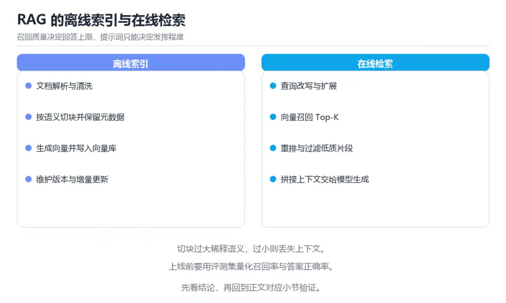

# 图解 RAG 检索增强生成流程

> 内容更新时间：2026-10-06 · 学习阶段：进阶 · 预计用时：50 分钟

## 本节知识框架

**课程定位**：所属分类为「图解专题」，课程主题为「图解 RAG 检索增强生成流程」，学习阶段为「进阶」，建议用时 50 分钟。

**本课要解决的主问题**：离线索引与在线问答全链路、分块策略、混合检索与评测指标。

| 学习层次 | 要回答的问题 | 完成判据 |
| --- | --- | --- |
| 概念层 | 「图解 RAG 检索增强生成流程」有哪些必须区分的对象与术语？ | 能用自己的话定义核心术语，并各举一个正例和一个反例。 |
| 机制层 | 这些对象按什么顺序发生作用，输入如何变成输出？ | 能画出或写出机制步骤，并说明每一步的失败条件。 |
| 应用层 | 什么场景适合使用「图解 RAG 检索增强生成流程」，什么场景不适合？ | 能给出一个真实场景、一个最小示例和一个边界案例。 |
| 性能层 | 时间、空间、吞吐或延迟受哪些量影响？ | 能说出复杂度或性能瓶颈的证据来源；没有证据时明确写“材料未提供”。 |
| 复习层 | 怎样确认自己不是只记住了结论？ | 能独立完成本课自测，并把错误定位到概念、机制、示例或边界。 |

### 阅读路线

1. 先读「核心概念定义」，建立「RAG」等对象的精确定义。
2. 再读「原理与运行机制」，把定义串成可重复的过程。
3. 用「代码/协议/SQL 示例」验证过程，并只改一个条件观察结果变化。
4. 最后检查性能、易错点、知识关系与自测题，形成可复习的证据链。

**前置知识**：《图解 Kubernetes 调度与探针》

**学习位置**：本课位于《图解 Kubernetes 调度与探针》之后；如果前一课的自测不能通过，应先回补再继续。

**后续衔接**：下一课《图解数据库事务隔离级别》会继续使用本课术语，学完后建议立即完成一次自测。

**教材衔接：学习目标**

- 能用自己的话解释图解 RAG 检索增强生成流程解决了什么问题，而不是只背术语。
- 能说清 「RAG」、「分块」、「向量检索」、「Rerank」 之间的关系，并分别举出一个例子。
- 能把 RAG 放回「图解 RAG 检索增强生成流程」的知识体系，说明它和 分块 的边界。
- 能完成本课练习，并用验收标准检查自己的结果。

> 一句话摘要：离线索引与在线问答全链路、分块策略、混合检索与评测指标。

**教材衔接：前置知识**

- 先完成上一课《图解 Kubernetes 调度与探针》；如果已经掌握，可以直接用本课练习自测。
- 本课阶段：进阶。建议先完成「图解 Kubernetes 调度与探针」，或确认自己能独立跑通正文里的 BM25 示例。
- 开始前先复习：RAG、分块、向量检索。
- 看不懂就直接缩小例子：只保留 RAG 相关的两行输入，跑通后再加回其余部分。


**教材衔接：本课小结**

- RAG 的质量取决于**分块、召回、重排、提示**这四步，模型只是最后一环。
- 排查永远先看「进入提示的片段对不对」，再怀疑模型。
- 没有评测集的 RAG 无法迭代，先做 50 条评测集再谈优化。

## 核心概念定义

> 在阅读《图解 RAG 检索增强生成流程》时，术语第一次出现先给操作性定义，再给边界；正文说法与这里冲突时，以定义和可复现示例为准。

| 术语 | 操作性定义 | 本课中的边界 |
| --- | --- | --- |
| RAG | 先检索外部知识，再把证据与问题一起交给模型生成可引用的回答。 | 仅在「图解 RAG 检索增强生成流程」明确给出的输入、版本与资源条件下成立。 |
| 分块 | 把长文档切成适合嵌入和检索的片段，并保留必要的上下文重叠。 | 仅在「图解 RAG 检索增强生成流程」明确给出的输入、版本与资源条件下成立。 |
| 重排序 | 先粗召回再用交叉编码器精排，能明显提升答案引用到正确文档的概率。 | 仅在「图解 RAG 检索增强生成流程」明确给出的输入、版本与资源条件下成立。 |
| 引用溯源 | 答案带上原文片段与出处，便于用户核对并降低幻觉带来的影响。 | 仅在「图解 RAG 检索增强生成流程」明确给出的输入、版本与资源条件下成立。 |
| 上下文压缩 | 上下文压缩把长片段变短 | 仅在「图解 RAG 检索增强生成流程」明确给出的输入、版本与资源条件下成立。 |
| 引用返回 | 引用返回让答案可核对 | 仅在「图解 RAG 检索增强生成流程」明确给出的输入、版本与资源条件下成立。 |

### 定义如何使用

在「图解 RAG 检索增强生成流程」中判断一个说法是否成立，先确认它使用的是哪个对象的定义，再检查输入规模、运行环境与失败路径。定义不是口号，而是后续推导、代码示例和自测题共享的约束。

## 原理与运行机制

### 机制总览

1. **建立输入**：把「RAG」按本课定义整理成可观察、可重复的输入条件。
2. **执行转换**：围绕「分块」执行本课的核心步骤；每一步都记录中间状态，避免只看最终输出。
3. **产生输出**：得到「重排序」后，用正文示例或协议/SQL 结果核对输出是否符合预期。
4. **改变一个条件**：只替换一个边界条件或环境参数，观察「图解 RAG 检索增强生成流程」的结论是否仍然成立。

| 阶段 | 关注对象 | 失败时应检查 |
| --- | --- | --- |
| 输入 | RAG | 类型、范围、编码、版本或前置状态是否满足定义。 |
| 处理 | 分块 | 顺序、可见性、锁、路由、事务或调度规则是否被破坏。 |
| 输出 | 重排序 | 结果是否可复现，错误是否被正确传播而不是被吞掉。 |

本课的机制结论要用「图解 RAG 检索增强生成流程」自己的示例验证。「图解 RAG 检索增强生成流程」没有给出某个数量级、吞吐或内存数据时，本课把该判断标为“材料未提供”，不从相邻主题外推。

**教材衔接：一句话说清**

RAG 就是在模型回答之前，先**去知识库里捞出相关片段塞进提示**。
它解决两个问题：模型不知道的私有知识，以及模型凭空编造（幻觉）。

**教材衔接：补充：查询改写、上下文压缩与评测落地**

### 查询改写的四种手段

| 手段 | 做法 | 适用 |
| --- | --- | --- |
| 多查询扩展 | 让模型把问题改写成 3~5 个不同说法，分别检索后合并 | 提问口语化、术语不统一 |
| HyDE | 先让模型「编」一个假设答案，再用它去检索 | 问题很短、语义稀疏 |
| 关键词抽取 | 从问题里抽实体与关键字做 BM25 检索 | 含编号、型号、专有名词 |
| 对话改写 | 把「它多少钱」改写成「X 商品多少钱」 | 多轮对话 |

```text
多查询扩展的实现要点
  ① 各查询分别取 Top-N（例如各 10 条）
  ② 用 RRF（倒数排名融合）合并：score = Σ 1/(k + rank)，k 常取 60
  ③ 再把融合结果交给 Rerank
优势：不依赖分数可比性，比「加权求和」更稳
```

### 上下文压缩：把长片段变短

```text
问题：召回的长片段里 70% 是无关内容，既占 token 又干扰生成

三种压缩方式
  ① 句子级筛选：用 Rerank 分数只保留相关句子
  ② 摘要压缩：让模型把片段压缩成要点（有信息损失）
  ③ 结构化抽取：只保留表格/代码块/参数值等关键部分

取舍：压缩越狠，token 越省，但信息丢失风险越高
     建议先做①（无损筛选），必要时才做②
```

### 引用返回：让答案可核对

```text
输出约定
  · 每个结论后面标注来源编号 [1]
  · 末尾列出「编号 → 文档名 + 章节 + 片段 ID」
  · 无依据的内容必须标注「资料中未提及」

工程价值
  · 用户可自行核对，降低幻觉危害
  · 评测时可自动检查「引用是否真的支持结论」
  · 出问题时能快速定位是检索错还是生成错
```

### 增量索引与失效

| 场景 | 做法 |
| --- | --- |
| 新增文档 | 走同一分块与向量化流程，追加写入 |
| 文档更新 | 先按文档 ID 删除旧片段，再写入新片段 |
| 文档删除 | 按元数据过滤（软删除）或重建索引 |
| 批量重建 | 双索引切换：建好新索引后切流量 |

```text
容易忽略的两点
  · 分块策略变更必须整体重建，否则新旧片段口径不一致
  · 嵌入模型升级同样要重建：不同模型的向量不可比较
```

### 最小评测集的构造与使用

```text
构造步骤
  ① 收集 50~100 个真实问题（不是编造的）
  ② 标注每个问题的「正确来源片段」与「期望答案要点」
  ③ 分成两半：调参用、验收用（避免过拟合）

每次改动都要跑的三组数字
  · Recall@5：正确片段是否被召回
  · 忠实度：答案是否只依据资料
  · P95 延迟与单次成本

改动优先级：先修检索（召回不够），再调生成（提示与模型）
```

### 自查清单

- [ ] 用了查询改写提升召回，而不是只调 Top-K
- [ ] 长片段做过句子级筛选再进提示
- [ ] 答案带可核对的引用编号
- [ ] 文档更新与模型升级有明确的重建流程
- [ ] 有独立的调参集与验收集，避免过拟合

**教材衔接：深入补充：图解 RAG 检索增强生成流程 的取舍与边界**

### 一、把概念放回真实约束

学习图解 RAG 检索增强生成流程时，最容易只记住结论而忽略前提。先写出三个约束：数据规模、时间预算、可接受的失败方式；再判断 RAG 与 分块 在这些约束下是否仍然成立。只要约束改变，原来的最优解就可能变成错误解。

| 观察到的现象 | 背后的机制 | 验证方式 | 常见误判 |
| --- | --- | --- | --- |
| 延迟突然升高 | 队列堆积或重传 | 分段计时与指标对照 | 只盯平均值 |
| 状态看似随机 | 并发交错或缓存失效 | 固定随机种子复现 | 把时序问题当逻辑错误 |
| 结果与预期不符 | 默认值与边界规则 | 构造最小输入 | 忽略版本差异 |

### 二、三个容易混淆的边界

1. 澄清输入与目标。先写清「图解 RAG 检索增强生成流程」要解决的问题、合法输入范围和成功标准，再进入后续步骤。
2. **把“平均值”当成“全部”**：RAG 的指标好看，不代表尾部请求、冷启动或失败重试也好看。
3. **把“当前版本”当成“永久行为”**：分块 依赖的默认值、API 或性能特征都可能随版本变化，需要固定版本并保留回归用例。

### 三、一个生产场景

假设团队要在真实系统里使用图解 RAG 检索增强生成流程：第一周先做小流量验证，记录 RAG 的基线与异常；第二周扩大输入规模，观察 分块 是否成为瓶颈；第三周再做故障演练，主动注入超时、重复请求和依赖不可用，确认系统能降级、能重试、能恢复。每一步都要留下指标、日志和结论，而不是只留下“感觉更快了”。

### 四、自测清单

- 能否用一句话说出图解 RAG 检索增强生成流程解决的核心问题与不适用场景？
- 能否画出 RAG 的数据流或状态变化，并标出失败路径？
- 把 BM25 的输入推到边界，说明本课哪一条结论会先失效。
- 能否写出一条可复现的验证命令，让别人独立得到相同结论？

**教材衔接：零基础精讲：把图解 RAG 检索增强生成流程真正讲透**

### 先建立一个直觉

本课的摘要可以当作一张地图：离线索引与在线问答全链路、分块策略、混合检索与评测指标。

### 逐步拆解

1. 澄清输入与目标。先写清「图解 RAG 检索增强生成流程」要解决的问题、合法输入范围和成功标准，再进入后续步骤。
2. 描述处理过程。把「RAG、分块、向量检索、Rerank、评测」映射到具体步骤，每步都要求能单独验证。
3. 定义输出。RAG 的输出不仅包括正常结果，还包括错误码、日志和资源释放状态。
4. 先预测RAG会怎样失败，再实际触发一次；差异部分就是本课最需要补的前提。
5. 把「一句话说清」里的最小示例抄成 BM25 一行的输入，先手算结果再执行，确认两者一致。

### 把正文串成一条执行链

- **查询改写的四种手段**：| 手段 | 做法 | 适用 |
- **上下文压缩：把长片段变短**：在「图解 RAG 检索增强生成流程」里，「上下文压缩：把长片段变短」这一步要先写清输入与预期，再记录实际结果和差异；结果不符时回到对应小节核对前提。
- **增量索引与失效**：| --- | --- |
- **自查清单**：- [ ] 用了查询改写提升召回，而不是只调 Top-K
- **练习 1：建立心智模型（10 分钟）**：在「图解 RAG 检索增强生成流程」里，「练习 1：建立心智模型（10 分钟）」这一步要先写清输入与预期，再记录实际结果和差异；结果不符时回到对应小节核对前提。
- **练习 2：做一次可控实验（20 分钟）**：在「图解 RAG 检索增强生成流程」里，「练习 2：做一次可控实验（20 分钟）」这一步要先写清输入与预期，再记录实际结果和差异；结果不符时回到对应小节核对前提。

### 从测验反推易错点

**检查点 1：分块过大或过小分别会带来什么问题？**

- 参考判断：过大引入噪音降低精度，过小导致语义不完整
- 自问：如果去掉题干里的一个限定词，结论还成立吗？

**检查点 2：混合检索指的是？**

- 参考判断：向量检索与关键词检索相结合

**检查点 3：引入 Rerank 的主要目的是？**

- 参考判断：对召回结果精排

**检查点 4：回答出现编造内容时，最先应该检查什么？**

- 参考判断：先看进入提示的片段是否正确

**检查点 5：把图解 RAG 检索增强生成流程中「验证步骤」的步骤调整为正确顺序。**

- 参考判断：记录运行环境、命令和真实输出

### 工程排错顺序

| 先查什么 | 要得到的证据 | 判断标准 |
| --- | --- | --- |
| 输入与前提是否满足 | 日志、输入样例、测试或指标 | 能复现并解释，才算定位 |
| 核心步骤是否产生了预期中间结果 | 日志、输入样例、测试或指标 | 能复现并解释，才算定位 |
| 失败路径是否可观测、可恢复 | 日志、输入样例、测试或指标 | 能复现并解释，才算定位 |
| 资源、权限与成本是否在预算内 | 日志、输入样例、测试或指标 | 能复现并解释，才算定位 |

### 变式训练

1. 先用一个单文件示例验证 BM25，确认正确性后再引入框架或分布式组件。
2. 扩大 分块 的规模，记录本课结论在哪一个量级开始不成立。
3. 制造一次 RAG 相关的依赖超时或错误输入，要求错误可解释且不留半完成状态。
5. 去掉一个前提后重跑 BM25，记录输出差异与对应的失败解释。
6. 限制 CPU 与内存上限后重跑 BM25，观察哪一项参数需要重新设定。

### 本课自测

- [ ] 能用一句话解释「RAG」在本课中的角色与边界。
- [ ] 能举出一个正常例子和一个失败例子。
- [ ] 能说出最小验证步骤，以及需要记录的证据。
- [ ] 能用一句话解释「分块」在本课中的角色与边界。
- [ ] 能用一句话解释「向量检索」在本课中的角色与边界。
- [ ] 能用一句话解释「Rerank」在本课中的角色与边界。
- [ ] 能用一句话解释「评测」在本课中的角色与边界。

### 迁移案例库

换一个 分块 约束重做一次，确认结论在新条件下是否仍然成立。

#### 迁移案例 1：围绕「RAG」做一次小实验

**目标**：在不改变课程主体的前提下，验证图解 RAG 检索增强生成流程中的一个关键判断。

**步骤**：
1. 复述当前方案对「RAG」的假设，写成一句可证伪的话。
2. 设计一个正常输入和一个边界输入，分别预测输出。
3. 运行或逐步演算，记录实际输出、耗时和失败信息。
4. 只调整一个参数，比较前后差异并解释原因。
5. 补充一条测试或复习卡，确保下次能更快复现。

**验收**：迁移过程要留下 BM25 的可运行记录，并说明分块在新场景下是否仍然成立。

#### 迁移案例 2：围绕「分块」做一次小实验

**步骤**：
1. 复述当前方案对「分块」的假设，写成一句可证伪的话。

#### 迁移案例 3：围绕「向量检索」做一次小实验

**步骤**：
1. 复述当前方案对「向量检索」的假设，写成一句可证伪的话。

#### 迁移案例 4：围绕「Rerank」做一次小实验

**步骤**：
1. 复述当前方案对「Rerank」的假设，写成一句可证伪的话。

#### 迁移案例 5：围绕「评测」做一次小实验

**步骤**：
1. 复述当前方案对「评测」的假设，写成一句可证伪的话。

#### 迁移案例 6：围绕「RAG」做一次小实验

**步骤**：

#### 迁移案例 7：围绕「分块」做一次小实验

**步骤**：

#### 迁移案例 8：围绕「向量检索」做一次小实验

**步骤**：

#### 迁移案例 9：围绕「Rerank」做一次小实验

**步骤**：

#### 迁移案例 10：围绕「评测」做一次小实验

**步骤**：

#### 迁移案例 11：围绕「RAG」做一次小实验

**步骤**：

#### 迁移案例 12：围绕「分块」做一次小实验

**步骤**：

#### 迁移案例 13：围绕「向量检索」做一次小实验

**步骤**：

#### 迁移案例 14：围绕「Rerank」做一次小实验

**步骤**：

#### 迁移案例 15：围绕「评测」做一次小实验

**步骤**：

#### 迁移案例 16：围绕「RAG」做一次小实验

**步骤**：

<!-- p0-depth-v2:end -->

**教材衔接：验证步骤**

1. 记录运行环境、命令和真实输出。
2. 修改一个输入，先写预测再运行。
3. 制造一次错误输入，记录错误信息与修复方式。
4. 把结论写回本课笔记或测试用例。

## 典型应用场景

| 场景 | 典型输入或前提 | 期望产物 |
| --- | --- | --- |
| 学习验证 | 使用本课最小示例和 RAG、分块 | 能复现正文结论，并解释每一步。 |
| 工程落地 | 把「图解 RAG 检索增强生成流程」放入真实模块或服务边界 | 输出可观测、失败可定位、参数可配置。 |
| 故障排查 | 只改一个版本、规模、输入或依赖条件 | 能区分概念错误、实现错误和环境差异。 |

判断「图解 RAG 检索增强生成流程」的场景是否成立，标准是能否写出输入、处理、输出和失败路径；材料中没有出现的数据在本课标注为“材料未提供”，不用推测替代证据。

**教材衔接：五个高频失效场景**

| 现象 | 根因 | 对策 |
| --- | --- | --- |
| 检索不到 | 分块不合适或术语不匹配 | 改分块、加混合检索、补同义词 |
| 检索到但答非所问 | 召回了相似但无关片段 | 加 Rerank、提高阈值 |
| 答案编造 | 提示没约束或资料不足 | 强化提示、无资料就拒答 |
| 答案过长或跑题 | 片段太多、约束不清 | 限制片段数与输出长度 |
| 延迟太高 | Rerank 与长上下文开销 | 减少 K、加缓存、并行化 |

```text
排查顺序（从便宜到贵）
  1. 打印实际进入提示的片段，肉眼判断相关性
  2. 看召回集是否包含正确片段（不含则属于检索问题）
  3. 若含正确片段但答案错，属于生成或提示问题
  4. 最后才考虑换模型或换向量库
```

## 代码/协议/SQL 示例

以下代码、协议或 SQL 片段来自《图解 RAG 检索增强生成流程》原文，保留原有语言标记与上下文；先预测《图解 RAG 检索增强生成流程》示例的输出，再按正文步骤运行或推演，示例依赖外部环境时同时记录版本与输入。

**教材衔接：一张图看懂完整链路**

```text
【离线：建立索引】

文档（PDF / Markdown / 网页 / 表格）
        │
        ▼
① 解析与清洗（去页眉页脚、乱码、重复）
        │
        ▼
② 分块 Chunking（按语义或固定长度加重叠）
        │
        ▼
③ 向量化 Embedding（每块转成一组向量）
        │
        ▼
④ 写入向量库（向量 + 原文 + 元数据）

【在线：回答问题】

用户提问
        │
        ▼
⑤ 问题向量化
        │
        ▼
⑥ 检索召回（向量相似度 + 关键词 BM25，可混合）
        │
        ▼
⑦ 重排序 Rerank（用小模型精排 Top-K）
        │
        ▼
⑧ 组装提示（问题 + 片段 + 回答约束）
        │
        ▼
⑨ 大模型生成答案（附引用来源）
        │
        ▼
⑩ 后处理（校验、格式化、日志与评测）
```

**教材衔接：分块策略：影响最大的一步**

```text
块太大                          块太小
┌───────────────────────┐      ┌────┐ ┌────┐ ┌────┐
│ 含大量无关内容          │      │一句话│ │半句 │ │短语│
│ 检索精度下降            │      │语义不完整、缺上下文   │
└───────────────────────┘      └────┘ └────┘ └────┘

推荐做法
  · 长度：中文 300~800 字，或 200~500 token
  · 重叠：10%~20%，避免语义在切分点被截断
  · 优先按结构切：标题、段落、代码块、表格自成一块
  · 每块带元数据：文档名、章节、页码、更新时间
```

| 策略 | 适合 |
| --- | --- |
| 固定长度加重叠 | 通用兜底 |
| 按标题层级切 | 结构化文档（手册、规范） |
| 按语义切（句子边界） | 叙述性文本 |
| 小块检索、大块生成 | 兼顾精度与上下文 |

**教材衔接：检索：先召回再精排**

```text
第一阶段：召回（Recall）—— 要快、宁多勿漏
  · 向量检索：语义相似，同义改述也能命中
  · 关键词检索（BM25）：专有名词、编号、代码符号更准
  · 混合检索：两路各取前 N，去重合并

第二阶段：精排（Rerank）—— 要准，用小模型逐条打分
  · 交叉编码器给「问题-片段」打相关性分
  · 取前 3~5 条进入提示，而不是把 20 条全塞进去
```

| 做法 | 优点 | 代价 |
| --- | --- | --- |
| 纯向量 | 语义泛化好 | 精确匹配差（编号、缩写） |
| 纯关键词 | 精确 | 换种说法就搜不到 |
| 混合 | 覆盖两者 | 需要调权重 |
| 加 Rerank | 相关性显著提升 | 增加一次模型调用延迟 |

**教材衔接：提示组装的三条约束**

```text
系统提示示例
  你是一个严谨的问答助手，只能依据给定资料回答。
  · 资料中没有的内容，回答「资料中未提及」
  · 每个结论后面标注来源编号，如 [1]
  · 不要编造链接、数据与引用

用户提示
  【资料】
  [1] ……片段内容……
  [2] ……片段内容……

  【问题】
  用户的原始问题
```

**关键点：明确指出「资料中没有就说没有」**，能大幅降低编造。

**教材衔接：评测：怎么知道 RAG 变好了**

| 指标 | 衡量什么 | 怎么算 |
| --- | --- | --- |
| 召回率 Recall@K | 正确片段是否被召回 | 正确片段出现在前 K 的比例 |
| 准确率 Precision@K | 召回的片段有多少相关 | 前 K 中相关片段占比 |
| 忠实度 Faithfulness | 答案是否只依据资料 | 人工或模型评审 |
| 答案相关性 | 是否回答了问题 | 人工或模型评审 |
| 引用正确率 | 引用是否指向真正来源 | 抽样核对 |

```text
评测集最小可用版本
  · 50~100 个真实问题
  · 每个问题标注「正确片段来源」与「期望答案要点」
  · 每次改动（分块、模型、K 值）都跑一遍对比
```

**教材衔接：最小可运行示例**

下面示例用于验证 RAG 的最小输入、处理和输出。先原样运行，再只修改一个值：

```python
steps = ["input", "process", "output"]
print(" -> ".join(steps))
```

**教材衔接：预期输出**

```text
input -> process -> output
```

## 时间/空间复杂度或性能分析

**复杂度证据**：「图解 RAG 检索增强生成流程」的现有材料没有给出渐近时间或空间复杂度的明确结论，本课只做定性检查，不补写未经验证的 $O$ 记号。

| 维度 | 本课关注点 | 判断依据 |
| --- | --- | --- |
| 时间/延迟 | 「图解 RAG 检索增强生成流程」的主要步骤是否会随输入规模、并发度或网络往返增长。 | 以正文复杂度、基准数据或可重复测量为准。 |
| 空间/内存 | 中间状态、缓存、副本、连接或索引是否随规模增长。 | 记录峰值内存与数据副本，不只看最终结果。 |
| 吞吐/资源 | 版本、调度、锁、IO、序列化或协议开销是否成为瓶颈。 | 固定环境做对照实验，改变一个变量。 |

评估「图解 RAG 检索增强生成流程」时要区分“正确性成立”和“性能达标”两件事；材料没有给出基准时，本课只保留量级来源与测量方法，不写不可验证的绝对数字。

## 常见误区与易错点

> 复核《图解 RAG 检索增强生成流程》的易错点时，优先保留原文的错误表、故障现场与排错路径；每条修正都要能用本课示例复验。

| 易错点 | 常见表现 | 正确做法 |
| --- | --- | --- |
| 只背结论 | 能复述「图解 RAG 检索增强生成流程」的定义，却说不清输入、输出与边界。 | 回到机制步骤，用最小示例逐一验证。 |
| 混淆相邻概念 | 把本课对象与相邻主题的对象当成同一类。 | 先比较定义、资源归属、生命周期和失败模式。 |
| 忽略版本与环境 | 在开发机通过后直接外推到生产环境。 | 固定版本、输入和资源条件，再记录可复现结果。 |

**教材衔接：常见错误与排查**

| 坑 | 现象 | 正确做法 |
| --- | --- | --- |
| 不做清洗直接入库 | 页眉页脚污染检索 | 先清洗再分块 |
| 分块不带重叠 | 关键句被切断 | 加 10%~20% 重叠 |
| 只做向量检索 | 编号与专有名词搜不到 | 加关键词混合检索 |
| 把 20 个片段全塞提示 | 噪音多、延迟高 | Rerank 后取前 3~5 |
| 没有「无资料就说没有」约束 | 幻觉严重 | 在系统提示中明确约束 |
| 不做评测就上线 | 改坏了也不知道 | 建最小评测集 |
| 不记录引用与日志 | 无法追溯答案来源 | 保存片段 ID 与得分 |
| 忽略更新与删除 | 检索到过期内容 | 支持增量更新与失效 |



**教材衔接：故障现场**

### 现场 1：不做清洗直接入库

**症状**：在《图解 RAG 检索增强生成流程》的复现场景中，页眉页脚污染检索。

**根因**：触发点是把“不做清洗直接入库”当成安全做法。它没有满足《图解 RAG 检索增强生成流程》要求的前提，因此先表现为“页眉页脚污染检索”；排查时先完整复现这一段，再核对输入、配置与依赖。

**修复**：针对《图解 RAG 检索增强生成流程》的问题，先清洗再分块。

**验证**：在《图解 RAG 检索增强生成流程》中按“先清洗再分块”调整后，从“不做清洗直接入库”的触发条件重放同一条路径，确认“页眉页脚污染检索”不再出现，并补一个相邻边界用例检查没有引入新问题。

### 现场 2：分块不带重叠

**症状**：在《图解 RAG 检索增强生成流程》的复现场景中，关键句被切断。

**根因**：“关键句被切断”只是表层结果。向上追溯会落到“分块不带重叠”这一步，因为它省略了《图解 RAG 检索增强生成流程》的约束，使实现行为和预期模型发生了偏离。

**修复**：针对《图解 RAG 检索增强生成流程》的问题，加 10%~20% 重叠。

**验证**：保留《图解 RAG 检索增强生成流程》里触发“关键句被切断”的输入、版本和日志，按“加 10%~20% 重叠”完成修改后原样重放；只有失败现象消失且相邻场景仍可解释，才保留改动。

### 现场 3：只做向量检索

**症状**：在《图解 RAG 检索增强生成流程》的复现场景中，编号与专有名词搜不到。

**根因**：“编号与专有名词搜不到”只是表层结果。向上追溯会落到“只做向量检索”这一步，因为它省略了《图解 RAG 检索增强生成流程》的约束，使实现行为和预期模型发生了偏离。

**修复**：针对《图解 RAG 检索增强生成流程》的问题，加关键词混合检索。

**验证**：先在《图解 RAG 检索增强生成流程》中记录“只做向量检索”留下的失败证据，再执行“加关键词混合检索”并重放；确认错误路径变为明确结果，且修复没有掩盖同类故障。

## 与其他知识点的关系

| 关系 | 课程 | 为什么 |
| --- | --- | --- |
| 先修 | 《图解 Kubernetes 调度与探针》 | 本课会直接使用它的概念或操作前提。 |
| 关联 | 《图解数据库事务隔离级别》 | 用于横向比较或把本课结论迁移到相邻主题。 |
| 关联 | 《嵌入、向量检索与 RAG》 | 用于横向比较或把本课结论迁移到相邻主题。 |
| 关联 | 《实战：文档问答助手（RAG + Agent）》 | 用于横向比较或把本课结论迁移到相邻主题。 |
| 关联 | 《实战：本地 RAG 客服 Agent》 | 用于横向比较或把本课结论迁移到相邻主题。 |
| 前置顺序 | 《图解 Kubernetes 调度与探针》 | 同分类中安排在本课之前，建议先完成其自测。 |
| 后续顺序 | 《图解数据库事务隔离级别》 | 同分类中安排在本课之后，会继续使用本课术语。 |

把「图解 RAG 检索增强生成流程」放回知识体系时，不只要记住“前面学过什么”，还要说明两个主题在输入、机制、资源边界和失败模式上的差异。这样才能把单课知识迁移到项目、排障和后续课程。

## 自测题与参考答案

> 先独立完成《图解 RAG 检索增强生成流程》的自测，再核对答案与解析。答案必须能在本课正文或示例中找到依据，不能只凭语感。

### 自测 1

围绕“图解 RAG 检索增强生成流程”中的 RAG、分块、向量检索，下列哪两项是本课强调的实践判断？

A. 验证 分块 时要固定版本并覆盖边界输入，结论才可复现
B. 把 分块 的单次运行结果当成所有版本和规模都成立
C. 学习 RAG 时要同时说明输入、输出和失败路径，不能只看正常流程
D. 只要 RAG 的常规示例通过，就可以跳过边界与异常路径

**参考答案**：验证 分块 时要固定版本并覆盖边界输入，结论才可复现；学习 RAG 时要同时说明输入、输出和失败路径，不能只看正常流程

**解析**：本课把图解 RAG 检索增强生成流程拆成概念、示例与故障现场三部分，因此判断 RAG 时必须同时交代输入、输出和失败路径，这使“学习 RAG 时要同时说明输入、输出和失败路径，不能只看正常流程”成立。在图解 RAG 检索增强生成流程里，判断 分块 时要固定版本与边界输入，所以“验证 分块 时要固定版本并覆盖边界输入，结论才可复现”才可复现。

### 自测 2

阅读「图解 RAG 检索增强生成流程」正文里的这段 Python 代码，下面哪一项判断是正确的？

```python
steps = ["input", "process", "output"]
print(" -> ".join(steps))
```

A. 这段代码只做静态声明，没有循环、分支或可观察输出。
B. 这段代码包含循环结构，同一段逻辑会被重复执行。
C. 这段代码会产生可观察的输出，运行后能看到结果。
D. 这段代码会读取外部输入，结果依赖传入的数据。

**参考答案**：这段代码会产生可观察的输出，运行后能看到结果。

**解析**：在「图解 RAG 检索增强生成流程」里，题干的正确项是这段代码会产生可观察的输出，运行后能看到结果，在「图解 RAG 检索增强生成流程」里要结合RAG核对输出是否符合预期。把输入或边界换成空值、极值或失败情况后，结论要以「图解 RAG 检索增强生成流程」的实际运行结果为准。「图解 RAG 检索增强生成流程」要求先交代RAG、分块、向量检索的前提再下结论，所以“这段代码会产生可观察的输出”只在题干“阅读图解 RAG 检索增强生成流程正文里的这段 Python”给定的条件下成立。

### 自测 3

引入 Rerank 的主要目的是？

A. 替代向量检索
B. 降低存储成本
C. 减少文档数量
D. 对召回结果精排

**参考答案**：对召回结果精排

**解析**：在「图解 RAG 检索增强生成流程」里，对召回结果精排。Rerank 用更精细的模型给「问题-片段」打分，把最相关的少数片段送进提示。「图解 RAG 检索增强生成流程」要求先交代RAG、分块、向量检索的前提再下结论，所以“对召回结果精排”只在题干“引入 Rerank 的主要目的是”给定的条件下成立。

**教材衔接：动手练习**

> 本课练习重点：围绕「RAG、分块、向量检索」完成复述、实验和交付，每个结果都要能被别人检查。

凭记忆画出 BM25 的执行顺序，与正文对照后补上遗漏环节。

### 练习 1：建立心智模型（10 分钟）

合上教程，用 3～5 句话回答：

1. 图解 RAG 检索增强生成流程解决了什么问题？
2. 如果没有它，会出现什么具体后果？
3. 它和「分块」是什么关系？

验收标准：回答里必须出现 RAG，并写出一个让结论失效的边界条件。

### 练习 2：做一次可控实验（20 分钟）

从正文中选一个最小示例，完成以下操作：

1. 先预测修改一个参数、输入或步骤后的结果。
2. 再实际执行或逐步推演，记录真实结果。
3. 如果结果与预测不同，写出差异原因。

**验收标准**：先原样跑通正文里的 `BM25`，再只改RAG相关的输入，按「原例 → 改动 → 预测 → 结果 → 原因」记录；预测必须写在实际运行之前。

### 练习 3：交付一个小结果（30 分钟）

不看原图手绘一遍流程，再用自己的话指出图中的关键状态变化。

任务要求：

- 结果必须能被别人检查，不能只写“我已经理解了”。
- 至少覆盖「RAG」和「分块」两个关键词。
- 写出 1 个仍然不确定的问题，以及下一步如何验证。

> 提示：时间有限时优先做练习 1 和练习 2；练习 3 可以拆成两次完成。

**教材衔接：可运行练习**

### 任务 1：先跑通，再解释

```python
steps = ["input", "process", "output"]
print(" -> ".join(steps))
```

### 任务 2：只改一个条件

把「图解 RAG 检索增强生成流程」的最小示例复制一份，只改一个条件再跑一次：

- 改动点：只调整 BM25 的一个参数，其余条件一律不动。
- 预测：先写下「图解 RAG 检索增强生成流程」在改动后的输出或错误信息，再运行。
- 记录：对照改动前后的结果，指出差异出在哪一步。
- 验收：换回原条件能复现原结果，改动只影响RAG。

### 任务 3：迁移到自己的数据

把 BM25 换成你自己的输入，先保持步骤不变，再比较输出差异。

**教材衔接：本课复习清单**

离开本课前，逐项确认：

- [ ] 不看解析，能说出「分块过大或过小分别会带来什么问题？」的判断依据。
- [ ] 不看解析，能说出「混合检索指的是？」的判断依据。
- [ ] 不看解析，能说出「引入 Rerank 的主要目的是？」的判断依据。
- [ ] 不看解析，能说出「回答出现编造内容时，最先应该检查什么？」的判断依据。
- [ ] 不看解析，能说出「把图解 RAG 检索增强生成流程中「验证步骤」的步骤调整为正确顺序。」的判断依据。
- [ ] 至少运行一次 BM25 的示例，记录输入、输出和 RAG 的边界情况。
- [ ] 把本课最容易混淆的两个概念写成一句话对照。

| 复盘项 | 记录 |
| --- | --- |
| 已经能独立解释的考点 |  |
| 仍然说不清的概念 |  |
| 下一步验证动作 |  |

**教材衔接：复习与自测**

- [ ] 能用一句话说明「一句话说清」解决什么问题。
- [ ] 能把「一张图看懂完整链路」的判断标准套到一个新例子上。
- [ ] 能说清「分块策略：影响最大的一步」的结论，并说出它的适用边界。
- [ ] 能用自己的话复述「检索：先召回再精排」，并各举一个正例和反例。
- [ ] 能解释「提示组装的三条约束」里最容易混淆的两个概念。
- [ ] 能不看正文写出「评测：怎么知道 RAG 变好了」的关键步骤。

---

## 术语速查

| 术语 | 一句话说明 |
| --- | --- |
| `RAG` | 先检索外部知识，再把证据与问题一起交给模型生成可引用的回答。 |
| `分块` | 把长文档切成适合嵌入和检索的片段，并保留必要的上下文重叠。 |
| `重排序` | 先粗召回再用交叉编码器精排，能明显提升答案引用到正确文档的概率。 |
| `引用溯源` | 答案带上原文片段与出处，便于用户核对并降低幻觉带来的影响。 |
| `上下文压缩` | 上下文压缩把长片段变短 |
| `引用返回` | 引用返回让答案可核对 |

## 考点精讲

### 考点 1：多选辨析·RAG

- **题目**：围绕“图解 RAG 检索增强生成流程”中的 RAG、分块、向量检索，下列哪两项是本课强调的实践判断？
- **判断依据**：本课把图解 RAG 检索增强生成流程拆成概念、示例与故障现场三部分，因此判断 RAG 时必须同时交代输入、输出和失败路径，这使“学习 RAG 时要同时说明输入、输出和失败路径，不能只看正常流程”成立。在图解 RAG 检索增强生成流程里，判断 分块 时要固定版本与边界输入，所以“验证 分块 时要固定版本并覆盖边界输入，结论才可复现”才可复现。

### 考点 2：代码补全·RAG

- **题目**：阅读「图解 RAG 检索增强生成流程」正文里的这段 Python 代码，下面哪一项判断是正确的？
- **判断依据**：在「图解 RAG 检索增强生成流程」里，题干的正确项是这段代码会产生可观察的输出，运行后能看到结果，在「图解 RAG 检索增强生成流程」里要结合RAG核对输出是否符合预期。把输入或边界换成空值、极值或失败情况后，结论要以「图解 RAG 检索增强生成流程」的实际运行结果为准。「图解 RAG 检索增强生成流程」要求先交代RAG、分块、向量检索的前提再下结论，所以“这段代码会产生可观察的输出”只在题干“阅读图解 RAG 检索增强生成流程正文里的这段 Python”给定的条件下成立。

### 考点 3：概念判断·RAG

- **题目**：引入 Rerank 的主要目的是？
- **判断依据**：在「图解 RAG 检索增强生成流程」里，对召回结果精排。Rerank 用更精细的模型给「问题-片段」打分，把最相关的少数片段送进提示。「图解 RAG 检索增强生成流程」要求先交代RAG、分块、向量检索的前提再下结论，所以“对召回结果精排”只在题干“引入 Rerank 的主要目的是”给定的条件下成立。

### 考点 4：概念判断·RAG

- **题目**：回答出现编造内容时，最先应该检查什么？
- **判断依据**：在「图解 RAG 检索增强生成流程」里，结论应落在「先看进入提示的片段是否正确」。多数幻觉来自片段不相关或提示缺少约束，先验证输入再谈换模型。在「图解 RAG 检索增强生成流程」里，这道题要求区分概念与边界，「先看进入提示的片段是否正确」只有在题干给出的前提下才成立，而「立刻换更大的模型」、「直接关闭 RAG，需要额外的验证与维护」缺少同一组条件。

### 考点 5：顺序排列·RAG

- **题目**：把「图解 RAG 检索增强生成流程」中「验证步骤」的步骤调整为正确顺序。
- **判断依据**：在「图解 RAG 检索增强生成流程」里，正确的执行顺序是「记录运行环境、命令和真实输出」 → 「修改一个输入，先写预测再运行」 → 「制造一次错误输入，记录错误信息与修复方式」 → 「把结论写回本课笔记或测试用例」。在「图解 RAG 检索增强生成流程」里判断这道题，要把RAG、分块、向量检索的条件、过程与失败路径逐项对齐，换成“把图解 RAG 检索增强生成流程中验”这个场景，只有满足前提的结论才成立。

## English Overview

**Title:** RAG Pipeline Illustrated

**Summary:** Indexing and query pipelines, chunking, hybrid retrieval and metrics.

**Category:** Visual Guide
**Level:** 进阶
**Key terms:** RAG, 分块, 向量检索, Rerank, 评测

## 内容元数据

- 内容版本：v2.0
- 最后更新：2026-10-06
- 学习阶段：进阶
- 适用环境：通用图解与系统原理；本课聚焦 RAG。
- 内容来源：内置结构化课程与工程实践整理
- 相关主题：RAG、分块、向量检索、Rerank、评测
- 质量版本：P0 测验标准 + P1 覆盖扩展 + P2 体验补全

## 参考资料与复核

- 最后复核：2026-10-04
- 下次复核：2027-07-10
- 复核范围：版本兼容、API 行为、安全建议与工程实践
- 来源性质：官方文档、标准或权威教材；正文为离线教学重组

| 参考资料 | 本课用途 |
| --- | --- |
| [Kubernetes 架构](https://kubernetes.io/docs/concepts/architecture/) | 控制平面与节点流程 |
| [RFC Editor](https://www.rfc-editor.org/) | 协议状态机与报文流程 |
| [Diagrams.net 文档](https://www.drawio.com/doc/) | 通用图表绘制 |

> 「图解 RAG 检索增强生成流程」的链接用于离线阅读后的延伸核对；App 不会自动联网。
