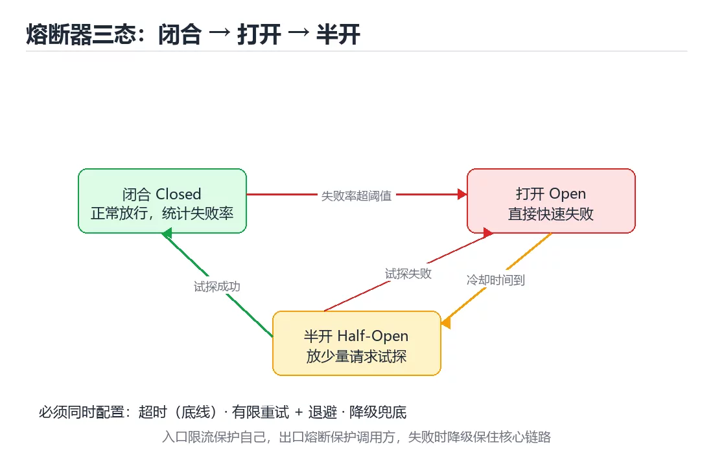

# 图解限流、熔断与降级

> 内容更新时间：2026-10-03 · 学习阶段：进阶 · 预计用时：20 分钟

## 学习目标

- 能用自己的话解释「图解限流、熔断与降级」解决了什么问题，而不是只背术语。
- 能说清 「限流」、「熔断」、「降级」、「令牌桶」 之间的关系，并分别举出一个例子。
- 能把本课知识放回「图解专题」的知识体系，说明它和相邻主题的边界。
- 能完成本课练习，并用验收标准检查自己的结果。

> 一句话摘要：四种限流算法、熔断三态、四种降级手段与故障完整时序。

## 前置知识

- 先完成上一课《图解 CDN 缓存与回源》；如果已经掌握，可以直接用本课练习自测。
- 本课阶段：进阶。建议先掌握同一分类的基础课程，并能独立运行正文中的最小示例。
- 开始前先复习：限流、熔断、降级。
- 如果某一步看不懂，先记录具体卡点，完成练习后再回头读一遍。




## 一句话说清

这三件事解决的是同一个问题：**别让局部故障拖垮整个系统**。
限流保护自己，熔断保护调用方，降级保证核心功能可用。

## 三者的分工

```text
① 限流 Rate Limiting
   控制「进来的流量」，保护自身不被压垮
   视角：入口

② 熔断 Circuit Breaker
   下游持续失败时快速失败，避免资源被拖死
   视角：出口

③ 降级 Fallback
   核心功能不可用时给出兜底结果
   视角：用户体验

三者组合：入口限流 → 出口熔断 → 失败降级
```

## 限流的四种算法

```text
① 固定窗口：每分钟计数，到点清零
   简单，但窗口边界可能放过 2 倍流量

   窗口1 [──────────]│窗口2 [──────────]
                   ▲ 边界处突发

② 滑动窗口：把窗口切成小格，滚动统计
   更平滑，实现稍复杂

③ 漏桶：请求先入桶，按固定速率流出
   严格平滑输出，适合保护下游

   请求 ──► ┌────────┐ ──固定速率──►
            │ 漏桶   │
            └────────┘ 溢出则拒绝

④ 令牌桶：按固定速率放令牌，请求消耗令牌
   允许突发（桶里攒的令牌），最常用

   令牌 ──► ┌────────┐
            │ 令牌桶 │ ──► 有令牌通过，无令牌拒绝
            └────────┘
```

| 算法 | 允许突发 | 实现复杂度 | 适用 |
| --- | --- | --- | --- |
| 固定窗口 | 边界处会 | 低 | 粗略限流 |
| 滑动窗口 | 轻微 | 中 | 通用 |
| 漏桶 | 不允许 | 中 | 保护脆弱下游 |
| 令牌桶 | 允许（有上限） | 中 | **推荐默认** |

```text
分布式限流的实现要点
  · 计数器放 Redis，用 Lua 脚本保证原子性
  · 按维度限流：用户 ID、IP、接口、租户
  · 本地限流 + 全局限流组合：本地挡住突发，全局控制总量
```

## 熔断器的三种状态

```text
       失败率超阈值
  闭合 ──────────────► 打开
  Closed              Open
    ▲                   │ 等待冷却时间
    │ 试探成功            ▼
    └────────────── 半开 Half-Open
                       │ 试探失败
                       └──────► 回到打开

闭合：正常放行，统计失败率
打开：直接快速失败，不再调用下游
半开：放少量请求试探，成功则恢复，失败则继续打开
```

| 参数 | 含义 | 常见取值 |
| --- | --- | --- |
| 失败率阈值 | 超过即打开 | 50% |
| 最小请求数 | 样本不足不触发 | 20 |
| 冷却时间 | 打开后等待多久进入半开 | 10~30 秒 |
| 半开试探数 | 允许通过多少请求 | 3~5 |

**关键点**：熔断必须配合超时。没有超时的熔断只是等死。

## 降级的四种手段

```text
① 返回缓存或默认值
   推荐位不可用时，返回上次缓存的结果

② 关闭非核心功能
   高峰期先关评论、推荐，保住下单与支付

③ 异步化
   同步调用失败，落库后由队列重试

④ 兜底文案
   明确告知用户「稍后重试」，而不是白屏
```

```text
降级的优先级（越靠前越核心）
  支付 > 下单 > 浏览 > 搜索 > 推荐 > 评论
  降级时从右往左关
```

## 一次故障中的完整时序

```text
t0  下游接口开始变慢
t1  调用方超时增多，线程池开始排队
t2  失败率超过阈值 → 熔断器打开，快速失败
t3  入口限流开始拒绝超出配额的请求
t4  降级逻辑返回缓存数据，核心链路仍可用
t5  下游恢复 → 冷却期后半开试探 → 成功 → 闭合
t6  逐步恢复流量，观察错误率与延迟
```

```text
必须提前准备的配置
  · 每个下游都要有超时与熔断
  · 每个关键接口都要有降级方案
  · 降级开关要能在不发布的情况下打开
```

## 新手最容易踩的八个坑

| 坑 | 现象 | 正确做法 |
| --- | --- | --- |
| 只限流不设超时 | 请求仍然堆积 | 超时是底线 |
| 熔断阈值过敏感 | 抖动就熔断 | 设最小请求数与窗口 |
| 熔断后不试探 | 永远不恢复 | 配置半开状态 |
| 重试放大故障 | 下游更惨 | 限制重试次数并加退避 |
| 无限重试非幂等接口 | 重复扣款 | 非幂等禁止重试 |
| 降级开关要发布才能改 | 故障时来不及 | 配置中心动态开关 |
| 所有接口一起降级 | 核心功能也停了 | 按优先级分级降级 |
| 不演练 | 真出事不会用 | 定期做故障演练 |

## 本课小结
- **入口限流、出口熔断、失败降级**，三者组合才形成完整的保护网。
- 限流默认选令牌桶；熔断必须有超时与半开试探。
- 降级要按业务优先级设计，并且开关能动态生效。


## 补充：令牌桶实现、分布式限流与熔断参数

### 令牌桶的最小实现

```python
import time

class TokenBucket:
    """按固定速率补充令牌，允许一定突发（桶容量）。"""

    def __init__(self, rate: float, capacity: int) -> None:
        self.rate = rate              # 每秒补充多少令牌
        self.capacity = capacity      # 桶容量 = 允许的最大突发
        self.tokens = float(capacity)
        self.updated = time.monotonic()

    def allow(self, cost: int = 1) -> bool:
        now = time.monotonic()
        self.tokens = min(self.capacity, self.tokens + (now - self.updated) * self.rate)
        self.updated = now
        if self.tokens >= cost:
            self.tokens -= cost
            return True
        return False
```

| 参数 | 含义 | 取值建议 |
| --- | --- | --- |
| rate | 长期平均速率 | 按下游承载能力设定 |
| capacity | 允许的突发量 | 通常为 rate 的 1~2 倍 |
| cost | 单次消耗 | 重接口可设为 2~5，实现按成本限流 |

### 分布式限流：Redis + Lua

```lua
-- 固定窗口计数器：原子地自增并在首次设置过期时间
local key = KEYS[1]
local limit = tonumber(ARGV[1])
local window = tonumber(ARGV[2])

local current = redis.call('INCR', key)
if current == 1 then
  redis.call('EXPIRE', key, window)
end
if current > limit then
  return 0
end
return 1
```

```text
为什么必须用 Lua
  · INCR 与 EXPIRE 分开执行会产生竞态：可能只自增而没设过期，key 永久驻留
  · Lua 脚本在 Redis 中原子执行，避免这个问题

本地限流 + 全局限流的组合
  ① 每个实例先做本地令牌桶（挡住突发、零网络开销）
  ② 再查一次全局配额（保证总量不超）
  ③ 全局存储不可用时降级为纯本地限流，保证服务不被打垮
```

### 限流维度的选择

| 维度 | 适用 | 风险 |
| --- | --- | --- |
| 用户 ID | 防单用户刷接口 | 未登录用户需要 IP 兜底 |
| IP | 防爬虫与攻击 | NAT 环境下会误伤整栋楼 |
| 接口 + 租户 | 多租户 SaaS | 需要租户标识透传 |
| 全局 | 保护脆弱下游 | 一个热点接口会拖累全部 |

**推荐组合**：用户维度 + 接口维度，并对未登录请求使用 IP 维度兜底。

### 熔断参数怎么定

| 参数 | 含义 | 建议初值 | 调整方向 |
| --- | --- | --- | --- |
| 统计窗口 | 多久滚动一次 | 10 秒 | 抖动大就拉长 |
| 最小请求数 | 样本门槛 | 20 | 流量小就降低 |
| 失败率阈值 | 触发打开 | 50% | 核心链路可降到 30% |
| 冷却时间 | 打开后等多久试探 | 10~30 秒 | 下游恢复慢就拉长 |
| 半开试探数 | 允许通过的请求 | 3~5 | 保守取小 |

```text
必须同时配置的三件事
  · 超时：没有超时，熔断只是等死
  · 重试：只对幂等接口重试，并限制次数 + 退避
  · 降级：熔断打开时返回什么（缓存值 / 默认值 / 友好提示）
```

### 降级开关的设计

```text
要求
  · 能在不发布的情况下动态开关（配置中心或数据库）
  · 开关粒度到「功能」，而不是全局总开关
  · 默认值安全：拿不到配置时按「关闭非核心功能」处理

优先级（越靠前越核心，降级时从后往前关）
  支付 > 下单 > 浏览 > 搜索 > 推荐 > 评论
```

### 自查清单

- [ ] 限流有明确的维度与阈值，而不是全局一把梭
- [ ] 分布式限流用 Lua 保证原子性
- [ ] 全局存储不可用时有本地降级方案
- [ ] 每个下游都配置了超时与熔断
- [ ] 降级开关可动态生效，且按业务优先级分级

## 动手练习


> 本课练习重点：围绕「限流、熔断、降级」完成复述、实验和交付，每个结果都要能被别人检查。

先不看原图手绘流程，再标出状态变化，最后用自己的话解释关键一步。

### 练习 1：建立心智模型（10 分钟）

合上教程，用 3～5 句话回答：

1. 「图解限流、熔断与降级」解决了什么问题？
2. 如果没有它，会出现什么具体后果？
3. 它和「熔断」是什么关系？

**验收标准**：至少出现一个本课关键词，并写出一个反例、边界条件或失效场景。

### 练习 2：做一次可控实验（20 分钟）

从正文中选一个最小示例，完成以下操作：

1. 先预测修改一个参数、输入或步骤后的结果。
2. 再实际执行或逐步推演，记录真实结果。
3. 如果结果与预测不同，写出差异原因。

**验收标准**：留下「原例 → 改动 → 预测 → 结果 → 原因」五步记录。

### 练习 3：交付一个小结果（30 分钟）

不看原图手绘一遍流程，再用自己的话指出图中的关键状态变化。

任务要求：

- 结果必须能被别人检查，不能只写“我已经理解了”。
- 至少覆盖「限流」和「熔断」两个关键词。
- 写出 1 个仍然不确定的问题，以及下一步如何验证。

> 提示：时间有限时优先做练习 1 和练习 2；练习 3 可以拆成两次完成。


## 考点精讲：把测验题还原成判断过程

本课有 5 个判断点。先自己作答，再看「判断依据」；如果结论正确但理由不完整，回到正文对应章节补足概念。

### 考点 1：既能限制平均速率、又允许一定突发的限流算法是？

- **正确判断**：令牌桶
- **判断依据**：令牌桶会按速率累积令牌，因此允许有上限的突发。「固定窗口」在窗口边界会放过两倍流量。针对「既能限制平均速率、又允许一定突发的限流算法是，」，本课在「一句话说清」中说明：限流保护自己，熔断保护调用方，降级保证核心功能可用。本课还在「本课小结」中说明：入口限流、出口熔断、失败降级，三者组合才形成完整的保护网。本课还在「本课小结」中说明：降级要按业务优先级设计，并且开关能动态生效。
- **迁移检查**：把题干里的一个条件换成边界值，原来的结论还成立吗？写出判断过程。

### 考点 2：熔断器的三种状态是？

- **正确判断**：闭合、打开、半开
- **判断依据**：正确答案是「闭合、打开、半开」，本课在「一句话说清」中说明：限流保护自己，熔断保护调用方，降级保证核心功能可用。闭合正常放行，打开快速失败，半开放少量请求试探恢复。本课还在「本课小结」中说明：入口限流、出口熔断、失败降级，三者组合才形成完整的保护网。本课还在「补充：令牌桶实现、分布式限流与熔断参数」中说明：限流有明确的维度与阈值，而不是全局一把梭。
- **迁移检查**：如果给某个错误选项去掉一个限定词，它会不会变成正确？说明理由。

### 考点 3：熔断器配置中，最小请求数参数的作用是？

- **正确判断**：样本量不足时不触发熔断
- **判断依据**：正确答案是「样本量不足时不触发熔断」，本课在「补充：令牌桶实现、分布式限流与熔断参数」中说明：推荐组合：用户维度 + 接口维度，并对未登录请求使用 IP 维度兜底。请求量太小时失败率不具代表性，容易因个别失败误熔断。课程摘要指出四种限流算法，熔断三态，四种降级手段与故障完整时序，本课要判断的正是熔断器配置中，最小请求数参数的作用是。
- **迁移检查**：如果给某个错误选项去掉一个限定词，它会不会变成正确？说明理由。

### 考点 4：关于降级，下面哪种做法正确？

- **正确判断**：按业务优先级分级
- **判断依据**：正确答案是「按业务优先级分级」，本课在「本课小结」中说明：降级要按业务优先级设计，并且开关能动态生效。降级要保核心、关边缘，并且开关应能动态生效。课程摘要指出四种限流算法，熔断三态，四种降级手段与故障完整时序，本课要判断的正是关于降级，下面哪种做法正确。
- **迁移检查**：把题干里的一个条件换成边界值，原来的结论还成立吗？写出判断过程。

### 考点 5：补全代码：「图解限流、熔断与降级」示例中，下面这行代码缺少哪个关键字或函数名？请填入 ____。 `self.tokens = min(self.____, self.tokens + (now - self.updated) * self.rate)`

- **正确判断**：capacity
- **判断依据**：正确答案是「capacity」，这道题在问补全代码：图解限流、熔断与降级示例中，下面这行代码缺…updated)*self.rate)`，判断时要把题干限定的输入、边界与目标逐项对齐。本课示例中还能看到 `self.tokens = float(capacity)` 这样的用法，说明该关键字在本课代码中承担实际功能。
- **迁移检查**：如果填成相近的另一个函数或关键字，程序会在哪一步出错？

## 本课复习清单

离开本课前，逐项确认：

- [ ] 不看解析，能说出「既能限制平均速率、又允许一定突发的限流算法是？」的判断依据。
- [ ] 不看解析，能说出「熔断器的三种状态是？」的判断依据。
- [ ] 不看解析，能说出「熔断器配置中，最小请求数参数的作用是？」的判断依据。
- [ ] 不看解析，能说出「关于降级，下面哪种做法正确？」的判断依据。
- [ ] 不看解析，能说出「补全代码：「图解限流、熔断与降级」示例中，下面这行代码缺少哪个关键字或函数名？请…」的判断依据。
- [ ] 至少运行一次本课示例，记录输入、输出和一个边界情况。
- [ ] 把本课最容易混淆的两个概念写成一句话对照。

| 复盘项 | 记录 |
| --- | --- |
| 已经能独立解释的考点 |  |
| 仍然说不清的概念 |  |
| 下一步验证动作 |  |

## English Overview

**Title:** Rate Limiting and Circuit Breaking

**Summary:** Limiting algorithms, breaker states, fallbacks and timelines.

**Category:** Visual Guide  
**Level:** 进阶  
**Key terms:** 限流, 熔断, 降级, 令牌桶, 超时

> The full tutorial is written in Chinese. This bilingual overview helps English readers identify the topic, scope and key terms before studying the detailed examples.

## 内容元数据

- 内容版本：v2.0
- 最后更新：2026-10-03
- 学习阶段：进阶
- 适用环境：通用图解与系统原理
- 内容来源：内置结构化课程与工程实践整理
- 相关主题：限流、熔断、降级、令牌桶、超时
- 质量版本：P0 测验标准 + P1 覆盖扩展 + P2 体验补全


## 参考资料与复核

- 最后复核：2026-10-04
- 下次复核：2027-04-04
- 复核范围：版本兼容、API 行为、安全建议与工程实践
- 来源性质：官方文档与标准；本课正文为离线教学重组，不复制原文

| 参考资料 | 本课用途 |
| --- | --- |
| [RFC Editor](https://www.rfc-editor.org/) | 协议与状态机 |
| [MDN Web Docs](https://developer.mozilla.org/) | 浏览器与网络流程 |

> 本课主题：四种限流算法、熔断三态、四种降级手段与故障完整时序。

> App 完全离线展示文字链接，不会自动联网；需要延伸阅读时可复制链接到浏览器。

