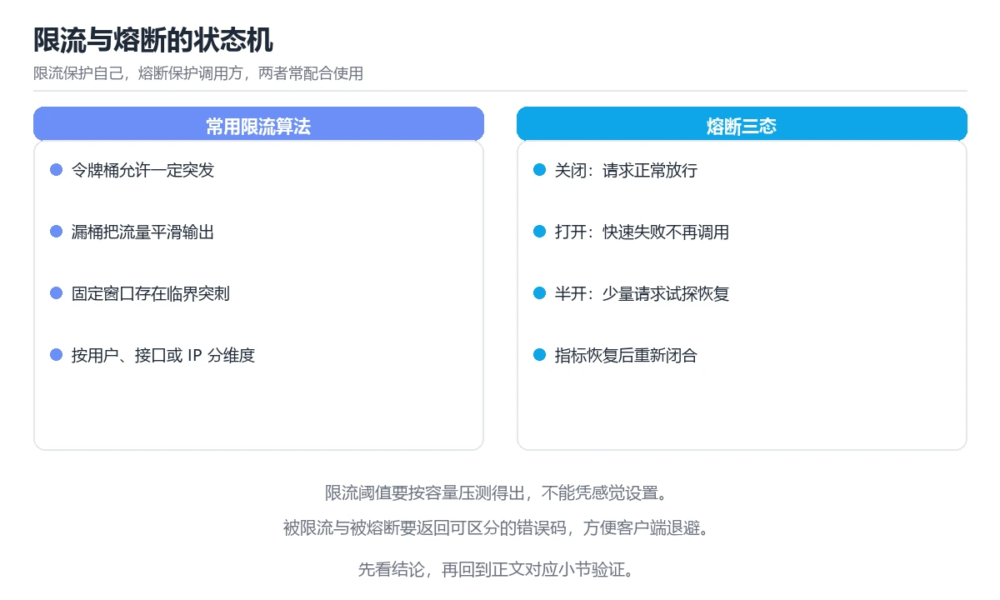

# 图解限流、熔断与降级

> 内容更新时间：2026-10-06 · 学习阶段：进阶 · 预计用时：45 分钟

## 本节知识框架

**课程定位**：所属分类 `visual_guide`（图解专题），课程主题 `图解限流、熔断与降级`，学习阶段 进阶，建议用时 45 分钟。

本课主线：四种限流算法、熔断三态、四种降级手段与故障完整时序。

**学完本课应当能够**
- 说清 `限流` 与 `熔断` 的含义与区别，并各举一个正例和一个反例。
- 用本课示例验证 `降级` 的行为，记录输入、输出与失败条件。
- 遇到「限流只按总量」这类问题时，能说出触发条件与修复顺序。

### 从概念到验证的学习链条

1. `限流`：先掌握 · 按维度限流：用户 ID、IP、接口、租户，再用它解释 `熔断` 为什么会出现。
2. `熔断`：先掌握 依赖连续失败达到阈值后暂时停止调用并快速失败，给下游恢复时间并防止雪崩，再用它解释 `降级` 为什么会出现。
3. `降级`：先掌握 · 降级：熔断打开时返回什么（缓存值 / 默认值 / 友好提示），再用它解释 `令牌桶` 为什么会出现。
4. `令牌桶`：先掌握 ④ 令牌桶：按固定速率放令牌，请求消耗令牌，再用它解释 `超时` 为什么会出现。
5. `超时`：先掌握 · 超时：没有超时，熔断只是等死，再用它解释 本课示例的观察结果 为什么会出现。

**先修与衔接**：本课是「图解专题」分类的第 18 课。先修内容：《图解 CDN 缓存与回源》。《图解 CDN 缓存与回源》里的 `CDN`、`缓存` 是本课的前提。相关或后续课程：《图解 Kafka 分区、副本与再平衡》、《API 网关与负载均衡》、《高可用与容量规划》、《限流与熔断算法专题》。

### 完成判据

- **定义关**：不看正文也能说明 `限流` 是 · 按维度限流：用户 ID、IP、接口、租户，并指出一个反例。
- **机制关**：能按“输入 → 转换 → 输出 → 验证”复述 `图解限流、熔断与降级`，而不是只背结论。
- **示例关**：能运行或推演 `图解限流、熔断与降级` 的 `text` 示例，并说明一个真实出现的标识符或字面量。
- **证据关**：能指出 `图解限流、熔断与降级` 示例里的 调用了 `__init__()`，并说明它支持或反驳了本课的哪一条结论。
- **排错关**：能复现 限流只按总量，记录现象并按 按用户与接口维度分别限流 修复。
- **迁移关**：能把 `限流`、`熔断`、`降级`、`令牌桶` 放进一个与 `图解限流、熔断与降级` 不同的项目场景，并保持输入与验证条件可追踪。
- **复盘关**：学完 `图解限流、熔断与降级` 后，用一句话写下仍然不确定的结论，并列出下一次验证需要的输入、环境和成功判据。

### 复习清单

- [ ] 能不看正文复述本课核心术语，并指出一个边界或反例。
- [ ] 能运行或推演本课示例，记录输入、输出与失败现象。
- [ ] 能完成一次自测，并把错题对照错误表定位原因。

**本课配图**




## 核心概念定义

| 术语 | 操作性定义 | 常见边界与风险 |
| --- | --- | --- |
| 限流 | · 按维度限流：用户 ID、IP、接口、租户。 | 易错：单个用户就能打满配额；正确做法是按用户与接口维度分别限流。 |
| 熔断 | 依赖连续失败达到阈值后暂时停止调用并快速失败，给下游恢复时间并防止雪崩。 | 易错：噪音大或者根本不起作用；正确做法是按历史基线动态调整并区分错误类型。 |
| 降级 | · 降级：熔断打开时返回什么（缓存值 / 默认值 / 友好提示）。 | 易错：用户看到空白页；正确做法是降级时返回缓存或默认结果并标注状态。 |
| 令牌桶 | ④ 令牌桶：按固定速率放令牌，请求消耗令牌。 | 网络延迟、超时与版本协商会改变行为，只在真实链路或多版本客户端上验证才算数。 |
| 超时 | · 超时：没有超时，熔断只是等死。 | 网络延迟、超时与版本协商会改变行为，只在真实链路或多版本客户端上验证才算数。 |

## 原理与运行机制

### 机制总览

**教材衔接：一句话说清**

这三件事解决的是同一个问题：**别让局部故障拖垮整个系统**。
限流保护自己，熔断保护调用方，降级保证核心功能可用。

**教材衔接：限流的四种算法**

```text
① 固定窗口：每分钟计数，到点清零
   简单，但窗口边界可能放过 2 倍流量

   窗口1 [──────────]│窗口2 [──────────]
                   ▲ 边界处突发

② 滑动窗口：把窗口切成小格，滚动统计
   更平滑，实现稍复杂

③ 漏桶：请求先入桶，按固定速率流出
   严格平滑输出，适合保护下游

   请求 ──► ┌────────┐ ──固定速率──►
            │ 漏桶   │
            └────────┘ 溢出则拒绝

④ 令牌桶：按固定速率放令牌，请求消耗令牌
   允许突发（桶里攒的令牌），最常用

   令牌 ──► ┌────────┐
            │ 令牌桶 │ ──► 有令牌通过，无令牌拒绝
            └────────┘
```

| 算法 | 允许突发 | 实现复杂度 | 适用 |
| --- | --- | --- | --- |
| 固定窗口 | 边界处会 | 低 | 粗略限流 |
| 滑动窗口 | 轻微 | 中 | 通用 |
| 漏桶 | 不允许 | 中 | 保护脆弱下游 |
| 令牌桶 | 允许（有上限） | 中 | **推荐默认** |

```text
分布式限流的实现要点
  · 计数器放 Redis，用 Lua 脚本保证原子性
  · 按维度限流：用户 ID、IP、接口、租户
  · 本地限流 + 全局限流组合：本地挡住突发，全局控制总量
```

**教材衔接：补充：令牌桶实现、分布式限流与熔断参数**

### 令牌桶的最小实现

```python
import time

class TokenBucket:
    """按固定速率补充令牌，允许一定突发（桶容量）。"""

    def __init__(self, rate: float, capacity: int) -> None:
        self.rate = rate              # 每秒补充多少令牌
        self.capacity = capacity      # 桶容量 = 允许的最大突发
        self.tokens = float(capacity)
        self.updated = time.monotonic()

    def allow(self, cost: int = 1) -> bool:
        now = time.monotonic()
        self.tokens = min(self.capacity, self.tokens + (now - self.updated) * self.rate)
        self.updated = now
        if self.tokens >= cost:
            self.tokens -= cost
            return True
        return False
```

| 参数 | 含义 | 取值建议 |
| --- | --- | --- |
| rate | 长期平均速率 | 按下游承载能力设定 |
| capacity | 允许的突发量 | 通常为 rate 的 1~2 倍 |
| cost | 单次消耗 | 重接口可设为 2~5，实现按成本限流 |

### 分布式限流：Redis + Lua

```lua
-- 固定窗口计数器：原子地自增并在首次设置过期时间
local key = KEYS[1]
local limit = tonumber(ARGV[1])
local window = tonumber(ARGV[2])

local current = redis.call('INCR', key)
if current == 1 then
  redis.call('EXPIRE', key, window)
end
if current > limit then
  return 0
end
return 1
```

```text
为什么必须用 Lua
  · INCR 与 EXPIRE 分开执行会产生竞态：可能只自增而没设过期，key 永久驻留
  · Lua 脚本在 Redis 中原子执行，避免这个问题

本地限流 + 全局限流的组合
  ① 每个实例先做本地令牌桶（挡住突发、零网络开销）
  ② 再查一次全局配额（保证总量不超）
  ③ 全局存储不可用时降级为纯本地限流，保证服务不被打垮
```

### 限流维度的选择

| 维度 | 适用 | 风险 |
| --- | --- | --- |
| 用户 ID | 防单用户刷接口 | 未登录用户需要 IP 兜底 |
| IP | 防爬虫与攻击 | NAT 环境下会误伤整栋楼 |
| 接口 + 租户 | 多租户 SaaS | 需要租户标识透传 |
| 全局 | 保护脆弱下游 | 一个热点接口会拖累全部 |

**推荐组合**：用户维度 + 接口维度，并对未登录请求使用 IP 维度兜底。

### 熔断参数怎么定

| 参数 | 含义 | 建议初值 | 调整方向 |
| --- | --- | --- | --- |
| 统计窗口 | 多久滚动一次 | 10 秒 | 抖动大就拉长 |
| 最小请求数 | 样本门槛 | 20 | 流量小就降低 |
| 失败率阈值 | 触发打开 | 50% | 核心链路可降到 30% |
| 冷却时间 | 打开后等多久试探 | 10~30 秒 | 下游恢复慢就拉长 |
| 半开试探数 | 允许通过的请求 | 3~5 | 保守取小 |

```text
必须同时配置的三件事
  · 超时：没有超时，熔断只是等死
  · 重试：只对幂等接口重试，并限制次数 + 退避
  · 降级：熔断打开时返回什么（缓存值 / 默认值 / 友好提示）
```

### 降级开关的设计

```text
要求
  · 能在不发布的情况下动态开关（配置中心或数据库）
  · 开关粒度到「功能」，而不是全局总开关
  · 默认值安全：拿不到配置时按「关闭非核心功能」处理

优先级（越靠前越核心，降级时从后往前关）
  支付 > 下单 > 浏览 > 搜索 > 推荐 > 评论
```

### 自查清单

- [ ] 限流有明确的维度与阈值，而不是全局一把梭
- [ ] 分布式限流用 Lua 保证原子性
- [ ] 全局存储不可用时有本地降级方案
- [ ] 每个下游都配置了超时与熔断
- [ ] 降级开关可动态生效，且按业务优先级分级

**教材衔接：深入补充：图解限流、熔断与降级 的取舍与边界**

### 一、把概念放回真实约束

| 观察到的现象 | 背后的机制 | 验证方式 | 常见误判 |
| --- | --- | --- | --- |
| 延迟突然升高 | 队列堆积或重传 | 分段计时与指标对照 | 只盯平均值 |
| 状态看似随机 | 并发交错或缓存失效 | 固定随机种子复现 | 把时序问题当逻辑错误 |
| 结果与预期不符 | 默认值与边界规则 | 构造最小输入 | 忽略版本差异 |


### 三、一个生产场景

假设团队要在真实系统里使用图解限流、熔断与降级：第一周先做小流量验证，记录 限流 的基线与异常；第二周扩大输入规模，观察 熔断 是否成为瓶颈；第三周再做故障演练，主动注入超时、重复请求和依赖不可用，确认系统能降级、能重试、能恢复。每一步都要留下指标、日志和结论，而不是只留下“感觉更快了”。


### 机制拆解：每一步的输入、动作与输出

#### 1. `限流`
- 输入：`限流`；本步把 · 按维度限流：用户 ID、IP、接口、租户 当作判断规则。
- 动作：围绕 `限流` 保留中间状态，并记录它与 `熔断` 的对应关系。
- 输出：`熔断`，它可以被下一段代码、测试或记录继续使用。
- `限流` 的失败条件：当限流只按总量时，会出现单个用户就能打满配额。

#### 2. `熔断`
- 输入：`限流`；本步把 依赖连续失败达到阈值后暂时停止调用并快速失败，给下游恢复时间并防止雪崩 当作判断规则。
- 动作：围绕 `熔断` 保留中间状态，并记录它与 `降级` 的对应关系。
- 输出：`降级`，它可以被下一段代码、测试或记录继续使用。
- `熔断` 的失败条件：当熔断阈值写死时，会出现噪音大或者根本不起作用。

#### 3. `降级`
- 输入：`熔断`；本步把 · 降级：熔断打开时返回什么（缓存值 / 默认值 / 友好提示） 当作判断规则。
- 动作：围绕 `降级` 保留中间状态，并记录它与 `令牌桶` 的对应关系。
- 输出：`令牌桶`，它可以被下一段代码、测试或记录继续使用。
- `降级` 的失败条件：当降级没有兜底返回时，会出现用户看到空白页。

#### 4. `令牌桶`
- 输入：`降级`；本步把 ④ 令牌桶：按固定速率放令牌，请求消耗令牌 当作判断规则。
- 动作：围绕 `令牌桶` 保留中间状态，并记录它与 `超时` 的对应关系。
- 输出：`超时`，它可以被下一段代码、测试或记录继续使用。
- `令牌桶` 的失败条件：网络延迟、超时与版本协商会改变行为，只在真实链路或多版本客户端上验证才算数。

#### 5. `超时`
- 输入：`令牌桶`；本步把 · 超时：没有超时，熔断只是等死 当作判断规则。
- 动作：围绕 `超时` 保留中间状态，并记录它与 `__init__` 的对应关系。
- 输出：`__init__`，它可以被下一段代码、测试或记录继续使用。
- `超时` 的失败条件：网络延迟、超时与版本协商会改变行为，只在真实链路或多版本客户端上验证才算数。

### 示例中的可观察事实

1. 调用了 `__init__()`；它对应的课程主题是 `图解限流、熔断与降级`。
2. 调用了 `float()`；它对应的课程主题是 `图解限流、熔断与降级`。
3. 调用了 `monotonic()`；它对应的课程主题是 `图解限流、熔断与降级`。
4. 调用了 `allow()`；它对应的课程主题是 `图解限流、熔断与降级`。
5. 调用了 `min()`；它对应的课程主题是 `图解限流、熔断与降级`。
6. 出现字面量 `按固定速率补充令牌，允许一定突发（桶容量）。`；它对应的课程主题是 `图解限流、熔断与降级`。

### 复现实验记录

- 环境：`图解限流、熔断与降级` 使用 `text` 示例，固定 `限流`、`熔断`、`降级`、`令牌桶` 作为第一组条件。
- 首轮输入：先确认 调用了 `__init__()`，预测 `限流` 会怎样变化。
- 基线观察：记录命令、输入、输出和错误原文，不用截图代替可复制的文本。
- 单变量修改：只改变 `限流`，观察 `超时` 是否仍满足定义。
- 失败注入：复现 限流只按总量，确认现象是 单个用户就能打满配额。
- 记录结论：把“修改前、修改后、预期变化、实际变化”写成四列表，这样复盘 `图解限流、熔断与降级` 时才能区分概念错误与实现错误。

## 典型应用场景

- **限流只按总量**：典型现象是单个用户就能打满配额；正确做法是按用户与接口维度分别限流。
- **熔断阈值写死**：典型现象是噪音大或者根本不起作用；正确做法是按历史基线动态调整并区分错误类型。
- **降级没有兜底返回**：典型现象是用户看到空白页；正确做法是降级时返回缓存或默认结果并标注状态。

### 最小验证场景

- 准备：保留 `text` 示例的原始输入，先记录 `图解限流、熔断与降级` 的基线输出和完整运行命令。
- 观察：先核对 调用了 `__init__()`，再改变一个与 `限流` 相关的条件。
- 判定：新结果与 `图解限流、熔断与降级` 的基线不同不等于错误；只有当差异破坏了 `限流` 的定义或错误表中的约束，才判定为失败。

### 选择与边界

- 使用 `限流` 时，先满足它的定义：· 按维度限流：用户 ID、IP、接口、租户；易错：单个用户就能打满配额；正确做法是按用户与接口维度分别限流。
- 使用 `熔断` 时，先满足它的定义：依赖连续失败达到阈值后暂时停止调用并快速失败，给下游恢复时间并防止雪崩；易错：噪音大或者根本不起作用；正确做法是按历史基线动态调整并区分错误类型。
- 使用 `降级` 时，先满足它的定义：· 降级：熔断打开时返回什么（缓存值 / 默认值 / 友好提示）；易错：用户看到空白页；正确做法是降级时返回缓存或默认结果并标注状态。
- 使用 `令牌桶` 时，先满足它的定义：④ 令牌桶：按固定速率放令牌，请求消耗令牌；网络延迟、超时与版本协商会改变行为，只在真实链路或多版本客户端上验证才算数。
- 使用 `超时` 时，先满足它的定义：· 超时：没有超时，熔断只是等死；网络延迟、超时与版本协商会改变行为，只在真实链路或多版本客户端上验证才算数。

## 代码/协议/SQL 示例

**教材衔接：三者的分工**

```text
① 限流 Rate Limiting
   控制「进来的流量」，保护自身不被压垮
   视角：入口

② 熔断 Circuit Breaker
   下游持续失败时快速失败，避免资源被拖死
   视角：出口

③ 降级 Fallback
   核心功能不可用时给出兜底结果
   视角：用户体验

三者组合：入口限流 → 出口熔断 → 失败降级
```

**教材衔接：熔断器的三种状态**

```text
       失败率超阈值
  闭合 ──────────────► 打开
  Closed              Open
    ▲                   │ 等待冷却时间
    │ 试探成功            ▼
    └────────────── 半开 Half-Open
                       │ 试探失败
                       └──────► 回到打开

闭合：正常放行，统计失败率
打开：直接快速失败，不再调用下游
半开：放少量请求试探，成功则恢复，失败则继续打开
```

| 参数 | 含义 | 常见取值 |
| --- | --- | --- |
| 失败率阈值 | 超过即打开 | 50% |
| 最小请求数 | 样本不足不触发 | 20 |
| 冷却时间 | 打开后等待多久进入半开 | 10~30 秒 |
| 半开试探数 | 允许通过多少请求 | 3~5 |

**关键点**：熔断必须配合超时。没有超时的熔断只是等死。

**教材衔接：降级的四种手段**

```text
① 返回缓存或默认值
   推荐位不可用时，返回上次缓存的结果

② 关闭非核心功能
   高峰期先关评论、推荐，保住下单与支付

③ 异步化
   同步调用失败，落库后由队列重试

④ 兜底文案
   明确告知用户「稍后重试」，而不是白屏
```

```text
降级的优先级（越靠前越核心）
  支付 > 下单 > 浏览 > 搜索 > 推荐 > 评论
  降级时从右往左关
```

### 示例精读：先找证据，再改一个条件

1. 调用了 `__init__()`；它出现在 `图解限流、熔断与降级` 的示例中，阅读时先确认它前后各发生了什么。
2. 调用了 `float()`；它出现在 `图解限流、熔断与降级` 的示例中，阅读时先确认它前后各发生了什么。
3. 调用了 `monotonic()`；它出现在 `图解限流、熔断与降级` 的示例中，阅读时先确认它前后各发生了什么。
4. 调用了 `allow()`；它出现在 `图解限流、熔断与降级` 的示例中，阅读时先确认它前后各发生了什么。
5. 调用了 `min()`；它出现在 `图解限流、熔断与降级` 的示例中，阅读时先确认它前后各发生了什么。
6. 出现字面量 `按固定速率补充令牌，允许一定突发（桶容量）。`；它出现在 `图解限流、熔断与降级` 的示例中，阅读时先确认它前后各发生了什么。
- 在 `图解限流、熔断与降级` 中与 `限流` 对照：示例必须能支持 · 按维度限流：用户 ID、IP、接口、租户，否则说明这一段还缺少实现或验证步骤。
- 在 `图解限流、熔断与降级` 中与 `熔断` 对照：示例必须能支持 依赖连续失败达到阈值后暂时停止调用并快速失败，给下游恢复时间并防止雪崩，否则说明这一段还缺少实现或验证步骤。
- 在 `图解限流、熔断与降级` 中与 `降级` 对照：示例必须能支持 · 降级：熔断打开时返回什么（缓存值 / 默认值 / 友好提示），否则说明这一段还缺少实现或验证步骤。
- 在 `图解限流、熔断与降级` 中与 `令牌桶` 对照：示例必须能支持 ④ 令牌桶：按固定速率放令牌，请求消耗令牌，否则说明这一段还缺少实现或验证步骤。

## 时间/空间复杂度或性能分析

**性能关注点（图解限流、熔断与降级）**：图解类课程的性能点在渲染与交互响应：记录首屏时间与交互延迟。

**本课特有开销（图解限流、熔断与降级 · 限流）**：缓存命中率比缓存实现本身更关键，先记录命中率与失效策略再谈优化。

**测量方法**：以 `图解限流、熔断与降级` 的 `限流` 场景为对象，固定输入跑一遍记录基线，再把规模或并发度提高一个数量级复测；两次结果的差值与波动范围才是结论依据。

### 需要控制的变量与记录项

- `图解限流、熔断与降级` 的 `限流`：固定它的版本、输入范围和资源上限，分别记录速度、内存与失败率的变化。
- `图解限流、熔断与降级` 的 `熔断`：固定它的版本、输入范围和资源上限，分别记录速度、内存与失败率的变化。
- `图解限流、熔断与降级` 的 `降级`：固定它的版本、输入范围和资源上限，分别记录速度、内存与失败率的变化。
- `图解限流、熔断与降级` 的 `令牌桶`：固定它的版本、输入范围和资源上限，分别记录速度、内存与失败率的变化。
- `图解限流、熔断与降级` 的 `超时`：固定它的版本、输入范围和资源上限，分别记录速度、内存与失败率的变化。
- `图解限流、熔断与降级` 中 `限流` 的边界：易错：单个用户就能打满配额；正确做法是按用户与接口维度分别限流。达到边界时不要外推，必须重新测量。
- `图解限流、熔断与降级` 中 `熔断` 的边界：易错：噪音大或者根本不起作用；正确做法是按历史基线动态调整并区分错误类型。达到边界时不要外推，必须重新测量。
- `图解限流、熔断与降级` 中 `降级` 的边界：易错：用户看到空白页；正确做法是降级时返回缓存或默认结果并标注状态。达到边界时不要外推，必须重新测量。
- `图解限流、熔断与降级` 中 `令牌桶` 的边界：网络延迟、超时与版本协商会改变行为，只在真实链路或多版本客户端上验证才算数。达到边界时不要外推，必须重新测量。
- `图解限流、熔断与降级` 中 `超时` 的边界：网络延迟、超时与版本协商会改变行为，只在真实链路或多版本客户端上验证才算数。达到边界时不要外推，必须重新测量。
- `图解限流、熔断与降级` 的代码证据：先验证 调用了 `__init__()`，再记录该路径的输入规模与耗时；只看代码行数不能推出复杂度。

## 常见误区与易错点

| 容易写错的做法 | 实际现象 | 原因与正确做法 |
| --- | --- | --- |
| 限流只按总量 | 单个用户就能打满配额。 | 按用户与接口维度分别限流。 |
| 熔断阈值写死 | 噪音大或者根本不起作用。 | 按历史基线动态调整并区分错误类型。 |
| 降级没有兜底返回 | 用户看到空白页。 | 降级时返回缓存或默认结果并标注状态。 |

### 现场 1：限流只按总量

**症状**：单个用户就能打满配额。

**根因与修复**：按用户与接口维度分别限流。

**自检**：在本课示例里复现「限流只按总量」，改成按用户与接口维度分别限流后重跑；如果症状消失且失败路径按预期变化，说明定位正确。

### 现场 2：熔断阈值写死

**症状**：噪音大或者根本不起作用。

**根因与修复**：按历史基线动态调整并区分错误类型。

**自检**：在本课示例里复现「熔断阈值写死」，改成按历史基线动态调整并区分错误类型后重跑；如果症状消失且失败路径按预期变化，说明定位正确。

### 现场 3：降级没有兜底返回

**症状**：用户看到空白页。

**根因与修复**：降级时返回缓存或默认结果并标注状态。

**自检**：在本课示例里复现「降级没有兜底返回」，改成降级时返回缓存或默认结果并标注状态后重跑；如果症状消失且失败路径按预期变化，说明定位正确。

## 与其他知识点的关系

| 关系 | 课程 | 为什么 |
| --- | --- | --- |
| 先修 | 《图解 CDN 缓存与回源》 | 本课会直接使用它的概念或操作前提。 |
| 关联 | 《图解 Kafka 分区、副本与再平衡》 | 用于横向比较或把本课结论迁移到相邻主题。 |
| 关联 | 《API 网关与负载均衡》 | 用于横向比较或把本课结论迁移到相邻主题。 |
| 关联 | 《高可用与容量规划》 | 用于横向比较或把本课结论迁移到相邻主题。 |
| 关联 | 《限流与熔断算法专题》 | 用于横向比较或把本课结论迁移到相邻主题。 |
| 前置顺序 | 《图解 CDN 缓存与回源》 | 同分类中安排在本课之前，建议先完成其自测。 |
| 后续顺序 | 《图解 Kafka 分区、副本与再平衡》 | 同分类中安排在本课之后，会继续使用本课术语。 |

- **先修**：`图解 CDN 缓存与回源`。本课默认这些内容已经掌握。
- **相关或后续**：`图解 Kafka 分区、副本与再平衡`、`API 网关与负载均衡`、`高可用与容量规划`、`限流与熔断算法专题`。本课术语会在这些课程里继续使用。
- **术语归属**：`限流`、`熔断`、`降级` 的定义以本课「核心概念定义」为准，换到其他课程时先确认定义是否被改写。

### 先修与后续术语接口

- `API 网关与负载均衡`：共享术语 `限流`、`熔断`，共同关键词 `限流`、`熔断`。
- `高可用与容量规划`：共享术语 `限流`、`熔断`，共同关键词 `限流`、`熔断`。
- `限流与熔断算法专题`：共享术语 `限流`、`令牌桶`、`熔断`，共同关键词 `限流`、`令牌桶`、`熔断`。
- `图解 CDN 缓存与回源`：两者通过本分类的学习顺序衔接，阅读时重点比较各自的输入与失败条件。
- `图解 Kafka 分区、副本与再平衡`：两者通过本分类的学习顺序衔接，阅读时重点比较各自的输入与失败条件。

### 容易混淆的相邻概念

- `限流` 与 `熔断`：前者强调 · 按维度限流：用户 ID、IP、接口、租户；后者强调 依赖连续失败达到阈值后暂时停止调用并快速失败，给下游恢复时间并防止雪崩。判断时分别检查两条定义的适用范围，不要只看名称相似就互换。
- `熔断` 与 `降级`：前者强调 依赖连续失败达到阈值后暂时停止调用并快速失败，给下游恢复时间并防止雪崩；后者强调 · 降级：熔断打开时返回什么（缓存值 / 默认值 / 友好提示）。判断时分别检查两条定义的适用范围，不要只看名称相似就互换。
- `降级` 与 `令牌桶`：前者强调 · 降级：熔断打开时返回什么（缓存值 / 默认值 / 友好提示）；后者强调 ④ 令牌桶：按固定速率放令牌，请求消耗令牌。判断时分别检查两条定义的适用范围，不要只看名称相似就互换。
- `令牌桶` 与 `超时`：前者强调 ④ 令牌桶：按固定速率放令牌，请求消耗令牌；后者强调 · 超时：没有超时，熔断只是等死。判断时分别检查两条定义的适用范围，不要只看名称相似就互换。

## 自测题与参考答案

> 先独立作答，再对照参考答案；答案都能在本课正文、术语表或错误表里找到依据。

### 自测 1（概念复述）

不看正文，写出 `限流` 的操作性定义，并说明它与 `熔断` 的区别。

**参考答案**：· 按维度限流：用户 ID、IP、接口、租户。

`熔断` 的定位是：依赖连续失败达到阈值后暂时停止调用并快速失败，给下游恢复时间并防止雪崩；两者的差别要从适用对象与失败模式上说明。

### 自测 2（排错）

本课错误表记录了「限流只按总量」这类做法。请写出它会出现的现象、根因，以及修复顺序。

**参考答案**：现象是单个用户就能打满配额；正确做法是按用户与接口维度分别限流。修复时先复现现象并保留证据，再改动一处假设重跑，确认现象消失。

### 自测 3（动手验证）

运行本课的 `text` 示例，把其中的 `2` 换成一个边界值后重新运行，记录输出与错误信息。

**参考答案**：正常输入下 `text` 示例应当复现正文给出的结果；把 `2` 换成边界值后，如果结果改变或报错，先核对它是否满足 `图解限流、熔断与降级` 中`限流` 的适用范围，再检查错误表里是否有同类现象。

### 自测 4（代码阅读）

阅读本课开头的 `text` 示例，说明它体现了`限流` 的哪一条性质，并指出改动哪个输入会让这条性质不再成立。

**参考答案**：`限流` 的定义是 · 按维度限流：用户 ID、IP、接口、租户，示例正是在实现这条定义。改动与 `限流` 有关的一个输入后，如果结果不再符合 `图解限流、熔断与降级` 的正文描述，就说明该性质只在当前前提成立。

### 自测 5（迁移）

把 `图解限流、熔断与降级` 的方法迁移到自己的项目：围绕 `限流` 写出一个与错误表同类的风险点，并说明触发条件和检验方式。

**参考答案**：例如「降级没有兜底返回」，它会导致用户看到空白页；检验方式是按降级时返回缓存或默认结果并标注状态改一处再复现，确认现象消失且没有引入新的失败分支。

### 自测 6（对比）

用一个表格对比 `限流` 与 `熔断`：各写一行适用场景、一行失败表现。

**参考答案**：`限流` 的定义是· 按维度限流：用户 ID、IP、接口、租户；`熔断` 的定义是依赖连续失败达到阈值后暂时停止调用并快速失败，给下游恢复时间并防止雪崩。两者的失败表现分别对应本课错误表里与本术语相关的行。

### 自测 7（排错顺序）

面对「限流只按总量」引发的问题，请把“复现 单个用户就能打满配额 → 保留证据 → 按用户与接口维度分别限流 → 回归验证”四步写成可执行的检查清单。

**参考答案**：第一步按单个用户就能打满配额复现；第二步记录输入、版本与完整报错；第三步按按用户与接口维度分别限流只改一处；第四步重跑并确认失败路径也按预期变化。

### 自测 8（边界判断）

针对 `超时`，分别写出“可以使用”的条件和“结论不再成立”的条件。

**参考答案**：网络延迟、超时与版本协商会改变行为，只在真实链路或多版本客户端上验证才算数。 同时要把 `超时` 的定义 · 超时：没有超时，熔断只是等死 与实际输入逐项对照。

### 自测 9（机制重建）

不看正文，按输入、转换、输出、验证四段重建 `限流` → `熔断` → `降级` → `令牌桶` 的作用链。

**参考答案**：起点是 `限流` 的定义 · 按维度限流：用户 ID、IP、接口、租户；中间每一步都保留可观察状态；终点由 `超时` 检查，失败时回到错误表定位第一个偏离定义的步骤。

### 自测 10（综合排错）

在 `图解限流、熔断与降级` 中，现象是 用户看到空白页。请围绕 降级没有兜底返回 写出最小复现、关键证据、修复动作和回归验证，并说明为什么不能只凭一次运行下结论。

**参考答案**：先复现 降级没有兜底返回，记录输入与完整错误；再按 降级时返回缓存或默认结果并标注状态 只改一处。回归时同时跑正常路径和边界路径，只有两次结果都可解释，才把修复视为完成。

### 自测 11（一分钟复述）

用每分钟约 200 字的速度复述 `图解限流、熔断与降级`：先给主问题，再按顺序说出 `限流`、`熔断`、`降级`、`令牌桶`，最后给一个失败案例。

**自评标准**：主问题必须对应 四种限流算法、熔断三态、四种降级手段与故障完整时序；每个术语都要能接上一句定义或边界；失败案例必须写成可观察现象，不能用“可能有风险”代替证据。

## 术语速查

| 术语 | 一句话说明 |
| --- | --- |
| `限流` | · 按维度限流：用户 ID、IP、接口、租户。 |
| `熔断` | 依赖连续失败达到阈值后暂时停止调用并快速失败，给下游恢复时间并防止雪崩。 |
| `降级` | · 降级：熔断打开时返回什么（缓存值 / 默认值 / 友好提示）。 |
| `令牌桶` | ④ 令牌桶：按固定速率放令牌，请求消耗令牌。 |
| `超时` | · 超时：没有超时，熔断只是等死。 |

**术语关系**：`限流`（· 按维度限流：用户 ID、IP、接口、租户） → `熔断`（依赖连续失败达到阈值后暂时停止调用并快速失败） → `降级`（· 降级：熔断打开时返回什么（缓存值 / 默认值 / 友好提示）） → `令牌桶`（④ 令牌桶：按固定速率放令牌）。

## 考点精讲

`图解限流、熔断与降级` 的题库有 5 道题，下面逐题给出题干、正确项与判断依据：先自己作答，再核对正确项，最后回到正文对应小节复核。

### 考点 1：第 1 题

- **题目**：下面这段 `lua` 代码来自 `图解限流、熔断与降级`。课程主线是四种限流算法、熔断三态、四种降级手段与故障完整时序。代码与 `限流` 有关。哪一项是代码里真实出现的内容？
- **正确项**：调用了 `allow()`
- **判断依据**：这道题落在术语 `限流` 上：· 按维度限流：用户 ID、IP、接口、租户。复习时把 `限流` 的定义、适用边界和一个反例一起说清楚，再回到「核心概念定义」核对原文。

### 考点 2：第 2 题

- **题目**：围绕“图解限流、熔断与降级”中的 限流、熔断、降级，下列哪两项是本课强调的实践判断？
- **正确项**：学习 限流 时要同时说明输入、输出和失败路径，不能只看正常流程；验证 熔断 时要固定版本并覆盖边界输入，结论才可复现
- **判断依据**：这道题落在术语 `限流` 上：· 按维度限流：用户 ID、IP、接口、租户。复习时把 `限流` 的定义、适用边界和一个反例一起说清楚，再回到「核心概念定义」核对原文。

### 考点 3：第 3 题

- **题目**：熔断器配置中，最小请求数参数的作用是？
- **正确项**：样本量不足时不触发熔断
- **判断依据**：这道题落在术语 `熔断` 上：依赖连续失败达到阈值后暂时停止调用并快速失败，给下游恢复时间并防止雪崩。复习时把 `熔断` 的定义、适用边界和一个反例一起说清楚，再回到「核心概念定义」核对原文。

### 考点 4：第 4 题

- **题目**：关于降级，下面哪种做法正确？
- **正确项**：按业务优先级分级
- **判断依据**：这道题落在术语 `降级` 上：· 降级：熔断打开时返回什么（缓存值 / 默认值 / 友好提示）。复习时把 `降级` 的定义、适用边界和一个反例一起说清楚，再回到「核心概念定义」核对原文。

### 考点 5：第 5 题

- **题目**：填空：补齐下面这段术语说明中的空缺。课程 `四种限流算法、熔断三态、四种降级手段与故障完整时序。`，这段说明是：· `____`：没有`____`，熔断只是等死。空缺处应填哪个术语？
- **正确项**：超时
- **判断依据**：这道题落在术语 `限流` 上：· 按维度限流：用户 ID、IP、接口、租户。复习时把 `限流` 的定义、适用边界和一个反例一起说清楚，再回到「核心概念定义」核对原文。

### 考点 6：`限流`

- **要点**：· 按维度限流：用户 ID、IP、接口、租户。
- **限流 的边界**：易错：单个用户就能打满配额；正确做法是按用户与接口维度分别限流。

### 考点 7：`熔断`

- **要点**：依赖连续失败达到阈值后暂时停止调用并快速失败，给下游恢复时间并防止雪崩。
- **熔断 的边界**：易错：噪音大或者根本不起作用；正确做法是按历史基线动态调整并区分错误类型。

### 考点 8：`降级`

- **要点**：· 降级：熔断打开时返回什么（缓存值 / 默认值 / 友好提示）。
- **降级 的边界**：易错：用户看到空白页；正确做法是降级时返回缓存或默认结果并标注状态。

### 考点 9：`令牌桶`

- **要点**：④ 令牌桶：按固定速率放令牌，请求消耗令牌。
- **令牌桶 的边界**：网络延迟、超时与版本协商会改变行为，只在真实链路或多版本客户端上验证才算数。

### 考点 10：`超时`

- **要点**：· 超时：没有超时，熔断只是等死。
- **超时 的边界**：网络延迟、超时与版本协商会改变行为，只在真实链路或多版本客户端上验证才算数。

### 考点 11：排错——限流只按总量

- **现象**：单个用户就能打满配额。
- **处理**：按用户与接口维度分别限流。

### 考点 12：排错——熔断阈值写死

- **现象**：噪音大或者根本不起作用。
- **处理**：按历史基线动态调整并区分错误类型。

### 考点 13：综合辨析——`限流` 与 `超时`

- **辨析点**：`限流` 的定义是 · 按维度限流：用户 ID、IP、接口、租户；`超时` 的定义是 · 超时：没有超时，熔断只是等死。
- **答题要求**：面对 `图解限流、熔断与降级` 的题目，先判断描述的是 `限流` 还是 `超时`，再归到对应定义，最后写出一个会让该定义失效的边界输入。

### 考点 14：排错评分点

- **现象分**：能写出 单个用户就能打满配额，而不是只写“程序有错”。
- **证据分**：保留触发 限流只按总量 的输入、版本和错误原文。
- **修复分**：按 按用户与接口维度分别限流 只改一处，并同时回归正常路径与边界路径。

## 内容元数据

- 内容版本：v2.0
- 最后更新：2026-10-06
- 学习阶段：进阶
- 适用环境：通用图解与系统原理；本课聚焦 限流。
- 内容来源：内置结构化课程与工程实践整理
- 相关主题：限流、熔断、降级、令牌桶、超时
- 质量版本：P0 测验标准 + P1 覆盖扩展 + P2 体验补全

## 参考资料与复核

- 最后复核：2026-10-04
- 下次复核：2027-07-10
- 复核范围：版本兼容、API 行为、安全建议与工程实践
- 来源性质：官方文档、标准或权威教材；本课核对关键词：限流、熔断、降级、令牌桶、超时。

| 参考资料 | 本课用途 |
| --- | --- |
| [Kubernetes 架构](https://kubernetes.io/docs/concepts/architecture/) | 控制平面与节点流程 |
| [Mermaid 文档](https://mermaid.js.org/intro/) | 流程图、时序图与状态图 |
| [PlantUML 文档](https://plantuml.com/) | UML 与架构图表达 |

| [本课术语索引：图解限流、熔断与降级](#核心概念定义) | 按本课输入、术语边界和错误表现逐项核对 |
> 「图解限流、熔断与降级」的链接用于离线阅读后的延伸核对；App 不会自动联网。