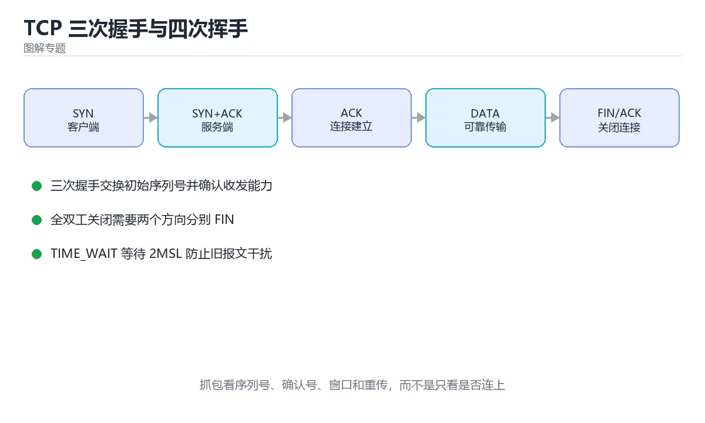
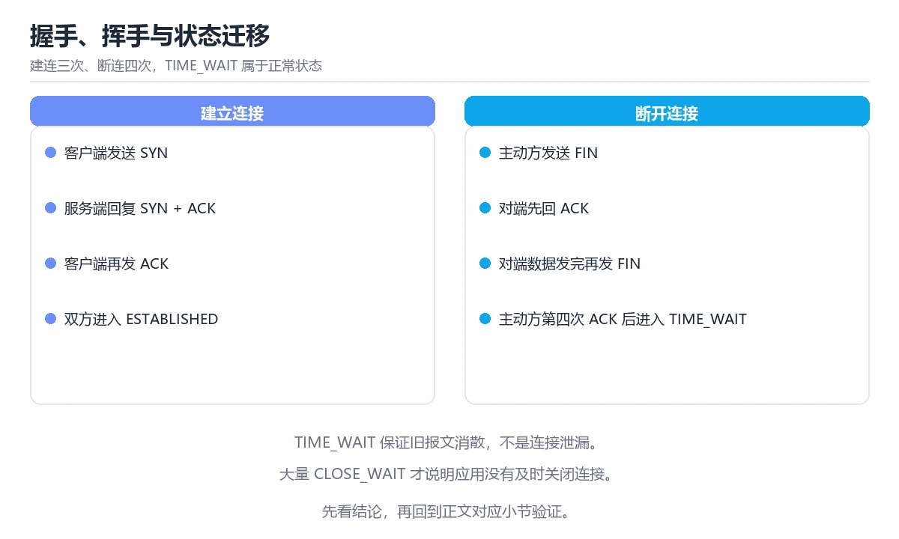

# 图解 TCP 握手、挥手与拥塞控制

> 内容更新时间：2026-10-06 · 学习阶段：进阶 · 预计用时：45 分钟



## 本节知识框架

**课程定位**：所属分类为「图解专题」，课程主题为「图解 TCP 握手、挥手与拥塞控制」，学习阶段为「进阶」，建议用时 45 分钟。

**本课要解决的主问题**：三次握手、四次挥手、滑动窗口与拥塞控制的图解与排查思路。

| 学习层次 | 要回答的问题 | 完成判据 |
| --- | --- | --- |
| 概念层 | 「图解 TCP 握手、挥手与拥塞控制」有哪些必须区分的对象与术语？ | 能用自己的话定义核心术语，并各举一个正例和一个反例。 |
| 机制层 | 这些对象按什么顺序发生作用，输入如何变成输出？ | 能画出或写出机制步骤，并说明每一步的失败条件。 |
| 应用层 | 什么场景适合使用「图解 TCP 握手、挥手与拥塞控制」，什么场景不适合？ | 能给出一个真实场景、一个最小示例和一个边界案例。 |
| 性能层 | 时间、空间、吞吐或延迟受哪些量影响？ | 能说出复杂度或性能瓶颈的证据来源；没有证据时明确写“材料未提供”。 |
| 复习层 | 怎样确认自己不是只记住了结论？ | 能独立完成本课自测，并把错误定位到概念、机制、示例或边界。 |

### 阅读路线

1. 先读「核心概念定义」，建立「TCP」等对象的精确定义。
2. 再读「原理与运行机制」，把定义串成可重复的过程。
3. 用「代码/协议/SQL 示例」验证过程，并只改一个条件观察结果变化。
4. 最后检查性能、易错点、知识关系与自测题，形成可复习的证据链。

**前置知识**：《图解 B+ 树与数据库索引》

**学习位置**：本课位于《图解 B+ 树与数据库索引》之后；如果前一课的自测不能通过，应先回补再继续。

**后续衔接**：下一课《图解 JVM 内存模型与垃圾回收》会继续使用本课术语，学完后建议立即完成一次自测。

**教材衔接：学习目标**

- 能用自己的话解释图解 TCP 握手、挥手与拥塞控制解决了什么问题，而不是只背术语。
- 能说清 「TCP」、「三次握手」、「TIME_WAIT」、「滑动窗口」 之间的关系，并分别举出一个例子。
- 能把 TCP 放回「图解 TCP 握手、挥手与拥塞控制」的知识体系，说明它和 三次握手 的边界。
- 能完成本课练习，并用验收标准检查自己的结果。

> 一句话摘要：三次握手、四次挥手、滑动窗口与拥塞控制的图解与排查思路。

**教材衔接：前置知识**

- 先完成上一课《图解 B+ 树与数据库索引》；如果已经掌握，可以直接用本课练习自测。
- 本课阶段：进阶。建议先完成「图解 B+ 树与数据库索引」，或确认自己能独立跑通正文里的 TIME_WAIT 示例。
- 开始前先复习：TCP、三次握手、TIME_WAIT。
- 如果 一句话说清 这一步看不懂，先记录具体卡点，再用 TIME_WAIT 复现一遍。

**教材衔接：本课小结**

- **握手花一个 RTT，挥手要四次**：短连接的成本主要在这里。
- **滑动窗口决定一次能发多少，拥塞控制决定能发多快**。
- 排查网络问题先分类：是延迟问题、丢包问题，还是连接管理问题。

## 核心概念定义

> 在阅读《图解 TCP 握手、挥手与拥塞控制》时，术语第一次出现先给操作性定义，再给边界；正文说法与这里冲突时，以定义和可复现示例为准。

| 术语 | 操作性定义 | 本课中的边界 |
| --- | --- | --- |
| TCP | TCP 通过三次握手建立连接、四次挥手释放连接，并用序列号、确认、重传、滑动窗口和拥塞控制提供可靠传输；握手步骤保证双方确认收发能力与初始序列号。 | 仅在「图解 TCP 握手、挥手与拥塞控制」明确给出的输入、版本与资源条件下成立。 |
| 三次握手 | │ ① SYN seq = x │ 我想连你，我的起始序号是 x。 | 仅在「图解 TCP 握手、挥手与拥塞控制」明确给出的输入、版本与资源条件下成立。 |
| 滑动窗口 | 在时间轴上只统计最近一段窗口内的请求或事件，用平滑突发并限制瞬时速率。 | 仅在「图解 TCP 握手、挥手与拥塞控制」明确给出的输入、版本与资源条件下成立。 |
| 拥塞控制 | TCP 根据网络反馈调整发送速率，避免丢包和排队崩溃。 | 仅在「图解 TCP 握手、挥手与拥塞控制」明确给出的输入、版本与资源条件下成立。 |

### 定义如何使用

在「图解 TCP 握手、挥手与拥塞控制」中判断一个说法是否成立，先确认它使用的是哪个对象的定义，再检查输入规模、运行环境与失败路径。定义不是口号，而是后续推导、代码示例和自测题共享的约束。

## 原理与运行机制

### 机制总览

1. **建立输入**：把「TCP」按本课定义整理成可观察、可重复的输入条件。
2. **执行转换**：围绕「三次握手」执行本课的核心步骤；每一步都记录中间状态，避免只看最终输出。
3. **产生输出**：得到「滑动窗口」后，用正文示例或协议/SQL 结果核对输出是否符合预期。
4. **改变一个条件**：只替换一个边界条件或环境参数，观察「图解 TCP 握手、挥手与拥塞控制」的结论是否仍然成立。

| 阶段 | 关注对象 | 失败时应检查 |
| --- | --- | --- |
| 输入 | TCP | 类型、范围、编码、版本或前置状态是否满足定义。 |
| 处理 | 三次握手 | 顺序、可见性、锁、路由、事务或调度规则是否被破坏。 |
| 输出 | 滑动窗口 | 结果是否可复现，错误是否被正确传播而不是被吞掉。 |

本课的机制结论要用「图解 TCP 握手、挥手与拥塞控制」自己的示例验证。「图解 TCP 握手、挥手与拥塞控制」没有给出某个数量级、吞吐或内存数据时，本课把该判断标为“材料未提供”，不从相邻主题外推。

**教材衔接：一句话说清**

TCP 用**三次握手**建立连接、**四次挥手**断开连接，用**滑动窗口与拥塞控制**决定「一次能发多少、发多快」。
看懂这三张图，网络慢与丢包问题就有了排查方向。

## 典型应用场景

| 场景 | 典型输入或前提 | 期望产物 |
| --- | --- | --- |
| 学习验证 | 使用本课最小示例和 TCP、三次握手 | 能复现正文结论，并解释每一步。 |
| 工程落地 | 把「图解 TCP 握手、挥手与拥塞控制」放入真实模块或服务边界 | 输出可观测、失败可定位、参数可配置。 |
| 故障排查 | 只改一个版本、规模、输入或依赖条件 | 能区分概念错误、实现错误和环境差异。 |

判断「图解 TCP 握手、挥手与拥塞控制」的场景是否成立，标准是能否写出输入、处理、输出和失败路径；材料中没有出现的数据在本课标注为“材料未提供”，不用推测替代证据。

**教材衔接：一个真实场景：为什么「大文件慢」和「小请求慢」原因不同**

| 现象 | 可能原因 | 排查方向 |
| --- | --- | --- |
| 大文件吞吐低 | 拥塞窗口受限、丢包 | 看重传率与 cwnd |
| 小请求延迟高 | 握手与 TLS 往返多 | 复用连接、就近部署 |
| 偶发卡顿 | 丢包触发重传与减窗 | 看重传率与 RTT 抖动 |
| 连接数暴涨 | 未复用连接 | 用连接池 |

```bash
# 观察重传与关键指标
ss -ti | grep -E "retrans|cwnd"
netstat -s | grep -i retrans
```

## 代码/协议/SQL 示例

以下代码、协议或 SQL 片段来自《图解 TCP 握手、挥手与拥塞控制》原文，保留原有语言标记与上下文；先预测《图解 TCP 握手、挥手与拥塞控制》示例的输出，再按正文步骤运行或推演，示例依赖外部环境时同时记录版本与输入。

**教材衔接：三次握手**

```text
客户端                                     服务端
   │                                          │
   │ ① SYN  seq = x                           │   我想连你，我的起始序号是 x
   ├─────────────────────────────────────────►│
   │                                          │   服务端记录并分配资源
   │ ② SYN + ACK  seq = y, ack = x + 1        │
   │◄─────────────────────────────────────────┤
   │                                          │
   │ ③ ACK  ack = y + 1                       │
   ├─────────────────────────────────────────►│
   │                                          │   双方进入 ESTABLISHED
   ▼                                          ▼
```

| 问题 | 答案 |
| --- | --- |
| 为什么不是两次？ | 防止旧连接请求突然到达，服务端白白分配资源 |
| 为什么不是四次？ | 第二步的 SYN 与 ACK 可以合并 |
| 每次握手的代价 | 一个 RTT（往返时间） |

**结论**：连接建立至少花一个 RTT，所以「复用连接」永远是第一优化手段。

**教材衔接：四次挥手**

```text
客户端                                     服务端
   │ ① FIN                                     │
   ├─────────────────────────────────────────►│  我不再发数据了
   │ ② ACK                                     │
   │◄─────────────────────────────────────────┤
   │                                          │  服务端可能还有数据要发
   │ ③ FIN                                     │
   │◄─────────────────────────────────────────┤  我也发完了
   │ ④ ACK                                     │
   ├─────────────────────────────────────────►│
   │                                          │
   ▼ 进入 TIME_WAIT（通常 2MSL）               ▼ 关闭
```

| 概念 | 含义 |
| --- | --- |
| 半关闭 | 一方停止发送，但仍能接收 |
| `TIME_WAIT` | 主动关闭方等待一段时间，确保最后的 ACK 到达 |
| 大量 `TIME_WAIT` | 短连接过多，通常是没复用连接的信号 |
| `CLOSE_WAIT` 堆积 | 程序收到 FIN 却没调用 close，是代码 bug |

```bash
# 查看连接状态分布
ss -tan | awk 'NR>1 {state[$1]++} END {for (s in state) print s, state[s]}' | sort -k2 -nr
```

**教材衔接：滑动窗口：一次能发多少**

```text
发送方维护一个窗口，可以连续发送多个段而不必逐个等待确认

  [ 已发送已确认 ][ 已发送未确认 ][ 可发送 ][ 还不能发 ]
                    └────── 窗口大小 ──────┘

接收方通过 ACK 里的 window 字段告诉发送方：
  「我的缓冲区还剩多少，你最多还能发这么多」
```

```text
零窗口（接收方缓冲区满）
  接收方：window = 0
  发送方：停止发送，定期发窗口探测包
  → 现象：吞吐骤降，延迟上升
```

**教材衔接：拥塞控制：发多快**

```text
拥塞窗口 cwnd 随时间变化（经典 AIMD）

cwnd
 ▲
 │            ╱│╲
 │          ╱  │  ╲
 │        ╱    │    ╲
 │      ╱      │      ╲
 │    ╱        │        ╲
 │  ╱          │          ╲
 └────────────────────────────► 时间
   慢启动    拥塞避免   丢包后减半
   （指数）  （线性）    （乘法减小）

四个阶段：慢启动 → 拥塞避免 → 快速重传 → 快速恢复
```

| 算法 | 特点 |
| --- | --- |
| Reno | 丢包即减半，经典实现 |
| CUBIC | Linux 默认，适合高带宽长距离 |
| BBR | 基于带宽与时延估计，弱网表现好 |

```bash
# 查看与修改拥塞控制算法
sysctl net.ipv4.tcp_congestion_control
sysctl -w net.ipv4.tcp_congestion_control=bbr
```

**教材衔接：深入补充：图解 TCP 握手、挥手与拥塞控制**

前面已经建立了基本概念。这一节换一个角度，把图解 TCP 握手、挥手与拥塞控制放进真实工程里，
重点回答三件事：TIME_WAIT 解决什么问题、依赖哪些前提、在什么条件下失效。

### 一、核心模型

TCP 通过三次握手建立连接、四次挥手释放连接，并用序列号、确认、重传、滑动窗口和拥塞控制提供可靠传输；握手步骤保证双方确认收发能力与初始序列号。

```text
客户端 SYN → 服务端 SYN+ACK → 客户端 ACK → 数据传输 → 双方 FIN/ACK → TIME_WAIT → 连接关闭
```

### 二、关键机制拆解

1. 三次握手确认双方都能发送和接收，并交换初始序列号。
2. SYN 洪泛利用大量半连接占满队列，SYN Cookie 可以缓解。
3. 四次挥手因为 TCP 全双工，双方需要分别关闭发送方向。
4. TIME_WAIT 等待 2MSL，确保旧报文消失并让最终 ACK 可靠到达。
5. 滑动窗口控制未确认数据量，接收窗口反映接收端缓冲能力。
6. 慢启动、拥塞避免、快速重传和快速恢复共同控制发送速率。
7. 丢包不一定是拥塞，无线链路误码也会触发重传和速率下降。

### 三、对照表：抓住容易混淆的边界

| 维度 | 一侧 | 另一侧 |
| --- | --- | --- |
| 三次握手 | 建立双向连接 | 交换序列号并确认收发能力 |
| 四次挥手 | 分别关闭两个方向 | 因为全双工需要独立 FIN |
| 超时重传 | 等超时后重发 | 保守但延迟高 |
| 快速重传 | 收到重复 ACK 立即重发 | 减少等待超时 |

### 四、工作示例

连接建立时客户端发送 SYN，序列号 x；服务端回复 SYN+ACK，序列号 y、确认 x+1；客户端再发 ACK 确认 y+1。之后双方才能发送应用数据。

### 五、常见误区与失效边界

| 错误做法或假设 | 后果 | 正确做法 |
| --- | --- | --- |
| 认为握手只是形式 | 无法理解序列号和可靠性 | 把每一步与收发能力、序列号对应起来 |
| 忽略 TIME_WAIT | 端口耗尽或旧报文干扰 | 合理配置并监控连接状态 |
| 把丢包都当拥塞 | 无线场景优化错误 | 结合重传率和信号质量判断 |
| 盲目调大窗口 | 接收端溢出和延迟增加 | 根据带宽时延积和接收能力调整 |

### 六、场景推演

服务出现大量 TIME_WAIT，短连接 QPS 高。排查后启用连接复用、调整内核参数并监控端口使用；同时确认不是服务端异常关闭导致频繁挥手。

### 七、自测问答

**Q1：为什么需要三次握手？**

确认双方收发能力并交换初始序列号，保证连接状态一致。

**Q2：为什么挥手是四次？**

TCP 全双工，两个方向需要分别关闭。

**Q3：TIME_WAIT 的作用是什么？**

确保旧报文消失并让最终 ACK 可靠到达。

**Q4：快速重传如何触发？**

接收端收到乱序报文后重复 ACK，发送端据此立即重传。

### 八、小项目：把知识变成可检查的产出

用抓包工具记录一次 HTTP 请求的 TCP 握手、数据传输和挥手，标注序列号、ACK、窗口和状态变化；再模拟一次丢包，观察重传与拥塞窗口变化。

### 九、适用边界

TCP 提供可靠字节流，不保留消息边界，也不保证应用层语义。消息分帧、幂等和超时重试必须由协议或应用自行设计。

### 十、完成检查清单

- [ ] 能画出三次握手与四次挥手
- [ ] 能解释序列号和确认号
- [ ] 能说明 TIME_WAIT 与连接复用
- [ ] 能分析滑动窗口和拥塞控制
- [ ] 能用抓包定位连接问题

### 十一、复习顺序

1. 合上教程复述 TCP，确认能说出它解决的三个问题。
2. 再对照表逐行解释容易混淆的概念，每个概念补一个反例。
3. 跟着工作示例做一遍，改变一个条件并预测结果。
4. 用自测问答检查理解，错题回到对应小节重新阅读。
5. 用 TIME_WAIT 做一个最小交付，附上运行命令与失败样例。

> 复习不是重读一遍，而是离开原文重新产出：复述、改写、验证、复盘。

## 时间/空间复杂度或性能分析

**复杂度证据**：「图解 TCP 握手、挥手与拥塞控制」的现有材料没有给出渐近时间或空间复杂度的明确结论，本课只做定性检查，不补写未经验证的 $O$ 记号。

| 维度 | 本课关注点 | 判断依据 |
| --- | --- | --- |
| 时间/延迟 | 「图解 TCP 握手、挥手与拥塞控制」的主要步骤是否会随输入规模、并发度或网络往返增长。 | 以正文复杂度、基准数据或可重复测量为准。 |
| 空间/内存 | 中间状态、缓存、副本、连接或索引是否随规模增长。 | 记录峰值内存与数据副本，不只看最终结果。 |
| 吞吐/资源 | 版本、调度、锁、IO、序列化或协议开销是否成为瓶颈。 | 固定环境做对照实验，改变一个变量。 |

评估「图解 TCP 握手、挥手与拥塞控制」时要区分“正确性成立”和“性能达标”两件事；材料没有给出基准时，本课只保留量级来源与测量方法，不写不可验证的绝对数字。

## 常见误区与易错点

> 复核《图解 TCP 握手、挥手与拥塞控制》的易错点时，优先保留原文的错误表、故障现场与排错路径；每条修正都要能用本课示例复验。

| 易错点 | 常见表现 | 正确做法 |
| --- | --- | --- |
| 只背结论 | 能复述「图解 TCP 握手、挥手与拥塞控制」的定义，却说不清输入、输出与边界。 | 回到机制步骤，用最小示例逐一验证。 |
| 混淆相邻概念 | 把本课对象与相邻主题的对象当成同一类。 | 先比较定义、资源归属、生命周期和失败模式。 |
| 忽略版本与环境 | 在开发机通过后直接外推到生产环境。 | 固定版本、输入和资源条件，再记录可复现结果。 |

**教材衔接：常见错误与排查**

> 说明：本表由《图解 TCP 握手、挥手与拥塞控制》的核心知识整理（2026-10-07），人工复核进度见 docs/content_review_batches.md。

| 易错点 | 容易踩的做法 | 正确结论 |
| --- | --- | --- |
| 把建立与关闭流程混为一谈 | 状态迁移理解错误 | 按状态机分别理解建立与关闭 |
| 忽略重传与超时 | 慢连接问题解释不了 | 结合抓包观察重传与超时时间 |
| 忽略拥塞控制 | 高丢包下吞吐骤降无法解释 | 观察拥塞窗口与丢包事件的对应关系 |



**教材衔接：故障现场**

### 现场 1：把建立与关闭流程混为一谈

**症状**：在《图解 TCP 握手、挥手与拥塞控制》的复现场景中，状态迁移理解错误。

**根因**：当出现“把建立与关闭流程混为一谈”时，执行路径已经绕过了《图解 TCP 握手、挥手与拥塞控制》的关键约束，最终以“状态迁移理解错误”暴露出来；修复前必须先确认约束在哪里失效。

**修复**：针对《图解 TCP 握手、挥手与拥塞控制》的问题，按状态机分别理解建立与关闭。

**验证**：先在《图解 TCP 握手、挥手与拥塞控制》中记录“把建立与关闭流程混为一谈”留下的失败证据，再执行“按状态机分别理解建立与关闭”并重放；确认错误路径变为明确结果，且修复没有掩盖同类故障。

### 现场 2：忽略重传与超时

**症状**：在《图解 TCP 握手、挥手与拥塞控制》的复现场景中，慢连接问题解释不了。

**根因**：当出现“忽略重传与超时”时，执行路径已经绕过了《图解 TCP 握手、挥手与拥塞控制》的关键约束，最终以“慢连接问题解释不了”暴露出来；修复前必须先确认约束在哪里失效。

**修复**：针对《图解 TCP 握手、挥手与拥塞控制》的问题，结合抓包观察重传与超时时间。

**验证**：在《图解 TCP 握手、挥手与拥塞控制》中按“结合抓包观察重传与超时时间”调整后，从“忽略重传与超时”的触发条件重放同一条路径，确认“慢连接问题解释不了”不再出现，并补一个相邻边界用例检查没有引入新问题。

### 现场 3：忽略拥塞控制

**症状**：在《图解 TCP 握手、挥手与拥塞控制》的复现场景中，高丢包下吞吐骤降无法解释。

**根因**：当出现“忽略拥塞控制”时，执行路径已经绕过了《图解 TCP 握手、挥手与拥塞控制》的关键约束，最终以“高丢包下吞吐骤降无法解释”暴露出来；修复前必须先确认约束在哪里失效。

**修复**：针对《图解 TCP 握手、挥手与拥塞控制》的问题，观察拥塞窗口与丢包事件的对应关系。

**验证**：保留《图解 TCP 握手、挥手与拥塞控制》里触发“高丢包下吞吐骤降无法解释”的输入、版本和日志，按“观察拥塞窗口与丢包事件的对应关系”完成修改后原样重放；只有失败现象消失且相邻场景仍可解释，才保留改动。

## 与其他知识点的关系

| 关系 | 课程 | 为什么 |
| --- | --- | --- |
| 先修 | 《图解 B+ 树与数据库索引》 | 本课会直接使用它的概念或操作前提。 |
| 关联 | 《图解 JVM 内存模型与垃圾回收》 | 用于横向比较或把本课结论迁移到相邻主题。 |
| 关联 | 《TCP/IP 协议栈》 | 用于横向比较或把本课结论迁移到相邻主题。 |
| 关联 | 《IP、子网与传输层深入》 | 用于横向比较或把本课结论迁移到相邻主题。 |
| 关联 | 《网络性能调优》 | 用于横向比较或把本课结论迁移到相邻主题。 |
| 前置顺序 | 《图解 B+ 树与数据库索引》 | 同分类中安排在本课之前，建议先完成其自测。 |
| 后续顺序 | 《图解 JVM 内存模型与垃圾回收》 | 同分类中安排在本课之后，会继续使用本课术语。 |

把「图解 TCP 握手、挥手与拥塞控制」放回知识体系时，不只要记住“前面学过什么”，还要说明两个主题在输入、机制、资源边界和失败模式上的差异。这样才能把单课知识迁移到项目、排障和后续课程。

**教材衔接：复习与迁移**

复习目标：把「图解 TCP 握手、挥手与拥塞控制」的判断标准放回可复现的例子里。先自己作答，再对照依据；如果结论正确但理由不完整，回到正文补足前提。

### 概念复述

- 用一句话说明「图解 TCP 握手、挥手与拥塞控制」解决什么问题：三次握手、四次挥手、滑动窗口与拥塞控制的图解与排查思路。
- 写出TCP、三次握手、TIME_WAIT之间的关系，并各举一个例子。
- 说出本课最容易混淆的两个概念，以及区分它们的判据。

### 正文逐节复核

- **一句话说清**：TCP 用**三次握手**建立连接、**四次挥手**断开连接，用**滑动窗口与拥塞控制**决定「一次能发多少、发多快」。
- **深入补充：图解 TCP 握手、挥手与拥塞控制**：前面已经建立了基本概念。这一节换一个角度，把图解 TCP 握手、挥手与拥塞控制放进真实工程里，。

### 测验回顾

1. 围绕“图解 TCP 握手、挥手与拥塞控制”中的 TCP、三次握手、TIME_WAIT，下列哪两项是本课强调的实践判断？
   - 依据：本课把图解 TCP 握手、挥手与拥塞控制拆成概念、示例与故障现场三部分，因此判断 TCP 时必须同时交代输入、输出和失败路径，这使“学习 TCP 时要同时说明输入、输出和失败路径，不能只看正常流程”成立。在图解 TCP 握手、挥手与拥塞控制里，判断 三次握手 时要固定版本与边界输入，所以“验证 三次握手 时要固定版本并覆盖边界输入，结论才可复现”才可复现。
2. 下面这段代码摘自「图解 TCP 握手、挥手与拥塞控制」的正文示例。关于这段代码，下面哪一项说法与实际内容相符？
   - 依据：在「图解 TCP 握手、挥手与拥塞控制」里，这段代码只做静态声明，没有循环、分支或可观察输出。这段代码出自「图解 TCP 握手、挥手与拥塞控制」的正文示例，围绕TCP、三次握手、TIME_WAIT展开；把输入或边界换成空值、极值或失败情况后，结论要以「图解 TCP 握手、挥手与拥塞控制」的实际运行结果为准。
3. 接收方缓冲区满时，TCP 会怎样？
   - 依据：零窗口机制让发送方暂停并定期探测窗口是否恢复。在「图解 TCP 握手、挥手与拥塞控制」里，如果只凭关键词作答，很容易把「丢弃连接」、「自动扩容缓冲区」与「通过零窗口通知发送方暂停」混在一起；「图解 TCP 握手、挥手与拥塞控制」要求先交代TCP、三次握手、TIME_WAIT的前提再下结论，所以“通过零窗口通知发送方暂停”只在题干“接收方缓冲区满时”给定的条件下成立。
4. 排查「大文件传输吞吐低」时，更应关注？
   - 依据：大文件吞吐受拥塞控制与丢包影响最直接。在「图解 TCP 握手、挥手与拥塞控制」里，作答时，先用TCP建立输入与输出的基线，再把重传率与拥塞窗口（cwnd）代入边界条件核对，结论才能复现。在「图解 TCP 握手、挥手与拥塞控制」里，这道题要求区分概念与边界，「重传率与拥塞窗口（cwnd）」只有在题干给出的前提下才成立，而「DNS 解析时间」、「TLS 证书链长度」缺少同一组条件。
5. 补全代码：「图解 TCP 握手、挥手与拥塞控制」示例中，下面这行代码缺少哪个关键字或函数名？请填入 ____。

`▼ 进入 ____（通常 2MSL） ▼ 关闭`
   - 依据：空格应填写「TIME_WAIT」、「time_wait」。在「图解 TCP 握手、挥手与拥塞控制」里判断这道题，要把TCP、三次握手、TIME_WAIT的条件、过程与失败路径逐项对齐，换成“补全代码”这个场景，只有满足前提的结论才成立。回到「图解 TCP 握手、挥手与拥塞控制」的正文示例，用“补全代码”走一遍TCP、三次握手、TIME_WAIT的完整流程，能复现的结论才可以保留。

### 迁移练习

把「图解 TCP 握手、挥手与拥塞控制」的结论迁移到相邻主题，每次迁移都写清预测与证据：

1. 换输入：用TCP处理一组你自己的数据，对比教材示例的结果差异。
2. 换失败条件：制造一个三次握手相关的错误，说明如何从错误信息定位根因。
3. 换规模：把数据量或并发度提高一个数量级，说明「图解 TCP 握手、挥手与拥塞控制」的结论是否仍成立。

## 自测题与参考答案

> 先独立完成《图解 TCP 握手、挥手与拥塞控制》的自测，再核对答案与解析。答案必须能在本课正文或示例中找到依据，不能只凭语感。

### 自测 1

围绕“图解 TCP 握手、挥手与拥塞控制”中的 TCP、三次握手、TIME_WAIT，下列哪两项是本课强调的实践判断？

A. 学习 TCP 时要同时说明输入、输出和失败路径，不能只看正常流程
B. 只要 TCP 的常规示例通过，就可以跳过边界与异常路径
C. 验证 三次握手 时要固定版本并覆盖边界输入，结论才可复现
D. 把 三次握手 的单次运行结果当成所有版本和规模都成立

**参考答案**：学习 TCP 时要同时说明输入、输出和失败路径，不能只看正常流程；验证 三次握手 时要固定版本并覆盖边界输入，结论才可复现

**解析**：本课把图解 TCP 握手、挥手与拥塞控制拆成概念、示例与故障现场三部分，因此判断 TCP 时必须同时交代输入、输出和失败路径，这使“学习 TCP 时要同时说明输入、输出和失败路径，不能只看正常流程”成立。在图解 TCP 握手、挥手与拥塞控制里，判断 三次握手 时要固定版本与边界输入，所以“验证 三次握手 时要固定版本并覆盖边界输入，结论才可复现”才可复现。

### 自测 2

下面这段代码摘自「图解 TCP 握手、挥手与拥塞控制」的正文示例。关于这段代码，下面哪一项说法与实际内容相符？

```bash
# 查看与修改拥塞控制算法
sysctl net.ipv4.tcp_congestion_control
sysctl -w net.ipv4.tcp_congestion_control=bbr
```

A. 这段代码包含条件分支，不同输入会走不同的执行路径。
B. 这段代码把主要逻辑封装在函数或方法里，需要被调用才会执行。
C. 这段代码只做静态声明，没有循环、分支或可观察输出。
D. 这段代码包含循环结构，同一段逻辑会被重复执行。

**参考答案**：这段代码只做静态声明，没有循环、分支或可观察输出。

**解析**：在「图解 TCP 握手、挥手与拥塞控制」里，这段代码只做静态声明，没有循环、分支或可观察输出。这段代码出自「图解 TCP 握手、挥手与拥塞控制」的正文示例，围绕TCP、三次握手、TIME_WAIT展开；把输入或边界换成空值、极值或失败情况后，结论要以「图解 TCP 握手、挥手与拥塞控制」的实际运行结果为准。

### 自测 3

接收方缓冲区满时，TCP 会怎样？

A. 改用 UDP
B. 丢弃连接
C. 通过零窗口通知发送方暂停
D. 自动扩容缓冲区，但这会增加往返次数

**参考答案**：通过零窗口通知发送方暂停

**解析**：零窗口机制让发送方暂停并定期探测窗口是否恢复。在「图解 TCP 握手、挥手与拥塞控制」里，如果只凭关键词作答，很容易把「丢弃连接」、「自动扩容缓冲区，但这会增加往返次数」与「通过零窗口通知发送方暂停」混在一起；「图解 TCP 握手、挥手与拥塞控制」要求先交代TCP、三次握手、TIME_WAIT的前提再下结论，所以“通过零窗口通知发送方暂停”只在题干“接收方缓冲区满时”给定的条件下成立。

**教材衔接：动手练习**

> 本课练习重点：围绕「TCP、三次握手、TIME_WAIT」完成复述、实验和交付，每个结果都要能被别人检查。

手绘 三次握手 的状态转移图，标出哪一步会写数据。

### 练习 1：建立心智模型（10 分钟）

合上教程，用 3～5 句话回答：

1. 图解 TCP 握手、挥手与拥塞控制解决了什么问题？
2. 如果没有它，会出现什么具体后果？
3. 它和「三次握手」是什么关系？

验收标准：用自己的话解释 TCP，并给出一个它不成立的反例。

### 练习 2：做一次可控实验（20 分钟）

从正文中选一个最小示例，完成以下操作：

1. 先预测修改一个参数、输入或步骤后的结果。
2. 再实际执行或逐步推演，记录真实结果。
3. 如果结果与预测不同，写出差异原因。

**验收标准**：先在「一句话说清」里找一个可运行的最小输入，再按五步法记录TCP的影响；预测与结果不一致时补写被忽略的前提。

### 练习 3：交付一个小结果（30 分钟）

不看原图手绘一遍流程，再用自己的话指出图中的关键状态变化。

任务要求：

- 结果必须能被别人检查，不能只写“我已经理解了”。
- 至少覆盖「TCP」和「三次握手」两个关键词。
- 写出 1 个仍然不确定的问题，以及下一步如何验证。

> 提示：时间有限时优先做练习 1 和练习 2；练习 3 可以拆成两次完成。

**教材衔接：可运行练习**

### 任务 1：先跑通，再解释

```bash
# 查看连接状态分布
ss -tan | awk 'NR>1 {state[$1]++} END {for (s in state) print s, state[s]}' | sort -k2 -nr
```

### 任务 2：只改一个条件

把「图解 TCP 握手、挥手与拥塞控制」的最小示例复制一份，只改一个条件再跑一次：

- 改动点：只把 TCP 的输入换成空值、极值或错误输入，其余保持不变。
- 预测：先写下「图解 TCP 握手、挥手与拥塞控制」在改动后的输出或错误信息，再运行。
- 记录：对照改动前后的结果，指出差异出在哪一步。
- 验收：换回原条件能复现原结果，改动只影响TCP。

### 任务 3：迁移到自己的数据

换一个 三次握手 场景重做一次，确认结论不是只对示例数据成立。

**教材衔接：本课复习清单**

离开本课前，逐项确认：

- [ ] 不看解析，能说出「TCP 为什么需要三次握手而不是两次？」的判断依据。
- [ ] 不看解析，能说出「服务器上出现大量 CLOSE_WAIT 状态，最可能的原因是？」的判断依据。
- [ ] 不看解析，能说出「接收方缓冲区满时，TCP 会怎样？」的判断依据。
- [ ] 不看解析，能说出「排查「大文件传输吞吐低」时，更应关注？」的判断依据。
- [ ] 用 TCP 构造一个正常输入和一个边界输入，分别记录输出与判断依据。
- [ ] 把本课最容易混淆的两个概念写成一句话对照。

| 复盘项 | 记录 |
| --- | --- |
| 已经能独立解释的考点 |  |
| 仍然说不清的概念 |  |
| 下一步验证动作 |  |

**教材衔接：复习与自测**

- [ ] 能说清「一句话说清」的结论，并说出它的适用边界。
- [ ] 能用自己的话复述「三次握手」，并各举一个正例和反例。
- [ ] 能解释「四次挥手」里最容易混淆的两个概念。
- [ ] 能不看正文写出「滑动窗口：一次能发多少」的关键步骤。
- [ ] 能用一句话说明「拥塞控制：发多快」解决什么问题。
- [ ] 能把「一个真实场景：为什么「大文件慢」和「小请求慢」原因不同」的判断标准套到一个新例子上。

---

## 术语速查

| 术语 | 一句话说明 |
| --- | --- |
| `TCP` | TCP 通过三次握手建立连接、四次挥手释放连接，并用序列号、确认、重传、滑动窗口和拥塞控制提供可靠传输；握手步骤保证双方确认收发能力与初始序列号。 |
| `三次握手` | │ ① SYN seq = x │ 我想连你，我的起始序号是 x。 |
| `滑动窗口` | 在时间轴上只统计最近一段窗口内的请求或事件，用平滑突发并限制瞬时速率。 |
| `拥塞控制` | TCP 根据网络反馈调整发送速率，避免丢包和排队崩溃。 |

## 考点精讲

### 考点 1：多选辨析·TCP

- **题目**：围绕“图解 TCP 握手、挥手与拥塞控制”中的 TCP、三次握手、TIME_WAIT，下列哪两项是本课强调的实践判断？
- **判断依据**：本课把图解 TCP 握手、挥手与拥塞控制拆成概念、示例与故障现场三部分，因此判断 TCP 时必须同时交代输入、输出和失败路径，这使“学习 TCP 时要同时说明输入、输出和失败路径，不能只看正常流程”成立。在图解 TCP 握手、挥手与拥塞控制里，判断 三次握手 时要固定版本与边界输入，所以“验证 三次握手 时要固定版本并覆盖边界输入，结论才可复现”才可复现。

### 考点 2：代码补全·TCP

- **题目**：下面这段代码摘自「图解 TCP 握手、挥手与拥塞控制」的正文示例。关于这段代码，下面哪一项说法与实际内容相符？
- **判断依据**：在「图解 TCP 握手、挥手与拥塞控制」里，这段代码只做静态声明，没有循环、分支或可观察输出。这段代码出自「图解 TCP 握手、挥手与拥塞控制」的正文示例，围绕TCP、三次握手、TIME_WAIT展开；把输入或边界换成空值、极值或失败情况后，结论要以「图解 TCP 握手、挥手与拥塞控制」的实际运行结果为准。

### 考点 3：概念判断·TCP

- **题目**：接收方缓冲区满时，TCP 会怎样？
- **判断依据**：零窗口机制让发送方暂停并定期探测窗口是否恢复。在「图解 TCP 握手、挥手与拥塞控制」里，如果只凭关键词作答，很容易把「丢弃连接」、「自动扩容缓冲区，但这会增加往返次数」与「通过零窗口通知发送方暂停」混在一起；「图解 TCP 握手、挥手与拥塞控制」要求先交代TCP、三次握手、TIME_WAIT的前提再下结论，所以“通过零窗口通知发送方暂停”只在题干“接收方缓冲区满时”给定的条件下成立。

### 考点 4：概念判断·大文件传输吞吐低

- **题目**：排查「大文件传输吞吐低」时，更应关注？
- **判断依据**：大文件吞吐受拥塞控制与丢包影响最直接。在「图解 TCP 握手、挥手与拥塞控制」里，作答时，先用TCP建立输入与输出的基线，再把重传率与拥塞窗口（cwnd）代入边界条件核对，结论才能复现。在「图解 TCP 握手、挥手与拥塞控制」里，这道题要求区分概念与边界，「重传率与拥塞窗口（cwnd）」只有在题干给出的前提下才成立，而「DNS 解析时间」、「TLS 证书链长度，但这会增加每帧的开销」缺少同一组条件。

### 考点 5：填空·TCP

- **题目**：补全代码：「图解 TCP 握手、挥手与拥塞控制」示例中，下面这行代码缺少哪个关键字或函数名？请填入 ____。 `▼ 进入 ____（通常 2MSL） ▼ 关闭`
- **判断依据**：空格应填写「TIME_WAIT」、「time_wait」。在「图解 TCP 握手、挥手与拥塞控制」里判断这道题，要把TCP、三次握手、TIME_WAIT的条件、过程与失败路径逐项对齐，换成“补全代码”这个场景，只有满足前提的结论才成立。回到「图解 TCP 握手、挥手与拥塞控制」的正文示例，用“补全代码”走一遍TCP、三次握手、TIME_WAIT的完整流程，能复现的结论才可以保留。

## English Overview

**Title:** TCP Handshake Illustrated

**Summary:** Handshake, teardown, sliding window and congestion control.

**Category:** Visual Guide
**Level:** 进阶
**Key terms:** TCP, 三次握手, TIME_WAIT, 滑动窗口, 拥塞控制

## 内容元数据

- 内容版本：v2.0
- 最后更新：2026-10-06
- 学习阶段：进阶
- 适用环境：通用图解与系统原理；本课聚焦 TCP。
- 内容来源：内置结构化课程与工程实践整理
- 相关主题：TCP、三次握手、TIME_WAIT、滑动窗口、拥塞控制
- 质量版本：P0 测验标准 + P1 覆盖扩展 + P2 体验补全

## 参考资料与复核

- 最后复核：2026-10-04
- 下次复核：2027-07-10
- 复核范围：版本兼容、API 行为、安全建议与工程实践
- 来源性质：官方文档、标准或权威教材；正文为离线教学重组

| 参考资料 | 本课用途 |
| --- | --- |
| [MDN 浏览器工作原理](https://developer.mozilla.org/docs/Web/Performance/How_browsers_work) | 从请求到渲染的流程 |
| [PlantUML 文档](https://plantuml.com/) | UML 与架构图表达 |
| [RFC Editor](https://www.rfc-editor.org/) | 协议状态机与报文流程 |

> 「图解 TCP 握手、挥手与拥塞控制」的链接用于离线阅读后的延伸核对；App 不会自动联网。
