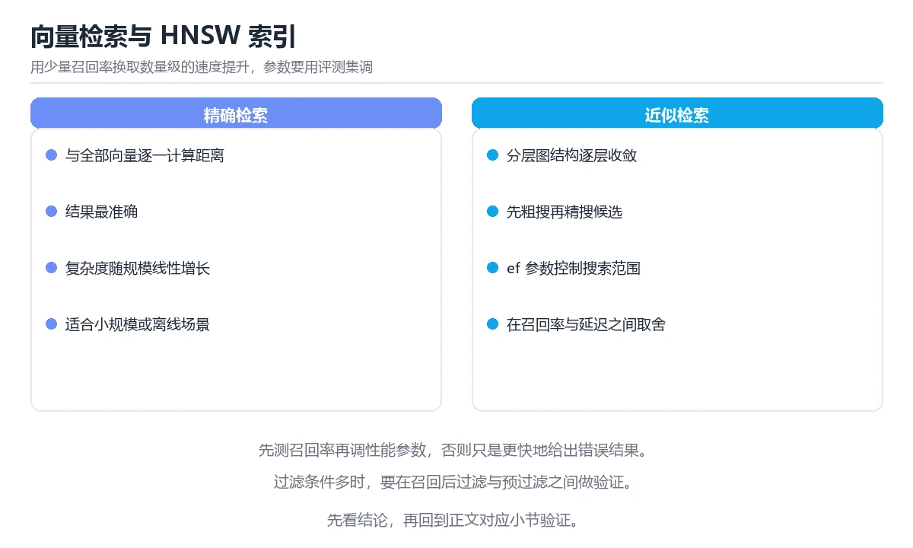

# 图解向量检索与 HNSW 索引

> 内容更新时间：2026-10-06 · 学习阶段：进阶 · 预计用时：50 分钟


## 本节知识框架

**课程定位**：所属分类 `visual_guide`（图解专题），课程主题 `图解向量检索与 HNSW 索引`，学习阶段 进阶，建议用时 50 分钟。

本课主线：暴力检索的瓶颈、HNSW 分层图、三个关键参数与 Recall 评估。

**学完本课应当能够**
- 说清 `向量检索` 与 `HNSW` 的含义与区别，并各举一个正例和一个反例。
- 用本课示例验证 `ANN` 的行为，记录输入、输出与失败条件。
- 遇到「召回率低」这类问题时，能说出触发条件与修复顺序。

### 从概念到验证的学习链条

1. `向量检索`：先掌握 把文本、图像等编码成向量，并按相似度快速找出语义最接近的条目，再用它解释 `HNSW` 为什么会出现。
2. `HNSW`：先掌握 分层可导航小世界图：近似最近邻索引，上层稀疏用于快速跳转，下层密集用于精确定位，再用它解释 `ANN` 为什么会出现。
3. `ANN`：先掌握 暴力比对太慢，于是用近似最近邻（ANN）索引换取速度，HNSW 是其中最常用的图索引，再用它解释 `RAG` 为什么会出现。
4. `RAG`：先掌握 先检索外部知识，再把证据与问题一起交给模型生成可引用的回答，再用它解释 本课示例的观察结果 为什么会出现。

**先修与衔接**：本课是「图解专题」分类的第 21 课。先修内容：《图解一致性哈希与数据分片》。《图解一致性哈希与数据分片》里的 `一致性哈希`、`分片` 是本课的前提。相关或后续课程：《嵌入、向量检索与 RAG》、《向量数据库选型与调优》、《实战：本地 RAG 客服 Agent》。

### 完成判据

- **定义关**：不看正文也能说明 `向量检索` 是 把文本、图像等编码成向量，并按相似度快速找出语义最接近的条目，并指出一个反例。
- **机制关**：能按“输入 → 转换 → 输出 → 验证”复述 `图解向量检索与 HNSW 索引`，而不是只背结论。
- **示例关**：能运行或推演 `图解向量检索与 HNSW 索引` 的 `text` 示例，并说明一个真实出现的标识符或字面量。
- **证据关**：能从 `图解向量检索与 HNSW 索引` 的示例写出一个输入、处理、输出三元组，并说明它支持或反驳了本课的哪一条结论。
- **排错关**：能复现 召回率低，记录现象并按 调大参数、改分块 修复。
- **迁移关**：能把 `向量检索`、`HNSW`、`ANN`、`召回率` 放进一个与 `图解向量检索与 HNSW 索引` 不同的项目场景，并保持输入与验证条件可追踪。
- **复盘关**：学完 `图解向量检索与 HNSW 索引` 后，用一句话写下仍然不确定的结论，并列出下一次验证需要的输入、环境和成功判据。

### 复习清单

- [ ] 能不看正文复述本课核心术语，并指出一个边界或反例。
- [ ] 能运行或推演本课示例，记录输入、输出与失败现象。
- [ ] 能完成一次自测，并把错题对照错误表定位原因。

**本课配图**



## 核心概念定义

| 术语 | 操作性定义 | 常见边界与风险 |
| --- | --- | --- |
| 向量检索 | 把文本、图像等编码成向量，并按相似度快速找出语义最接近的条目。 | 换编码、换字节序或换平台都可能改变结果，处理前先固定输入编码。 |
| HNSW | 分层可导航小世界图：近似最近邻索引，上层稀疏用于快速跳转，下层密集用于精确定位。 | 易错：HNSW 图本身占内存；正确做法是用 PQ 量化或换 IVF。 |
| ANN | 暴力比对太慢，于是用近似最近邻（ANN）索引换取速度，HNSW 是其中最常用的图索引。 | 易错：结果与暴力检索不一致；正确做法是用 Recall@K 量化。 |
| RAG | 先检索外部知识，再把证据与问题一起交给模型生成可引用的回答。 | 越界、悬垂引用与释放顺序会破坏结论，必须在边界输入下复验。 |

## 原理与运行机制

### 机制总览

**教材衔接：一句话说清**

向量检索要解决「在几百万条向量里找最相似的几条」。
暴力比对太慢，于是用近似最近邻（ANN）索引换取速度，**HNSW 是其中最常用的图索引**。

**教材衔接：HNSW 的分层图结构**

```text
第 2 层（最稀疏，用于快速跳转）
        A ─────────────── D
        │                 │
第 1 层（中等密度）
    A ── B ── C ── D ── E
    │    │         │    │
第 0 层（全部节点，密集连接）
  A─B─C─D─E─F─G─H─I─J─K─L

检索过程：
  ① 从最上层入口点开始，贪心走向更近的邻居
  ② 逐层下降，缩小搜索范围
  ③ 在最底层做小范围精细搜索，返回 Top-K
```

| 特点 | 说明 |
| --- | --- |
| 分层 | 上层稀疏负责「跳远」，下层密集负责「精找」 |
| 贪心搜索 | 每层只走「距离更近」的邻居 |
| 近似结果 | 不保证 100% 精确，但召回率可调到很高 |

**教材衔接：深入补充：图解向量检索与 HNSW 索引 的取舍与边界**

### 一、把概念放回真实约束

| 观察到的现象 | 背后的机制 | 验证方式 | 常见误判 |
| --- | --- | --- | --- |
| 延迟突然升高 | 队列堆积或重传 | 分段计时与指标对照 | 只盯平均值 |
| 状态看似随机 | 并发交错或缓存失效 | 固定随机种子复现 | 把时序问题当逻辑错误 |
| 结果与预期不符 | 默认值与边界规则 | 构造最小输入 | 忽略版本差异 |


### 四、自测清单

**教材衔接：验证步骤**

### 机制拆解：每一步的输入、动作与输出

#### 1. `向量检索`
- 输入：`向量检索`；本步把 把文本、图像等编码成向量，并按相似度快速找出语义最接近的条目 当作判断规则。
- 动作：围绕 `向量检索` 保留中间状态，并记录它与 `HNSW` 的对应关系。
- 输出：`HNSW`，它可以被下一段代码、测试或记录继续使用。
- `向量检索` 的失败条件：换编码、换字节序或换平台都可能改变结果，处理前先固定输入编码。

#### 2. `HNSW`
- 输入：`向量检索`；本步把 分层可导航小世界图：近似最近邻索引，上层稀疏用于快速跳转，下层密集用于精确定位 当作判断规则。
- 动作：围绕 `HNSW` 保留中间状态，并记录它与 `ANN` 的对应关系。
- 输出：`ANN`，它可以被下一段代码、测试或记录继续使用。
- `HNSW` 的失败条件：当内存爆掉时，会出现HNSW 图本身占内存。

#### 3. `ANN`
- 输入：`HNSW`；本步把 暴力比对太慢，于是用近似最近邻（ANN）索引换取速度，HNSW 是其中最常用的图索引 当作判断规则。
- 动作：围绕 `ANN` 保留中间状态，并记录它与 `RAG` 的对应关系。
- 输出：`RAG`，它可以被下一段代码、测试或记录继续使用。
- `ANN` 的失败条件：当以为 ANN 一定精确时，会出现结果与暴力检索不一致。

#### 4. `RAG`
- 输入：`ANN`；本步把 先检索外部知识，再把证据与问题一起交给模型生成可引用的回答 当作判断规则。
- 动作：围绕 `RAG` 保留中间状态，并记录它与 `本课示例的最终结果` 的对应关系。
- 输出：`本课示例的最终结果`，它可以被下一段代码、测试或记录继续使用。
- `RAG` 的失败条件：越界、悬垂引用与释放顺序会破坏结论，必须在边界输入下复验。

### 复现实验记录

- 环境：`图解向量检索与 HNSW 索引` 使用 `text` 示例，固定 `向量检索`、`HNSW`、`ANN`、`召回率` 作为第一组条件。
- 首轮输入：从示例中的第一个输入开始，预测 `向量检索` 会怎样变化。
- 基线观察：记录命令、输入、输出和错误原文，不用截图代替可复制的文本。
- 单变量修改：只改变 `向量检索`，观察 `RAG` 是否仍满足定义。
- 失败注入：复现 召回率低，确认现象是 `efSearch` 太小或分块不当。
- 记录结论：把“修改前、修改后、预期变化、实际变化”写成四列表，这样复盘 `图解向量检索与 HNSW 索引` 时才能区分概念错误与实现错误。

## 典型应用场景

- **召回率低**：典型现象是`efSearch` 太小或分块不当；正确做法是调大参数、改分块。
- **延迟高**：典型现象是索引在内存外或并发过高；正确做法是预热、加机器、降维度。
- **内存爆掉**：典型现象是HNSW 图本身占内存；正确做法是用 PQ 量化或换 IVF。
- **删除后仍被检索到**：典型现象是多数索引是「软删除」；正确做法是定期重建或做过滤。

### 最小验证场景

- 准备：保留 `text` 示例的原始输入，先记录 `图解向量检索与 HNSW 索引` 的基线输出和完整运行命令。
- 判定：新结果与 `图解向量检索与 HNSW 索引` 的基线不同不等于错误；只有当差异破坏了 `向量检索` 的定义或错误表中的约束，才判定为失败。

### 选择与边界

- 使用 `向量检索` 时，先满足它的定义：把文本、图像等编码成向量，并按相似度快速找出语义最接近的条目；换编码、换字节序或换平台都可能改变结果，处理前先固定输入编码。
- 使用 `HNSW` 时，先满足它的定义：分层可导航小世界图：近似最近邻索引，上层稀疏用于快速跳转，下层密集用于精确定位；易错：HNSW 图本身占内存；正确做法是用 PQ 量化或换 IVF。
- 使用 `ANN` 时，先满足它的定义：暴力比对太慢，于是用近似最近邻（ANN）索引换取速度，HNSW 是其中最常用的图索引；易错：结果与暴力检索不一致；正确做法是用 Recall@K 量化。
- 使用 `RAG` 时，先满足它的定义：先检索外部知识，再把证据与问题一起交给模型生成可引用的回答；越界、悬垂引用与释放顺序会破坏结论，必须在边界输入下复验。

## 代码/协议/SQL 示例

**教材衔接：为什么不能暴力比对**

```text
暴力检索（Flat）
  查询向量 q
      │
      ├─► 与向量 1 算距离
      ├─► 与向量 2 算距离
      ├─► …（全部 N 条）
      └─► 排序取前 K

  100 万条 × 768 维 → 每次查询约 7.7 亿次乘法
  延迟：几百毫秒到数秒，无法支撑在线检索
```

**教材衔接：三个关键参数**

| 参数 | 含义 | 调大后 | 调小后 |
| --- | --- | --- | --- |
| `M` | 每个节点的连接数 | 召回率更高、内存更大 | 更快、召回率下降 |
| `efConstruction` | 建索引时的搜索宽度 | 索引质量更好、建库更慢 | 建库快、质量下降 |
| `efSearch` | 查询时的搜索宽度 | 召回率更高、延迟更大 | 更快、召回率下降 |

```text
调参的直觉
  · 离线建库慢一点没关系 → efConstruction 可以大
  · 在线查询延迟敏感 → efSearch 是主要旋钮
  · 内存紧张 → 降低 M（典型 16~64）
```

**教材衔接：与其他索引的对比**

| 索引 | 原理 | 优点 | 缺点 |
| --- | --- | --- | --- |
| Flat | 暴力比对 | 100% 精确 | 慢 |
| IVF | 先聚类再搜少数簇 | 内存小、速度快 | 需训练，边界样本易漏 |
| IVF-PQ | 聚类 + 乘积量化压缩 | 内存极省 | 精度损失明显 |
| HNSW | 分层图 | 召回率高、延迟低 | 内存占用大 |
| HNSW+PQ | 图 + 量化 | 折中 | 实现复杂 |

```text
选型建议
  · 数据量 < 10 万且要精确 → Flat 也可接受
  · 数据量大、内存充足、要低延迟 → HNSW
  · 数据量极大、内存紧张 → IVF-PQ
```

**教材衔接：检索质量怎么衡量**

```text
Recall@K：在前 K 条结果中，真正相似的有几条

  精确检索结果（基准）        ANN 检索结果
  {A, B, C, D, E}            {A, X, C, D, Y}
  Recall@5 = 3 / 5 = 60%

工程做法：
  ① 用 Flat 跑一批查询作为基准答案
  ② 用 ANN 跑同样查询，计算 Recall@K
  ③ 调整 efSearch，找到「召回率达标且延迟可接受」的点
```

| 指标 | 关注点 |
| --- | --- |
| Recall@K | 检索质量 |
| P95 延迟 | 用户体验 |
| 内存占用 | 成本 |
| 建库时间 | 迭代速度 |

**教材衔接：向量检索在 RAG 中的位置**

```text
用户问题
   │
   ▼ 向量化
查询向量 ──► 向量索引（HNSW）──► Top-N 候选片段
                                     │
                                     ▼
                              重排序 Rerank
                                     │
                                     ▼
                              取 Top-3~5 进提示

注意：向量召回负责「不漏」，Rerank 负责「更准」
两者分工不同，不能互相替代
```

**教材衔接：四个常见工程问题**

| 问题 | 原因 | 对策 |
| --- | --- | --- |
| 召回率低 | `efSearch` 太小或分块不当 | 调大参数、改分块 |
| 延迟高 | 索引在内存外或并发过高 | 预热、加机器、降维度 |
| 内存爆掉 | HNSW 图本身占内存 | 用 PQ 量化或换 IVF |
| 删除后仍被检索到 | 多数索引是「软删除」 | 定期重建或做过滤 |

```text
更新与删除的处理方式
  · 追加新向量并给旧向量打失效标记
  · 查询时按元数据过滤掉失效项
  · 定期重建索引，回收空间
```

**教材衔接：补充：距离度量、过滤检索与量化压缩**

### 三种距离度量的选择

| 度量 | 公式直觉 | 适用 | 注意 |
| --- | --- | --- | --- |
| 余弦相似度 | 只看方向，忽略长度 | 文本、语义检索 | 向量需归一化或引擎支持 |
| 欧氏距离 L2 | 看绝对位置 | 图像特征、坐标 | 量纲差异大时需标准化 |
| 内积 IP | 兼顾方向与长度 | 推荐系统（长度代表热度） | 未归一化时结果偏向长向量 |

```text
重要关系：向量归一化后
  余弦相似度 ≡ 内积（cos = a·b / (|a||b|)，|a|=|b|=1 时分母为 1）
  余弦相似度与 L2 距离单调相关

实践建议
  · 文本检索：做 L2 归一化后统一用内积，实现最快
  · 图像检索：先标准化特征再比较，注意引擎默认度量
```

### 过滤检索：先过滤还是后过滤

```text
Post-filtering（先检索后过滤）
  检索 Top-100 → 按元数据过滤 → 可能只剩 3 条
  问题：想取 10 条却不够，需要放大 K 重试

Pre-filtering（先过滤后检索）
  先按元数据筛出候选集 → 在候选集内做 ANN
  问题：候选集太小会退化为暴力检索

混合策略（推荐）
  · 过滤条件选择性高（剩余 <5%）→ 走暴力检索更稳
  · 选择性低（剩余 >30%）→ 用 ANN + 过滤
```

| 场景 | 建议 |
| --- | --- |
| 按租户隔离检索 | 元数据过滤 + 分区索引 |
| 时间范围检索 | 按时间分索引，缩小检索范围 |
| 类别筛选 | 每类单独索引或先过滤 |

### 量化压缩：PQ 与 SQ

```text
标量量化（SQ）
  每个维度独立压缩：FP32 → INT8
  显存降到 1/4，精度损失小，实现简单

乘积量化（PQ）
  把向量切成 m 段，每段用聚类中心的编号表示
  例：128 维切成 16 段，每段 8 维、256 个中心
      → 每向量只需 16 字节（原始 FP32 需 512 字节）
  显存大幅下降，但需要训练码本，召回率有损失

IVF-PQ：先聚类分桶，再在桶内用 PQ 比较，兼顾速度与内存
```

| 方案 | 显存 | 召回率 | 建索引时间 | 适用 |
| --- | --- | --- | --- | --- |
| Flat | 100% | 精确 | 无 | 小规模、需精确 |
| HNSW | 100%+（图开销） | 高 | 中 | 低延迟、内存充足 |
| IVF-PQ | 5%~10% | 中 | 长（需训练） | 亿级、内存紧张 |

### 更新与删除的处理

```text
图索引难以就地删除（删节点会破坏连通性），常见做法：
  · 软删除：标记失效，查询时过滤
  · 定期重建：回收空间并把有效向量重新建图
  · 增量 + 合并：新向量进小索引，达到阈值后合并进主索引

更新 = 删除旧向量 + 插入新向量（多数引擎内部如此实现）
```

### 调参与评估的闭环

```text
① 用 Flat 跑一批查询，得到精确答案作为基准
② 调 efSearch（HNSW）或 nprobe（IVF），记录 Recall@K 与 P95 延迟
③ 画「召回率-延迟」曲线，选满足业务要求的拐点
④ 上线后继续监控：召回率漂移、延迟分位数、内存占用
```

| 参数 | 影响 |
| --- | --- |
| HNSW `M` | 图的连通度：越大召回越高、内存越大 |
| HNSW `efSearch` | 查询搜索宽度：越大越准越慢 |
| IVF `nprobe` | 搜索的桶数：越多越准越慢 |

### 自查清单

- [ ] 明确索引使用的距离度量，并与模型训练时一致
- [ ] 向量已按度量要求做归一化或标准化
- [ ] 过滤检索有明确的先过滤/后过滤策略
- [ ] 内存不足时评估过 PQ 或 IVF-PQ
- [ ] 有「召回率-延迟」曲线，而不是只调一个参数

**教材衔接：最小可运行示例**

下面示例用于验证 向量检索 的最小输入、处理和输出。先原样运行，再只修改一个值：

```python
steps = ["input", "process", "output"]
print(" -> ".join(steps))
```

**教材衔接：预期输出**

```text
input -> process -> output
```

### 示例精读：先找证据，再改一个条件

- 在 `图解向量检索与 HNSW 索引` 中与 `向量检索` 对照：示例必须能支持 把文本、图像等编码成向量，并按相似度快速找出语义最接近的条目，否则说明这一段还缺少实现或验证步骤。
- 在 `图解向量检索与 HNSW 索引` 中与 `HNSW` 对照：示例必须能支持 分层可导航小世界图：近似最近邻索引，上层稀疏用于快速跳转，下层密集用于精确定位，否则说明这一段还缺少实现或验证步骤。
- 在 `图解向量检索与 HNSW 索引` 中与 `ANN` 对照：示例必须能支持 暴力比对太慢，于是用近似最近邻（ANN）索引换取速度，HNSW 是其中最常用的图索引，否则说明这一段还缺少实现或验证步骤。
- 在 `图解向量检索与 HNSW 索引` 中与 `RAG` 对照：示例必须能支持 先检索外部知识，再把证据与问题一起交给模型生成可引用的回答，否则说明这一段还缺少实现或验证步骤。
- `图解向量检索与 HNSW 索引` 的示例没有抽取到函数调用或字面量；按行记录输入、控制流和输出，避免只背代码外形。

## 时间/空间复杂度或性能分析

**性能关注点（图解向量检索与 HNSW 索引）**：图解类课程的性能点在渲染与交互响应：记录首屏时间与交互延迟。

**本课特有开销（图解向量检索与 HNSW 索引 · 向量检索）**：索引能减少扫描行数，但会增加写入与存储开销，需要同时记录读、写两侧代价。

**测量方法**：以 `图解向量检索与 HNSW 索引` 的 `向量检索` 场景为对象，固定输入跑一遍记录基线，再把规模或并发度提高一个数量级复测；两次结果的差值与波动范围才是结论依据。

### 需要控制的变量与记录项

- `图解向量检索与 HNSW 索引` 的 `向量检索`：固定它的版本、输入范围和资源上限，分别记录速度、内存与失败率的变化。
- `图解向量检索与 HNSW 索引` 的 `HNSW`：固定它的版本、输入范围和资源上限，分别记录速度、内存与失败率的变化。
- `图解向量检索与 HNSW 索引` 的 `ANN`：固定它的版本、输入范围和资源上限，分别记录速度、内存与失败率的变化。
- `图解向量检索与 HNSW 索引` 的 `召回率`：固定它的版本、输入范围和资源上限，分别记录速度、内存与失败率的变化。
- `图解向量检索与 HNSW 索引` 的 `RAG`：固定它的版本、输入范围和资源上限，分别记录速度、内存与失败率的变化。
- `图解向量检索与 HNSW 索引` 中 `向量检索` 的边界：换编码、换字节序或换平台都可能改变结果，处理前先固定输入编码。达到边界时不要外推，必须重新测量。
- `图解向量检索与 HNSW 索引` 中 `HNSW` 的边界：易错：HNSW 图本身占内存；正确做法是用 PQ 量化或换 IVF。达到边界时不要外推，必须重新测量。
- `图解向量检索与 HNSW 索引` 中 `ANN` 的边界：易错：结果与暴力检索不一致；正确做法是用 Recall@K 量化。达到边界时不要外推，必须重新测量。
- `图解向量检索与 HNSW 索引` 中 `RAG` 的边界：越界、悬垂引用与释放顺序会破坏结论，必须在边界输入下复验。达到边界时不要外推，必须重新测量。

## 常见误区与易错点

| 容易写错的做法 | 实际现象 | 原因与正确做法 |
| --- | --- | --- |
| 召回率低 | `efSearch` 太小或分块不当 | 调大参数、改分块 |
| 延迟高 | 索引在内存外或并发过高 | 预热、加机器、降维度 |
| 内存爆掉 | HNSW 图本身占内存 | 用 PQ 量化或换 IVF |
| 删除后仍被检索到 | 多数索引是「软删除」 | 定期重建或做过滤 |
| 以为 ANN 一定精确 | 结果与暴力检索不一致 | 用 Recall@K 量化 |
| `efSearch` 用默认值 | 召回率不达标 | 按基准测试调整 |
| 只调参数不改分块 | 召回的语义不完整 | 分块与检索一起调 |
| 忽略内存预算 | 上线即 OOM | 先估内存再选索引类型 |
| 不预热索引 | 首次查询很慢 | 启动时预热 |
| 删除后不重建 | 空间不回收、结果脏 | 定期重建 |
| 维度不匹配 | 报错或结果乱 | 索引与查询同模型同维度 |
| 只看平均延迟 | 长尾用户排队 | 看 P95 与 P99 |
| efSearch 用默认值 | 召回率不达标。 | 按基准测试调整。 |

### 现场 1：召回率低

**症状**：`efSearch` 太小或分块不当。

**根因与修复**：调大参数、改分块。

**自检**：在本课示例里复现「召回率低」，改成调大参数、改分块后重跑；如果症状消失且失败路径按预期变化，说明定位正确。

### 现场 2：延迟高

**症状**：索引在内存外或并发过高。

**根因与修复**：预热、加机器、降维度。

**自检**：在本课示例里复现「延迟高」，改成预热、加机器、降维度后重跑；如果症状消失且失败路径按预期变化，说明定位正确。

### 现场 3：内存爆掉

**症状**：HNSW 图本身占内存。

**根因与修复**：用 PQ 量化或换 IVF。

**自检**：在本课示例里复现「内存爆掉」，改成用 PQ 量化或换 IVF后重跑；如果症状消失且失败路径按预期变化，说明定位正确。

### 现场 4：删除后仍被检索到

**症状**：多数索引是「软删除」。

**根因与修复**：定期重建或做过滤。

**自检**：在本课示例里复现「删除后仍被检索到」，改成定期重建或做过滤后重跑；如果症状消失且失败路径按预期变化，说明定位正确。

### 现场 5：以为 ANN 一定精确

**症状**：结果与暴力检索不一致。

**根因与修复**：用 Recall@K 量化。

**自检**：在本课示例里复现「以为 ANN 一定精确」，改成用 Recall@K 量化后重跑；如果症状消失且失败路径按预期变化，说明定位正确。

### 现场 6：`efSearch` 用默认值

**症状**：召回率不达标。

**根因与修复**：按基准测试调整。

**自检**：在本课示例里复现「`efSearch` 用默认值」，改成按基准测试调整后重跑；如果症状消失且失败路径按预期变化，说明定位正确。

### 现场 7：只调参数不改分块

**症状**：召回的语义不完整。

**根因与修复**：分块与检索一起调。

**自检**：在本课示例里复现「只调参数不改分块」，改成分块与检索一起调后重跑；如果症状消失且失败路径按预期变化，说明定位正确。

### 现场 8：忽略内存预算

**症状**：上线即 OOM。

**根因与修复**：先估内存再选索引类型。

**自检**：在本课示例里复现「忽略内存预算」，改成先估内存再选索引类型后重跑；如果症状消失且失败路径按预期变化，说明定位正确。

### 现场 9：不预热索引

**症状**：首次查询很慢。

**根因与修复**：启动时预热。

**自检**：在本课示例里复现「不预热索引」，改成启动时预热后重跑；如果症状消失且失败路径按预期变化，说明定位正确。

## 与其他知识点的关系

| 关系 | 课程 | 为什么 |
| --- | --- | --- |
| 先修 | 《图解一致性哈希与数据分片》 | 本课会直接使用它的概念或操作前提。 |
| 关联 | 《嵌入、向量检索与 RAG》 | 用于横向比较或把本课结论迁移到相邻主题。 |
| 关联 | 《向量数据库选型与调优》 | 用于横向比较或把本课结论迁移到相邻主题。 |
| 关联 | 《实战：本地 RAG 客服 Agent》 | 用于横向比较或把本课结论迁移到相邻主题。 |
| 前置顺序 | 《图解一致性哈希与数据分片》 | 同分类中安排在本课之前，建议先完成其自测。 |

- **先修**：`图解一致性哈希与数据分片`。本课默认这些内容已经掌握。
- **相关或后续**：`嵌入、向量检索与 RAG`、`向量数据库选型与调优`、`实战：本地 RAG 客服 Agent`。本课术语会在这些课程里继续使用。
- **术语归属**：`向量检索`、`HNSW`、`ANN` 的定义以本课「核心概念定义」为准，换到其他课程时先确认定义是否被改写。
- 同一分类的《图解 RAG 检索增强生成流程》也涉及 `RAG`；两课衔接时先确认这个术语的定义是否一致。

### 先修与后续术语接口

- `嵌入、向量检索与 RAG`：共享术语 `向量检索`、`RAG`，共同关键词 `向量检索`、`RAG`。
- `向量数据库选型与调优`：共同关键词 `HNSW`、`召回率`。
- `图解一致性哈希与数据分片`：两者通过本分类的学习顺序衔接，阅读时重点比较各自的输入与失败条件。
- `实战：本地 RAG 客服 Agent`：共享术语 `RAG`、`向量检索`，共同关键词 `RAG`、`向量检索`。

### 容易混淆的相邻概念

- `向量检索` 与 `HNSW`：前者强调 把文本、图像等编码成向量，并按相似度快速找出语义最接近的条目；后者强调 分层可导航小世界图：近似最近邻索引，上层稀疏用于快速跳转，下层密集用于精确定位。判断时分别检查两条定义的适用范围，不要只看名称相似就互换。
- `HNSW` 与 `ANN`：前者强调 分层可导航小世界图：近似最近邻索引，上层稀疏用于快速跳转，下层密集用于精确定位；后者强调 暴力比对太慢，于是用近似最近邻（ANN）索引换取速度，HNSW 是其中最常用的图索引。判断时分别检查两条定义的适用范围，不要只看名称相似就互换。
- `ANN` 与 `RAG`：前者强调 暴力比对太慢，于是用近似最近邻（ANN）索引换取速度，HNSW 是其中最常用的图索引；后者强调 先检索外部知识，再把证据与问题一起交给模型生成可引用的回答。判断时分别检查两条定义的适用范围，不要只看名称相似就互换。

## 自测题与参考答案

> 先独立作答，再对照参考答案；答案都能在本课正文、术语表或错误表里找到依据。

### 自测 1（概念复述）

不看正文，写出 `向量检索` 的操作性定义，并说明它与 `HNSW` 的区别。

**参考答案**：把文本、图像等编码成向量，并按相似度快速找出语义最接近的条目。

`HNSW` 的定位是：分层可导航小世界图：近似最近邻索引，上层稀疏用于快速跳转，下层密集用于精确定位；两者的差别要从适用对象与失败模式上说明。

### 自测 2（排错）

本课错误表记录了「召回率低」这类做法。请写出它会出现的现象、根因，以及修复顺序。

**参考答案**：现象是`efSearch` 太小或分块不当；正确做法是调大参数、改分块。修复时先复现现象并保留证据，再改动一处假设重跑，确认现象消失。

### 自测 3（动手验证）

运行本课的 `text` 示例，把其中的 `2` 换成一个边界值后重新运行，记录输出与错误信息。

**参考答案**：正常输入下 `text` 示例应当复现正文给出的结果；把 `2` 换成边界值后，如果结果改变或报错，先核对它是否满足 `图解向量检索与 HNSW 索引` 中`向量检索` 的适用范围，再检查错误表里是否有同类现象。

### 自测 4（代码阅读）

阅读本课开头的 `text` 示例，说明它体现了`向量检索` 的哪一条性质，并指出改动哪个输入会让这条性质不再成立。

**参考答案**：`向量检索` 的定义是 把文本、图像等编码成向量，并按相似度快速找出语义最接近的条目，示例正是在实现这条定义。改动与 `向量检索` 有关的一个输入后，如果结果不再符合 `图解向量检索与 HNSW 索引` 的正文描述，就说明该性质只在当前前提成立。

### 自测 5（迁移）

把 `图解向量检索与 HNSW 索引` 的方法迁移到自己的项目：围绕 `向量检索` 写出一个与错误表同类的风险点，并说明触发条件和检验方式。

**参考答案**：例如「efSearch 用默认值」，它会导致召回率不达标；检验方式是按按基准测试调整改一处再复现，确认现象消失且没有引入新的失败分支。

### 自测 6（对比）

用一个表格对比 `向量检索` 与 `HNSW`：各写一行适用场景、一行失败表现。

**参考答案**：`向量检索` 的定义是把文本、图像等编码成向量，并按相似度快速找出语义最接近的条目；`HNSW` 的定义是分层可导航小世界图：近似最近邻索引，上层稀疏用于快速跳转，下层密集用于精确定位。两者的失败表现分别对应本课错误表里与本术语相关的行。

### 自测 7（排错顺序）

面对「召回率低」引发的问题，请把“复现 `efSearch` 太小或分块不当 → 保留证据 → 调大参数、改分块 → 回归验证”四步写成可执行的检查清单。

**参考答案**：第一步按`efSearch` 太小或分块不当复现；第二步记录输入、版本与完整报错；第三步按调大参数、改分块只改一处；第四步重跑并确认失败路径也按预期变化。

### 自测 8（边界判断）

针对 `RAG`，分别写出“可以使用”的条件和“结论不再成立”的条件。

**参考答案**：越界、悬垂引用与释放顺序会破坏结论，必须在边界输入下复验。 同时要把 `RAG` 的定义 先检索外部知识，再把证据与问题一起交给模型生成可引用的回答 与实际输入逐项对照。

### 自测 9（机制重建）

不看正文，按输入、转换、输出、验证四段重建 `向量检索` → `HNSW` → `ANN` → `RAG` 的作用链。

**参考答案**：起点是 `向量检索` 的定义 把文本、图像等编码成向量，并按相似度快速找出语义最接近的条目；中间每一步都保留可观察状态；终点由 `RAG` 检查，失败时回到错误表定位第一个偏离定义的步骤。

### 自测 10（综合排错）

在 `图解向量检索与 HNSW 索引` 中，现象是 召回率不达标。请围绕 efSearch 用默认值 写出最小复现、关键证据、修复动作和回归验证，并说明为什么不能只凭一次运行下结论。

**参考答案**：先复现 efSearch 用默认值，记录输入与完整错误；再按 按基准测试调整 只改一处。回归时同时跑正常路径和边界路径，只有两次结果都可解释，才把修复视为完成。

### 自测 11（一分钟复述）

用每分钟约 200 字的速度复述 `图解向量检索与 HNSW 索引`：先给主问题，再按顺序说出 `向量检索`、`HNSW`、`ANN`、`RAG`，最后给一个失败案例。

**自评标准**：主问题必须对应 暴力检索的瓶颈、HNSW 分层图、三个关键参数与 Recall 评估；每个术语都要能接上一句定义或边界；失败案例必须写成可观察现象，不能用“可能有风险”代替证据。

## 术语速查

| 术语 | 一句话说明 |
| --- | --- |
| `向量检索` | 把文本、图像等编码成向量，并按相似度快速找出语义最接近的条目。 |
| `HNSW` | 分层可导航小世界图：近似最近邻索引，上层稀疏用于快速跳转，下层密集用于精确定位。 |
| `ANN` | 暴力比对太慢，于是用近似最近邻（ANN）索引换取速度，HNSW 是其中最常用的图索引。 |
| `RAG` | 先检索外部知识，再把证据与问题一起交给模型生成可引用的回答。 |

**术语关系**：`向量检索`（把文本、图像等编码成向量） → `HNSW`（分层可导航小世界图：近似最近邻索引） → `ANN`（暴力比对太慢） → `RAG`（先检索外部知识）。

## 考点精讲

`图解向量检索与 HNSW 索引` 的题库有 5 道题，下面逐题给出题干、正确项与判断依据：先自己作答，再核对正确项，最后回到正文对应小节复核。

### 考点 1：第 1 题

- **题目**：围绕“图解向量检索与 HNSW 索引”中的 向量检索、HNSW、ANN，下列哪两项是本课强调的实践判断？
- **正确项**：学习 向量检索 时要同时说明输入、输出和失败路径，不能只看正常流程；验证 HNSW 时要固定版本并覆盖边界输入，结论才可复现
- **判断依据**：这道题落在术语 `向量检索` 上：把文本、图像等编码成向量，并按相似度快速找出语义最接近的条目。复习时把 `向量检索` 的定义、适用边界和一个反例一起说清楚，再回到「核心概念定义」核对原文。

### 考点 2：第 2 题

- **题目**：代码语言为 `python`，选自 `图解向量检索与 HNSW 索引` 的 `向量检索` 部分。课程问题为暴力检索的瓶颈、HNSW 分层图、三个关键参数与 Recall 评估。哪一项描述与代码一致？
- **正确项**：这段示例用于说明本课术语 `RAG` 的行为
- **判断依据**：这道题落在术语 `向量检索` 上：把文本、图像等编码成向量，并按相似度快速找出语义最接近的条目。复习时把 `向量检索` 的定义、适用边界和一个反例一起说清楚，再回到「核心概念定义」核对原文。

### 考点 3：第 3 题

- **题目**：Recall@K 衡量的是？
- **正确项**：ANN 结果与精确结果的重合比例，即检索质量
- **判断依据**：这道题落在术语 `ANN` 上：暴力比对太慢，于是用近似最近邻（ANN）索引换取速度，HNSW 是其中最常用的图索引。复习时把 `ANN` 的定义、适用边界和一个反例一起说清楚，再回到「核心概念定义」核对原文。

### 考点 4：第 4 题

- **题目**：向量索引里删除一条数据后，常见现象是？
- **正确项**：多为软删除，仍可能被检索到
- **判断依据**：这道题检验本课主问题：暴力检索的瓶颈、HNSW 分层图、三个关键参数与 Recall 评估。复习时先复述本课主问题，再举一个会让结论失效的输入。

### 考点 5：第 5 题

- **题目**：把 `图解向量检索与 HNSW 索引` 中与 `向量检索` 有关的步骤调整为正确顺序；该课主线是暴力检索的瓶颈、HNSW 分层图、三个关键参数与 Recall 评估。
- **正确项**：记录运行环境、命令和真实输出 → 修改一个输入，先写预测再运行 → 制造一次错误输入，记录错误信息与修复方式 → 把结论写回本课笔记或测试用例
- **判断依据**：这道题落在术语 `向量检索` 上：把文本、图像等编码成向量，并按相似度快速找出语义最接近的条目。复习时把 `向量检索` 的定义、适用边界和一个反例一起说清楚，再回到「核心概念定义」核对原文。

### 考点 6：`向量检索`

- **要点**：把文本、图像等编码成向量，并按相似度快速找出语义最接近的条目。
- **向量检索 的边界**：换编码、换字节序或换平台都可能改变结果，处理前先固定输入编码。

### 考点 7：`HNSW`

- **要点**：分层可导航小世界图：近似最近邻索引，上层稀疏用于快速跳转，下层密集用于精确定位。
- **HNSW 的边界**：易错：HNSW 图本身占内存；正确做法是用 PQ 量化或换 IVF。

### 考点 8：`ANN`

- **要点**：暴力比对太慢，于是用近似最近邻（ANN）索引换取速度，HNSW 是其中最常用的图索引。
- **ANN 的边界**：易错：结果与暴力检索不一致；正确做法是用 Recall@K 量化。

### 考点 9：`RAG`

- **要点**：先检索外部知识，再把证据与问题一起交给模型生成可引用的回答。
- **RAG 的边界**：越界、悬垂引用与释放顺序会破坏结论，必须在边界输入下复验。

### 考点 10：排错——召回率低

- **现象**：`efSearch` 太小或分块不当。
- **处理**：调大参数、改分块。

### 考点 11：排错——延迟高

- **现象**：索引在内存外或并发过高。
- **处理**：预热、加机器、降维度。

### 考点 12：综合辨析——`向量检索` 与 `RAG`

- **辨析点**：`向量检索` 的定义是 把文本、图像等编码成向量，并按相似度快速找出语义最接近的条目；`RAG` 的定义是 先检索外部知识，再把证据与问题一起交给模型生成可引用的回答。
- **答题要求**：面对 `图解向量检索与 HNSW 索引` 的题目，先判断描述的是 `向量检索` 还是 `RAG`，再归到对应定义，最后写出一个会让该定义失效的边界输入。

### 考点 13：排错评分点

- **现象分**：能写出 `efSearch` 太小或分块不当，而不是只写“程序有错”。
- **证据分**：保留触发 召回率低 的输入、版本和错误原文。
- **修复分**：按 调大参数、改分块 只改一处，并同时回归正常路径与边界路径。

## 内容元数据

- 内容版本：v2.0
- 最后更新：2026-10-06
- 学习阶段：进阶
- 适用环境：通用图解与系统原理；本课聚焦 向量检索。
- 内容来源：内置结构化课程与工程实践整理
- 相关主题：向量检索、HNSW、ANN、召回率、RAG
- 质量版本：P0 测验标准 + P1 覆盖扩展 + P2 体验补全

## 参考资料与复核

- 最后复核：2026-10-04
- 下次复核：2027-07-10
- 复核范围：版本兼容、API 行为、安全建议与工程实践
- 来源性质：官方文档、标准或权威教材；本课核对关键词：向量检索、HNSW、ANN、召回率、RAG。

| 参考资料 | 本课用途 |
| --- | --- |
| [Kubernetes 架构](https://kubernetes.io/docs/concepts/architecture/) | 控制平面与节点流程 |
| [PlantUML 文档](https://plantuml.com/) | UML 与架构图表达 |
| [Pro Git 内部原理](https://git-scm.com/book/zh/v2/Git-内部原理-Git-对象) | Git 对象与引用关系 |

| [本课术语索引：图解向量检索与 HNSW 索引](#核心概念定义) | 按本课输入、术语边界和错误表现逐项核对 |
> 「图解向量检索与 HNSW 索引」的链接用于离线阅读后的延伸核对；App 不会自动联网。