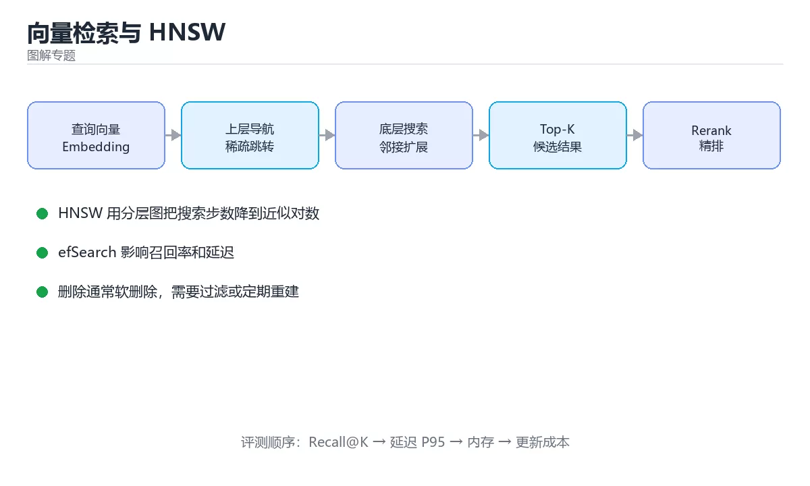

# 图解向量检索与 HNSW 索引



> 内容更新时间：2026-10-03 · 学习阶段：进阶 · 预计用时：20 分钟

## 学习目标

- 能用自己的话解释「图解向量检索与 HNSW 索引」解决了什么问题，而不是只背术语。
- 能说清 「向量检索」、「HNSW」、「ANN」、「召回率」 之间的关系，并分别举出一个例子。
- 能把本课知识放回「图解专题」的知识体系，说明它和相邻主题的边界。
- 能完成本课练习，并用验收标准检查自己的结果。

> 一句话摘要：暴力检索的瓶颈、HNSW 分层图、三个关键参数与 Recall 评估。

## 前置知识

- 先完成上一课《图解一致性哈希与数据分片》；如果已经掌握，可以直接用本课练习自测。
- 本课阶段：进阶。建议先掌握同一分类的基础课程，并能独立运行正文中的最小示例。
- 开始前先复习：向量检索、HNSW、ANN。
- 如果某一步看不懂，先记录具体卡点，完成练习后再回头读一遍。


## 一句话说清

向量检索要解决「在几百万条向量里找最相似的几条」。
暴力比对太慢，于是用近似最近邻（ANN）索引换取速度，**HNSW 是其中最常用的图索引**。

## 为什么不能暴力比对

```text
暴力检索（Flat）
  查询向量 q
      │
      ├─► 与向量 1 算距离
      ├─► 与向量 2 算距离
      ├─► …（全部 N 条）
      └─► 排序取前 K

  100 万条 × 768 维 → 每次查询约 7.7 亿次乘法
  延迟：几百毫秒到数秒，无法支撑在线检索
```

## HNSW 的分层图结构

```text
第 2 层（最稀疏，用于快速跳转）
        A ─────────────── D
        │                 │
第 1 层（中等密度）
    A ── B ── C ── D ── E
    │    │         │    │
第 0 层（全部节点，密集连接）
  A─B─C─D─E─F─G─H─I─J─K─L

检索过程：
  ① 从最上层入口点开始，贪心走向更近的邻居
  ② 逐层下降，缩小搜索范围
  ③ 在最底层做小范围精细搜索，返回 Top-K
```

| 特点 | 说明 |
| --- | --- |
| 分层 | 上层稀疏负责「跳远」，下层密集负责「精找」 |
| 贪心搜索 | 每层只走「距离更近」的邻居 |
| 近似结果 | 不保证 100% 精确，但召回率可调到很高 |

## 三个关键参数

| 参数 | 含义 | 调大后 | 调小后 |
| --- | --- | --- | --- |
| `M` | 每个节点的连接数 | 召回率更高、内存更大 | 更快、召回率下降 |
| `efConstruction` | 建索引时的搜索宽度 | 索引质量更好、建库更慢 | 建库快、质量下降 |
| `efSearch` | 查询时的搜索宽度 | 召回率更高、延迟更大 | 更快、召回率下降 |

```text
调参的直觉
  · 离线建库慢一点没关系 → efConstruction 可以大
  · 在线查询延迟敏感 → efSearch 是主要旋钮
  · 内存紧张 → 降低 M（典型 16~64）
```

## 与其他索引的对比

| 索引 | 原理 | 优点 | 缺点 |
| --- | --- | --- | --- |
| Flat | 暴力比对 | 100% 精确 | 慢 |
| IVF | 先聚类再搜少数簇 | 内存小、速度快 | 需训练，边界样本易漏 |
| IVF-PQ | 聚类 + 乘积量化压缩 | 内存极省 | 精度损失明显 |
| HNSW | 分层图 | 召回率高、延迟低 | 内存占用大 |
| HNSW+PQ | 图 + 量化 | 折中 | 实现复杂 |

```text
选型建议
  · 数据量 < 10 万且要精确 → Flat 也可接受
  · 数据量大、内存充足、要低延迟 → HNSW
  · 数据量极大、内存紧张 → IVF-PQ
```

## 检索质量怎么衡量

```text
Recall@K：在前 K 条结果中，真正相似的有几条

  精确检索结果（基准）        ANN 检索结果
  {A, B, C, D, E}            {A, X, C, D, Y}
  Recall@5 = 3 / 5 = 60%

工程做法：
  ① 用 Flat 跑一批查询作为基准答案
  ② 用 ANN 跑同样查询，计算 Recall@K
  ③ 调整 efSearch，找到「召回率达标且延迟可接受」的点
```

| 指标 | 关注点 |
| --- | --- |
| Recall@K | 检索质量 |
| P95 延迟 | 用户体验 |
| 内存占用 | 成本 |
| 建库时间 | 迭代速度 |

## 向量检索在 RAG 中的位置

```text
用户问题
   │
   ▼ 向量化
查询向量 ──► 向量索引（HNSW）──► Top-N 候选片段
                                     │
                                     ▼
                              重排序 Rerank
                                     │
                                     ▼
                              取 Top-3~5 进提示

注意：向量召回负责「不漏」，Rerank 负责「更准」
两者分工不同，不能互相替代
```

## 四个常见工程问题

| 问题 | 原因 | 对策 |
| --- | --- | --- |
| 召回率低 | `efSearch` 太小或分块不当 | 调大参数、改分块 |
| 延迟高 | 索引在内存外或并发过高 | 预热、加机器、降维度 |
| 内存爆掉 | HNSW 图本身占内存 | 用 PQ 量化或换 IVF |
| 删除后仍被检索到 | 多数索引是「软删除」 | 定期重建或做过滤 |

```text
更新与删除的处理方式
  · 追加新向量并给旧向量打失效标记
  · 查询时按元数据过滤掉失效项
  · 定期重建索引，回收空间
```

## 新手最容易踩的八个坑

| 坑 | 现象 | 正确做法 |
| --- | --- | --- |
| 以为 ANN 一定精确 | 结果与暴力检索不一致 | 用 Recall@K 量化 |
| `efSearch` 用默认值 | 召回率不达标 | 按基准测试调整 |
| 只调参数不改分块 | 召回的语义不完整 | 分块与检索一起调 |
| 忽略内存预算 | 上线即 OOM | 先估内存再选索引类型 |
| 不预热索引 | 首次查询很慢 | 启动时预热 |
| 删除后不重建 | 空间不回收、结果脏 | 定期重建 |
| 维度不匹配 | 报错或结果乱 | 索引与查询同模型同维度 |
| 只看平均延迟 | 长尾用户排队 | 看 P95 与 P99 |

## 本课小结
- 向量检索用**近似换速度**，HNSW 的分层图是当前最常用的方案。
- 三个旋钮记清楚：**M 决定内存与质量、efConstruction 决定建库质量、efSearch 决定查询质量**。
- RAG 里向量召回负责不漏，Rerank 负责更准，两者缺一不可。


## 补充：距离度量、过滤检索与量化压缩

### 三种距离度量的选择

| 度量 | 公式直觉 | 适用 | 注意 |
| --- | --- | --- | --- |
| 余弦相似度 | 只看方向，忽略长度 | 文本、语义检索 | 向量需归一化或引擎支持 |
| 欧氏距离 L2 | 看绝对位置 | 图像特征、坐标 | 量纲差异大时需标准化 |
| 内积 IP | 兼顾方向与长度 | 推荐系统（长度代表热度） | 未归一化时结果偏向长向量 |

```text
重要关系：向量归一化后
  余弦相似度 ≡ 内积（cos = a·b / (|a||b|)，|a|=|b|=1 时分母为 1）
  余弦相似度与 L2 距离单调相关

实践建议
  · 文本检索：做 L2 归一化后统一用内积，实现最快
  · 图像检索：先标准化特征再比较，注意引擎默认度量
```

### 过滤检索：先过滤还是后过滤

```text
Post-filtering（先检索后过滤）
  检索 Top-100 → 按元数据过滤 → 可能只剩 3 条
  问题：想取 10 条却不够，需要放大 K 重试

Pre-filtering（先过滤后检索）
  先按元数据筛出候选集 → 在候选集内做 ANN
  问题：候选集太小会退化为暴力检索

混合策略（推荐）
  · 过滤条件选择性高（剩余 <5%）→ 走暴力检索更稳
  · 选择性低（剩余 >30%）→ 用 ANN + 过滤
```

| 场景 | 建议 |
| --- | --- |
| 按租户隔离检索 | 元数据过滤 + 分区索引 |
| 时间范围检索 | 按时间分索引，缩小检索范围 |
| 类别筛选 | 每类单独索引或先过滤 |

### 量化压缩：PQ 与 SQ

```text
标量量化（SQ）
  每个维度独立压缩：FP32 → INT8
  显存降到 1/4，精度损失小，实现简单

乘积量化（PQ）
  把向量切成 m 段，每段用聚类中心的编号表示
  例：128 维切成 16 段，每段 8 维、256 个中心
      → 每向量只需 16 字节（原始 FP32 需 512 字节）
  显存大幅下降，但需要训练码本，召回率有损失

IVF-PQ：先聚类分桶，再在桶内用 PQ 比较，兼顾速度与内存
```

| 方案 | 显存 | 召回率 | 建索引时间 | 适用 |
| --- | --- | --- | --- | --- |
| Flat | 100% | 精确 | 无 | 小规模、需精确 |
| HNSW | 100%+（图开销） | 高 | 中 | 低延迟、内存充足 |
| IVF-PQ | 5%~10% | 中 | 长（需训练） | 亿级、内存紧张 |

### 更新与删除的处理

```text
图索引难以就地删除（删节点会破坏连通性），常见做法：
  · 软删除：标记失效，查询时过滤
  · 定期重建：回收空间并把有效向量重新建图
  · 增量 + 合并：新向量进小索引，达到阈值后合并进主索引

更新 = 删除旧向量 + 插入新向量（多数引擎内部如此实现）
```

### 调参与评估的闭环

```text
① 用 Flat 跑一批查询，得到精确答案作为基准
② 调 efSearch（HNSW）或 nprobe（IVF），记录 Recall@K 与 P95 延迟
③ 画「召回率-延迟」曲线，选满足业务要求的拐点
④ 上线后继续监控：召回率漂移、延迟分位数、内存占用
```

| 参数 | 影响 |
| --- | --- |
| HNSW `M` | 图的连通度：越大召回越高、内存越大 |
| HNSW `efSearch` | 查询搜索宽度：越大越准越慢 |
| IVF `nprobe` | 搜索的桶数：越多越准越慢 |

### 自查清单

- [ ] 明确索引使用的距离度量，并与模型训练时一致
- [ ] 向量已按度量要求做归一化或标准化
- [ ] 过滤检索有明确的先过滤/后过滤策略
- [ ] 内存不足时评估过 PQ 或 IVF-PQ
- [ ] 有「召回率-延迟」曲线，而不是只调一个参数

## 动手练习


> 本课练习重点：围绕「向量检索、HNSW、ANN」完成复述、实验和交付，每个结果都要能被别人检查。

先不看原图手绘流程，再标出状态变化，最后用自己的话解释关键一步。

### 练习 1：建立心智模型（10 分钟）

合上教程，用 3～5 句话回答：

1. 「图解向量检索与 HNSW 索引」解决了什么问题？
2. 如果没有它，会出现什么具体后果？
3. 它和「HNSW」是什么关系？

**验收标准**：至少出现一个本课关键词，并写出一个反例、边界条件或失效场景。

### 练习 2：做一次可控实验（20 分钟）

从正文中选一个最小示例，完成以下操作：

1. 先预测修改一个参数、输入或步骤后的结果。
2. 再实际执行或逐步推演，记录真实结果。
3. 如果结果与预测不同，写出差异原因。

**验收标准**：留下「原例 → 改动 → 预测 → 结果 → 原因」五步记录。

### 练习 3：交付一个小结果（30 分钟）

不看原图手绘一遍流程，再用自己的话指出图中的关键状态变化。

任务要求：

- 结果必须能被别人检查，不能只写“我已经理解了”。
- 至少覆盖「向量检索」和「HNSW」两个关键词。
- 写出 1 个仍然不确定的问题，以及下一步如何验证。

> 提示：时间有限时优先做练习 1 和练习 2；练习 3 可以拆成两次完成。


## 考点精讲：把测验题还原成判断过程

本课有 4 个判断点。先自己作答，再看「判断依据」；如果结论正确但理由不完整，回到正文对应章节补足概念。

### 考点 1：HNSW 为什么能加速向量检索？

- **正确判断**：用分层图从稀疏上层快速跳转
- **判断依据**：分层结构让搜索步数大幅减少，用近似换速度。选项一、三、四都不是 HNSW 的机制。正确项「用分层图从稀疏上层快速跳转」是该问题的规范说法，换成其他表述都会丢失条件。错误项「它压缩了向量维度」适用于其他场景，但与本题的前提不匹配。错误项「它只检索部分维度」忽略了题目中的限制条件，因此不成立。错误项「它把向量转成标量」属于相邻主题的说法，范围与本题要求不一致。把题干「HNSW 为什么能加速向量检索？」放回《图解向量检索与 HNSW 索引》的「暴力检索的瓶颈、HNSW 分层图、三个关键参数与 Recall 评估」语境，逐项对照定义与边界条件，就能排除其余说法。
- **迁移检查**：遮住选项，只根据定义复述一次答案，再回来看哪个选项与复述一致。

### 考点 2：在线查询延迟偏高时，优先调整哪个参数？

- **正确判断**：efSearch
- **判断依据**：efSearch 是查询期旋钮，直接决定搜索宽度与延迟。选项二与选项三主要影响索引质量与内存。选项四由模型决定，不能随意改。正确项「efSearch」正面回答了题目所问，符合课程给出的定义与适用范围。错误项「M」把不同概念混在一起，缺少题干限定的前提。错误项「efConstruction」与课程给出的定义相冲突，不能回答题目所问。错误项「索引维度」只看到了表面现象，没有解释题干真正考查的机制。把题干「在线查询延迟偏高时，优先调整哪个参数？」放回《图解向量检索与 HNSW 索引》的「暴力检索的瓶颈、HNSW 分层图、三个关键参数与 Recall 评估」语境，逐项对照定义与边界条件，就能排除其余说法。
- **迁移检查**：如果给某个错误选项去掉一个限定词，它会不会变成正确？说明理由。

### 考点 3：Recall@K 衡量的是？

- **正确判断**：ANN 结果与精确结果的重合比例，即检索质量
- **判断依据**：用暴力检索的结果作为基准，比较 ANN 命中多少。选项一、三、四分别对应延迟、内存与建库时间。正确项「ANN 结果与精确结果的重合比例，即检索质量」正面回答了题目所问，符合课程给出的定义与适用范围。错误项「检索速度」属于相邻主题的说法，范围与本题要求不一致。错误项「内存占用」与课程给出的定义相冲突，不能回答题目所问。错误项「索引构建时间（仅部分场景成立）」只看到了表面现象，没有解释题干真正考查的机制。把题干「Recall@K 衡量的是？」放回《图解向量检索与 HNSW 索引》的「暴力检索的瓶颈、HNSW 分层图、三个关键参数与 Recall 评估」语境，逐项对照定义与边界条件，就能排除其余说法。
- **迁移检查**：把题干里的一个条件换成边界值，原来的结论还成立吗？写出判断过程。

### 考点 4：向量索引里删除一条数据后，常见现象是？

- **正确判断**：多为软删除，仍可能被检索到
- **判断依据**：图索引结构难以即时删除节点，通常打失效标记并在查询时过滤。选项一、三、四与常见实现不符。正确项「多为软删除，仍可能被检索到」描述正确，能够解释题干场景中的现象与结果。错误项「立刻彻底消失」与课程给出的定义相冲突，不能回答题目所问。错误项「索引自动重建」在边界或失败路径上会得出错误结果。错误项「召回率自动提升」适用于其他场景，但与本题的前提不匹配。把题干「向量索引里删除一条数据后，常见现象是？」放回《图解向量检索与 HNSW 索引》的「暴力检索的瓶颈、HNSW 分层图、三个关键参数与 Recall 评估」语境，逐项对照定义与边界条件，就能排除其余说法。
- **迁移检查**：把题干里的一个条件换成边界值，原来的结论还成立吗？写出判断过程。

## 本课复习清单

离开本课前，逐项确认：

- [ ] 不看解析，能说出「HNSW 为什么能加速向量检索？」的判断依据。
- [ ] 不看解析，能说出「在线查询延迟偏高时，优先调整哪个参数？」的判断依据。
- [ ] 不看解析，能说出「Recall@K 衡量的是？」的判断依据。
- [ ] 不看解析，能说出「向量索引里删除一条数据后，常见现象是？」的判断依据。
- [ ] 至少运行一次本课示例，记录输入、输出和一个边界情况。
- [ ] 把本课最容易混淆的两个概念写成一句话对照。

| 复盘项 | 记录 |
| --- | --- |
| 已经能独立解释的考点 |  |
| 仍然说不清的概念 |  |
| 下一步验证动作 |  |

## English Overview

**Title:** Vector Search and HNSW

**Summary:** Brute force limits, HNSW layers, key parameters and recall.

**Category:** Visual Guide  
**Level:** 进阶  
**Key terms:** 向量检索, HNSW, ANN, 召回率, RAG

> The full tutorial is written in Chinese. This bilingual overview helps English readers identify the topic, scope and key terms before studying the detailed examples.

## 内容元数据

- 内容版本：v2.0
- 最后更新：2026-10-03
- 学习阶段：进阶
- 适用环境：通用图解与系统原理
- 内容来源：内置结构化课程与工程实践整理
- 相关主题：向量检索、HNSW、ANN、召回率、RAG
- 质量版本：P0 测验标准 + P1 覆盖扩展 + P2 体验补全


## 最小可运行示例

下面示例用于验证「图解向量检索与 HNSW 索引」的最小输入、处理和输出。先原样运行，再只修改一个值：

```python
steps = ["input", "process", "output"]
print(" -> ".join(steps))
```

## 预期输出

```text
input -> process -> output
```

## 验证步骤

1. 记录运行环境、命令和真实输出。
2. 修改一个输入，先写预测再运行。
3. 制造一次错误输入，记录错误信息与修复方式。
4. 把结论写回本课笔记或测试用例。


## 参考资料与复核

- 最后复核：2026-10-04
- 下次复核：2027-04-04
- 复核范围：版本兼容、API 行为、安全建议与工程实践
- 来源性质：官方文档与标准；本课正文为离线教学重组，不复制原文

| 参考资料 | 本课用途 |
| --- | --- |
| [RFC Editor](https://www.rfc-editor.org/) | 协议与状态机 |
| [MDN Web Docs](https://developer.mozilla.org/) | 浏览器与网络流程 |

> 本课主题：暴力检索的瓶颈、HNSW 分层图、三个关键参数与 Recall 评估。

> App 完全离线展示文字链接，不会自动联网；需要延伸阅读时可复制链接到浏览器。

