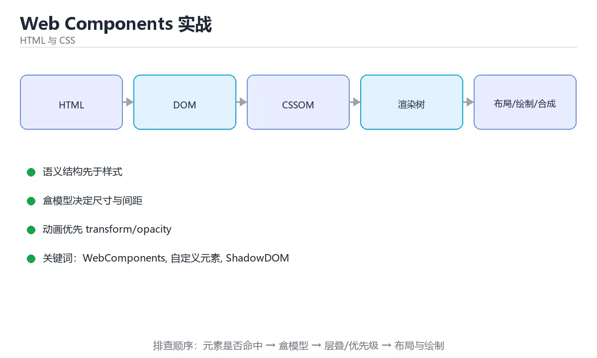

# Web Components 实战



> 内容更新时间：2026-10-03 · 学习阶段：高级 · 预计用时：18 分钟

## 学习目标

- 能用自己的话解释「Web Components 实战」解决了什么问题，而不是只背术语。
- 能说清 「WebComponents」、「自定义元素」、「ShadowDOM」、「slot」 之间的关系，并分别举出一个例子。
- 能把本课知识放回「HTML 与 CSS」的知识体系，说明它和相邻主题的边界。
- 能完成本课练习，并用验收标准检查自己的结果。

> 一句话摘要：自定义元素生命周期、Shadow DOM 隔离与事件穿透。

## 前置知识

- 先完成上一课《PWA 与离线能力》；如果已经掌握，可以直接用本课练习自测。
- 本课阶段：高级。建议具备同一方向的完整基础，能阅读较长的代码、配置或系统设计说明。
- 开始前先复习：WebComponents、自定义元素、ShadowDOM。
- 如果某一步看不懂，先记录具体卡点，完成练习后再回头读一遍。


## 四大组成速查

| 技术 | 作用 |
| --- | --- |
| 自定义元素 | 通过 `customElements.define` 注册新标签 |
| Shadow DOM | 封装内部结构与样式，隔离外部 CSS |
| `<template>` | 声明可复用的 DOM 片段，克隆后使用 |
| `<slot>` | 允许外部插入内容（内容分发） |

核心价值：**框架无关、样式隔离、可长期维护**——适合做设计系统与跨项目复用的基础组件。

## 自定义元素生命周期

| 回调 | 触发时机 | 典型用途 |
| --- | --- | --- |
| `constructor` | 元素创建时 | 初始化状态，禁止访问子节点 |
| `connectedCallback` | 插入文档 | 渲染、绑定事件、发起请求 |
| `disconnectedCallback` | 从文档移除 | 解绑事件、清理定时器 |
| `attributeChangedCallback` | 监听属性变化 | 同步属性到渲染 |
| `adoptedCallback` | 移动到新文档 | 少见 |

属性监听需要静态声明：`static get observedAttributes()`。

```javascript
// lesson-card.js：带 Shadow DOM 与属性监听的卡片组件
const template = document.createElement("template");
template.innerHTML = `
  <style>
    :host {
      display: block;
      --card-radius: var(--radius-md, 8px);
    }
    :host([hidden]) { display: none; }
    .card {
      background: var(--color-surface, #fff);
      border-radius: var(--card-radius);
      padding: 16px;
      transition: transform 160ms ease;
    }
    .card:hover { transform: translateY(-2px); }
    .title { font-weight: 600; margin: 0 0 4px; }
    .meta { color: #64748b; font-size: 0.875rem; margin: 0; }
  </style>
  <article class="card" part="card">
    <h3 class="title"><slot name="title">未命名课程</slot></h3>
    <p class="meta"><slot name="meta"></slot></p>
  </article>
`;

class LessonCard extends HTMLElement {
  static get observedAttributes() {
    return ["minutes", "disabled"];
  }

  constructor() {
    super();
    this.attachShadow({ mode: "open" });        // open 便于调试，closed 更严格
    this.shadowRoot.appendChild(template.content.cloneNode(true));
  }

  connectedCallback() {
    if (!this.hasAttribute("role")) this.setAttribute("role", "listitem");
    this.addEventListener("click", this.#onClick);
  }

  disconnectedCallback() {
    // 必须解绑，避免内存泄漏
    this.removeEventListener("click", this.#onClick);
  }

  attributeChangedCallback(name, oldValue, newValue) {
    if (oldValue === newValue) return;
    if (name === "minutes") {
      this.shadowRoot.querySelector(".meta").textContent = `${newValue} 分钟`;
    }
    if (name === "disabled") {
      this.setAttribute("aria-disabled", String(newValue !== null));
    }
  }

  #onClick = () => {
    if (this.hasAttribute("disabled")) return;
    this.dispatchEvent(
      new CustomEvent("lesson-open", {
        bubbles: true,      // 允许父级监听
        composed: true,     // 穿透 Shadow 边界
        detail: { id: this.getAttribute("lesson-id") },
      }),
    );
  };
}

customElements.define("lesson-card", LessonCard);
```

```html
<!-- 使用方：外部样式只能通过 CSS 变量与 ::part 影响内部 -->
<lesson-card lesson-id="py-1" minutes="12">
  <span slot="title">Python 基础语法</span>
  <span slot="meta">入门</span>
</lesson-card>

<script>
  document.addEventListener("lesson-open", (event) => {
    console.log("打开课程", event.detail.id);
  });
</script>
```

## 样式隔离与定制速查

| 需求 | 手段 |
| --- | --- |
| 外部控制主题 | CSS 自定义属性（变量可穿透 Shadow） |
| 暴露指定内部结构给外部改样式 | `part="name"` + `::part(name)` |
| 插槽内容样式 | `::slotted(selector)` |
| 组件自身样式 | `:host`、`:host([attr])` |
| 全局样式覆盖 | 默认隔离，需用变量或 `::part` 显式开放 |

## 与框架的关系

| 维度 | Web Components | React / Vue 组件 |
| --- | --- | --- |
| 复用范围 | 跨框架、跨项目 | 同框架内 |
| 样式隔离 | Shadow DOM 原生隔离 | 依赖工具与约定 |
| 数据传递 | 属性与事件 | props 与状态 |
| 复杂度 | 需自己处理渲染与状态 | 框架提供响应式 |
| 适用 | 设计系统、嵌入式组件 | 业务应用界面 |

经验：**设计系统的底层组件适合做成 Web Components，业务页面继续用框架。**

## 常见错误对照表

| 容易踩的做法 | 实际现象 | 原因与正确做法 |
| --- | --- | --- |
| 在 `constructor` 里访问子节点或属性 | 报错或取不到值 | 放到 `connectedCallback` |
| 元素名不用连字符 | 注册失败 | 必须形如 `my-component` |
| 重复注册同名元素 | 抛错 | 注册前判断或集中注册 |
| `disconnectedCallback` 不解绑事件 | 内存泄漏 | 成对绑定与解绑 |
| 直接给 Shadow 内部元素加外部类名 | 样式不生效 | 用 CSS 变量或 `::part` |
| 事件不设 `composed: true` | 跨 Shadow 边界收不到 | 明确是否需要穿透 |
| 在属性里传复杂对象 | 只能传字符串 | 用属性传 JSON 或直接设 JS 属性 |
| 用 `innerHTML` 插用户输入 | XSS 风险 | 用 `textContent` 或转义 |

## 自测清单

- [ ] 能注册自定义元素并实现四个生命周期回调。
- [ ] 用 Shadow DOM 隔离样式，并开放变量与 `::part` 供定制。
- [ ] 事件按需设置 `bubbles` 与 `composed`。
- [ ] 断开连接时清理事件与定时器。
- [ ] 能判断何时用 Web Components、何时用框架组件。

## 动手练习

<!-- practice-diversified:v1 -->

> 本课练习重点：围绕「WebComponents、自定义元素、ShadowDOM」完成复述、实验和交付，每个结果都要能被别人检查。

先写最小语义结构，再调整布局与样式，最后检查键盘、窄屏和对比度。

### 练习 1：建立心智模型（10 分钟）

合上教程，用 3～5 句话回答：

1. 「Web Components 实战」解决了什么问题？
2. 如果没有它，会出现什么具体后果？
3. 它和「自定义元素」是什么关系？

**验收标准**：至少出现一个本课关键词，并写出一个反例、边界条件或失效场景。

### 练习 2：做一次可控实验（20 分钟）

从正文中选一个最小示例，完成以下操作：

1. 先预测修改一个参数、输入或步骤后的结果。
2. 再实际执行或逐步推演，记录真实结果。
3. 如果结果与预测不同，写出差异原因。

**验收标准**：留下「原例 → 改动 → 预测 → 结果 → 原因」五步记录。

### 练习 3：交付一个小结果（30 分钟）

做一个只有标题、卡片和按钮的最小页面，并用浏览器设备模式检查窄屏。

任务要求：

- 结果必须能被别人检查，不能只写“我已经理解了”。
- 至少覆盖「WebComponents」和「自定义元素」两个关键词。
- 写出 1 个仍然不确定的问题，以及下一步如何验证。

> 提示：时间有限时优先做练习 1 和练习 2；练习 3 可以拆成两次完成。

## 本课小结

- 核心问题：「Web Components 实战」不是孤立术语，而是在「HTML 与 CSS」中解决一类具体问题。
- 关键关系：先分清「WebComponents」与「自定义元素」的职责，再理解「ShadowDOM」的适用边界。
- 判断标准：能解释正常场景、边界条件和失败场景，才算真正掌握。
- 下一步：完成练习后，用自己的话写下 3 条要点，再去做本课测验。

<!-- scaffold:v1 -->

<!-- project-verification:v1 -->

## 验证命令与预期输出

项目代码不能只看“能编译”，还要能按固定命令复现结果。下表给出最低验证集：

| 阶段 | 命令 | 预期输出 |
| --- | --- | --- |
| 安装依赖 | `python -m pip install -r requirements.txt` | 依赖安装完成，没有版本冲突 |
| 语法检查 | `python -m compileall .` | 所有模块编译通过 |
| 运行测试 | `python -m pytest -q` | 测试全部通过，失败用例数为 0 |
| 启动示例 | `python main.py` | 服务启动并输出监听地址 |

### 验收证据

- [ ] 保存依赖安装和启动命令的完整输出。
- [ ] 至少运行 3 条测试，其中包含一条非法输入或失败路径。
- [ ] 重复执行同一操作两次，确认没有重复写入或副作用。
- [ ] 记录一次失败状态码、错误日志和恢复步骤。
- [ ] 在 README 中写明环境版本、启动方式和回滚方式。

### 回归与回滚

1. 先在一个可丢弃的目录或临时数据库执行，避免污染真实数据。
2. 修改一处逻辑后重跑全部验证命令，确认没有回归。
3. 若失败，回滚到上一个可运行版本并保留失败日志。
4. 定位原因后补一条自动化测试，再重新执行发布流程。
5. 把教训写入项目复盘或本课笔记，形成下一次的检查项。

<!-- p2-enrichment:v1 -->

## English Overview

**Title:** Web Components

**Summary:** Custom elements, Shadow DOM encapsulation and events.

**Category:** HTML & CSS  
**Level:** 高级  
**Key terms:** WebComponents, 自定义元素, ShadowDOM, slot, 设计系统

> The full tutorial is written in Chinese. This bilingual overview helps English readers identify the topic, scope and key terms before studying the detailed examples.

## 内容元数据

- 内容版本：v2.0
- 最后更新：2026-10-03
- 学习阶段：高级
- 适用环境：现代浏览器（Chrome/Firefox/Safari）
- 内容来源：内置结构化课程与工程实践整理
- 相关主题：WebComponents、自定义元素、ShadowDOM、slot、设计系统
- 质量版本：P0 测验标准 + P1 覆盖扩展 + P2 体验补全

## 项目专属规格：Web Components 实战

### 核心场景

自定义元素生命周期、Shadow DOM 隔离与事件穿透。 项目目标是把「WebComponents、自定义元素、ShadowDOM、slot、设计系统」落实为可运行、可测试、可回滚的交付物。

### 架构与数据流

```text
用户/输入 → 接口或命令 → 领域逻辑 → 存储/外部依赖 → 输出与监控
                         ↘ 失败分类 → 重试/补偿 → 回滚
```

### 最小数据模型

| 对象 | 关键字段 | 约束 |
| --- | --- | --- |
| 输入实体 | WebComponents、时间、来源 | 必填校验、长度限制、幂等键 |
| 任务实体 | 状态、优先级、创建时间 | 状态迁移合法、不可重复执行 |
| 结果实体 | 输出、错误码、耗时 | 可序列化、错误可解释 |
| 审计记录 | 操作者、动作、结果、时间 | 不可篡改、可查询、脱敏 |

### 验收场景

1. 正常路径：最小输入得到预期输出，并留下日志与指标。
2. 边界路径：空值、最大值、重复数据和超长内容得到明确处理。
3. 失败路径：依赖超时或不可用时能快速失败、重试或降级。
4. 幂等路径：同一请求执行两次不会产生重复副作用。
5. 回滚路径：回滚后数据一致，且能说明恢复时间和影响范围。

<!-- project-delivery:v1 -->

## 项目交付物

### 建议仓库结构

```text
src/
tests/
docs/
README.md
```

### 测试矩阵

| 层级 | 覆盖内容 | 最低数量 | 通过标准 |
| --- | --- | ---: | --- |
| 单元测试 | 领域规则、边界和错误分类 | 8 | 正常、边界、失败路径全部通过 |
| 集成测试 | 数据库、网络、文件或平台边界 | 3 | 使用真实边界且可重复运行 |
| 端到端测试 | 核心用户路径 | 1 | 从输入到输出完整跑通 |
| 手动验收 | 文档中列出的 5 个场景 | 5 | 有命令、输出和结论记录 |

### 验收数据

```json
{
  "project": "web_components",
  "input": {"case": "normal", "value": 5},
  "expected": {"ok": true, "result": 5},
  "failure_case": {"value": -1, "error": "validation_error"},
  "idempotency_key": "demo-001"
}
```

### 复盘模板

| 问题 | 记录 |
| --- | --- |
| 原目标是什么？ | 用一句话描述可验收目标 |
| 实际发生了什么？ | 时间线、指标和关键日志 |
| 哪个假设被推翻？ | 根因与促成因素 |
| 如何回滚？ | 步骤、耗时和数据校验 |
| 下一步做什么？ | 负责人、期限和验证方式 |

> 项目验收围绕「WebComponents、自定义元素、ShadowDOM」：至少完成一次正常路径、一次边界输入、一次失败恢复和一次幂等检查。

<!-- p2-references:v1 -->

## 参考资料与复核

- 最后复核：2026-10-04
- 下次复核：2027-04-04
- 复核范围：版本兼容、API 行为、安全建议与工程实践
- 来源性质：官方文档与标准；本课正文为离线教学重组，不复制原文

| 参考资料 | 本课用途 |
| --- | --- |
| [MDN Web Docs](https://developer.mozilla.org/docs/Web) | HTML、CSS 与浏览器行为 |
| [W3C Standards](https://www.w3.org/TR/) | Web 标准与可访问性规范 |

> 本课主题：自定义元素生命周期、Shadow DOM 隔离与事件穿透。

> App 完全离线展示文字链接，不会自动联网；需要延伸阅读时可复制链接到浏览器。

