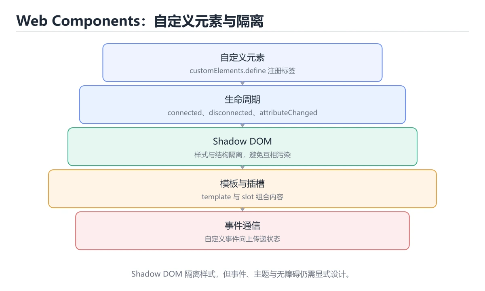

# Web Components 实战




> 内容更新时间：2026-10-06 · 学习阶段：高级 · 预计用时：60 分钟

## 学习目标

- 能用自己的话解释Web Components 实战解决了什么问题，而不是只背术语。
- 能说清 「WebComponents」、「自定义元素」、「ShadowDOM」、「slot」 之间的关系，并分别举出一个例子。
- 能把 WebComponents 放回「Web Components 实战」的知识体系，说明它和 自定义元素 的边界。
- 能完成本课练习，并用验收标准检查自己的结果。

> 一句话摘要：自定义元素生命周期、Shadow DOM 隔离与事件穿透。

## 前置知识

- 先完成上一课《PWA 与离线能力》；如果已经掌握，可以直接用本课练习自测。
- 开始前先复习：WebComponents、自定义元素、ShadowDOM。
- 卡在 WebComponents 上时不要跳过：把输入、预期和实际输出写成三行，再回头读正文。

## 四大组成速查

| 技术 | 作用 |
| --- | --- |
| 自定义元素 | 通过 `customElements.define` 注册新标签 |
| Shadow DOM | 封装内部结构与样式，隔离外部 CSS |
| `<template>` | 声明可复用的 DOM 片段，克隆后使用 |
| `<slot>` | 允许外部插入内容（内容分发） |

核心价值：**框架无关、样式隔离、可长期维护**——适合做设计系统与跨项目复用的基础组件。

## 自定义元素生命周期

| 回调 | 触发时机 | 典型用途 |
| --- | --- | --- |
| `constructor` | 元素创建时 | 初始化状态，禁止访问子节点 |
| `connectedCallback` | 插入文档 | 渲染、绑定事件、发起请求 |
| `disconnectedCallback` | 从文档移除 | 解绑事件、清理定时器 |
| `attributeChangedCallback` | 监听属性变化 | 同步属性到渲染 |
| `adoptedCallback` | 移动到新文档 | 少见 |

属性监听需要静态声明：`static get observedAttributes()`。

```javascript
// lesson-card.js：带 Shadow DOM 与属性监听的卡片组件
const template = document.createElement("template");
template.innerHTML = `
  <style>
    :host {
      display: block;
      --card-radius: var(--radius-md, 8px);
    }
    :host([hidden]) { display: none; }
    .card {
      background: var(--color-surface, #fff);
      border-radius: var(--card-radius);
      padding: 16px;
      transition: transform 160ms ease;
    }
    .card:hover { transform: translateY(-2px); }
    .title { font-weight: 600; margin: 0 0 4px; }
    .meta { color: #64748b; font-size: 0.875rem; margin: 0; }
  </style>
  <article class="card" part="card">
    <h3 class="title"><slot name="title">未命名课程</slot></h3>
    <p class="meta"><slot name="meta"></slot></p>
  </article>
`;

class LessonCard extends HTMLElement {
  static get observedAttributes() {
    return ["minutes", "disabled"];
  }

  constructor() {
    super();
    this.attachShadow({ mode: "open" });        // open 便于调试，closed 更严格
    this.shadowRoot.appendChild(template.content.cloneNode(true));
  }

  connectedCallback() {
    if (!this.hasAttribute("role")) this.setAttribute("role", "listitem");
    this.addEventListener("click", this.#onClick);
  }

  disconnectedCallback() {
    // 必须解绑，避免内存泄漏
    this.removeEventListener("click", this.#onClick);
  }

  attributeChangedCallback(name, oldValue, newValue) {
    if (oldValue === newValue) return;
    if (name === "minutes") {
      this.shadowRoot.querySelector(".meta").textContent = `${newValue} 分钟`;
    }
    if (name === "disabled") {
      this.setAttribute("aria-disabled", String(newValue !== null));
    }
  }

  #onClick = () => {
    if (this.hasAttribute("disabled")) return;
    this.dispatchEvent(
      new CustomEvent("lesson-open", {
        bubbles: true,      // 允许父级监听
        composed: true,     // 穿透 Shadow 边界
        detail: { id: this.getAttribute("lesson-id") },
      }),
    );
  };
}

customElements.define("lesson-card", LessonCard);
```

```html
<!-- 使用方：外部样式只能通过 CSS 变量与 ::part 影响内部 -->
<lesson-card lesson-id="py-1" minutes="12">
  <span slot="title">Python 基础语法</span>
  <span slot="meta">入门</span>
</lesson-card>

<script>
  document.addEventListener("lesson-open", (event) => {
    console.log("打开课程", event.detail.id);
  });
</script>
```

## 样式隔离与定制速查

| 需求 | 手段 |
| --- | --- |
| 外部控制主题 | CSS 自定义属性（变量可穿透 Shadow） |
| 暴露指定内部结构给外部改样式 | `part="name"` + `::part(name)` |
| 插槽内容样式 | `::slotted(selector)` |
| 组件自身样式 | `:host`、`:host([attr])` |
| 全局样式覆盖 | 默认隔离，需用变量或 `::part` 显式开放 |

## 与框架的关系

| 维度 | Web Components | React / Vue 组件 |
| --- | --- | --- |
| 复用范围 | 跨框架、跨项目 | 同框架内 |
| 样式隔离 | Shadow DOM 原生隔离 | 依赖工具与约定 |
| 数据传递 | 属性与事件 | props 与状态 |
| 复杂度 | 需自己处理渲染与状态 | 框架提供响应式 |
| 适用 | 设计系统、嵌入式组件 | 业务应用界面 |

经验：**设计系统的底层组件适合做成 Web Components，业务页面继续用框架。**

## 常见错误与排查

| 容易踩的做法 | 实际现象 | 原因与正确做法 |
| --- | --- | --- |
| 在 `constructor` 里访问子节点或属性 | 报错或取不到值 | 放到 `connectedCallback` |
| 元素名不用连字符 | 注册失败 | 必须形如 `my-component` |
| 重复注册同名元素 | 抛错 | 注册前判断或集中注册 |
| `disconnectedCallback` 不解绑事件 | 内存泄漏 | 成对绑定与解绑 |
| 直接给 Shadow 内部元素加外部类名 | 样式不生效 | 用 CSS 变量或 `::part` |
| 事件不设 `composed: true` | 跨 Shadow 边界收不到 | 明确是否需要穿透 |
| 在属性里传复杂对象 | 只能传字符串 | 用属性传 JSON 或直接设 JS 属性 |
| 用 `innerHTML` 插用户输入 | XSS 风险 | 用 `textContent` 或转义 |

## 复习与自测

- [ ] 能注册自定义元素并实现四个生命周期回调。
- [ ] 用 Shadow DOM 隔离样式，并开放变量与 `::part` 供定制。
- [ ] 事件按需设置 `bubbles` 与 `composed`。
- [ ] 断开连接时清理事件与定时器。
- [ ] 能判断何时用 Web Components、何时用框架组件。

## 动手练习

> 本课练习重点：围绕「WebComponents、自定义元素、ShadowDOM」完成复述、实验和交付，每个结果都要能被别人检查。

先让 createElement 的内容结构正确，再处理视觉与响应式细节。

### 练习 1：建立心智模型（10 分钟）

合上教程，用 3～5 句话回答：

1. Web Components 实战解决了什么问题？
2. 如果没有它，会出现什么具体后果？
3. 它和「自定义元素」是什么关系？

验收标准：回答里必须出现 WebComponents，并写出一个让结论失效的边界条件。

### 练习 2：做一次可控实验（20 分钟）

从正文中选一个最小示例，完成以下操作：

1. 先预测修改一个参数、输入或步骤后的结果。
2. 再实际执行或逐步推演，记录真实结果。
3. 如果结果与预测不同，写出差异原因。

**验收标准**：用 createElement 复现原例后，把自定义元素改成边界值，五步记录缺一不可，其中「原因」一栏要写明「Web Components 实战」里哪条规则被触发。

### 练习 3：交付一个小结果（30 分钟）

做一个只包含 WebComponents 的最小页面，并用设备模式检查窄屏表现。

任务要求：

- 结果必须能被别人检查，不能只写“我已经理解了”。
- 至少覆盖「WebComponents」和「自定义元素」两个关键词。
- 写出 1 个仍然不确定的问题，以及下一步如何验证。

> 提示：时间有限时优先做练习 1 和练习 2；练习 3 可以拆成两次完成。

## 本课小结

- 核心问题：Web Components 实战不是孤立术语，而是在「HTML 与 CSS」中解决一类具体问题。
- 关键关系：先分清「WebComponents」与「自定义元素」的职责，再理解「ShadowDOM」的适用边界。
- 判断标准：能举出 自定义元素 的一个反例并解释原因。
- 下一步：先复述 自定义元素 的边界，再开始本课测验。

## 验证命令与预期输出

「Web Components 实战」不能只看「能编译」，还要能按固定命令复现结果。下表给出最低验证集：

| 阶段 | 命令 | 预期输出 |
| --- | --- | --- |
| 安装依赖 | `python -m pip install -r requirements.txt` | 依赖安装完成，没有版本冲突 |
| 语法检查 | `python -m compileall .` | 所有模块编译通过 |
| 运行测试 | `python -m pytest -q` | 测试全部通过，失败用例数为 0 |
| 启动示例 | `python main.py` | 服务启动并输出监听地址 |

### 验收证据

- [ ] 保存依赖安装和启动命令的完整输出。
- [ ] 至少运行 3 条 WebComponents 相关测试，其中一条是非法输入或失败路径。
- [ ] 连续两次触发 自定义元素，检查数据与计数是否被重复累加。
- [ ] 记录一次失败状态码、错误日志和恢复步骤。
- [ ] 交付说明包含版本、启动、验证与回滚四部分。

### 回归与回滚

1. 先在可丢弃的目录或临时库里跑 WebComponents，避免污染真实数据。
2. 修改一处逻辑后重跑全部验证命令，确认没有回归。
3. 若失败，回滚到上一个可运行版本并保留失败日志。
4. 定位原因后补一条自动化测试，再重新执行发布流程。
5. 把教训写入项目复盘或本课笔记，形成下一次的检查项。

## 可运行练习

### 任务 1：先跑通，再解释

```json
{
  "project": "web_components",
  "scenario": "WebComponents的正常路径",
  "input": {"case": "normal", "value": "createElement"},
  "expected": {"ok": true, "checks": ["WebComponents可复现", "自定义元素有记录"]},
  "failure_case": {"case": "自定义元素越界或缺失", "error": "validation_error"},
  "idempotency_key": "web_components-001"
}
```

### 任务 2：只改一个条件

把「Web Components 实战」的最小示例复制一份，只改一个条件再跑一次：

- 改动点：把 自定义元素 换成边界值，其他输入保持原样。
- 预测：先写下「Web Components 实战」在改动后的输出或错误信息，再运行。
- 记录：对照改动前后的结果，指出差异出在哪一步。
- 验收：换回原条件能复现原结果，改动只影响WebComponents。

### 任务 3：迁移到自己的数据

把 createElement 换成你自己的输入，先保持步骤不变，再比较输出差异。

## 故障现场

### 现场 1：在 constructor 里访问子节点或属性

**症状**：在《Web Components 实战》的复现场景中，报错或取不到值。

**根因**：触发点是把“在 constructor 里访问子节点或属性”当成安全做法。它没有满足《Web Components 实战》要求的前提，因此先表现为“报错或取不到值”；排查时先完整复现这一段，再核对输入、配置与依赖。

**修复**：针对《Web Components 实战》的问题，放到 connectedCallback。

**验证**：保留《Web Components 实战》里触发“报错或取不到值”的输入、版本和日志，按“放到 connectedCallback”完成修改后原样重放；只有失败现象消失且相邻场景仍可解释，才保留改动。

### 现场 2：事件不设 composed: true

**症状**：在《Web Components 实战》的复现场景中，跨 Shadow 边界收不到。

**根因**：“跨 Shadow 边界收不到”只是表层结果。向上追溯会落到“事件不设 composed: true”这一步，因为它省略了《Web Components 实战》的约束，使实现行为和预期模型发生了偏离。

**修复**：针对《Web Components 实战》的问题，明确是否需要穿透。

**验证**：保留《Web Components 实战》里触发“跨 Shadow 边界收不到”的输入、版本和日志，按“明确是否需要穿透”完成修改后原样重放；只有失败现象消失且相邻场景仍可解释，才保留改动。

### 现场 3：在属性里传复杂对象

**症状**：在《Web Components 实战》的复现场景中，只能传字符串。

**根因**：当出现“在属性里传复杂对象”时，执行路径已经绕过了《Web Components 实战》的关键约束，最终以“只能传字符串”暴露出来；修复前必须先确认约束在哪里失效。

**修复**：针对《Web Components 实战》的问题，用属性传 JSON 或直接设 JS 属性。

**验证**：先在《Web Components 实战》中记录“在属性里传复杂对象”留下的失败证据，再执行“用属性传 JSON 或直接设 JS 属性”并重放；确认错误路径变为明确结果，且修复没有掩盖同类故障。

## 本课复习清单

离开本课前，逐项确认：

- [ ] 不看解析，能说出「注册自定义元素时，标签名必须满足？」的判断依据。
- [ ] 不看解析，能说出「为什么不应在 constructor 中访问子节点或属性？」的判断依据。
- [ ] 不看解析，能说出「外部想定制 Shadow DOM 内部的样式，正确方式是？」的判断依据。
- [ ] 不看解析，能说出「自定义事件要能穿透 Shadow 边界被外层接收，需要设置？」的判断依据。
- [ ] 不看解析，能说出「组件被移除后必须做什么以避免内存泄漏？」的判断依据。
- [ ] 用 WebComponents 构造一个正常输入和一个边界输入，分别记录输出与判断依据。
- [ ] 把本课最容易混淆的两个概念写成一句话对照。

| 复盘项 | 记录 |
| --- | --- |
| 已经能独立解释的考点 |  |
| 仍然说不清的概念 |  |
| 下一步验证动作 |  |

## 术语速查

| 术语 | 一句话说明 |
| --- | --- |
| `Web Components` | 浏览器原生提供的可复用自定义元素标准集合。 |
| `Custom Elements` | 定义和注册自定义 HTML 标签及其生命周期的 API。 |
| `Shadow DOM` | 给元素附加隔离的 DOM 与样式作用域，避免外部样式泄漏。 |
| `HTML Template` | 用 template 标签保存可克隆但不立即渲染的 DOM 片段。 |

## 考点精讲

### 考点 1：概念判断·WebComponents

- **题目**：注册自定义元素时，标签名必须满足？
- **判断依据**：在「Web Components 实战」里，包含连字符。标准要求自定义元素名必须含连字符，以避免与未来 HTML 保留标签冲突。回到「Web Components 实战」的正文示例，用“注册自定义元素时”走一遍WebComponents、自定义元素、ShadowDOM的完整流程，能复现的结论才可以保留。

### 考点 2：概念判断·WebComponents

- **题目**：为什么不应在 constructor 中访问子节点或属性？
- **判断依据**：在「Web Components 实战」里，此时元素尚未插入文档。constructor 阶段元素还没进入文档，读取属性可能与升级顺序相关，正确位置是 connectedCallback。「Web Components 实战」要求先交代WebComponents、自定义元素、ShadowDOM的前提再下结论，所以“此时元素尚未插入文档”只在题干“为什么不应在 constructor 中访问子节点或属性”给定的条件下成立。

### 考点 3：多选辨析·WebComponents

- **题目**：围绕“Web Components 实战”中的 WebComponents、自定义元素、ShadowDOM，下列哪两项是本课强调的实践判断？
- **判断依据**：本课把Web Components 实战拆成概念、示例与故障现场三部分，因此判断 WebComponents 时必须同时交代输入、输出和失败路径，这使“学习 WebComponents 时要同时说明输入、输出和失败路径，不能只看正常流程”成立。在Web Components 实战里，判断 自定义元素 时要固定版本与边界输入，所以“验证 自定义元素 时要固定版本并覆盖边界输入，结论才可复现”才可复现。

### 考点 4：顺序排列·WebComponents

- **题目**：按“Web Components 实战”中 WebComponents、自定义元素、ShadowDOM 的实践顺序，把四个步骤排成从准备到复盘的合理顺序。
- **判断依据**：在「Web Components 实战」里，在本课的练习里，顺序应当是：先明确 WebComponents 的输入、输出与约束 → 写出最小示例并核对 自定义元素 的基线结果 → 只改一个变量，记录边界与失败路径的变化 → 固定版本与证据，把本课的结论写成可复现记录。这个顺序把 WebComponents 的输入、输出和约束放在最前面，在Web Components 实战里避免概念没对齐就开始调参。第二步用 自定义元素 建立可核对的基线，在Web Components 实战里第三步才允许改变一个变量并观察失败路径。

### 考点 5：概念判断·WebComponents

- **题目**：组件被移除后必须做什么以避免内存泄漏？
- **判断依据**：在「Web Components 实战」里，在 disconnectedCallback 中解绑事件并清理定时器。移除时解绑监听、清理定时器与订阅，才能让对象被回收。「Web Components 实战」要求先交代WebComponents、自定义元素、ShadowDOM的前提再下结论，所以“在 disconnectedCallba”只在题干“组件被移除后必须做什么以避免内存泄漏”给定的条件下成立。

### 考点 6：排错·WebComponents

- **题目**：阅读「Web Components 实战」的代码片段，下面哪项判断是正确的？
- **判断依据**：这道题的关键在「Web Components 实战」的WebComponents、自定义元素、ShadowDOM：先确认题干“阅读Web Components 实”问的是哪一步，再排除偷换前提的选项。把“包含连字符”代回「Web Components 实战」里“阅读Web Components 实战的代码片段”的例子核对，条件一旦改变，结论就要用WebComponents、自定义元素、ShadowDOM重新推导。

## English Overview

**Title:** Web Components

**Summary:** Custom elements, Shadow DOM encapsulation and events.

**Category:** HTML & CSS
**Level:** 高级
**Key terms:** WebComponents, 自定义元素, ShadowDOM, slot, 设计系统

## 内容元数据

- 内容版本：v2.0
- 最后更新：2026-10-06
- 学习阶段：高级
- 适用环境：现代浏览器（Chrome/Firefox/Safari）
；本课聚焦 WebComponents。
- 内容来源：内置结构化课程与工程实践整理
- 相关主题：WebComponents、自定义元素、ShadowDOM、slot、设计系统
- 质量版本：P0 测验标准 + P1 覆盖扩展 + P2 体验补全

## 项目专属规格：Web Components 实战

### 核心场景

自定义元素生命周期、Shadow DOM 隔离与事件穿透。 项目目标是把「WebComponents、自定义元素、ShadowDOM、slot、设计系统」落实为可运行、可测试、可回滚的交付物。

### 架构与数据流

```text
用户/输入 → 接口或命令 → 领域逻辑 → 存储/外部依赖 → 输出与监控
                         ↘ 失败分类 → 重试/补偿 → 回滚
```

### 最小数据模型

| 对象 | 关键字段 | 约束 |
| --- | --- | --- |
| 输入实体 | WebComponents、时间、来源 | 必填校验、长度限制、幂等键 |
| 任务实体 | 状态、优先级、创建时间 | 状态迁移合法、不可重复执行 |
| 结果实体 | 输出、错误码、耗时 | 可序列化、错误可解释 |
| 审计记录 | 操作者、动作、结果、时间 | 不可篡改、可查询、脱敏 |

### 验收场景

1. 正常路径：最小输入得到预期输出，并留下日志与指标。
2. 边界路径：把 createElement 的输入推到上下限，确认返回结果可解释。
3. 失败路径：依赖超时或不可用时能快速失败、重试或降级。
4. 幂等路径：同一请求执行两次不会产生重复副作用。
5. 回滚路径：撤掉 createElement 的变更后，数据与资源都回到变更前的状态。

## 项目交付物

### 建议仓库结构

```text
src/
tests/
docs/
README.md
```

### 测试矩阵

| 层级 | 覆盖内容 | 最低数量 | 通过标准 |
| --- | --- | ---: | --- |
| 单元测试 | 领域规则、边界和错误分类 | 8 | 正常、边界、失败路径全部通过 |
| 集成测试 | 数据库、网络、文件或平台边界 | 3 | 使用真实边界且可重复运行 |
| 端到端测试 | 核心用户路径 | 1 | 从输入到输出完整跑通 |
| 手动验收 | 文档中列出的 5 个场景 | 5 | 有命令、输出和结论记录 |

### 验收数据

```json
{
  "project": "web_components",
  "scenario": "WebComponents的正常路径",
  "input": {"case": "normal", "value": "createElement"},
  "expected": {"ok": true, "checks": ["WebComponents可复现", "自定义元素有记录"]},
  "failure_case": {"case": "自定义元素越界或缺失", "error": "validation_error"},
  "idempotency_key": "web_components-001"
}
```

### 复盘模板

| 问题 | 记录 |
| --- | --- |
| 原目标是什么？ | 用一句话描述可验收目标 |
| 实际发生了什么？ | 时间线、指标和关键日志 |
| 哪个假设被推翻？ | 根因与促成因素 |
| 如何回滚？ | 步骤、耗时和数据校验 |
| 下一步做什么？ | 负责人、期限和验证方式 |

> 项目验收围绕「WebComponents、自定义元素、ShadowDOM」：至少完成一次正常路径、一次边界输入、一次失败恢复和一次幂等检查。

## 参考资料与复核

- 最后复核：2026-10-04
- 下次复核：2027-08-17
- 复核范围：版本兼容、API 行为、安全建议与工程实践
- 来源性质：官方文档、标准或权威教材；正文为离线教学重组

| 参考资料 | 本课用途 |
| --- | --- |
| [MDN DOM](https://developer.mozilla.org/docs/Web/API/Document_Object_Model) | DOM 树与浏览器 API |
| [W3C Web 标准](https://www.w3.org/TR/) | HTML、CSS 与 Web 标准 |
| [MDN CSS](https://developer.mozilla.org/docs/Web/CSS) | CSS 布局、选择器与动画 |

> 「Web Components 实战」的链接用于离线阅读后的延伸核对；App 不会自动联网。

<!-- p1-project-review:start -->
## 交付评审：评分表、决策记录与证据链

「Web Components 实战」的验收不能只看功能能不能跑通。下面把正文里的交付物、验证命令和关键设计点整理成一张评审表，按表逐项留下证据即可。

### 一、「Web Components 实战」的交付物评分表

| 交付物 | 权重 | 合格线 | 需要的证据 |
| --- | ---: | --- | --- |
| 核心链路 | 34% | 能在干净环境复现，且失败路径有明确处理 | 命令与输出、对应测试、一次失败与恢复记录 |
| 测试与验收记录 | 33% | 能在干净环境复现，且失败路径有明确处理 | 命令与输出、对应测试、一次失败与恢复记录 |
| 运行与回滚说明 | 33% | 能在干净环境复现，且失败路径有明确处理 | 命令与输出、对应测试、一次失败与恢复记录 |

「Web Components 实战」的评分先看证据再打分：任意一项只要拿不出可复现的命令或测试，该项按 0 分计，不允许用「基本完成」代替。

### 二、需要写下来的决策（ADR）

| 决策点 | 本课给出的做法 | 备选方案 | 代价与回滚 |
| --- | --- | --- | --- |
| 架构与数据流 | 用户/输入 → 接口或命令 → 领域逻辑 → 存储/外部依赖 → 输出与监控 | 不做「架构与数据流」，沿用最朴素的实现（需要额外补一次对照实验） | 若「架构与数据流」出问题，回到上一版本并按本课验收场景重跑 |

ADR 不需要长：每个决策三行就够——选了什么、放弃了什么、出问题怎么退。评审时只检查这三行是否和「Web Components 实战」的实际代码一致。

### 三、「Web Components 实战」的交付证据链

本课未给出可执行命令，用下面的最小证据集代替：

1. 一条从零开始的环境准备命令。
2. 一条跑通核心链路的命令及其完整输出。
3. 一条触发失败的命令，以及恢复后的验证结果。

把「Web Components 实战」的上表整理成一个 evidence/ 目录：每条命令一个文件，文件名带日期，内容包含版本、命令与输出。评审时直接按目录核对，不再口头确认。

### 四、「Web Components 实战」的验收指标

| 指标 | 目标值 | 测量方式 | 不达标时的动作 |
| --- | --- | --- | --- |
| WebComponents 的核心路径耗时与失败率 | 用本课正文给出的阈值，没有就写实测基线 | 固定环境重复三次取中位数 | 回到对应小节定位，先修原因再重测 |
| 资源占用峰值与回收情况 | 用本课正文给出的阈值，没有就写实测基线 | 固定环境重复三次取中位数 | 回到对应小节定位，先修原因再重测 |
| 验收场景的通过率 | 用本课正文给出的阈值，没有就写实测基线 | 固定环境重复三次取中位数 | 回到对应小节定位，先修原因再重测 |

指标必须能用一条命令或一次操作测出来；写不出测量方式的指标，在「Web Components 实战」的评审里一律视为未定义。

### 五、评审记录模板

| 记录项 | 填写要求 |
| --- | --- |
| 项目标识 | `web_components` |
| 本次范围 | 说明这一轮交付了「Web Components 实战」的哪些部分 |
| 未完成项 | 列出与 WebComponents 相关但本轮未做的内容 |
| 证据位置 | 指向 evidence/ 目录下的具体文件 |
| 风险与回滚 | 写清剩余风险、回滚步骤和验证方式 |
| 结论 | 通过 / 有条件通过 / 不通过，三者选一 |

「Web Components 实战」评审结束后把这张表填完并归档；下一轮迭代直接读上一次的「未完成项」与「风险与回滚」，避免重复讨论同一个问题。
<!-- p1-project-review:end -->
