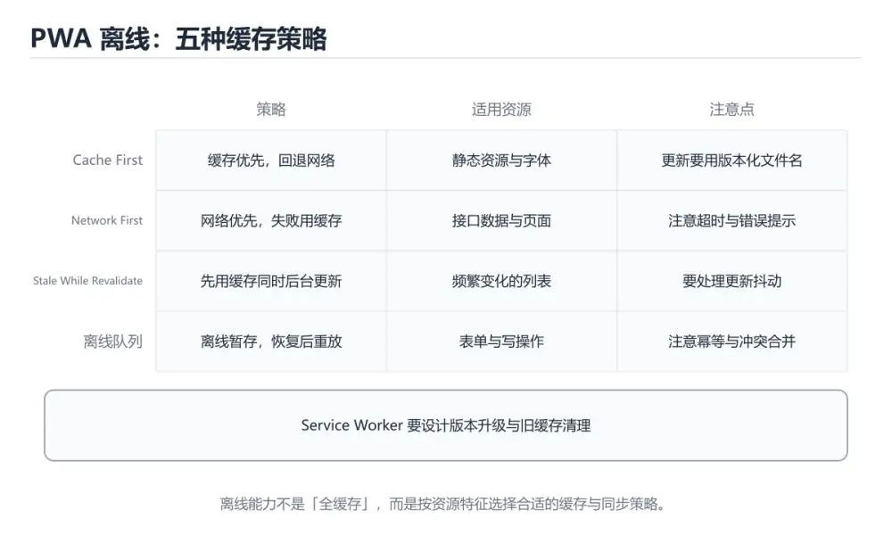

# PWA 与离线能力




> 内容更新时间：2026-10-06 · 学习阶段：高级 · 预计用时：40 分钟

## 本节知识框架

**课程定位**：所属分类 `html_css`（HTML 与 CSS），课程主题 `PWA 与离线能力`，学习阶段 高级，建议用时 50 分钟。

本课主线：Service Worker 五种缓存策略、离线队列与版本更新。

**学完本课应当能够**
- 说清 `PWA` 与 `ServiceWorker` 的含义与区别，并各举一个正例和一个反例。
- 用本课示例验证 `离线` 的行为，记录输入、输出与失败条件。
- 遇到「在 HTTP 下注册 SW」这类问题时，能说出触发条件与修复顺序。

### 从概念到验证的学习链条

1. `PWA`：先掌握 用 Service Worker、清单和缓存增强网页，使其具备安装与离线能力，再用它解释 `ServiceWorker` 为什么会出现。
2. `ServiceWorker`：先掌握 浏览器在页面之外运行的后台脚本，用于缓存、离线与推送，再用它解释 `离线` 为什么会出现。
3. `离线`：先掌握 关键关系：先分清「PWA」与「ServiceWorker」的职责，再理解「离线」的适用边界，再用它解释 `缓存策略` 为什么会出现。
4. `缓存策略`：先掌握 规定写入、过期、淘汰和失效方式，在命中率与一致性之间取舍，再用它解释 `IndexedDB` 为什么会出现。
5. `IndexedDB`：先掌握 浏览器内置的异步事务型对象数据库，适合保存大量离线结构化数据，再用它解释 `BackgroundSync` 为什么会出现。
6. `BackgroundSync`：先掌握 浏览器在恢复网络后由 Service Worker 重试后台同步任务，再用它解释 本课示例的观察结果 为什么会出现。

**先修与衔接**：本课是「HTML 与 CSS」分类的第 13 课。先修内容：《浏览器渲染与事件循环深入》。《浏览器渲染与事件循环深入》里的 `事件循环`、`微任务` 是本课的前提。相关或后续课程：《Web Components 实战》。

### 完成判据

- **定义关**：不看正文也能说明 `PWA` 是 用 Service Worker、清单和缓存增强网页，使其具备安装与离线能力，并指出一个反例。
- **机制关**：能按“输入 → 转换 → 输出 → 验证”复述 `PWA 与离线能力`，而不是只背结论。
- **示例关**：能运行或推演 `PWA 与离线能力` 的 `javascript` 示例，并说明一个真实出现的标识符或字面量。
- **证据关**：能指出 `PWA 与离线能力` 示例里的 调用了 `addEventListener()`，并说明它支持或反驳了本课的哪一条结论。
- **排错关**：能复现 在 HTTP 下注册 SW，记录现象并按 必须 HTTPS（localhost 例外） 修复。
- **迁移关**：能把 `PWA`、`ServiceWorker`、`离线`、`缓存策略` 放进一个与 `PWA 与离线能力` 不同的项目场景，并保持输入与验证条件可追踪。
- **复盘关**：学完 `PWA 与离线能力` 后，用一句话写下仍然不确定的结论，并列出下一次验证需要的输入、环境和成功判据。

### 复习清单

- [ ] 能不看正文复述本课核心术语，并指出一个边界或反例。
- [ ] 能运行或推演本课示例，记录输入、输出与失败现象。
- [ ] 能完成一次自测，并把错题对照错误表定位原因。

## 核心概念定义

| 术语 | 操作性定义 | 常见边界与风险 |
| --- | --- | --- |
| PWA | 用 Service Worker、清单和缓存增强网页，使其具备安装与离线能力。 | 缓存与状态残留会让结果过期，先明确失效策略再判断正确性。 |
| ServiceWorker | 浏览器在页面之外运行的后台脚本，用于缓存、离线与推送。 | 缓存与状态残留会让结果过期，先明确失效策略再判断正确性。 |
| 离线 | 关键关系：先分清「PWA」与「ServiceWorker」的职责，再理解「离线」的适用边界。 | 易错：数据错乱；正确做法是只缓存 GET，写请求直连并做离线队列。 |
| 缓存策略 | 规定写入、过期、淘汰和失效方式，在命中率与一致性之间取舍。 | 隔离级别与并发事务会影响可见性，换级别或换存储引擎后要重新验证。 |
| IndexedDB | 浏览器内置的异步事务型对象数据库，适合保存大量离线结构化数据。 | 隔离级别与并发事务会影响可见性，换级别或换存储引擎后要重新验证。 |
| BackgroundSync | 浏览器在恢复网络后由 Service Worker 重试后台同步任务。 | 网络延迟、超时与版本协商会改变行为，只在真实链路或多版本客户端上验证才算数。 |

## 原理与运行机制

### 机制总览

**教材衔接：核心组成速查**

| 组成 | 作用 |
| --- | --- |
| Web App Manifest | 定义名称、图标、启动方式，支持「添加到主屏」 |
| Service Worker | 独立于页面的后台脚本，拦截请求、管理缓存 |
| Cache Storage | 存放静态资源与离线响应 |
| IndexedDB | 存放结构化业务数据 |
| Background Sync | 网络恢复后补发请求 |
| Push API | 服务端推送通知（需用户授权） |

能力边界要清楚：**Service Worker 只能拦截同源（或受控范围）请求**，且必须运行在 HTTPS（localhost 例外）。

**教材衔接：离线数据与同步速查**

| 主题 | 做法 |
| --- | --- |
| 本地存储选型 | 大数据用 IndexedDB，配置用 localStorage，二进制用 Cache Storage |
| 冲突解决 | 以服务端版本号为准，或按业务规则合并 |
| 幂等 | 每条离线操作带幂等键，重放不会重复 |
| 版本迁移 | 数据库带版本号，升级时写迁移逻辑 |
| 容量控制 | 定期清理过期数据，设置上限 |
| 用户提示 | 明确显示「离线中，将在联网后同步」 |

### 机制拆解：每一步的输入、动作与输出

#### 1. `PWA`
- 输入：`PWA`；本步把 用 Service Worker、清单和缓存增强网页，使其具备安装与离线能力 当作判断规则。
- 动作：围绕 `PWA` 保留中间状态，并记录它与 `ServiceWorker` 的对应关系。
- 输出：`ServiceWorker`，它可以被下一段代码、测试或记录继续使用。
- `PWA` 的失败条件：缓存与状态残留会让结果过期，先明确失效策略再判断正确性。

#### 2. `ServiceWorker`
- 输入：`PWA`；本步把 浏览器在页面之外运行的后台脚本，用于缓存、离线与推送 当作判断规则。
- 动作：围绕 `ServiceWorker` 保留中间状态，并记录它与 `离线` 的对应关系。
- 输出：`离线`，它可以被下一段代码、测试或记录继续使用。
- `ServiceWorker` 的失败条件：缓存与状态残留会让结果过期，先明确失效策略再判断正确性。

#### 3. `离线`
- 输入：`ServiceWorker`；本步把 关键关系：先分清「PWA」与「ServiceWorker」的职责，再理解「离线」的适用边界 当作判断规则。
- 动作：围绕 `离线` 保留中间状态，并记录它与 `缓存策略` 的对应关系。
- 输出：`缓存策略`，它可以被下一段代码、测试或记录继续使用。
- `离线` 的失败条件：当缓存写请求时，会出现数据错乱。

#### 4. `缓存策略`
- 输入：`离线`；本步把 规定写入、过期、淘汰和失效方式，在命中率与一致性之间取舍 当作判断规则。
- 动作：围绕 `缓存策略` 保留中间状态，并记录它与 `IndexedDB` 的对应关系。
- 输出：`IndexedDB`，它可以被下一段代码、测试或记录继续使用。
- `缓存策略` 的失败条件：隔离级别与并发事务会影响可见性，换级别或换存储引擎后要重新验证。

#### 5. `IndexedDB`
- 输入：`缓存策略`；本步把 浏览器内置的异步事务型对象数据库，适合保存大量离线结构化数据 当作判断规则。
- 动作：围绕 `IndexedDB` 保留中间状态，并记录它与 `BackgroundSync` 的对应关系。
- 输出：`BackgroundSync`，它可以被下一段代码、测试或记录继续使用。
- `IndexedDB` 的失败条件：隔离级别与并发事务会影响可见性，换级别或换存储引擎后要重新验证。

#### 6. `BackgroundSync`
- 输入：`IndexedDB`；本步把 浏览器在恢复网络后由 Service Worker 重试后台同步任务 当作判断规则。
- 动作：围绕 `BackgroundSync` 保留中间状态，并记录它与 `addEventListener` 的对应关系。
- 输出：`addEventListener`，它可以被下一段代码、测试或记录继续使用。
- `BackgroundSync` 的失败条件：网络延迟、超时与版本协商会改变行为，只在真实链路或多版本客户端上验证才算数。

### 示例中的可观察事实

1. 调用了 `addEventListener()`；它对应的课程主题是 `PWA 与离线能力`。
2. 调用了 `waitUntil()`；它对应的课程主题是 `PWA 与离线能力`。
3. 调用了 `open()`；它对应的课程主题是 `PWA 与离线能力`。
4. 调用了 `then()`；它对应的课程主题是 `PWA 与离线能力`。
5. 调用了 `addAll()`；它对应的课程主题是 `PWA 与离线能力`。
6. 调用了 `keys()`；它对应的课程主题是 `PWA 与离线能力`。
7. 调用了 `all()`；它对应的课程主题是 `PWA 与离线能力`。
8. 调用了 `filter()`；它对应的课程主题是 `PWA 与离线能力`。

### 复现实验记录

- 环境：`PWA 与离线能力` 使用 `javascript` 示例，固定 `PWA`、`ServiceWorker`、`离线`、`缓存策略` 作为第一组条件。
- 首轮输入：先确认 调用了 `addEventListener()`，预测 `PWA` 会怎样变化。
- 基线观察：记录命令、输入、输出和错误原文，不用截图代替可复制的文本。
- 单变量修改：只改变 `PWA`，观察 `BackgroundSync` 是否仍满足定义。
- 失败注入：复现 在 HTTP 下注册 SW，确认现象是 注册失败。
- 记录结论：把“修改前、修改后、预期变化、实际变化”写成四列表，这样复盘 `PWA 与离线能力` 时才能区分概念错误与实现错误。

## 典型应用场景

- **在 HTTP 下注册 SW**：典型现象是注册失败；正确做法是必须 HTTPS（localhost 例外）。
- **缓存所有请求**：典型现象是用户永远看到旧数据；正确做法是按资源类型选择策略，接口用 Network First。
- **缓存写请求**：典型现象是数据错乱；正确做法是只缓存 GET，写请求直连并做离线队列。
- **不清理旧缓存**：典型现象是磁盘占用增长、旧版本残留；正确做法是activate 时删除非当前版本缓存。

### 最小验证场景

- 准备：保留 `javascript` 示例的原始输入，先记录 `PWA 与离线能力` 的基线输出和完整运行命令。
- 观察：先核对 调用了 `addEventListener()`，再改变一个与 `PWA` 相关的条件。
- 判定：新结果与 `PWA 与离线能力` 的基线不同不等于错误；只有当差异破坏了 `PWA` 的定义或错误表中的约束，才判定为失败。

### 选择与边界

- 使用 `PWA` 时，先满足它的定义：用 Service Worker、清单和缓存增强网页，使其具备安装与离线能力；缓存与状态残留会让结果过期，先明确失效策略再判断正确性。
- 使用 `ServiceWorker` 时，先满足它的定义：浏览器在页面之外运行的后台脚本，用于缓存、离线与推送；缓存与状态残留会让结果过期，先明确失效策略再判断正确性。
- 使用 `离线` 时，先满足它的定义：关键关系：先分清「PWA」与「ServiceWorker」的职责，再理解「离线」的适用边界；易错：数据错乱；正确做法是只缓存 GET，写请求直连并做离线队列。
- 使用 `缓存策略` 时，先满足它的定义：规定写入、过期、淘汰和失效方式，在命中率与一致性之间取舍；隔离级别与并发事务会影响可见性，换级别或换存储引擎后要重新验证。
- 使用 `IndexedDB` 时，先满足它的定义：浏览器内置的异步事务型对象数据库，适合保存大量离线结构化数据；隔离级别与并发事务会影响可见性，换级别或换存储引擎后要重新验证。

## 代码/协议/SQL 示例

### 最小可验证示例

```javascript
// service-worker.js：按资源类型选择策略
const SHELL_CACHE = "app-shell-v3";
const DATA_CACHE = "api-v1";
const SHELL_ASSETS = ["/", "/index.html", "/app.css", "/app.js"];

self.addEventListener("install", (event) => {
  event.waitUntil(
    caches.open(SHELL_CACHE).then((cache) => cache.addAll(SHELL_ASSETS)),
  );
});

self.addEventListener("activate", (event) => {
  // 清理旧版本缓存，避免磁盘无限增长
  event.waitUntil(
    caches.keys().then((keys) =>
      Promise.all(
        keys
          .filter((key) => ![SHELL_CACHE, DATA_CACHE].includes(key))
          .map((key) => caches.delete(key)),
      ),
    ),
  );
});

self.addEventListener("fetch", (event) => {
  const { request } = event;
  const url = new URL(request.url);

  if (request.method !== "GET") return;                 // 写请求不缓存
  if (url.pathname.startsWith("/api/pay")) return;      // 敏感接口直连网络

  if (url.pathname.startsWith("/api/")) {
    // Network First：保证数据尽量新鲜，离线时回落缓存
    event.respondWith(
      fetch(request)
        .then((response) => {
          const copy = response.clone();
          caches.open(DATA_CACHE).then((cache) => cache.put(request, copy));
          return response;
        })
        .catch(() => caches.match(request)),
    );
    return;
  }

  // Cache First：静态资源优先走缓存
  event.respondWith(
    caches.match(request).then((cached) => cached || fetch(request)),
  );
});
```

**教材衔接：深挖「PWA」的边界与代价**


### 二、把 SHELL_CACHE 推到边界

下面是本课第一段代码（javascript），先原样运行一次作为基线：

```javascript
// service-worker.js：按资源类型选择策略
const SHELL_CACHE = "app-shell-v3";
const DATA_CACHE = "api-v1";
const SHELL_ASSETS = ["/", "/index.html", "/app.css", "/app.js"];
self.addEventListener("install", (event) => {
  event.waitUntil(
    caches.open(SHELL_CACHE).then((cache) => cache.addAll(SHELL_ASSETS)),
  );
});
self.addEventListener("activate", (event) => {
  // 清理旧版本缓存，避免磁盘无限增长
  event.waitUntil(
    caches.keys().then((keys) =>
      Promise.all(
        keys
          .filter((key) => ![SHELL_CACHE, DATA_CACHE].includes(key))
          .map((key) => caches.delete(key)),
      ),
    ),
  );
});
self.addEventListener("fetch", (event) => {
// …（其余部分见正文，此处为截断片段）
```

| 变式 | 怎么改 | 先写下什么 | 观察点 |
| --- | --- | --- | --- |
| 边界输入 | 把 SHELL_CACHE 的输入换成空值或最大值 | 预测输出 | 是否报错、是否静默返回 |
| 只改一处 | 把 DATA_CACHE 的一个参数改成另一档 | 预测差异来源 | 输出变化能否用本课结论解释 |
| 去掉一步 | 注释掉 SHELL_CACHE 之后的一行 | 预测哪一步先失败 | 错误位置是否与预期一致 |


### 四、测验复盘

| 题号 | 正确答案 | 最容易选错的干扰项 | 复盘动作 |
| --- | --- | --- | --- |
| 1 | 必须使用 HTTPS（localhost 例外） | 必须使用 HTTP | 把干扰项改写成一句反例，再说明它违反本课哪条前提 |
| 2 | 这段代码把主要逻辑封装在函数或方法里，需要被调用才会执行。 | 这段代码只做静态声明，没有循环、分支或可观察输出。 | 把干扰项改写成一句反例，再说明它违反本课哪条前提 |
| 3 | 存入本地队列并带幂等键，联网后重放 | 直接丢弃请求 | 把干扰项改写成一句反例，再说明它违反本课哪条前提 |
| 4 | 验证 ServiceWorker 时要固定版本并覆盖边界输入，结论才… | 只要 PWA 的常规示例通过，就可以跳过边界与异常路径 | 把干扰项改写成一句反例，再说明它违反本课哪条前提 |
| 5 | Service Worker 缓存策略没有随版本更新 | 用户网络太慢 | 把干扰项改写成一句反例，再说明它违反本课哪条前提 |
| 6 | 0 | （无干扰项） | 把干扰项改写成一句反例，再说明它违反本课哪条前提 |

### 五、离开本课前的自检

**运行方式**：运行 `PWA 与离线能力` 的示例时，保存为 `.js` 后用 `node 文件名.js` 运行；涉及浏览器 API 的示例要放到页面里执行。

### 示例精读：先找证据，再改一个条件

1. 调用了 `addEventListener()`；它出现在 `PWA 与离线能力` 的示例中，阅读时先确认它前后各发生了什么。
2. 调用了 `waitUntil()`；它出现在 `PWA 与离线能力` 的示例中，阅读时先确认它前后各发生了什么。
3. 调用了 `open()`；它出现在 `PWA 与离线能力` 的示例中，阅读时先确认它前后各发生了什么。
4. 调用了 `then()`；它出现在 `PWA 与离线能力` 的示例中，阅读时先确认它前后各发生了什么。
5. 调用了 `addAll()`；它出现在 `PWA 与离线能力` 的示例中，阅读时先确认它前后各发生了什么。
6. 调用了 `keys()`；它出现在 `PWA 与离线能力` 的示例中，阅读时先确认它前后各发生了什么。
7. 调用了 `all()`；它出现在 `PWA 与离线能力` 的示例中，阅读时先确认它前后各发生了什么。
8. 调用了 `filter()`；它出现在 `PWA 与离线能力` 的示例中，阅读时先确认它前后各发生了什么。
- 在 `PWA 与离线能力` 中与 `PWA` 对照：示例必须能支持 用 Service Worker、清单和缓存增强网页，使其具备安装与离线能力，否则说明这一段还缺少实现或验证步骤。
- 在 `PWA 与离线能力` 中与 `ServiceWorker` 对照：示例必须能支持 浏览器在页面之外运行的后台脚本，用于缓存、离线与推送，否则说明这一段还缺少实现或验证步骤。
- 在 `PWA 与离线能力` 中与 `离线` 对照：示例必须能支持 关键关系：先分清「PWA」与「ServiceWorker」的职责，再理解「离线」的适用边界，否则说明这一段还缺少实现或验证步骤。
- 在 `PWA 与离线能力` 中与 `缓存策略` 对照：示例必须能支持 规定写入、过期、淘汰和失效方式，在命中率与一致性之间取舍，否则说明这一段还缺少实现或验证步骤。

## 时间/空间复杂度或性能分析

**性能关注点（PWA 与离线能力）**：浏览器渲染是关键路径：关注首屏时间、重排与重绘次数、资源体积。

**本课特有开销（PWA 与离线能力 · PWA）**：缓存命中率比缓存实现本身更关键，先记录命中率与失效策略再谈优化。

**测量方法**：以 `PWA 与离线能力` 的 `PWA` 场景为对象，固定输入跑一遍记录基线，再把规模或并发度提高一个数量级复测；两次结果的差值与波动范围才是结论依据。

### 需要控制的变量与记录项

- `PWA 与离线能力` 的 `PWA`：固定它的版本、输入范围和资源上限，分别记录速度、内存与失败率的变化。
- `PWA 与离线能力` 的 `ServiceWorker`：固定它的版本、输入范围和资源上限，分别记录速度、内存与失败率的变化。
- `PWA 与离线能力` 的 `离线`：固定它的版本、输入范围和资源上限，分别记录速度、内存与失败率的变化。
- `PWA 与离线能力` 的 `缓存策略`：固定它的版本、输入范围和资源上限，分别记录速度、内存与失败率的变化。
- `PWA 与离线能力` 的 `IndexedDB`：固定它的版本、输入范围和资源上限，分别记录速度、内存与失败率的变化。
- `PWA 与离线能力` 中 `PWA` 的边界：缓存与状态残留会让结果过期，先明确失效策略再判断正确性。达到边界时不要外推，必须重新测量。
- `PWA 与离线能力` 中 `ServiceWorker` 的边界：缓存与状态残留会让结果过期，先明确失效策略再判断正确性。达到边界时不要外推，必须重新测量。
- `PWA 与离线能力` 中 `离线` 的边界：易错：数据错乱；正确做法是只缓存 GET，写请求直连并做离线队列。达到边界时不要外推，必须重新测量。
- `PWA 与离线能力` 中 `缓存策略` 的边界：隔离级别与并发事务会影响可见性，换级别或换存储引擎后要重新验证。达到边界时不要外推，必须重新测量。
- `PWA 与离线能力` 中 `IndexedDB` 的边界：隔离级别与并发事务会影响可见性，换级别或换存储引擎后要重新验证。达到边界时不要外推，必须重新测量。
- `PWA 与离线能力` 的代码证据：先验证 调用了 `addEventListener()`，再记录该路径的输入规模与耗时；只看代码行数不能推出复杂度。

## 常见误区与易错点

| 容易写错的做法 | 实际现象 | 原因与正确做法 |
| --- | --- | --- |
| 在 HTTP 下注册 SW | 注册失败 | 必须 HTTPS（localhost 例外） |
| 缓存所有请求 | 用户永远看到旧数据 | 按资源类型选择策略，接口用 Network First |
| 缓存写请求 | 数据错乱 | 只缓存 GET，写请求直连并做离线队列 |
| 不清理旧缓存 | 磁盘占用增长、旧版本残留 | activate 时删除非当前版本缓存 |
| 离线操作无幂等键 | 重放产生重复订单 | 每次操作生成幂等键 |
| 更新 SW 后不提示 | 用户不知道要刷新 | 监听 updatefound 并提示 |
| 忽略缓存失效 | 发版后仍加载旧 JS | 文件名带哈希或改缓存名 |

### 现场 1：在 HTTP 下注册 SW

**症状**：注册失败。

**根因与修复**：必须 HTTPS（localhost 例外）。

**自检**：在本课示例里复现「在 HTTP 下注册 SW」，改成必须 HTTPS（localhost 例外）后重跑；如果症状消失且失败路径按预期变化，说明定位正确。

### 现场 2：缓存所有请求

**症状**：用户永远看到旧数据。

**根因与修复**：按资源类型选择策略，接口用 Network First。

**自检**：在本课示例里复现「缓存所有请求」，改成按资源类型选择策略，接口用 Network First后重跑；如果症状消失且失败路径按预期变化，说明定位正确。

### 现场 3：缓存写请求

**症状**：数据错乱。

**根因与修复**：只缓存 GET，写请求直连并做离线队列。

**自检**：在本课示例里复现「缓存写请求」，改成只缓存 GET，写请求直连并做离线队列后重跑；如果症状消失且失败路径按预期变化，说明定位正确。

### 现场 4：不清理旧缓存

**症状**：磁盘占用增长、旧版本残留。

**根因与修复**：activate 时删除非当前版本缓存。

**自检**：在本课示例里复现「不清理旧缓存」，改成activate 时删除非当前版本缓存后重跑；如果症状消失且失败路径按预期变化，说明定位正确。

### 现场 5：离线操作无幂等键

**症状**：重放产生重复订单。

**根因与修复**：每次操作生成幂等键。

**自检**：在本课示例里复现「离线操作无幂等键」，改成每次操作生成幂等键后重跑；如果症状消失且失败路径按预期变化，说明定位正确。

### 现场 6：更新 SW 后不提示

**症状**：用户不知道要刷新。

**根因与修复**：监听 updatefound 并提示。

**自检**：在本课示例里复现「更新 SW 后不提示」，改成监听 updatefound 并提示后重跑；如果症状消失且失败路径按预期变化，说明定位正确。

### 现场 7：忽略缓存失效

**症状**：发版后仍加载旧 JS。

**根因与修复**：文件名带哈希或改缓存名。

**自检**：在本课示例里复现「忽略缓存失效」，改成文件名带哈希或改缓存名后重跑；如果症状消失且失败路径按预期变化，说明定位正确。

## 与其他知识点的关系

- **先修**：`浏览器渲染与事件循环深入`。本课默认这些内容已经掌握。
- **相关或后续**：`Web Components 实战`。本课术语会在这些课程里继续使用。
- **术语归属**：`PWA`、`ServiceWorker`、`离线` 的定义以本课「核心概念定义」为准，换到其他课程时先确认定义是否被改写。

### 先修与后续术语接口

- `浏览器渲染与事件循环深入`：两者通过本分类的学习顺序衔接，阅读时重点比较各自的输入与失败条件。
- `Web Components 实战`：两者通过本分类的学习顺序衔接，阅读时重点比较各自的输入与失败条件。

### 容易混淆的相邻概念

- `PWA` 与 `ServiceWorker`：前者强调 用 Service Worker、清单和缓存增强网页，使其具备安装与离线能力；后者强调 浏览器在页面之外运行的后台脚本，用于缓存、离线与推送。判断时分别检查两条定义的适用范围，不要只看名称相似就互换。
- `ServiceWorker` 与 `离线`：前者强调 浏览器在页面之外运行的后台脚本，用于缓存、离线与推送；后者强调 关键关系：先分清「PWA」与「ServiceWorker」的职责，再理解「离线」的适用边界。判断时分别检查两条定义的适用范围，不要只看名称相似就互换。
- `离线` 与 `缓存策略`：前者强调 关键关系：先分清「PWA」与「ServiceWorker」的职责，再理解「离线」的适用边界；后者强调 规定写入、过期、淘汰和失效方式，在命中率与一致性之间取舍。判断时分别检查两条定义的适用范围，不要只看名称相似就互换。
- `缓存策略` 与 `IndexedDB`：前者强调 规定写入、过期、淘汰和失效方式，在命中率与一致性之间取舍；后者强调 浏览器内置的异步事务型对象数据库，适合保存大量离线结构化数据。判断时分别检查两条定义的适用范围，不要只看名称相似就互换。
- `IndexedDB` 与 `BackgroundSync`：前者强调 浏览器内置的异步事务型对象数据库，适合保存大量离线结构化数据；后者强调 浏览器在恢复网络后由 Service Worker 重试后台同步任务。判断时分别检查两条定义的适用范围，不要只看名称相似就互换。

## 自测题与参考答案

> 先独立作答，再对照参考答案；答案都能在本课正文、术语表或错误表里找到依据。

### 自测 1（概念复述）

不看正文，写出 `PWA` 的操作性定义，并说明它与 `ServiceWorker` 的区别。

**参考答案**：用 Service Worker、清单和缓存增强网页，使其具备安装与离线能力。

`ServiceWorker` 的定位是：浏览器在页面之外运行的后台脚本，用于缓存、离线与推送；两者的差别要从适用对象与失败模式上说明。

### 自测 2（排错）

本课错误表记录了「在 HTTP 下注册 SW」这类做法。请写出它会出现的现象、根因，以及修复顺序。

**参考答案**：现象是注册失败；正确做法是必须 HTTPS（localhost 例外）。修复时先复现现象并保留证据，再改动一处假设重跑，确认现象消失。

### 自测 3（动手验证）

运行本课的 `javascript` 示例，把其中的 `"app-shell-v3"` 换成一个边界值后重新运行，记录输出与错误信息。

**参考答案**：正常输入下 `javascript` 示例应当复现正文给出的结果；把 `"app-shell-v3"` 换成边界值后，如果结果改变或报错，先核对它是否满足 `PWA 与离线能力` 中`PWA` 的适用范围，再检查错误表里是否有同类现象。

### 自测 4（代码阅读）

阅读本课开头的 `javascript` 示例，说明它体现了`PWA` 的哪一条性质，并指出改动哪个输入会让这条性质不再成立。

**参考答案**：`PWA` 的定义是 用 Service Worker、清单和缓存增强网页，使其具备安装与离线能力，示例正是在实现这条定义。改动与 `PWA` 有关的一个输入后，如果结果不再符合 `PWA 与离线能力` 的正文描述，就说明该性质只在当前前提成立。

### 自测 5（迁移）

把 `PWA 与离线能力` 的方法迁移到自己的项目：围绕 `PWA` 写出一个与错误表同类的风险点，并说明触发条件和检验方式。

**参考答案**：例如「忽略缓存失效」，它会导致发版后仍加载旧 JS；检验方式是按文件名带哈希或改缓存名改一处再复现，确认现象消失且没有引入新的失败分支。

### 自测 6（对比）

用一个表格对比 `PWA` 与 `ServiceWorker`：各写一行适用场景、一行失败表现。

**参考答案**：`PWA` 的定义是用 Service Worker、清单和缓存增强网页，使其具备安装与离线能力；`ServiceWorker` 的定义是浏览器在页面之外运行的后台脚本，用于缓存、离线与推送。两者的失败表现分别对应本课错误表里与本术语相关的行。

### 自测 7（排错顺序）

面对「在 HTTP 下注册 SW」引发的问题，请把“复现 注册失败 → 保留证据 → 必须 HTTPS（localhost 例外） → 回归验证”四步写成可执行的检查清单。

**参考答案**：第一步按注册失败复现；第二步记录输入、版本与完整报错；第三步按必须 HTTPS（localhost 例外）只改一处；第四步重跑并确认失败路径也按预期变化。

### 自测 8（边界判断）

针对 `BackgroundSync`，分别写出“可以使用”的条件和“结论不再成立”的条件。

**参考答案**：网络延迟、超时与版本协商会改变行为，只在真实链路或多版本客户端上验证才算数。 同时要把 `BackgroundSync` 的定义 浏览器在恢复网络后由 Service Worker 重试后台同步任务 与实际输入逐项对照。

### 自测 9（机制重建）

不看正文，按输入、转换、输出、验证四段重建 `PWA` → `ServiceWorker` → `离线` → `缓存策略` 的作用链。

**参考答案**：起点是 `PWA` 的定义 用 Service Worker、清单和缓存增强网页，使其具备安装与离线能力；中间每一步都保留可观察状态；终点由 `BackgroundSync` 检查，失败时回到错误表定位第一个偏离定义的步骤。

### 自测 10（综合排错）

在 `PWA 与离线能力` 中，现象是 发版后仍加载旧 JS。请围绕 忽略缓存失效 写出最小复现、关键证据、修复动作和回归验证，并说明为什么不能只凭一次运行下结论。

**参考答案**：先复现 忽略缓存失效，记录输入与完整错误；再按 文件名带哈希或改缓存名 只改一处。回归时同时跑正常路径和边界路径，只有两次结果都可解释，才把修复视为完成。

### 自测 11（一分钟复述）

用每分钟约 200 字的速度复述 `PWA 与离线能力`：先给主问题，再按顺序说出 `PWA`、`ServiceWorker`、`离线`、`缓存策略`，最后给一个失败案例。

**自评标准**：主问题必须对应 Service Worker 五种缓存策略、离线队列与版本更新；每个术语都要能接上一句定义或边界；失败案例必须写成可观察现象，不能用“可能有风险”代替证据。

## 术语速查

| 术语 | 一句话说明 |
| --- | --- |
| `PWA` | 用 Service Worker、清单和缓存增强网页，使其具备安装与离线能力。 |
| `ServiceWorker` | 浏览器在页面之外运行的后台脚本，用于缓存、离线与推送。 |
| `离线` | 关键关系：先分清「PWA」与「ServiceWorker」的职责，再理解「离线」的适用边界。 |
| `缓存策略` | 规定写入、过期、淘汰和失效方式，在命中率与一致性之间取舍。 |
| `IndexedDB` | 浏览器内置的异步事务型对象数据库，适合保存大量离线结构化数据。 |
| `BackgroundSync` | 浏览器在恢复网络后由 Service Worker 重试后台同步任务。 |

**术语关系**：`PWA`（用 Service Worker、清单和缓存增强网页） → `ServiceWorker`（浏览器在页面之外运行的后台脚本） → `离线`（关键关系：先分清「PWA」与「ServiceWorker」的职责） → `缓存策略`（规定写入、过期、淘汰和失效方式）。

## 考点精讲

`PWA 与离线能力` 的题库有 6 道题，下面逐题给出题干、正确项与判断依据：先自己作答，再核对正确项，最后回到正文对应小节复核。

### 考点 1：第 1 题

- **题目**：Service Worker 注册的前置条件是？
- **正确项**：必须使用 HTTPS（localhost 例外）
- **判断依据**：这道题检验本课主问题：Service Worker 五种缓存策略、离线队列与版本更新。复习时先复述本课主问题，再举一个会让结论失效的输入。

### 考点 2：第 2 题

- **题目**：下面这段 `javascript` 代码来自 `PWA 与离线能力`。课程主线是Service Worker 五种缓存策略、离线队列与版本更新。代码与 `PWA` 有关。哪一项是代码里真实出现的内容？
- **正确项**：出现字面量 `install`
- **判断依据**：这道题落在术语 `PWA` 上：用 Service Worker、清单和缓存增强网页，使其具备安装与离线能力。复习时把 `PWA` 的定义、适用边界和一个反例一起说清楚，再回到「核心概念定义」核对原文。

### 考点 3：第 3 题

- **题目**：离线状态下用户提交了一个订单，正确做法是？
- **正确项**：存入本地队列并带幂等键，联网后重放
- **判断依据**：这道题落在术语 `离线` 上：关键关系：先分清「PWA」与「ServiceWorker」的职责，再理解「离线」的适用边界。复习时把 `离线` 的定义、适用边界和一个反例一起说清楚，再回到「核心概念定义」核对原文。

### 考点 4：第 4 题

- **题目**：围绕“PWA 与离线能力”中的 PWA、ServiceWorker、离线，下列哪两项是本课强调的实践判断？
- **正确项**：验证 ServiceWorker 时要固定版本并覆盖边界输入，结论才可复现；学习 PWA 时要同时说明输入、输出和失败路径，不能只看正常流程
- **判断依据**：这道题落在术语 `PWA` 上：用 Service Worker、清单和缓存增强网页，使其具备安装与离线能力。复习时把 `PWA` 的定义、适用边界和一个反例一起说清楚，再回到「核心概念定义」核对原文。

### 考点 5：第 5 题

- **题目**：发版后用户仍加载旧版 JS，最可能的原因是？
- **正确项**：Service Worker 缓存策略没有随版本更新
- **判断依据**：这道题落在术语 `缓存策略` 上：规定写入、过期、淘汰和失效方式，在命中率与一致性之间取舍。复习时把 `缓存策略` 的定义、适用边界和一个反例一起说清楚，再回到「核心概念定义」核对原文。

### 考点 6：第 6 题

- **题目**：填空：补齐下面这段术语说明中的空缺。课程 `Service Worker 五种缓存策略、离线队列与版本更新。`，这段说明是：`____`：浏览器在页面之外运行的后台脚本，用于缓存、离线与推送。空缺处应填哪个术语？
- **正确项**：ServiceWorker
- **判断依据**：这道题落在术语 `ServiceWorker` 上：浏览器在页面之外运行的后台脚本，用于缓存、离线与推送。复习时把 `ServiceWorker` 的定义、适用边界和一个反例一起说清楚，再回到「核心概念定义」核对原文。

### 考点 7：`PWA`

- **要点**：用 Service Worker、清单和缓存增强网页，使其具备安装与离线能力。
- **PWA 的边界**：缓存与状态残留会让结果过期，先明确失效策略再判断正确性。

### 考点 8：`ServiceWorker`

- **要点**：浏览器在页面之外运行的后台脚本，用于缓存、离线与推送。
- **ServiceWorker 的边界**：缓存与状态残留会让结果过期，先明确失效策略再判断正确性。

### 考点 9：`离线`

- **要点**：关键关系：先分清「PWA」与「ServiceWorker」的职责，再理解「离线」的适用边界。
- **离线 的边界**：易错：数据错乱；正确做法是只缓存 GET，写请求直连并做离线队列。

### 考点 10：`缓存策略`

- **要点**：规定写入、过期、淘汰和失效方式，在命中率与一致性之间取舍。
- **缓存策略 的边界**：隔离级别与并发事务会影响可见性，换级别或换存储引擎后要重新验证。

### 考点 11：`IndexedDB`

- **要点**：浏览器内置的异步事务型对象数据库，适合保存大量离线结构化数据。
- **IndexedDB 的边界**：隔离级别与并发事务会影响可见性，换级别或换存储引擎后要重新验证。

### 考点 12：`BackgroundSync`

- **要点**：浏览器在恢复网络后由 Service Worker 重试后台同步任务。
- **BackgroundSync 的边界**：网络延迟、超时与版本协商会改变行为，只在真实链路或多版本客户端上验证才算数。

### 考点 13：排错——在 HTTP 下注册 SW

- **现象**：注册失败。
- **处理**：必须 HTTPS（localhost 例外）。

### 考点 14：排错——缓存所有请求

- **现象**：用户永远看到旧数据。
- **处理**：按资源类型选择策略，接口用 Network First。

### 考点 15：综合辨析——`PWA` 与 `BackgroundSync`

- **辨析点**：`PWA` 的定义是 用 Service Worker、清单和缓存增强网页，使其具备安装与离线能力；`BackgroundSync` 的定义是 浏览器在恢复网络后由 Service Worker 重试后台同步任务。
- **答题要求**：面对 `PWA 与离线能力` 的题目，先判断描述的是 `PWA` 还是 `BackgroundSync`，再归到对应定义，最后写出一个会让该定义失效的边界输入。

### 考点 16：排错评分点

- **现象分**：能写出 注册失败，而不是只写“程序有错”。
- **证据分**：保留触发 在 HTTP 下注册 SW 的输入、版本和错误原文。
- **修复分**：按 必须 HTTPS（localhost 例外） 只改一处，并同时回归正常路径与边界路径。

## 内容元数据

- 内容版本：v2.0
- 最后更新：2026-10-06
- 学习阶段：高级
- 适用环境：现代浏览器（Chrome/Firefox/Safari）；本课聚焦 PWA。
- 内容来源：内置结构化课程与工程实践整理
- 相关主题：PWA、ServiceWorker、离线、缓存策略、IndexedDB、BackgroundSync
- 质量版本：P0 测验标准 + P1 覆盖扩展 + P2 体验补全

## 参考资料与复核

- 最后复核：2026-10-04
- 下次复核：2027-08-17
- 复核范围：版本兼容、API 行为、安全建议与工程实践
- 来源性质：官方文档、标准或权威教材；本课核对关键词：PWA、ServiceWorker、离线、缓存策略、IndexedDB、BackgroundSync。

| 参考资料 | 本课用途 |
| --- | --- |
| [MDN HTTP](https://developer.mozilla.org/docs/Web/HTTP) | HTTP 语义与缓存 |
| [W3C Web 标准](https://www.w3.org/TR/) | HTML、CSS 与 Web 标准 |
| [MDN JavaScript](https://developer.mozilla.org/docs/Web/JavaScript) | 浏览器脚本语言 |

| [本课术语索引：PWA 与离线能力](#核心概念定义) | 按本课输入、术语边界和错误表现逐项核对 |
> 「PWA 与离线能力」的链接用于离线阅读后的延伸核对；App 不会自动联网。

<!-- p1-deep-dive:start -->