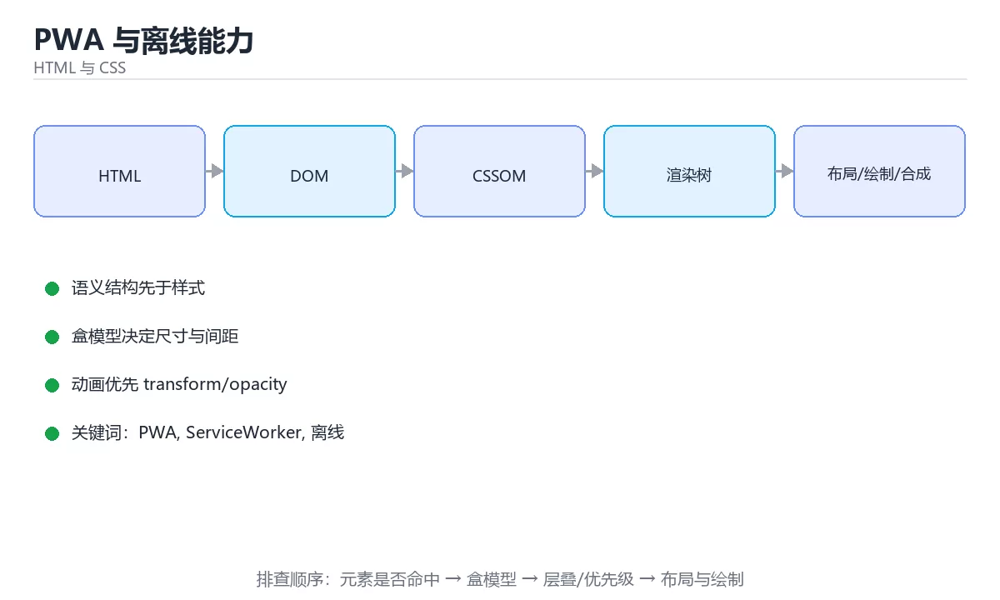

# PWA 与离线能力



> 内容更新时间：2026-10-03 · 学习阶段：高级 · 预计用时：18 分钟

## 学习目标

- 能用自己的话解释「PWA 与离线能力」解决了什么问题，而不是只背术语。
- 能说清 「PWA」、「ServiceWorker」、「离线」、「缓存策略」 之间的关系，并分别举出一个例子。
- 能把本课知识放回「HTML 与 CSS」的知识体系，说明它和相邻主题的边界。
- 能完成本课练习，并用验收标准检查自己的结果。

> 一句话摘要：Service Worker 五种缓存策略、离线队列与版本更新。

## 前置知识

- 先完成上一课《浏览器渲染与事件循环深入》；如果已经掌握，可以直接用本课练习自测。
- 本课阶段：高级。建议具备同一方向的完整基础，能阅读较长的代码、配置或系统设计说明。
- 开始前先复习：PWA、ServiceWorker、离线。
- 如果某一步看不懂，先记录具体卡点，完成练习后再回头读一遍。


## 核心组成速查

| 组成 | 作用 |
| --- | --- |
| Web App Manifest | 定义名称、图标、启动方式，支持「添加到主屏」 |
| Service Worker | 独立于页面的后台脚本，拦截请求、管理缓存 |
| Cache Storage | 存放静态资源与离线响应 |
| IndexedDB | 存放结构化业务数据 |
| Background Sync | 网络恢复后补发请求 |
| Push API | 服务端推送通知（需用户授权） |

能力边界要清楚：**Service Worker 只能拦截同源（或受控范围）请求**，且必须运行在 HTTPS（localhost 例外）。

## 缓存策略速查

| 策略 | 做法 | 适用 |
| --- | --- | --- |
| Cache First | 先读缓存，未命中再请求 | 静态资源、字体、图标 |
| Network First | 先请求网络，失败回落缓存 | 列表接口、需要新鲜度 |
| Stale While Revalidate | 立刻用缓存，同时后台更新 | 头像、配置、可容忍短暂陈旧 |
| Network Only | 不缓存 | 支付、登录等敏感接口 |
| Cache Only | 只读缓存 | 预下载的离线资源 |

```javascript
// service-worker.js：按资源类型选择策略
const SHELL_CACHE = "app-shell-v3";
const DATA_CACHE = "api-v1";
const SHELL_ASSETS = ["/", "/index.html", "/app.css", "/app.js"];

self.addEventListener("install", (event) => {
  event.waitUntil(
    caches.open(SHELL_CACHE).then((cache) => cache.addAll(SHELL_ASSETS)),
  );
});

self.addEventListener("activate", (event) => {
  // 清理旧版本缓存，避免磁盘无限增长
  event.waitUntil(
    caches.keys().then((keys) =>
      Promise.all(
        keys
          .filter((key) => ![SHELL_CACHE, DATA_CACHE].includes(key))
          .map((key) => caches.delete(key)),
      ),
    ),
  );
});

self.addEventListener("fetch", (event) => {
  const { request } = event;
  const url = new URL(request.url);

  if (request.method !== "GET") return;                 // 写请求不缓存
  if (url.pathname.startsWith("/api/pay")) return;      // 敏感接口直连网络

  if (url.pathname.startsWith("/api/")) {
    // Network First：保证数据尽量新鲜，离线时回落缓存
    event.respondWith(
      fetch(request)
        .then((response) => {
          const copy = response.clone();
          caches.open(DATA_CACHE).then((cache) => cache.put(request, copy));
          return response;
        })
        .catch(() => caches.match(request)),
    );
    return;
  }

  // Cache First：静态资源优先走缓存
  event.respondWith(
    caches.match(request).then((cached) => cached || fetch(request)),
  );
});
```

```javascript
// 页面侧：注册 SW、监听更新、离线排队
if ("serviceWorker" in navigator) {
  window.addEventListener("load", async () => {
    const registration = await navigator.serviceWorker.register("/service-worker.js");
    registration.addEventListener("updatefound", () => {
      console.info("发现新版本，将在下次进入时生效");
    });
  });
}

async function submitOrder(payload) {
  try {
    const response = await fetch("/api/orders", {
      method: "POST",
      headers: { "Content-Type": "application/json" },
      body: JSON.stringify(payload),
    });
    return await response.json();
  } catch (error) {
    // 离线：先入队，网络恢复后重放（务必带幂等键）
    const queue = (await getQueue()) || [];
    queue.push({ payload, idempotencyKey: crypto.randomUUID() });
    await saveQueue(queue);
    if ("sync" in (await navigator.serviceWorker.ready)) {
      await (await navigator.serviceWorker.ready).sync.register("order-sync");
    }
    return { queued: true };
  }
}
```

## 离线数据与同步速查

| 主题 | 做法 |
| --- | --- |
| 本地存储选型 | 大数据用 IndexedDB，配置用 localStorage，二进制用 Cache Storage |
| 冲突解决 | 以服务端版本号为准，或按业务规则合并 |
| 幂等 | 每条离线操作带幂等键，重放不会重复 |
| 版本迁移 | 数据库带版本号，升级时写迁移逻辑 |
| 容量控制 | 定期清理过期数据，设置上限 |
| 用户提示 | 明确显示「离线中，将在联网后同步」 |

## 常见错误对照表

| 容易踩的做法 | 实际现象 | 原因与正确做法 |
| --- | --- | --- |
| 在 HTTP 下注册 SW | 注册失败 | 必须 HTTPS（localhost 例外） |
| 缓存所有请求 | 用户永远看到旧数据 | 按资源类型选择策略，接口用 Network First |
| 缓存写请求 | 数据错乱 | 只缓存 GET，写请求直连并做离线队列 |
| 不清理旧缓存 | 磁盘占用增长、旧版本残留 | activate 时删除非当前版本缓存 |
| 离线操作无幂等键 | 重放产生重复订单 | 每次操作生成幂等键 |
| 更新 SW 后不提示 | 用户不知道要刷新 | 监听 updatefound 并提示 |
| 忽略缓存失效 | 发版后仍加载旧 JS | 文件名带哈希或改缓存名 |

## 自测清单

- [ ] 能用 Manifest 与 Service Worker 让应用可安装、可离线。
- [ ] 按资源类型选择五种缓存策略之一。
- [ ] 离线写操作入队并带幂等键，联网后重放。
- [ ] activate 阶段清理旧版本缓存。
- [ ] 版本更新有提示机制且能强制刷新。

## 动手练习


> 本课练习重点：围绕「PWA、ServiceWorker、离线」完成复述、实验和交付，每个结果都要能被别人检查。

先写最小语义结构，再调整布局与样式，最后检查键盘、窄屏和对比度。

### 练习 1：建立心智模型（10 分钟）

合上教程，用 3～5 句话回答：

1. 「PWA 与离线能力」解决了什么问题？
2. 如果没有它，会出现什么具体后果？
3. 它和「ServiceWorker」是什么关系？

**验收标准**：至少出现一个本课关键词，并写出一个反例、边界条件或失效场景。

### 练习 2：做一次可控实验（20 分钟）

从正文中选一个最小示例，完成以下操作：

1. 先预测修改一个参数、输入或步骤后的结果。
2. 再实际执行或逐步推演，记录真实结果。
3. 如果结果与预测不同，写出差异原因。

**验收标准**：留下「原例 → 改动 → 预测 → 结果 → 原因」五步记录。

### 练习 3：交付一个小结果（30 分钟）

做一个只有标题、卡片和按钮的最小页面，并用浏览器设备模式检查窄屏。

任务要求：

- 结果必须能被别人检查，不能只写“我已经理解了”。
- 至少覆盖「PWA」和「ServiceWorker」两个关键词。
- 写出 1 个仍然不确定的问题，以及下一步如何验证。

> 提示：时间有限时优先做练习 1 和练习 2；练习 3 可以拆成两次完成。

## 本课小结

- 核心问题：「PWA 与离线能力」不是孤立术语，而是在「HTML 与 CSS」中解决一类具体问题。
- 关键关系：先分清「PWA」与「ServiceWorker」的职责，再理解「离线」的适用边界。
- 判断标准：能解释正常场景、边界条件和失败场景，才算真正掌握。
- 下一步：完成练习后，用自己的话写下 3 条要点，再去做本课测验。


## 考点精讲：把测验题还原成判断过程

本课有 5 个判断点。先自己作答，再看「判断依据」；如果结论正确但理由不完整，回到正文对应章节补足概念。

### 考点 1：Service Worker 注册的前置条件是？

- **正确判断**：必须使用 HTTPS（localhost 例外）
- **判断依据**：Service Worker 能拦截请求，属于高权限能力，因此要求安全上下文。选项三、四与注册条件无关。正确项「必须使用 HTTPS（localhost 例外）」是该问题的规范说法，换成其他表述都会丢失条件。错误项「必须打包成原生应用」忽略了题目中的限制条件，因此不成立。错误项「必须有后端服务器推送证书（仅部分场景成立）」属于相邻主题的说法，范围与本题要求不一致。把题干「Service Worker 注册的前置条件是？」放回《PWA 与离线能力》的「Service Worker 五种缓存策略、离线队列与版本更新」语境，逐项对照定义与边界条件，就能排除其余说法。
- **迁移检查**：如果给某个错误选项去掉一个限定词，它会不会变成正确？说明理由。

### 考点 2：静态资源（JS、CSS、字体）适合哪种缓存策略？

- **正确判断**：Cache First
- **判断依据**：带哈希指纹的静态资源内容不变，缓存优先能显著提升加载速度并支持离线。选项一、四放弃了离线能力。选项三更适合需要新鲜度的接口数据。正确项「Cache First」是该问题的规范说法，换成其他表述都会丢失条件。错误项「Network First」适用于其他场景，但与本题的前提不匹配。错误项「完全不缓存」把因果关系颠倒了，不能作为正确结论。错误项「Network Only」忽略了题目中的限制条件，因此不成立。把题干「静态资源（JS、CSS、字体）适合哪种缓存策略？」放回《PWA 与离线能力》的「Service Worker 五种缓存策略、离线队列与版本更新」语境，逐项对照定义与边界条件，就能排除其余说法。
- **迁移检查**：如果给某个错误选项去掉一个限定词，它会不会变成正确？说明理由。

### 考点 3：离线状态下用户提交了一个订单，正确做法是？

- **正确判断**：存入本地队列并带幂等键，联网后重放
- **判断依据**：离线写操作要入队（通常用 IndexedDB），并带幂等键保证重放不会重复下单。选项三把 Cache Storage 当成请求队列，语义不符。正确项「存入本地队列并带幂等键，联网后重放」描述正确，能够解释题干场景中的现象与结果。错误项「直接丢弃请求」与课程给出的定义相冲突，不能回答题目所问。错误项「把请求缓存到 Cache Storage 再重放」在边界或失败路径上会得出错误结果。错误项「提示用户稍后手动重试且不保存数据」适用于其他场景，但与本题的前提不匹配。把题干「离线状态下用户提交了一个订单，正确做法是？」放回《PWA 与离线能力》的「Service Worker 五种缓存策略、离线队列与版本更新」语境，逐项对照定义与边界条件，就能排除其余说法。
- **迁移检查**：遮住选项，只根据定义复述一次答案，再回来看哪个选项与复述一致。

### 考点 4：为什么要在 activate 阶段清理旧缓存？

- **正确判断**：避免磁盘占用增长和旧版本资源残留导致的行为异常
- **判断依据**：每次发版都会产生新缓存，不清理就会累积并可能取到旧资源。选项三不成立，浏览器不会强制删除。正确项「避免磁盘占用增长和旧版本资源残留导致的行为异常」是该问题的规范说法，换成其他表述都会丢失条件。错误项「减少网络请求」适用于其他场景，但与本题的前提不匹配。错误项「提高页面渲染速度」把因果关系颠倒了，不能作为正确结论。错误项「满足浏览器强制要求（仅部分场景成立）」属于相邻主题的说法，范围与本题要求不一致。把题干「为什么要在 activate 阶段清理旧缓存？」放回《PWA 与离线能力》的「Service Worker 五种缓存策略、离线队列与版本更新」语境，逐项对照定义与边界条件，就能排除其余说法。
- **迁移检查**：如果给某个错误选项去掉一个限定词，它会不会变成正确？说明理由。

### 考点 5：发版后用户仍加载旧版 JS，最可能的原因是？

- **正确判断**：Service Worker 缓存策略没有随版本更新
- **判断依据**：缓存名或资源指纹未变时，SW 会继续返回旧资源，因此要用内容哈希或新的缓存版本号，并提供更新提示。选项二、四会造成慢，但不会稳定返回旧版本。选项三不会只影响部分资源。正确项「Service Worker 缓存策略没有随版本更新」是该问题的规范说法，换成其他表述都会丢失条件。错误项「用户网络太慢」把因果关系颠倒了，不能作为正确结论。错误项「浏览器不支持 JavaScript（仅部分场景成立）」忽略了题目中的限制条件，因此不成立。错误项「服务器带宽不足」属于相邻主题的说法，范围与本题要求不一致。把题干「发版后用户仍加载旧版 JS，最可能的原因是？」放回《PWA 与离线能力》的「Service Worker 五种缓存策略、离线队列与版本更新」语境，逐项对照定义与边界条件，就能排除其余说法。
- **迁移检查**：把题干里的一个条件换成边界值，原来的结论还成立吗？写出判断过程。

## 本课复习清单

离开本课前，逐项确认：

- [ ] 不看解析，能说出「Service Worker 注册的前置条件是？」的判断依据。
- [ ] 不看解析，能说出「静态资源（JS、CSS、字体）适合哪种缓存策略？」的判断依据。
- [ ] 不看解析，能说出「离线状态下用户提交了一个订单，正确做法是？」的判断依据。
- [ ] 不看解析，能说出「为什么要在 activate 阶段清理旧缓存？」的判断依据。
- [ ] 不看解析，能说出「发版后用户仍加载旧版 JS，最可能的原因是？」的判断依据。
- [ ] 至少运行一次本课示例，记录输入、输出和一个边界情况。
- [ ] 把本课最容易混淆的两个概念写成一句话对照。

| 复盘项 | 记录 |
| --- | --- |
| 已经能独立解释的考点 |  |
| 仍然说不清的概念 |  |
| 下一步验证动作 |  |

## English Overview

**Title:** PWA & Offline

**Summary:** Service worker caching strategies, offline queue and updates.

**Category:** HTML & CSS  
**Level:** 高级  
**Key terms:** PWA, ServiceWorker, 离线, 缓存策略, IndexedDB, BackgroundSync

> The full tutorial is written in Chinese. This bilingual overview helps English readers identify the topic, scope and key terms before studying the detailed examples.

## 内容元数据

- 内容版本：v2.0
- 最后更新：2026-10-03
- 学习阶段：高级
- 适用环境：现代浏览器（Chrome/Firefox/Safari）
- 内容来源：内置结构化课程与工程实践整理
- 相关主题：PWA、ServiceWorker、离线、缓存策略、IndexedDB、BackgroundSync
- 质量版本：P0 测验标准 + P1 覆盖扩展 + P2 体验补全


## 参考资料与复核

- 最后复核：2026-10-04
- 下次复核：2027-04-04
- 复核范围：版本兼容、API 行为、安全建议与工程实践
- 来源性质：官方文档与标准；本课正文为离线教学重组，不复制原文

| 参考资料 | 本课用途 |
| --- | --- |
| [MDN Web Docs](https://developer.mozilla.org/docs/Web) | HTML、CSS 与浏览器行为 |
| [W3C Standards](https://www.w3.org/TR/) | Web 标准与可访问性规范 |

> 本课主题：Service Worker 五种缓存策略、离线队列与版本更新。

> App 完全离线展示文字链接，不会自动联网；需要延伸阅读时可复制链接到浏览器。

